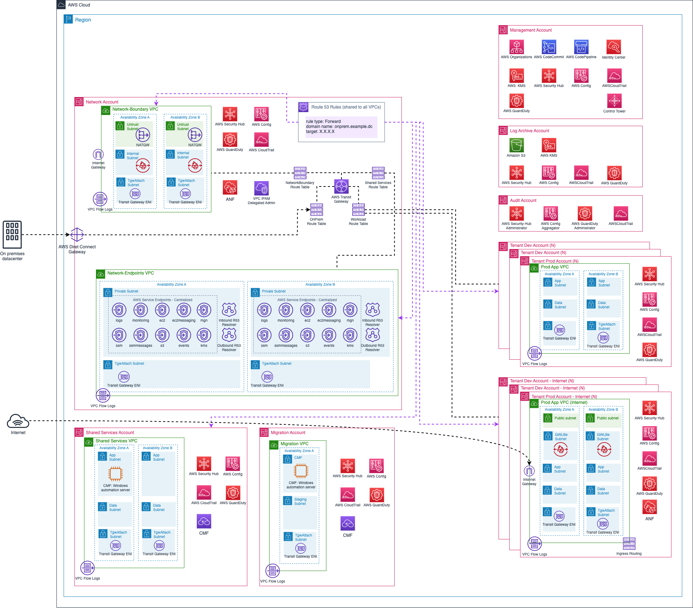
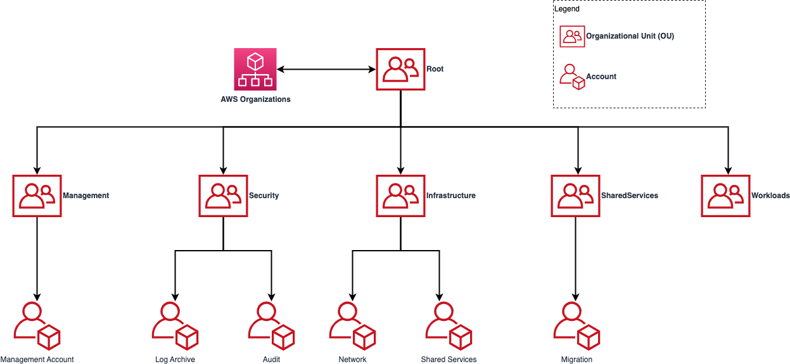
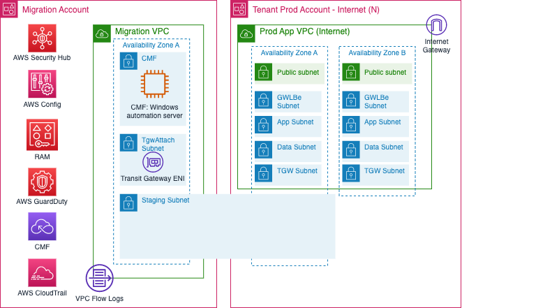

# 4-Rapid-Migration-Architecture-Overview

**Confluence Page:** https://healthedge.atlassian.net/wiki/spaces/CP1/pages/4867097128/4-Rapid-Migration-Architecture-Overview

**Created by:** Chris Falk on June 16, 2025  
**Last modified by:** Chris Falk on June 16, 2025 at 02:30 AM

---

**Purpose**
-----------

The purpose of this page is to describe the Rapid Migration architecture at various levels and depths.

NOTE: The PNGs below can be edited directly in draw.io

**High-Level Overview**
-----------------------

Below is the default high-level architecture diagram that includes sample tenant workload accounts.

**AWS Organizations Design**
----------------------------

Below is the initial OU and Account design

**Migration Account Design**
----------------------------

The Migration Account has a VPC created to support Cloud Migration Factory. It uses a shared **staging** subnet model to enable workloads to be staged within the target account, which allows a cutover to move the workload from the staging subnet to the final target VPC while keeping the data traffic for the cutover within the AWS account (versus traversing the TGW). Once Migration has been completed, the staging subnet can be unshared to the target accounts. Further steps can be taken to fully retire the Migration VPC and Migration account.

**Attachments:**

[rapid-migration-architecture-drawio-high-level.png](../attachments/rapid-migration-architecture-drawio-high-level.png)

[rapid-migration-architecture-drawio-migration.png](../attachments/rapid-migration-architecture-drawio-migration.png)

[rapid-migration-architecture-drawio-ou.png](../attachments/rapid-migration-architecture-drawio-ou.png)