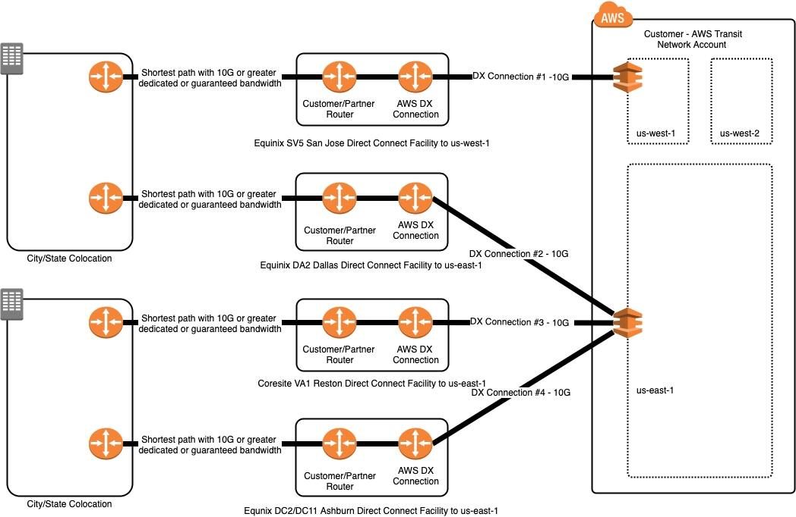

# 5-2-Decision-Direct-Connect-Design

**Confluence Page:** https://healthedge.atlassian.net/wiki/spaces/CP1/pages/4867097687/5-2-Decision-Direct-Connect-Design

**Created by:** Chris Falk on June 16, 2025  
**Last modified by:** Chris Falk on June 16, 2025 at 02:33 AM

---

---

title: 5.2 Decision Direct Connect Design
-----------------------------------------

### Document Lifecycle Status

**Purpose**
-----------

The purpose of this document is to understand the [Customer] connection requirements for connectivity from on-premise datacenter(s) that would need to connect to AWS.

### Decision

Determine if Direct Connect will be used

**Example Direct Connect Design**
---------------------------------

[Customer] will provision a #R\_NumberOf AWS Direct Connect connections from each of the Customer colocations, #R\_Site\_names. For each colocation, different AWS Direct Connect facilities will be used to provide the bandwidth and redundancy required to support hybrid operations during the shutdown of colocations and then for long-term connectivity to AWS regions from the remaining Customer facilities. Since #R\_Regions will be the primary regions, both colocations will have Direct Connect Connections directly into #R\_Regions.

**AWS DX Locations**
--------------------

Source: <https://aws.amazon.com/directconnect/features/#AWS_Direct_Connect_Locations>

**AWS Direct Connect Pricing**
------------------------------

Source: <https://aws.amazon.com/directconnect/pricing/>

**Direct Connect Design**
-------------------------

### Decision

Document the customer direct connect design here.

**References:**
---------------

<https://docs.aws.amazon.com/directconnect/latest/UserGuide/routing-and-bgp.html>

<https://docs.aws.amazon.com/directconnect/latest/UserGuide/WorkingWithVirtualInterfaces.html>

**Attachments:**

[direct\_connect.png](../../attachments/direct_connect.png)