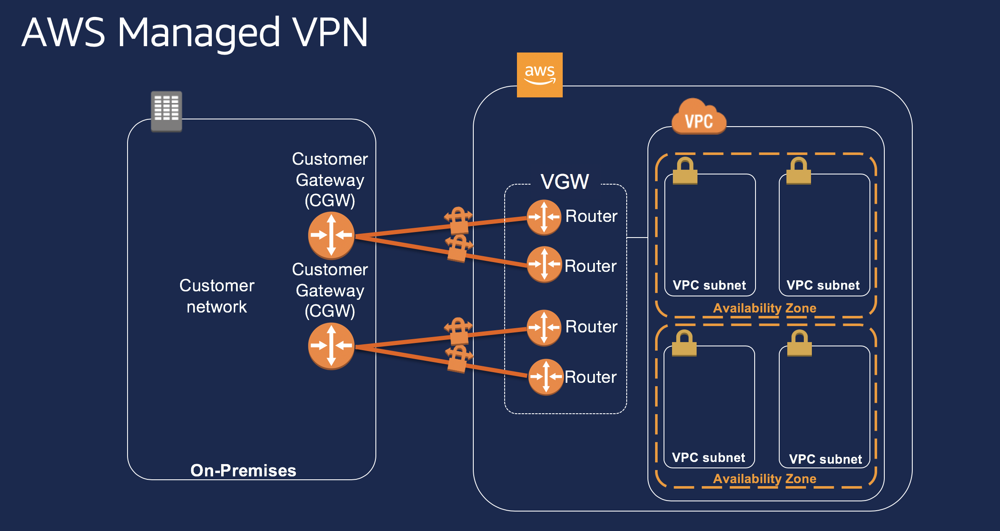

# 5-3-Decision-VPN-Design

**Confluence Page:** https://healthedge.atlassian.net/wiki/spaces/CP1/pages/4867064530/5-3-Decision-VPN-Design

**Created by:** Chris Falk on June 16, 2025  
**Last modified by:** Chris Falk on June 16, 2025 at 02:32 AM

---

---

title: 5.3 Decision VPN Design
------------------------------

**Purpose**

The purpose of this document is to document the hybrid connectivity strategy utilizing VPN.

### Decision

Determine if VPN will be used and integrated within the environment

**Example Operational Readiness State**
---------------------------------------

Two VPN Connections from separate Customer Gateway Routers for each AWS VPC.

**Example VPN Design Details**
------------------------------

Initial access between [Customer] data center and AWS is to be established by attaching an Amazon Virtual Private Gateway (VGW) to each VPC, creating a custom route table within each VPC, updating the security group rules, and creating AWS-managed VPN connections.

* Each VPC will utilize two static, point-to-point IPSEC tunnels back to the on-premise environment.
* Based on Amazon VGW capabilities, IKEv1 and Pre-Shared-Key (PSK) authentication will be used for the tunnels that transit to [Customer] on-premise environment.
* Amazon supports PSK lengths between 8 and 64 characters, with a 32 character default setting.  Prefer to use the maximum length, 64 characters.
* The PSK for the Amazon VGW is limited to alphanumeric characters, periods (.), and underscores (\_).  Given the reduced complexity available, the maximum length PSK is to be used.
* The AWS-managed VPN connections are limited to IPv4.  IPv6 traffic will not pass thru the AWS-managed VPN tunnels.

**Example VPN Configuration Parameter Table**
---------------------------------------------

| LZ Account Name | Status | Purpose | BGP ASN | Onprem Gateway IP Address | Tunnel 1  Public & Private IPs | Tunnel 2  Public & Private IPs |
| --- | --- | --- | --- | --- | --- | --- |
| SimulatedOnPrem | Up | Simulates an on-prem network | 65000 | x.x.x.x | * x.x.x.x * x.x.x.x    + AWS x.x.x.x   + CGW x.x.x.x | * + x.x.x.x   + x.x.x.x      - AWS x.x.x.x     - CGW x.x.x.x |

**Customer VPN Design**
-----------------------

[Customer] will utilize native AWS VPN to connect to [Customer] DC in X location to provide a redundant link to connect to the AWS environment.

**References:**
---------------

<https://docs.aws.amazon.com/vpc/latest/userguide/VPC_VPN.html>

<https://docs.aws.amazon.com/vpc/latest/adminguide/cisco-asa-vti-bgp.html>

**Attachments:**

[AWSManagedVPN.png](../../attachments/AWSManagedVPN.png)