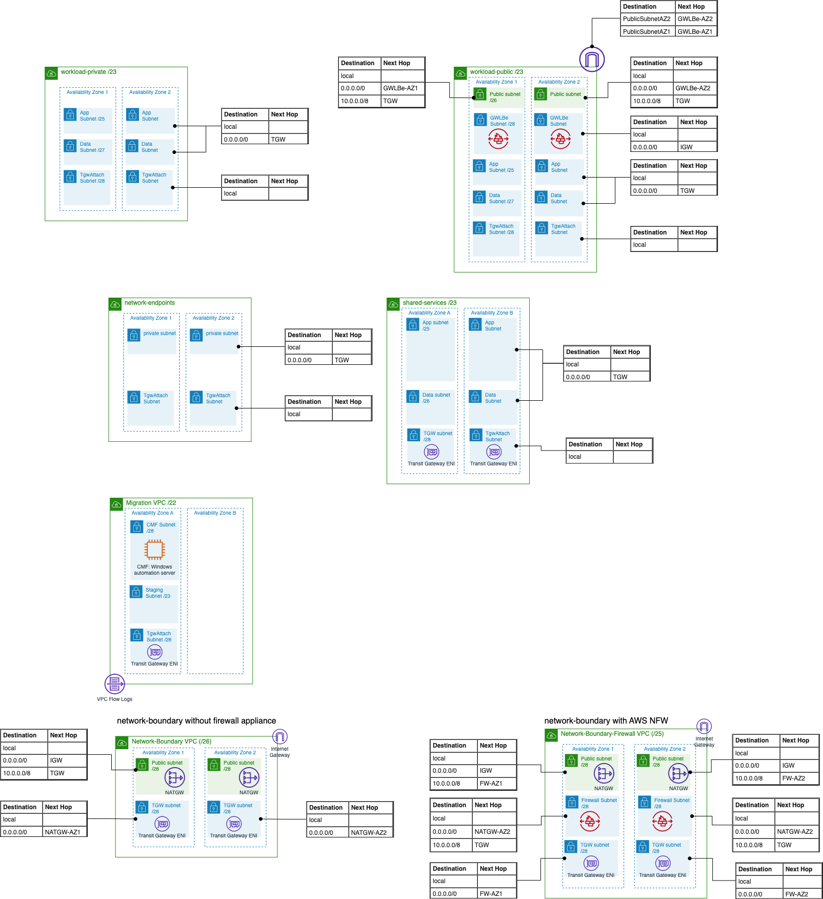

# 5-5-Decision-VPC-Design

**Confluence Page:** https://healthedge.atlassian.net/wiki/spaces/CP1/pages/4866999774/5-5-Decision-VPC-Design

**Created by:** Chris Falk on June 16, 2025  
**Last modified by:** Chris Falk on June 16, 2025 at 02:32 AM

---

---

title: 5.5 Decision VPC Design
------------------------------

**Purpose**
-----------

The purpose of this document is to document the VPC designs for the environment

NOTE: The PNGs below can be edited directly in [draw.io](http://draw.io)

**Applying Networking Decisions**
---------------------------------

### **VPCs**

#### **Workload VPCs**

All workloads will use a common predefined VPC pattern, documented below.

**Private VPC**

See diagram below

**Public VPC**

See diagram below

#### **Utility VPCs**

**Network Endpoints** - hosts the VPC Endpoints in the network account.

See diagram below

**Shared Services** - hosts customer shared-services infrastructure (domain controllers, customer logging tools, customer security tools, etc.)

See diagram below

**Migration** - hosts the CMF automation server and a shared subnet that will be temporarily shared to workload VPCs to support staging during the migration

See diagram below

**Network Boundary** - Different options for the network-boundary depending on an (optional) firewall appliance

See diagram below

### **Editable PNG Diagram (draw.io)**

Resources
---------

[[1]](#) [CIDR Subnet Calculator](https://www.davidc.net/sites/default/subnets/subnets.html)

**Attachments:**

[image-20211111-225816.png](../../attachments/image-20211111-225816.png)

[image-20211111-231321.png](../../attachments/image-20211111-231321.png)

[image-20211115-200239.png](../../attachments/image-20211115-200239.png)

[image2022-11-1\_14-23-13.png](../../attachments/image2022-11-1_14-23-13.png)

[image2022-11-1\_14-9-14.png](../../attachments/image2022-11-1_14-9-14.png)

[rapid-migration-architecture-drawio-vpcs.png](../../attachments/rapid-migration-architecture-drawio-vpcs.png)