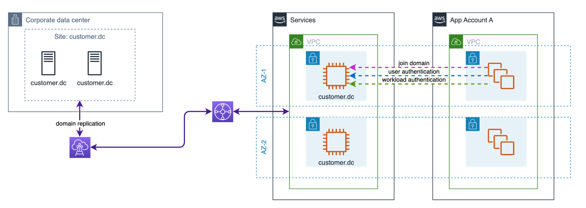

# 5-6-Decision-Active-Directory-Design

**Confluence Page:** https://healthedge.atlassian.net/wiki/spaces/CP1/pages/4867097275/5-6-Decision-Active-Directory-Design

**Created by:** Chris Falk on June 16, 2025  
**Last modified by:** Chris Falk on September 30, 2025 at 08:06 PM

---

---

5.6 Decision Active Directory Design
------------------------------------

**Purpose**
-----------

This document covers the design details for the Active Directory and Domain Controller design to support potential workloads, users, and service role authentication.

### Decision

Extend existing AD domains to AWS using self-managed Active Directory on EC2. Start with one AD domain controller per domain per AZ, deployed to the GC and HRP Shared Services accounts. Configure outbound endpoints to forward requests for self-managed AD domains to on-premise DCs to start, and then update to AWS hosted EC2 DCs when ready.

**Domain Controller Details**
-----------------------------

5-7-Decision-DNS-Design contains details of the implementation, domain list, and forwarding rules.

The following table documents the design for the location of your Domain Controller

**Example Architecture Design**
-------------------------------

**Attachments:**

[R53-CrossAccountRuleSharing.png](../../attachments/R53-CrossAccountRuleSharing.png)

[R53-HighlyAvailable.png](../../attachments/R53-HighlyAvailable.png)

[R53-ReducedComplexity.png](../../attachments/R53-ReducedComplexity.png)

[active-directory-design.drawio.png](../../attachments/active-directory-design.drawio.png)

[endpoints\_privatelink.png](../../attachments/endpoints_privatelink.png)

[image2021-11-11\_10-22-24.png](../../attachments/image2021-11-11_10-22-24.png)

[image2021-11-11\_10-33-49.png](../../attachments/image2021-11-11_10-33-49.png)

[image2021-11-11\_10-55-19.png](../../attachments/image2021-11-11_10-55-19.png)

[image2021-11-11\_11-21-46.png](../../attachments/image2021-11-11_11-21-46.png)

[image2021-11-11\_11-28-56.png](../../attachments/image2021-11-11_11-28-56.png)

[image2021-11-11\_12-4-52.png](../../attachments/image2021-11-11_12-4-52.png)

[image2022-11-1\_9-17-1.png](../../attachments/image2022-11-1_9-17-1.png)

[r53-endpoint-sample.drawio.png](../../attachments/r53-endpoint-sample.drawio.png)