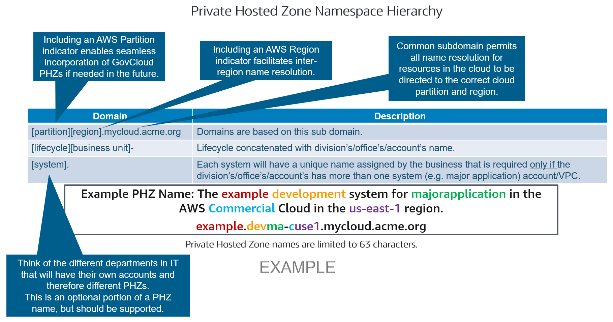
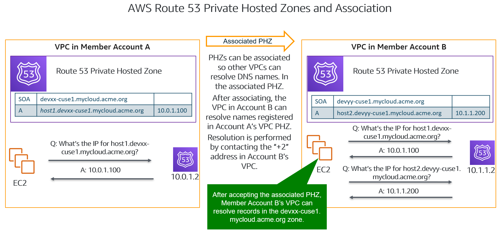
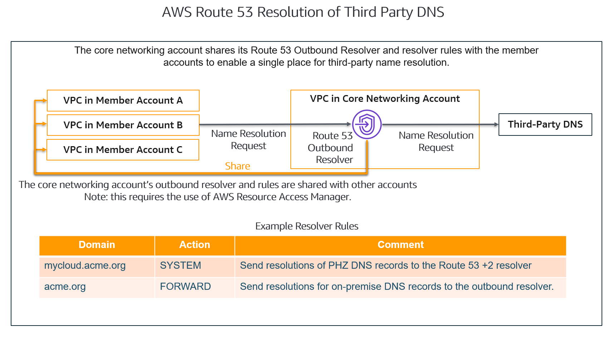
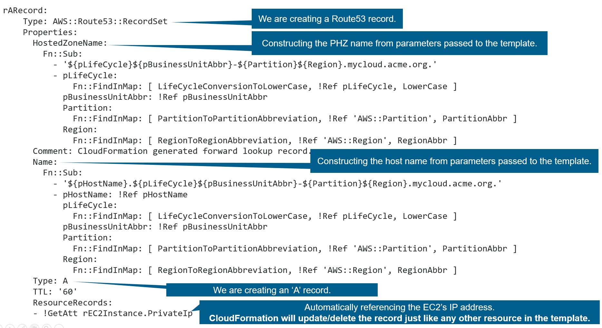
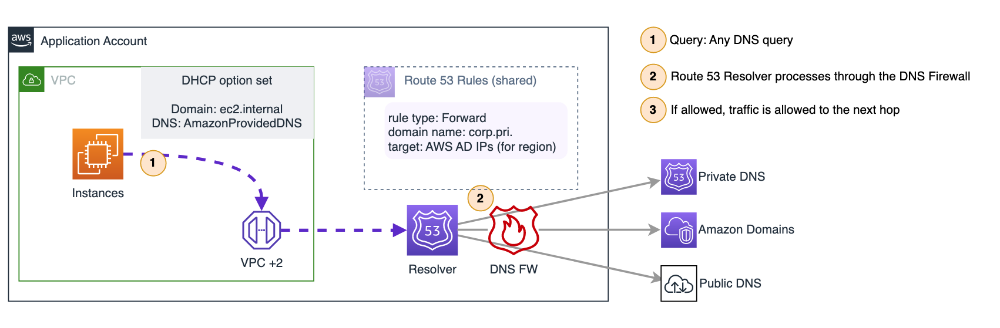
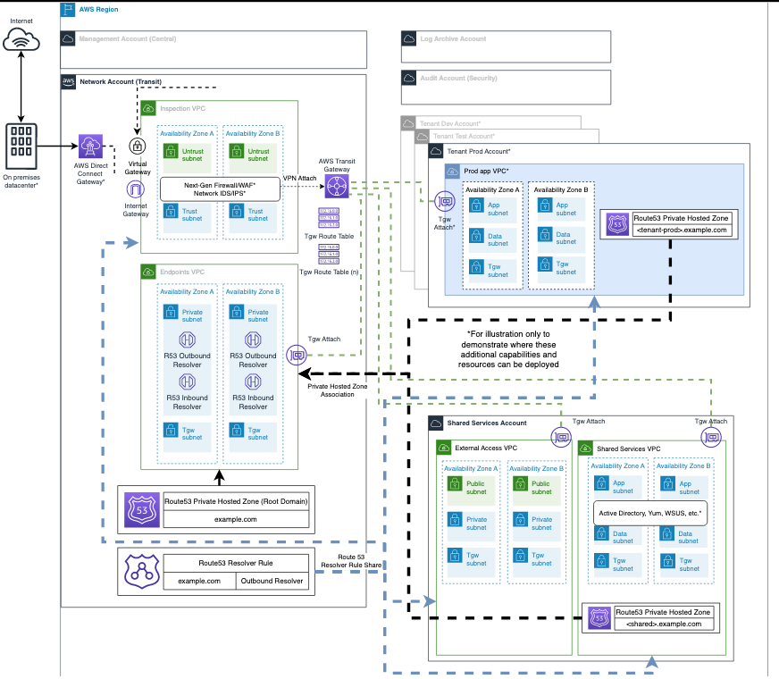

# 5-7-Decision-DNS-Design

**Confluence Page:** https://healthedge.atlassian.net/wiki/spaces/CP1/pages/4866999642/5-7-Decision-DNS-Design

**Created by:** Chris Falk on June 16, 2025  
**Last modified by:** Chris Falk on October 17, 2025 at 02:32 PM

---

---

**Status: APPROVED**
--------------------

**Purpose**
-----------

This document covers strategies for expanding HealthEdge Internal and External DNS capability to support hybrid DNS use cases for Active Directory, Red Hat Identity Manager, and Route 53 private hosted zones.

### Decisions

Implement a hybrid DNS design, using the AWS .2 Route 53 Resolver as the default DNS for all AWS workloads, with outbound Route 53 Resolver endpoints and rules to forward to self-managed Active Directory for HRP and Guiding Care internal and customer domains.

Implement an AWS private hosted zone for AWS workloads independent of internal DNS domains. Existing private DNS and Active Directory to remain authoritative for existing DNS zones (e.g. [healthedge.biz](http://healthedge.biz)).

Implement inbound Route 53 Resolver endpoints to allow for internal resolution of AWS VPC endpoints from on-premises and self-managed DNS/AD servers.

**Approach**
------------

There are multiple approaches to addressing hybrid DNS use cases. The recommended solution is to use the Amazon Route 53 Resolver (outbound) to forward DNS resolution requests of HealthEdge domains to their authoritative DNS servers. R53 resolver will provide a highly available low cost solution. When you create a VPC using Amazon VPC, you automatically get DNS resolution within the VPC from Route 53 Resolver. By default, Resolver answers DNS queries for VPC domain names such as domain names for EC2 instances or ELB load balancers. Resolver performs recursive lookups against public name servers for all other domain names.

**Overview**
------------

Domain name systems (DNS) convert (“resolve”) friendly names like [example.com](http://example.com) to IP addresses (e.g. 3.94.0.87) that computers use to transmit information via Internet Protocol.  DNS is commonly not a major topic, but it is in the cloud.  This overview is scoped to DNS resolutions performed inside VPCs, not public Internet DNS resolutions.

### Private Hosted Zone Naming Convention

AWS provides a native DNS service named Route 53.  Each VPC can have one or more Route 53 Private Hosted Zones (PHZ) associated with it.  A PHZ is simply a repository that contains DNS records to convert names to IP addresses.  Each PHZ has a name that must be unique across the environment.  The PHZ naming convention should support future use cases, such as differentiating regions and partitions.  An example PHZ naming convention demonstrating name features is as follows:

### Private Hosted Zone Associations

The DNS records in the PHZ are only visible from a VPC that is associated/shared with the VPC.  A PHZ may be associated with many VPCs, even in other AWS accounts.

The AWS Route 53 DNS service is accessed from within the VPC via the VPC’s “+2” IP address (VPC base address plus 2, e.g. 10.0.0.2).  Performing DNS resolution with Route 53 will resolve DNS records from any PHZ that is associated/shared with the VPC.

### Third-Party DNS Resolution of AWS Route 53 Private Hosted Zones

Current systems, using third-party DNS, may need to resolve new cloud hosted workloads and/or services. This would require the third-party DNS service to be configured to forward requests to the appropriate VPC that hosts the PHZ.  Instead, PHZs are associated with a central cloud networking VPC, enabling third-party DNS to forward requests to the Route 53 Inbound Resolver.

### Route 53 Resolution of Third-Party DNS

Workloads running in VPCs may need to resolve DNS records that are resident in third-party DNS systems.  Route 53 will consult resolver rules on where to send the resolution request.  Rather than create duplicate rules across the environment, a Route 53 Outbound Resolver and resolver rules are created in a central (e.g. networking) VPC and shared with other accounts via Resource Access Manager.  One or more rules directs DNS requests to third-party DNS.

### **Managing DNS Records in Hosted Zones**

When using third-party DNS, records may be automatically managed.  When using Route53 Private Hosted Zones, records must be added, updated and removed through an intentional method.  One such method is incorporating records into Infrastructure-as-Code. Hosts created through automation (e.g. EC2 Auto Scaling) would need automation to manage associated DNS records.  An example of creating an A record with CloudFormation is as follows:

### **PrivateLink Interface Endpoints and DNS**

Interface endpoints create ENIs with IP addresses in a VPC.  DNS resolutions of AWS services must resolve to the ENI's IP addresses if the interface endpoint will be used.  When Route 53 DNS (the VPC +2 resolver) is used, resolution of AWS services to VPC ENI IP addresses can be automatic if the Private DNS Names feature is enabled.  If third-party DNS is used with interface endpoints then the third-party DNS service must provide resolutions of AWS services that are specific for every VPC making a resolution request.

### **Forward DNS queries from resolvers on your network to Route 53 Resolver**

DNS resolvers on your network can forward DNS queries to Resolver in a specified VPC. This allows your DNS resolvers to easily resolve domain names for AWS resources such as EC2 instances or records in a Route 53 private hosted zone. For more information, see [How DNS Resolvers on Your Network Forward DNS Queries to Route 53 Resolver](https://docs.aws.amazon.com/Route53/latest/DeveloperGuide/resolver.html).

### **Conditionally forward queries from a VPC to resolvers on your network**

You can configure Resolver to forward queries that it receives from EC2 instances in your VPCs to DNS resolvers on your network. To forward selected queries, you create Resolver rules that specify the domain names for the DNS queries that you want to forward (such as [example.com](http://www.example.com)), and the IP addresses of the DNS resolvers on your network that you want to forward the queries to. If a query matches multiple rules ([example.com](http://www.example.com), [test.example.com](http://www.test.example.com)), Resolver chooses the rule with the most specific match ([test.example.com](http://www.test.example.com)) and forwards the query to the IP addresses that you specified in that rule.

**Route 53 Resolver DNS Firewall**
----------------------------------

With Route 53 Resolver DNS Firewall, you can filter and regulate outbound DNS traffic for your virtual private cloud (VPC). Create reusable collections of filtering rules in DNS Firewall rule groups, associate the rule groups to your VPC, and then monitor activity in DNS Firewall logs and metrics. Based on the activity, you can adjust the behavior of DNS Firewall accordingly.

<https://docs.aws.amazon.com/Route53/latest/DeveloperGuide/resolver-dns-firewall.html>

### **Approach**

The Route 53 Resolver DNS Firewall will be deployed to the entire Organization. As a VPC is created, the AWS Firewall Manager will ensure that the defined DNS Firewall Rules are applied to the Route 53 Resolver for the VPC. This will allow for the DNS firewall rules to be centrally managed by AWS Firewall Manager.

The following diagram demonstrates where the DNS Firewall would be applied for a given VPC.

**Landing Zone Accelerator Route 53 Integration**
-------------------------------------------------

Landing Zone Accelerator supports config driven deployments of Route R3 with the ability to configure outbound and inbound revolver endpoints to support hybrid DNS. Using the network-config.yaml file the following configuration can be deployed.

1. Resolving on-premises domains from workloads running in AWS
2. On-premises workloads resolving private domains in your AWS environment
3. Resolving domains across multiple AWS accounts.

The logic on how this functions can be found in this [blog](https://aws.amazon.com/blogs/security/simplify-dns-management-in-a-multiaccount-environment-with-route-53-resolver/) post.

**Route 53 Resolver Endpoints**
-------------------------------

| Component | AWS Account | VPC | Subnet | AZ | IP | Tags |
| --- | --- | --- | --- | --- | --- | --- |
| Inbound endpoint | Network | `NetworkEndpointsVpcUsEast1` | `PrivateSubnet1` | use1-az6 | 10.199.29.107 | Name: `he-prod-r53-use1-inbound`  Application: LandingZone |
| Inbound endpoint | Network | `NetworkEndpointsVpcUsEast1` | `PrivateSubnet2` | use1-az1 | 10.199.30.118 | Name: `he-prod-r53-use1-inbound`  Application: LandingZone |
| Inbound endpoint | Network | `NetworkEndpointsVpcUsEast1` | `PrivateSubnet3` | use1-az2 | 10.199.31.54 | Name: `he-prod-r53-use1-inbound`  Application: LandingZone |
| Inbound endpoint | Network | `NetworkEndpointsVpcUsEast2` | `PrivateSubnet1` | use2-az1 | 10.207.5.29 | Name: `he-prod-r53-use2-inbound`  Application: LandingZone |
| Inbound endpoint | Network | `NetworkEndpointsVpcUsEast2` | `PrivateSubnet2` | use2-az2 | 10.207.6.194 | Name: `he-prod-r53-use2-inbound`  Application: LandingZone |
| Inbound endpoint | Network | `NetworkEndpointsVpcUsEast2` | `PrivateSubnet3` | use2-az3 | 10.207.7.134 | Name: `he-prod-r53-use2-inbound`  Application: LandingZone |
| Inbound endpoint | Network | `NetworkEndpointsVpcUsWest1` | `PrivateSubnet1` | usw1-az1 | 10.215.13.194 | Name: `he-prod-r53-usw1-inbound`  Application: LandingZone |
| Inbound endpoint | Network | `NetworkEndpointsVpcUsWest1` | `PrivateSubnet3` | usw1-az3 | 10.215.14.151 | Name: `he-prod-r53-usw1-inbound`  Application: LandingZone |
| Inbound endpoint | Network | `NetworkEndpointsVpcUsWest2` | `PrivateSubnet1` | usw2-az2 | 10.223.13.68 | Name: `he-prod-r53-usw2-inbound`  Application: LandingZone |
| Inbound endpoint | Network | `NetworkEndpointsVpcUsWest2` | `PrivateSubnet2` | usw2-az1 | 10.223.14.220 | Name: `he-prod-r53-usw2-inbound`  Application: LandingZone |
| Inbound endpoint | Network | `NetworkEndpointsVpcUsWest2` | `PrivateSubnet3` | usw2-az3 | 10.223.15.172 | Name: `he-prod-r53-usw2-inbound`  Application: LandingZone |
| Outbound endpoint | Network | `NetworkEndpointsVpcUsEast1` | `PrivateSubnet1` | use1-az6 | 10.199.29.64 | Name: `he-prod-r53-use1-outbound`  Application: LandingZone |
| Outbound endpoint | Network | `NetworkEndpointsVpcUsEast1` | `PrivateSubnet2` | use1-az1 | 10.199.30.59 | Name: `he-prod-r53-use1-outbound`  Application: LandingZone |
| Outbound endpoint | Network | `NetworkEndpointsVpcUsEast1` | `PrivateSubnet3` | use1-az2 | 10.199.31.232 | Name: `he-prod-r53-use1-outbound`  Application: LandingZone |
| Outbound endpoint | Network | `NetworkEndpointsVpcUsEast2` | `PrivateSubnet1` | use2-az1 | 10.207.5.116 | Name: `he-prod-r53-use2-outbound`  Application: LandingZone |
| Outbound endpoint | Network | `NetworkEndpointsVpcUsEast2` | `PrivateSubnet2` | use2-az2 | 10.207.6.99 | Name: `he-prod-r53-use2-outbound`  Application: LandingZone |
| Outbound endpoint | Network | `NetworkEndpointsVpcUsEast2` | `PrivateSubnet3` | use2-az3 | 10.207.7.60 | Name: `he-prod-r53-use2-outbound`  Application: LandingZone |
| Outbound endpoint | Network | `NetworkEndpointsVpcUsWest1` | `PrivateSubnet1` | usw1-az1 | 10.215.13.183 | Name: `he-prod-r53-usw1-outbound`  Application: LandingZone |
| Outbound endpoint | Network | `NetworkEndpointsVpcUsWest1` | `PrivateSubnet3` | usw1-az3 | 10.215.14.236 | Name: `he-prod-r53-usw1-outbound`  Application: LandingZone |
| Outbound endpoint | Network | `NetworkEndpointsVpcUsWest2` | `PrivateSubnet3` | usw2-az2 | 10.223.13.49 | Name: `he-prod-r53-usw2-outbound`  Application: LandingZone |
| Outbound endpoint | Network | `NetworkEndpointsVpcUsWest2` | `PrivateSubnet1` | usw2-az1 | 10.223.14.119 | Name: `he-prod-r53-usw2-outbound`  Application: LandingZone |
| Outbound endpoint | Network | `NetworkEndpointsVpcUsWest2` | `PrivateSubnet2` | usw2-az3 | 10.223.15.102 | Name: `he-prod-r53-usw2-outbound`  Application: LandingZone |

**Route 53 Resolver Rules**
---------------------------

As AD domain controllers are brought up in AWS EC2 and new sites created, the targets should be updated to use the AWS AD servers.

| Name | Endpoint | Type | Owner | Target | Tags |
| --- | --- | --- | --- | --- | --- |
| Internet Resolver | Service | Recursive | Route 53 Resolver Service | SYSTEM | Name: InternetResolverRule  Application: LandingZone |
| healthedge.biz | Outbound | Forward | HRP AD DNS Servers | us-east-1 he1-mgtdc-01 - 10.51.254.20 he1-mgtdc-02 - 10.51.254.21  us-east-2, us-west-1, us-west-2 he2-mgtdc-01 - 10.52.254.20 he2-mgtdc-02 -10.52.254.21 | Name: `he-prod-r53-fwd-<region>-healthedge-biz`  Application: HRP |
| headquarters.healthedge.com | Outbound | Forward | HRP AD DNS Servers | us-east-1 he1-dc-01 10.10.14.210 he1-dc-02 10.10.14.211  us-east-2, us-west-1, us-west-2 he2-dc-01 10.11.14.220 he2-dc-02 10.11.14.221 | Name: `he-prod-r53-fwd-<region>-headquarters-he-com`  Application: Corporate AD |
| altruistahealth.net | Outbound | Forward | GC AD DNS Servers | us-east-1, us-east-2 AHSADS6-IAD3   10.22.12.5 AHSADS7-IAD3   10.22.12.4 AHSADS4-IAD3   10.50.2.3  us-west-1, us-west-2 AHSADS6-LAX3   10.23.12.5 AHSADS7-LAX3   10.23.12.4 | Name: `he-prod-r53-fwd-<region>-altruistahealth-net`  Application: Guiding Care |

**DNS Domains**
---------------

This is a list of authoritative domains used by the organization.

| Subdomain | Internal, External  or Split-Brain | Application or Host | Other details |
| --- | --- | --- | --- |
| healthedge.biz | Split | Application | HRP Active Directory |
| headquarters.healthedge.com | External | Application |  |
| HRP Customer AD Domains | Internal | Application | Customer HRP Active Directories |
| aws.healthedge.com??? | Internal | Application | AWS Private Hosted Zone |
| altruistahealth.net | Split |  |  |
|  |  |  |  |

**Attachments:**

[R53-CrossAccountRuleSharing.png](../../attachments/R53-CrossAccountRuleSharing.png)

[R53-HighlyAvailable.png](../../attachments/R53-HighlyAvailable.png)

[R53-ReducedComplexity.png](../../attachments/R53-ReducedComplexity.png)

[aws-route53-resolver-fw.drawio.png](../../attachments/aws-route53-resolver-fw.drawio.png)

[endpoints\_privatelink.png](../../attachments/endpoints_privatelink.png)

[image2021-11-11\_10-22-24.png](../../attachments/image2021-11-11_10-22-24.png)

[image2021-11-11\_10-33-49.png](../../attachments/image2021-11-11_10-33-49.png)

[image2021-11-11\_10-55-19.png](../../attachments/image2021-11-11_10-55-19.png)

[image2021-11-11\_11-21-46.png](../../attachments/image2021-11-11_11-21-46.png)

[image2021-11-11\_11-28-56.png](../../attachments/image2021-11-11_11-28-56.png)

[image2021-11-11\_12-4-52.png](../../attachments/image2021-11-11_12-4-52.png)

[image2022-11-1\_9-17-44.png](../../attachments/image2022-11-1_9-17-44.png)

[image2022-11-1\_9-18-29.png](../../attachments/image2022-11-1_9-18-29.png)

[r53-endpoint-sample.drawio.png](../../attachments/r53-endpoint-sample.drawio.png)