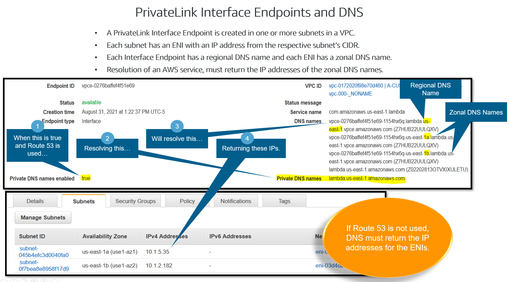
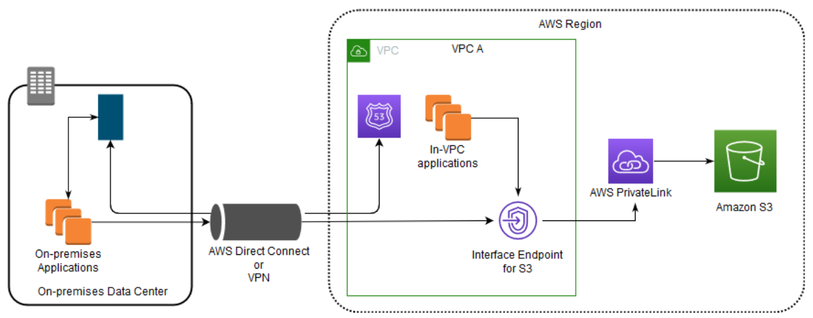
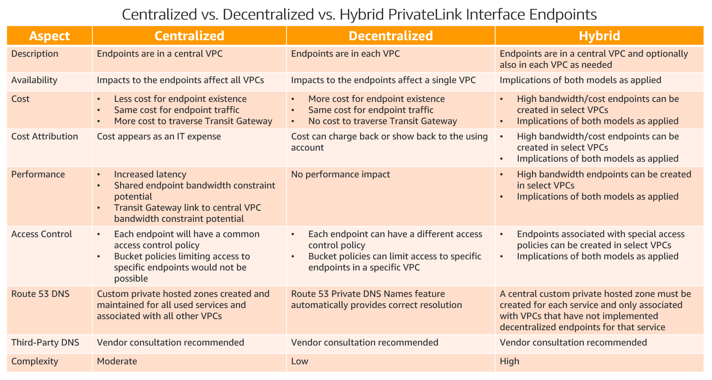
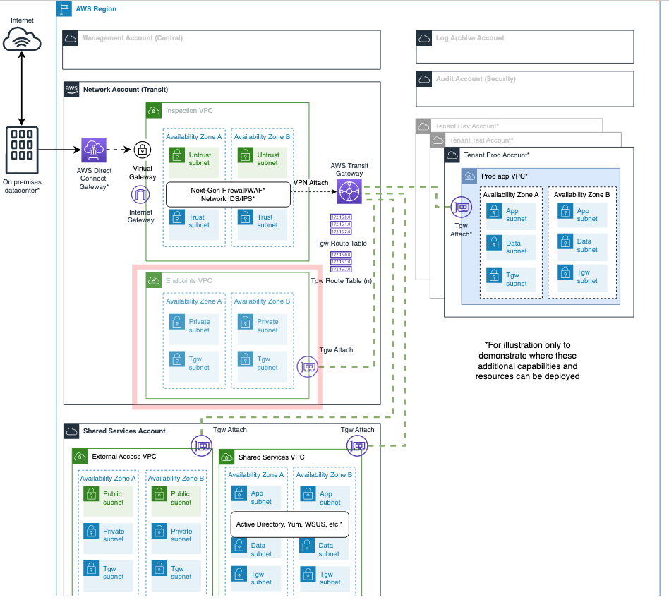

# 5-8-Decision-AWS-VPC-Endpoints-Design

**Confluence Page:** https://healthedge.atlassian.net/wiki/spaces/CP1/pages/4867097299/5-8-Decision-AWS-VPC-Endpoints-Design

**Created by:** Chris Falk on June 16, 2025  
**Last modified by:** Chris Falk on June 16, 2025 at 02:32 AM

---

---

title: 5.8 Decision AWS VPC Endpoints Design
--------------------------------------------

**Purpose**
-----------

This page is meant to document the current and readiness state relating to how On-Prem and VPC Systems will call VPC Endpoints.

**Endpoints**
-------------

AWS services are accessed through endpoints. An endpoint is a URL that serves as an entry point for an AWS web service. The endpoint can be https or http.

Some AWS services offer FIPS endpoints in selected Regions. Unlike standard AWS endpoints, FIPS endpoints use a TLS software library that complies with Federal Information Processing Standard (FIPS) 140-2. These endpoints might be required by enterprises that interact with the United States government. If the FIPS endpoint is used to access a service then the endpoint will always be https.

Endpoints for AWS services are documented here: [Service endpoints and quotas - AWS General Reference (amazon.com)](https://docs.aws.amazon.com/general/latest/gr/aws-service-information.html)

The endpoint topic is large and AWS documentation should be reviewed to understand all topic details: [AWS service endpoints - AWS General Reference (amazon.com)](https://docs.aws.amazon.com/general/latest/gr/rande.html)

Endpoints come in two general varieties: public and private.

### Public Endpoints

Public endpoints are URLs accessible from the public Internet. Clients accessing public endpoints may reside on the Internet, on-premises or from inside AWS either inside a VPC or not inside a VPC.

To access a public endpoint the client must be able to resolve the endpoint URL to an IP address and route to the endpoint.

* Clients on the Internet with functioning DNS should be able to easily access endpoints.
* Clients inside an AWS VPC will need Internet connectivity to access a public endpoint and the ability to DNS resolve endpoint URLs.

  + Internet access from a VPC may be accomplished by an Internet Gateway, NAT Gateway or in the case of IPv6 use an Egress-only Internet Gateway.
  + Additionally, clients inside an AWS VPC can access public endpoints via on-premises by using connectivity to on-premises such as Direct Connect. This connectivity to on-premises would use on-premises Internet connectivity to reach public endpoints.
* Clients can also access public endpoints when inside AWS, but not inside a VPC. For example, Lambdas that are not VPC-attached have access to public endpoints without explicitly establishing connectivity.
* On-premises clients may access public endpoints via their:

  + Internet connection. Customers will need the ability to resolve AWS service endpoint URLs and route to the endpoints over the public Internet.
  + Public VIF when using Direct Connect. Public VIFs are a Direct Connect VLAN that routes traffic from on-premises to networks hosting AWS services. Public VIFs do not provide general access to the Internet. Other AWS customers could access your customer via this network connection. Customers should filter Public VIF traffic to avoid permitting connectivity with other AWS customers.

### Private Endpoints

Private endpoints are URLs that provide access from VPCs to AWS services over the AWS internal network without traversing the Internet. Private endpoints are provided by AWS PrivateLink and this topic is described in detail in the next section. PrivateLink supports two types of endpoints: gateway and interface. Gateway endpoints may only be accessed from the VPC where the gateway endpoint resides. Interface endpoints also reside in a VPC, but can be accessed from any client that can route to the VPC. See the below section named PrivateLink Access to AWS Services via On-Premises for details.

**PrivateLink Use Cases**
-------------------------

AWS PrivateLink provides high-speed access to AWS services directly over the AWS network, without traversing the Internet.  There are two primary reasons to use PrivateLink:

1. Security Policy:  AWS services are available as public endpoints on the Internet.  Some organizations or specific workloads may be prohibited by policy from accessing the Internet and can use PrivateLink to avoid using the Internet.
2. Bandwidth and Cost: When an organization uses an Internet Gateway, they have unlimited Internet bandwidth.  However, organizations may have security controls that Internet traffic must traverse, such as a network security stack either in a VPC or on-premises.  Routing traffic to AWS service public endpoints through a network security stack and/or routing traffic through a DX may require additional capacity investment and/or labor expense to support the bandwidth required by AWS service use.  PrivateLink can permit organizations to avoid those investments.

**Interface Endpoints and Gateway Endpoints**
---------------------------------------------

### Interface Endpoints

Interface endpoints provide access to AWS services via one or more ENIs in your VPC(s).  When an interface endpoint is created, one or more subnets in different AZs are selected. An ENI will be created in each subnet. Each ENI is a zonal interface and will have a DNS name. The collection of an interface endpoint’s zonal interfaces is a regional interface and has a DNS name. Resolving the regional interface DNS name will return the IP addresses of the zonal interface ENIs. Traffic traversing these ENIs will use PrivateLink. PrivateLink does not initiate network traffic from the AWS network to a VPC.

Resiliency: For resiliency, create an interface endpoint across two or more subnets.

Bandwidth: For increased bandwidth, create an interface endpoint across more subnets. Each ENI will provide 10Gbps of burstable bandwidth.

Quantity: More than one interface endpoint may be created for the same AWS service in the same VPC, however, one should suffice.

Cost: Interface endpoints have a per hour cost to exist, regardless of the amount of network traffic transmitted. Interface endpoints have a per Gb data transfer charge.

Security: Interface endpoints may have a policy attached to control use of the endpoint. Interface endpoints may have a security group applied. If no security group is applied the default security group is applied. Note: The default security group only permits the default security group. If you have issues using an interface endpoint, use of the default security group is a likely cause.

Use: The DNS names of interface endpoints are different in every VPC. Applications accessing AWS services by their public DNS name will need to:

1. Configure applications to use the DNS name of the interface endpoint. **NOT recommended.** If the interface endpoint is recreated, it will have a different DNS name and applications would need to be updated.
2. Configure their third-party DNS to provide appropriate resolution according to the requestor’s VPC or;
3. Use AWS Route 53 AmazonProvidedDNS and enable Private DNS Names when configuring the interface endpoint. When using AWS Route 53 AmazonProvidedDNS and creating an interface endpoint with private DNS names enabled, a DNS record will automatically be created in a Route 53 Private Hosted Zone that resolves the AWS service DNS name to the IP addresses of the interface endpoint. Clients residing in the VPC will automatically use the interface endpoint when contacting the AWS service.

See the below graphic for details.

See the “PrivateLink Implementation Models“ section below for a full comparison of attributes and implications.

### Gateway Endpoints

Gateway endpoints are very simple and only support Amazon S3 and DynamoDB at this time. Creating a gateway endpoint creates a route in the VPC to a prefix list for the associated service. One or more route tables are selected when creating the gateway endpoint. Communication resolving to the AWS service IP addresses in the AWS-managed prefix list are routed privately to the AWS service.

Cost: There is no additional charge for using gateway endpoints. Standard charges for data transfer and resource usage apply.

Security: Policies may be applied to the gateway endpoint.

**PrivateLink Access to AWS Services via On-Premises**
------------------------------------------------------

There are various options for privately accessing AWS services from on-premises. From the perspective of PrivateLink, the following may be accomplished.

When on-premises has private connectivity to a VPC (e.g. VPN, Direct Connect), AWS services may be access from on-premise via an interface endpoint in a VPC.

1. Configure the DNS service used by on-premises hosts to resolve the AWS service DNS name to the IP addresses of the VPC’s interface endpoint’s zonal interface ENIs.
2. Configure routing bidirectionally between the VPC and on-premises.
3. Ensure that the security group associated with the interface endpoint permits communication with on-premises hosts.

**PrivateLink Implementation Models**
-------------------------------------

Three general PrivateLink implementation models exist, each with its own characteristics that may suit various customer objectives.

Consult the below table to determine which model is best suited.

**Implementation**
------------------

Most AWS Services are only exposed via Public API Endpoints. To access these services, [Customer] will have on-Prem systems and users will be routed through an AWS Direct Connect Connection Public VIF. Data Transfer out charges are ~450% less over Direct Connect vs over a Non DX Internet connection.

**Landing Zone Accelerator Route 53 Centralised Interface Endpoints Design**
----------------------------------------------------------------------------

Landing Zone Accelerator supports config driven deployments of [centralising AWS Endpoints](https://docs.aws.amazon.com/whitepapers/latest/building-scalable-secure-multi-vpc-network-infrastructure/centralized-access-to-vpc-private-endpoints.html) accessible via Transit Gateway routing. Endpoints can be deployed within account VPC's or centrally with careful consideration needed when an endpoint be centrally based on local. Endpoints have an associated hourly cost, having multiple endpoints of the same type across an organisation may add to cost when a centralised single endpoint would suffice. There is a trade off to be made when you consider the endpoint throughput and that associated cost as well as considering the additional costs of TGW throughput, use the table above to assess the right endpoint design. When deploying interface endpoints apply least privilege endpoint policies to define me/not me usage scenarios of who can access the endpoint, consider use of aws:PrincipalOrgID condition to restrict endpoint usage to only your organisation. Using the network-config.yaml file endpoints can deployed centrally with the option to use central endpoints or not.

**NOTE:** The Rapid Migration Landing Zone Accelerator utilizes centralized endpoints, with the endpoints listed in the tables below deployed by default.

**Decision**

Complete the following table with the VPC Endpoints that are to be added to the Landing Zone Accelerator configuration

| AWS Service Endpoint to Implement |
| --- |
| com.amazonaws.region.kms |
| com.amazonaws.region.mgn |

AMS Accelerate
--------------

If using AMS Accelerate, establishing a private connection between a VPC(s) and the service endpoint is required. For a list of required VPC Endpoints, visit the [link](https://docs.aws.amazon.com/managedservices/latest/accelerate-guide/acc-gs-prereqs.html)

> **Note:** This is a complex table with merged cells. For best viewing experience, see the [original Confluence page].

<table>

<tbody>
<tr>
<th>
AWS Service Endpoint to Implement
</th>
</tr>
<tr>
<td><code class="nohighlight hljs">com.amazonaws.<code class="replaceable">region</code>.logs</code>
</td>
</tr>
<tr>
<td><code class="nohighlight hljs">com.amazonaws.<code class="replaceable">region</code>.monitoring</code>
</td>
</tr>
<tr>
<td colspan="1"><code class="nohighlight hljs">com.amazonaws.<code class="replaceable">region</code>.ec2</code>
</td>
</tr>
<tr>
<td colspan="1"><code class="nohighlight hljs">com.amazonaws.<code class="replaceable">region</code>.ec2messages</code>
</td>
</tr>
<tr>
<td colspan="1"><code class="nohighlight hljs">com.amazonaws.<code class="replaceable">region</code>.ssm</code>
</td>
</tr>
<tr>
<td colspan="1"><code class="nohighlight hljs">com.amazonaws.<code class="replaceable">region</code>.ssmmessages</code>
</td>
</tr>
<tr>
<td colspan="1"><code class="nohighlight hljs">com.amazonaws.<code class="replaceable">region</code>.s3</code>
</td>
</tr>
<tr>
<td colspan="1"><code class="nohighlight hljs">com.amazonaws.<code class="replaceable">region</code>.events</code>
</td>
</tr>
</tbody>
</table>

**References**

[Centralized VPC Endpoint Architecture](https://docs.aws.amazon.com/whitepapers/latest/building-scalable-secure-multi-vpc-network-infrastructure/centralized-access-to-vpc-private-endpoints.html)

[Private Link and VPC Endpoints](https://docs.aws.amazon.com/vpc/latest/privatelink/endpoint-services-overview.html)

[Direct Connect Pricing](https://aws.amazon.com/directconnect/pricing/)

**Attachments:**

[1635265382625-inter-vpc.drawio.png](../../attachments/1635265382625-inter-vpc.drawio.png)

[centralised-endpoint-sample.drawio.png](../../attachments/centralised-endpoint-sample.drawio.png)

[centralized-endpoints.png](../../attachments/centralized-endpoints.png)

[cross-region.drawio.png](../../attachments/cross-region.drawio.png)

[egress-system-communication.png](../../attachments/egress-system-communication.png)

[image-20211115-204045.png](../../attachments/image-20211115-204045.png)

[image-20211115-205302.png](../../attachments/image-20211115-205302.png)

[image-20211115-205434.png](../../attachments/image-20211115-205434.png)

[image-20211115-222604.png](../../attachments/image-20211115-222604.png)

[image-20211116-151611.png](../../attachments/image-20211116-151611.png)

[image2022-11-1\_11-22-6.png](../../attachments/image2022-11-1_11-22-6.png)

[inter-vpc.drawio-e2fa0c37aea3d9035ca762d07f1c9fa1f352866c.png](../../attachments/inter-vpc.drawio-e2fa0c37aea3d9035ca762d07f1c9fa1f352866c.png)

[inter-vpc.drawio.png](../../attachments/inter-vpc.drawio.png)

[onprem2aws.drawio.png](../../attachments/onprem2aws.drawio.png)

[onprem2vpc.drawio.png](../../attachments/onprem2vpc.drawio.png)

[tgw-peering.png](../../attachments/tgw-peering.png)

[vpc-egress.drawio.png](../../attachments/vpc-egress.drawio.png)

[vpcendpoints2awsservices.drawio.png](../../attachments/vpcendpoints2awsservices.drawio.png)

[vpcendpoints2onprem.drawio.png](../../attachments/vpcendpoints2onprem.drawio.png)