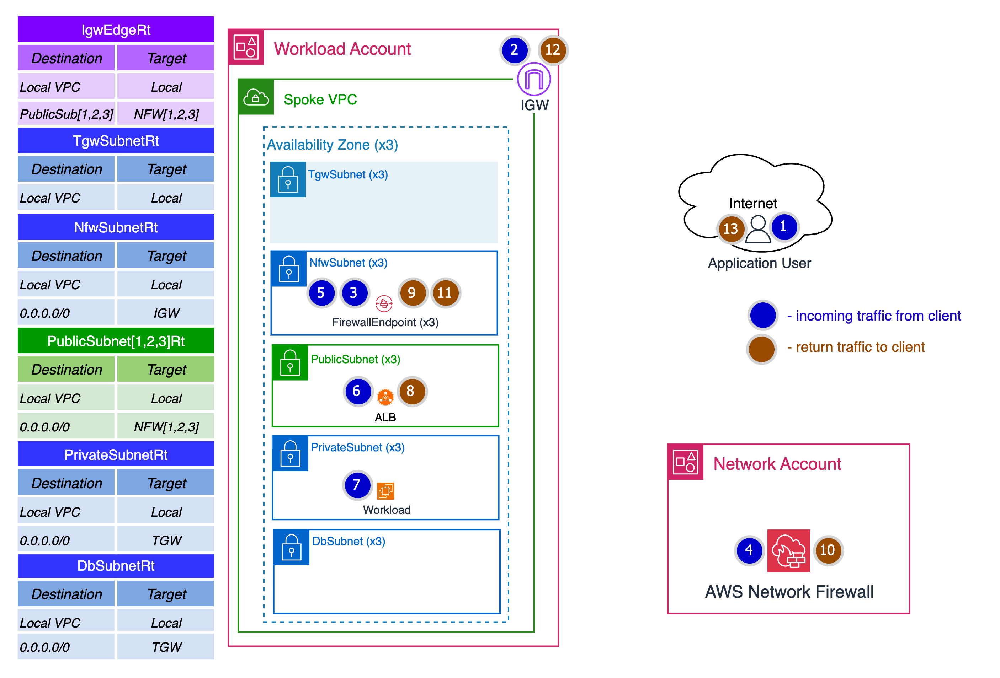
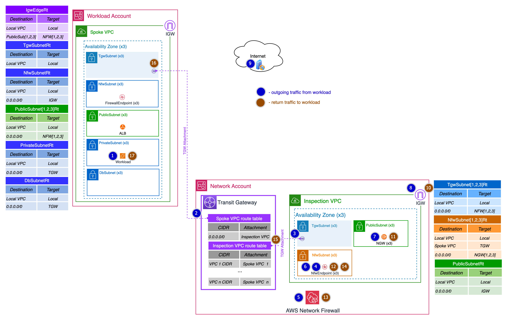
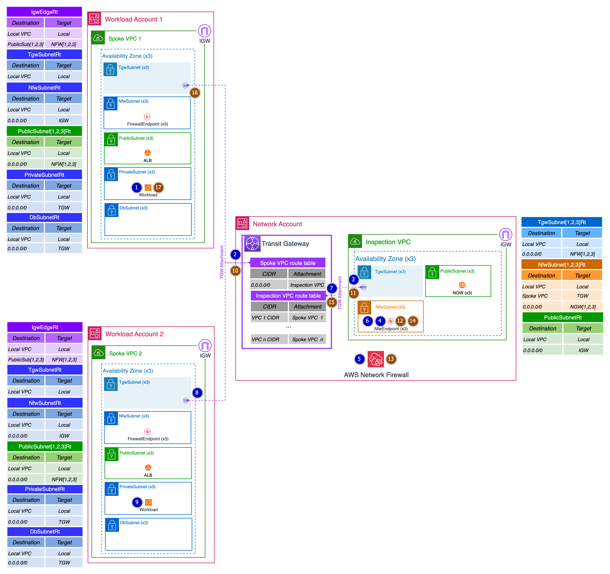
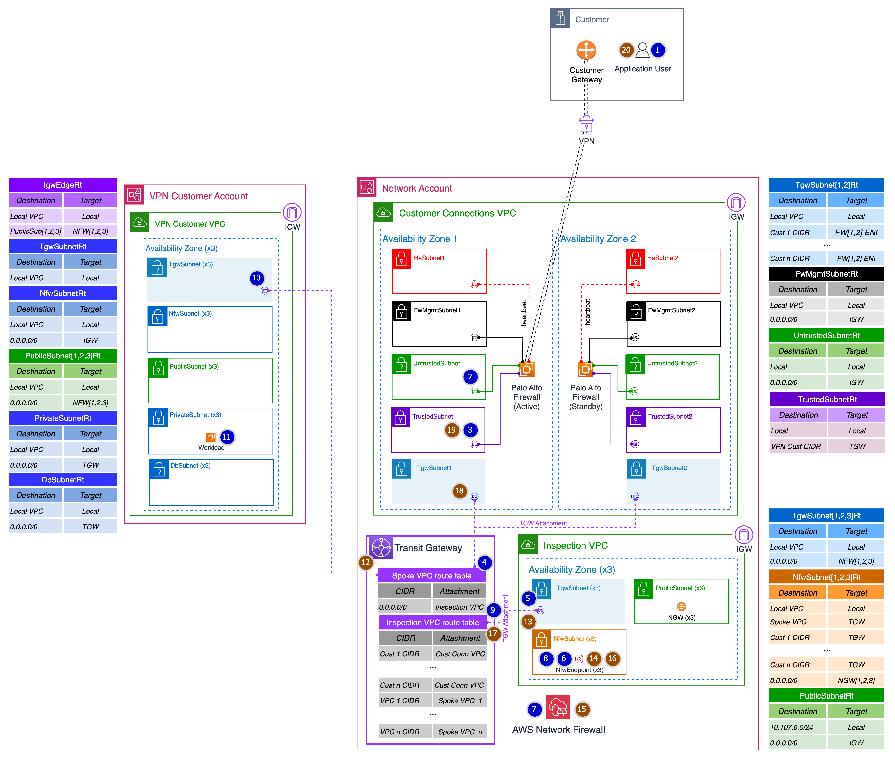
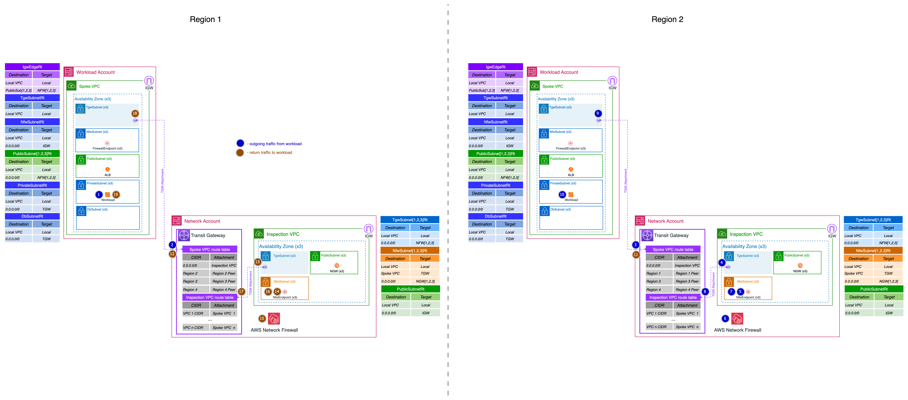
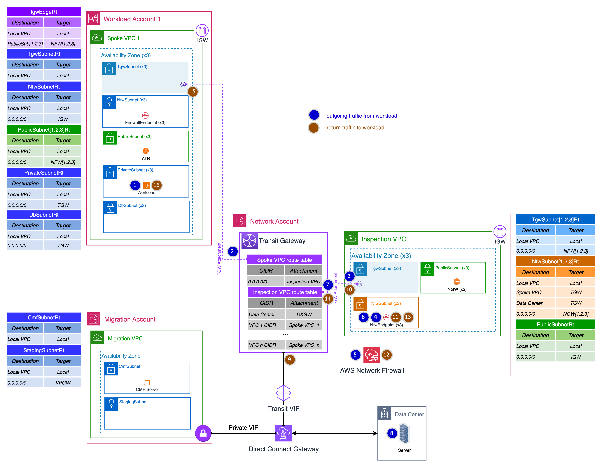

# 5.2 Network Data Flows

**Confluence Page:** https://healthedge.atlassian.net/wiki/spaces/CP1/pages/4867033182/5.2%20Network%20Data%20Flows

**Created by:** Chris Falk on June 16, 2025  
**Last modified by:** Gary Edwards on August 26, 2025 at 03:10 AM

---

---

**Purpose**
-----------

To document the readiness state relating to network data flows (N-S-E-W). The network design supports the following network data flow patterns:

1. Internet ingress
2. Internet egress
3. Inter-VPC
4. VPN customer network
5. Inter-region
6. Data center

**Internet Ingress**
--------------------

Internet ingress network traffic is defined as traffic originating from the Internet and destined to a resource within a VPC.

Modern ingress architectures leverage a distributed ingress model where each target VPC has an Internet Gateway (IGW) and leverages Ingress Routing to force that traffic to go through a centralized inspection point (leveraging a Gateway Load Balancer) before reaching its final destination.

The following diagram illustrates the network data flow for Internet ingress traffic.

The following are the hops taken for inbound Internet network traffic flows originating from a client on the Internet and destined to a HealthEdge application hosted in a Spoke VPC:

1. A client on the Internet initiates a connection to an HealthEdge application accessible via the Application Load Balancer (ALB).
2. The inbound traffic destined for the ALB is received by the Internet Gateway (IGW).
3. The traffic is redirected to the AWS Network Firewall (NFW) endpoint based on the IGW *IgwEdgeRt* route table.
4. The NFW endpoint forwards the traffic via the AWS internal network to the NFW in the Network account for inspection.
5. After inspection, the traffic is returned to the NFW endpoint.
6. The traffic is forwarded to the ALB based on the *NfwSubnetRt* Local route.
7. The ALB terminates the TLS connection and forwards the payload to the ALB target workload.
8. Return traffic from the workload is directed back to the ALB.
9. The traffic is forwarded to the NFW endpoint based on the *PublicSubnet[1,2,3]Rt* default route.
10. The NFW endpoint forwards the traffic via the AWS internal network to the NFW in the Network account for inspection.
11. After inspection, the traffic is returned to the NFW endpoint.
12. The traffic is forwarded to the the Spoke VPC IGW based on the *NfwSubnetRt* default route.
13. The Spoke VPC IGW forwards the traffic back to the client.

**Internet Egress**
-------------------

Internet egress network traffic is defined as traffic originating from a VPC destined to the Internet.

Internet egress network traffic is routed via a centralized inspection VPC for inspection and utilizes a shared NAT Gateway (NGW) for IP address translation to/from the Internet.

The following diagram illustrates the network data flow for Internet egress traffic.

The following are the hops taken for outbound Internet network traffic flows originating from a host in a Spoke VPC:

1. A host located in a Spoke VPC sends traffic destined for the Internet.
2. The traffic is forwarded to the TGW based on the Spoke VPC *PrivateSubnetRt* default route.
3. The TGW routes the traffic based on its Spoke VPC route table default route to the Inspection VPC *TgwSubnet* via its TGW attachment.
4. The traffic is forwarded to the NFW endpoint based on the *TgwSubnet[1,2,3]Rt* default route.
5. The NFW endpoint forwards the traffic via the AWS internal network to the NFW for inspection.
6. After inspection, the traffic is returned to the NFW endpoint.
7. The traffic is forwarded to the NGW based on the *NfwSubnet[1,2,3]Rt* default route.
8. The NGW performs address translation and forwards the traffic to the Inspection VPC IGW based on the *PublicSubnetRt* default route.
9. The Inspection VPC IGW forwards the traffic to the Internet destination host.
10. The Internet destination host processes the traffic and sends return traffic back to the Inspection VPC IGW.
11. The Inspection VPC IGW forwards the traffic to the NGW.
12. The NGW performs reverse address translation and forwards the traffic to the NFW endpoint.
13. The NFW endpoint forwards the traffic via the AWS internal network to the NFW for inspection.
14. After inspection, the traffic is returned to the NFW endpoint.
15. The traffic is routed back to the TGW based on the NfwSubnet[1,2,3]Rt Spoke VPC route.
16. The TGW routes the traffic based on its Inspection VPC route table to the Spoke VPC *TgwSubnet* via its TGW attachment.
17. The traffic is forwarded back to the originating host based on the *TgwSubnetRt* Local route.

**Inter-VPC**
-------------

Inter-VPC network traffic is defined as traffic originating from a VPC destined for another VPC.

Inter-VPC network traffic is routed via a centralized inspection VPC for inspection by the NFW prior to forwarding to the destination host.

The following diagram illustrates the network data flow for Internet egress traffic.

The following are the hops taken for inter-VPC network traffic flows:

1. A host located in a Spoke VPC sends traffic destined for another host in a different Spoke VPC.
2. The traffic is forwarded to the TGW based on the Spoke VPC *PrivateSubnetRt* default route.
3. The TGW routes the traffic based on its Spoke VPC route table default route to the Inspection VPC *TgwSubnet* via its TGW attachment.
4. The traffic is forwarded to the NFW endpoint based on the *TgwSubnet[1,2,3]Rt* default route.
5. The NFW endpoint forwards the traffic via the AWS internal network to the NFW for inspection.
6. After inspection, the traffic is returned to the NFW endpoint.
7. The traffic is forwarded to the TGW based on the *NfwSubnet[1,2,3]Rt* Spoke VPC route.
8. The TGW routes the traffic based on its Inspection VPC route table to the other Spoke VPC TgwSubnet via its TGW attachment.
9. The traffic is forwarded to the destination host based on TgwSubnetRt Local route.
10. The destination host processes the traffic and sends return traffic back to the TGW based on its VPC *PrivateSubnetRt* default route.
11. The TGW routes the traffic based on its Spoke VPC route table default route to the Inspection VPC TgwSubnet via its TGW attachment.
12. The traffic is forwarded to the NFW endpoint based on the TgwSubnet[1,2,3]Rt default route.
13. The NFW endpoint forwards the traffic via the AWS internal network to the NFW for inspection.
14. After inspection, the traffic is returned to the NFW endpoint.
15. The traffic is routed back to the TGW based on the NfwSubnet[1,2,3]Rt Spoke VPC route.
16. The TGW routes the traffic based on its Inspection VPC route table back to the originating Spoke VPC *TgwSubnet* via its TGW attachment.
17. The traffic is forwarded back to the originating host based on the *TgwSubnetRt* Local route.

VPN customer network
--------------------

VPN customer network traffic is defined as traffic originating from an external customer location and traversing the VPN to reach the customer’s AWS workload.

VPN customer network traffic is routed via a customer connections VPC for VPN termination and a centralized inspection VPC for inspection by the NFW prior to forwarding to the destination host.

The following diagram illustrates the network data flow for VPN customer network traffic.

The following are the hops taken for VPN customer network traffic flows:

1. An application client located in an external customer location sends traffic destined for the customer workload in the VPN Customer Account.
2. The traffic is forwarded across the VPN which terminates on the active Palo Alto firewall connection to the *UntrustedSubnet[1,2]* subnet.
3. The Palo Alto firewall performs source network address translation (SNAT) on the data packet and sends it out the interface connected to the *TrustedSubnet[1,2]* subnet.
4. The traffic is routed to the TGW based on the *TrustedSubnetRt* VPN Customer CIDR route.
5. The TGW routes the traffic based on its Spoke VPC route table default route to the Inspection VPC *TgwSubnet* via its TGW attachment.
6. The traffic is forwarded to the NFW endpoint based on the *TgwSubnet[1,2,3]Rt* default route.
7. The NFW endpoint forwards the traffic via the AWS internal network to the NFW for inspection.
8. After inspection, the traffic is returned to the NFW endpoint.
9. The traffic is forwarded to the TGW based on the *NfwSubnet[1,2,3]Rt* Customer CIDR route.
10. The TGW routes the traffic based on its Inspection VPC route table to the VPN Customer VPC TgwSubnet via its TGW attachment.
11. The traffic is forwarded to the customer workload based on TgwSubnetRt Local route.
12. The customer workload processes the traffic and sends return traffic back to the TGW based on its VPC *PrivateSubnetRt* default route.
13. The TGW routes the traffic based on its Spoke VPC route table default route to the Inspection VPC TgwSubnet via its TGW attachment.
14. The traffic is forwarded to the NFW endpoint based on the TgwSubnet[1,2,3]Rt default route.
15. The NFW endpoint forwards the traffic via the AWS internal network to the NFW for inspection.
16. After inspection, the traffic is returned to the NFW endpoint.
17. The traffic is routed back to the TGW based on the NfwSubnet[1,2,3]Rt Customer CIDR route.
18. The TGW routes the traffic based on its Inspection VPC route table back to the Customer Connections VPC *TgwSubnet* via its TGW attachment.
19. The traffic is routed back to the active Palo Alto Elastic Network Interface (ENI) based on the Customer Connections VPC *TgwSubnetRt* Customer CIDR route.
20. The Palo Alto firewall performs reverse address translation and forwards the traffic back across the VPN to the application client.

Inter-region
------------

Inter-region network traffic is defined as traffic originating from a VPC in one region and destined for a VPC in another region.

Inter-region network traffic is routed via a TGW peering connection to the TGW in the destination region. In the destination region, it’s forwarded to a centralized inspection VPC for inspection by the NFW in the destination region prior to forwarding to the destination host. Return traffic is sent back across the TGW peering connection and forwarded to a centralized inspection VPC for inspection by the NFW in the originating region prior to forwarding to the originating host.

The following diagram illustrates the network data flow for Inter-region network traffic.

The following are the hops taken for inter-region network traffic flows:

1. A host located in a VPC in one region sends traffic destined for another host located in a VPC in a different region.
2. The traffic is forwarded to the TGW in the originating region based on the Spoke VPC *PrivateSubnetRt* default route.
3. The TGW in the originating region forwards the traffic across the AWS internal network to the TGW in the destination region based on its TGW peering routes.
4. The TGW in the destination region routes the traffic based on its Spoke VPC route table default route to the Inspection VPC *TgwSubnet* via its TGW attachment.
5. The traffic is forwarded to the NFW endpoint based on the *TgwSubnet[1,2,3]Rt* default route.
6. The NFW endpoint forwards the traffic via the AWS internal network to the NFW for inspection.
7. After inspection, the traffic is returned to the NFW endpoint.
8. The traffic is forwarded to the TGW based on the *NfwSubnet[1,2,3]Rt* Spoke VPC route.
9. The TGW routes the traffic based on its Inspection VPC route table to the destination Spoke VPC TgwSubnet via its TGW attachment.
10. The traffic is forwarded to the destination host based on the TgwSubnetRt Local route.
11. The destination host sends return traffic back to the TGW in the destination region based on its VPC *PrivateSubnetRt* default route.
12. The TGW in the destination region forwards the traffic across the AWS internal network to the TGW in the originating region based on its TGW peering routes.
13. The TGW in the originating region routes the traffic based on its Spoke VPC route table default route to the Inspection VPC *TgwSubnet* via its TGW attachment.
14. The traffic is forwarded to the NFW endpoint based on the TgwSubnet[1,2,3]Rt default route.
15. The NFW endpoint forwards the traffic via the AWS internal network to the NFW for inspection.
16. After inspection, the traffic is returned to the NFW endpoint.
17. The traffic is routed back to the TGW based on the NfwSubnet[1,2,3]Rt Spoke VPC route.
18. The TGW routes the traffic based on its Inspection VPC route table back to the originating Spoke VPC *TgwSubnet* via its TGW attachment.
19. The traffic is forwarded back to the originating host based on the *TgwSubnetRt* Local route.

Data center
-----------

Data center network traffic is defined as traffic flowing to/from the corporate data center. This traffic flow will no longer exist after all data center resources have been migrated, at which time the data center connectivity can be terminated. There are 2 types of data center traffic:

* Migration - traffic associated with the migration of workloads.
* Workload - traffic associated with a workload accessing shared resources from the data center.

The following diagram illustrates the network data flow for data center network traffic.

### Migration Traffic

Migration data center traffic will flow via the Direct Connect Gateway (DXGW) directly between the data center and the Migration VPC. This traffic will not flow through the TGW or be inspected by the NFW.

### Workload Traffic

The following are the hops taken for workload data center network traffic flows:

1. A host located in a VPC sends traffic destined for another host located in the data center.
2. The traffic is forwarded to the TGW based on the Spoke VPC *PrivateSubnetRt* default route.
3. The TGW routes the traffic based on its Spoke VPC route table default route to the Inspection VPC *TgwSubnet* via its TGW attachment.
4. The traffic is forwarded to the NFW endpoint based on the *TgwSubnet[1,2,3]Rt* default route.
5. The NFW endpoint forwards the traffic via the AWS internal network to the NFW for inspection.
6. After inspection, the traffic is returned to the NFW endpoint.
7. The traffic is forwarded to the TGW based on the *NfwSubnet[1,2,3]Rt* Data Center route.
8. The TGW routes the traffic based on its Inspection VPC route table to the destination host in the data center via the Direct Connect Gateway.
9. The destination host in the data center sends return traffic back to the TGW via the Direct Connect connection.
10. The TGW routes the traffic based on its Spoke VPC route table default route to the Inspection VPC *TgwSubnet* via its TGW attachment.
11. The traffic is forwarded to the NFW endpoint based on the TgwSubnet[1,2,3]Rt default route.
12. The NFW endpoint forwards the traffic via the AWS internal network to the NFW for inspection.
13. After inspection, the traffic is returned to the NFW endpoint.
14. The traffic is routed back to the TGW based on the NfwSubnet[1,2,3]Rt Spoke VPC route.
15. The TGW routes the traffic based on its Inspection VPC route table back to the originating Spoke VPC *TgwSubnet* via its TGW attachment.
16. The traffic is forwarded back to the originating host based on the *TgwSubnetRt* Local route.