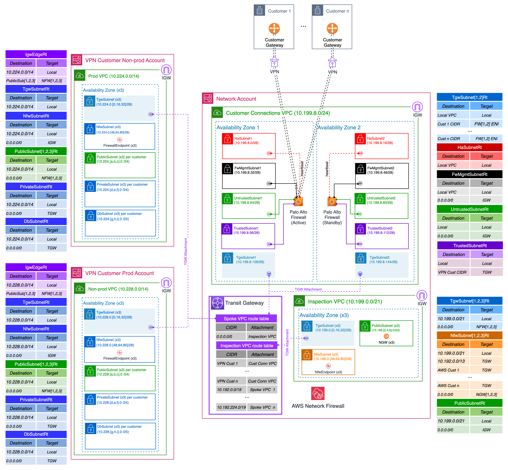

# 5-3.1-Guiding Care Disaster Recovery VPN Connectivity Assessment

**Confluence Page:** https://healthedge.atlassian.net/wiki/spaces/CP1/pages/5273419780/5-3.1-Guiding%20Care%20Disaster%20Recovery%20VPN%20Connectivity%20Assessment

**Created by:** Alex Dixon on November 24, 2025  
**Last modified by:** Alex Dixon on December 03, 2025 at 02:17 PM

---

**1. Overview**
---------------

This document summarizes the current and future-state VPN connectivity model for Guiding Care (GC) environments, focusing on how customer connectivity will behave during Disaster Recovery (DR).

---

**2. Current Connectivity Model**
---------------------------------

Taken from 5.4 Multi-Account Network Design



### **2.1 Architecture Summary**

Customer VPNs terminate on Palo Alto firewalls deployed in each AWS region. These firewalls use CGNAT and consistent per-customer CIDRs to avoid IP overlap and provide segmentation.

---

### **In-Region High Availability**

* Two Palo Alto firewalls per region
* Deployed across separate Availability Zones
* HA configuration with automatic state sync
* Failover between firewalls is seamless and automated

**Status:** *Fully implemented / Low risk*

---

### **Regional Failover (DR)**

* DR regions are pre-provisioned with identical:

  + CIDR allocation for DR Workloads will be different (as detailed here 5.4 Multi-Account Network Design and 5.1 IP Addressing )
  + NAT mapping (Identical to VPN NAT CIDR’s in the Primary Region)
  + Firewall configuration
* No automatic failover between regions
* Final routing/VPN activation is **intentional/manual**

**Status:** *Partially implemented / Medium risk*

---

**3. DR Behavior**
------------------

| **Failover Scope** | **Method** | **Expected Behavior** |
| --- | --- | --- |
| AZ Outage | Automatic | No action required (VPN endpoints at the Palo Alto’s will move to the live connection of the cluster) |
| Firewall Failure | Automatic | Standby appliance becomes active |
| Region Failure | Manual | DR VPN is activated; traffic reroutes |

HealthEdge is avoiding automated BGP DR-based switchover due to contractual and technical variability across customers.

---

**4. Customer Variability Consideration**
-----------------------------------------

Contracts and historical agreements create **differences in required behavior**.

| **Customer Type** | **Technical Capability** | **DR Method** |
| --- | --- | --- |
| Standard GC Customer | Static routing/VPN only | Manual failover |
| Advanced Customer (Future Goal) | Supports BGP\* | Automatic failover (future-state target model) |
| Legacy Azure-connected | Temporary exception path | Manual with special handling |

\*BGP settings and advertising of prefixes from the AWS network would be handled by Palo Alto VPN/firewalls.

---

**5. Risk Summary**
-------------------

| **Category** | **Status** | **Risk** |
| --- | --- | --- |
| Network HA | Implemented | Low |
| Region DR Failover Automation | Manual | Medium |
| Customer Configuration Alignment | Not standardized | Medium–High |
| Documentation + Runbooks | Under development; see <https://healthedge.atlassian.net/wiki/pages/resumedraft.action?draftId=5272600593&draftShareId=dcf84e0c-68bf-4e97-9b5b-3f30230f8019&atlOrigin=eyJpIjoiYmE3ODNjNTBhMDU2NGIzZDljODc4MmQ3ZDA4NjQwNDEiLCJwIjoiYyJ9> | Medium |

---

**6. Recommendation**
---------------------

Adopt a **tiered DR connectivity model per customer**, based on technical capability and contractual expectation. This may be difficult to implement and manage based on number of customers and BGP eligibility.


```
Tier 1 → Auto-failover + BGP  
Tier 2 → Standard GC model + managed manual failover  
Tier 3 → Legacy exceptions + documented runbook only  
```
