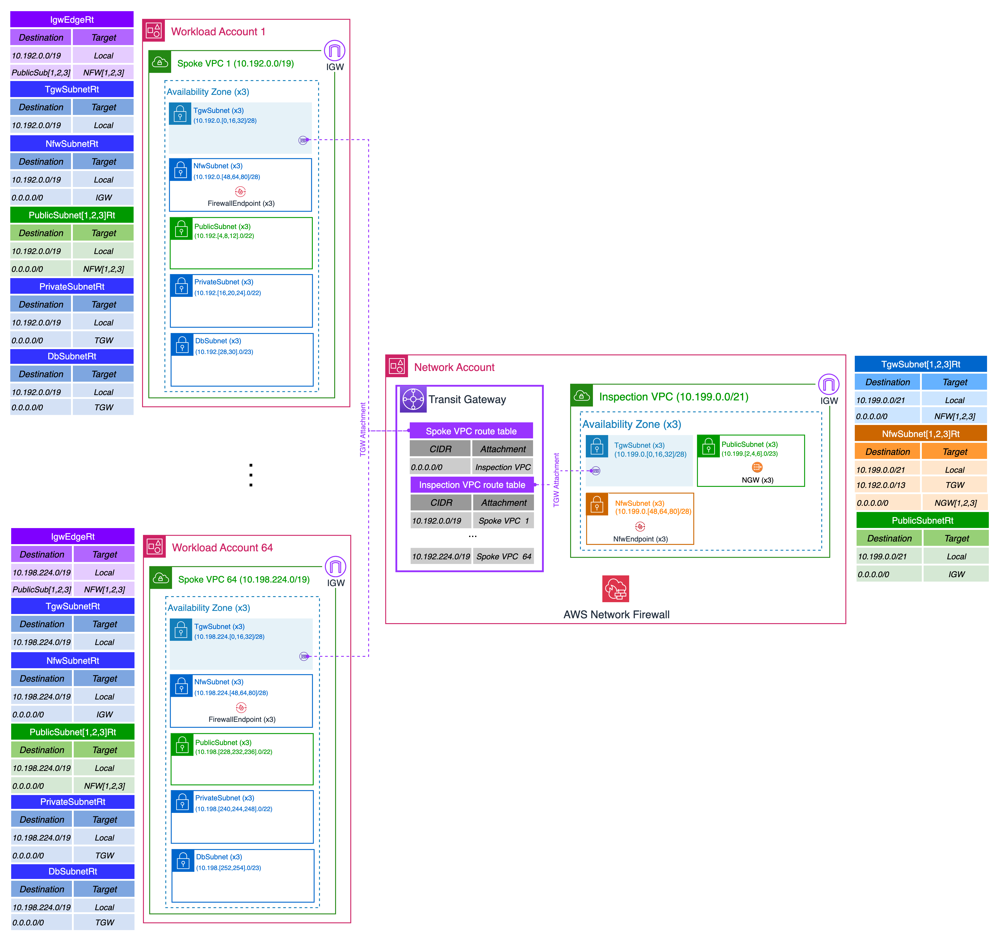
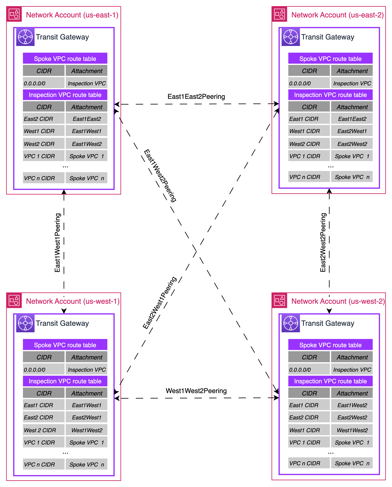
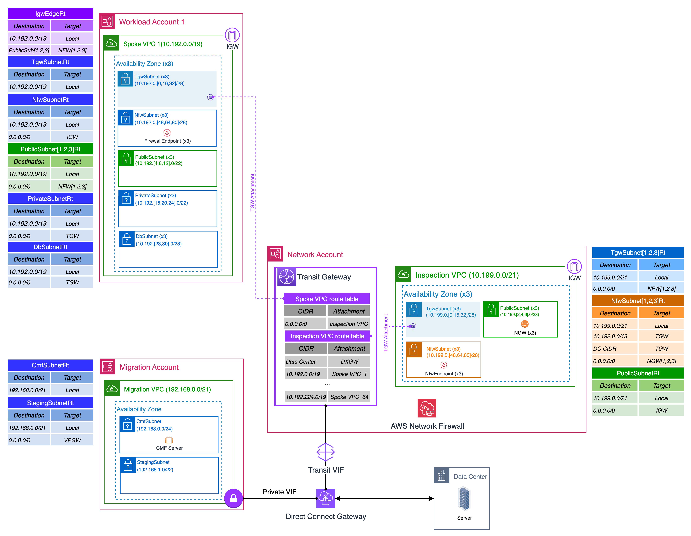

# 5.4 Multi-Account Network Design

**Confluence Page:** https://healthedge.atlassian.net/wiki/spaces/CP1/pages/4867097219/5.4%20Multi-Account%20Network%20Design

**Created by:** Chris Falk on June 16, 2025  
**Last modified by:** Ted O'Hayer on November 24, 2025 at 06:17 PM

---

---

**Purpose**
-----------

To document the HealthEdge multi-account network design.

Requirements and Assumptions
----------------------------

The HealthEdge network is designed around the following networks requirements and assumptions:

1. The HealthEdge network shall be deployed to the AWS us-east-1 (**primary region**), us-east-2, us-west-1, and us-west-2 regions.

2. Each region will be paired with another region based on customer proximity for disaster recovery (DR) purposes.

3. The HealthEdge network, with the exception of the VPN customer connections VPC, shall be designed to be resilient within the region with resources spanning three Availability Zones (AZ)s. However, the resources in the VPN customer connections VPC will only span two AZs due to limitations of the Palo Alto firewall high-availability (HA) architecture.

4. Palo Alto firewall HA pairs will be deployed in each region for site-to-site VPN termination and network address translation (NAT) to support HealthEdge customers connecting to their workloads over VPN. The Palo Alto HA pairs will provide resiliency within each region. Regional failover for DR will be a manual process.
5. Each of the four regions shall have a 10 Gb/s Direct Connect connection to a separate HealthEdge data center to support the workload migrations.

5. A classless inter-domain routing (CIDR) block of **10.192.0.0/10** shall be allocated for AWS network IP addressing.

6. All Internet ingress network traffic shall be distributed to flow through separate entry points in each VPC. However, the design will also accommodate centralized ingress if needed to meet a future requirement.

7. All network traffic flowing in from or out to the Internet, internally between VPCs, externally over the VPNs between AWS and customer sites, and externally between AWS workloads and HealthEdge data centers shall be subject to firewall filtering and inspection. However, HealthEdge migration traffic shall not be subject to firewall filtering and inspection.

8. The AWS Network Firewall shall be deployed centrally in an Inspection VPC spanning three AZs for resiliency to provide firewall filtering and inspection. The Network Firewall Enhanced Inspection feature shall be enabled to support TLS inspection.

**IP Addressing Schema**
------------------------

### IP Addressing Design Tenets

1. Assume growth and leave room for future accommodations at every opportunity.
2. Create one large CIDR for every region (e.g. 10.n.0.0/13). No CIDR should overlap with any existing or planned CIDR.
3. Ensure that the standard VPC CIDR, number of VPCs per account and the number of accounts per region fits inside the regional CIDR block.
4. Determine the standard number of VPCs per account. Understand what, if any, value is obtained by more than one VPC per account. VPCs do not provide isolation when connected to each other with a Transit Gateway or other mechanisms.
5. Divide the regional CIDR block into CIDR blocks for every life cycle to summarize routing and security groups by life cycle (see diagram below).
6. Determine the number of Availability Zones (AZ) that will be supported by the VPC. This number should be two or more for resiliency purposes. Note that when PrivateLink is used each subnet/AZ can provide 10Gbps. Choosing two AZs, for example, will limit PrivateLink bandwidth to 20Gbps that may burst.
7. Divide the VPC CIDR blocks into the number of subnets per CIDR. The subnets should be spread evenly across the selected number of AZs.
8. Reserve one /28 CIDR for TGW attachments for each AZ that subnets exist in.
9. If an account will host clusters or large IP address consumers, create an additional subnet perhaps as large as the VPC. .
10. Assign VPC CIDR blocks in an organized fashion. If a business doesn’t need a VPC CIDR block in a higher life cycle, the CIDR block should be reserved for the business’s future use.
11. Mirror the CIDR allocations across regions.
12. The use of AWS Transit Gateway is assumed.

See 5.1 IP Addressing for a description of the IP addressing schema applied to the network design.

Network Architecture
--------------------

The network architecture is designed to support each of the following patterns:

* Standard Internet facing network communications
* VPN customer network communications
* Inter-regional network communications
* Data center network communications

### Standard Internet Facing Network Communications

The following diagram depicts the network architecture for standard Internet facing communications in the us-east-1 region. This architecture is identical for each region with the exception of the regional CIDRs used. In this architecture, an AWS Transit Gateway (TGW) provides all Inter-VPC routing.  For resiliency, all TGW VPC attachments are made to three separate TGW subnets, each in a separate AZ.

This network is designed for distributed ingress and centralized egress network traffic flow.  Inbound network traffic originating from the Internet is routed via a separate Internet Gateway attached to each Spoke VPC.  Outbound network traffic originating from the HealthEdge AWS network is routed via a central Internet Gateway in the Network account attached to the Inspection VPC. All network traffic, destined to or from the Internet, or internally between VPCs is inspected and filtered by the AWS Network Firewall located in the Inspection VPC. See 5.2 Network Data Flows for a description of network traffic flows.

### VPN Customer Network Communications

To support VPN customer communications, a Customer Connections VPC is added in the Network account, The purpose of this VPC is to terminate site-to-site VPNs to the customer sites. Palo Alto firewalls are utilized to terminate the customer VPNs and provide NAT functionality to accommodate overlapping CIDRs among customers. The Palo Alto firewalls provide 1-to-1 NAT between an RFC 6598 Carrier Grade NAT (CGNAT) subnet assigned to the customer facing interface and a subnet allocated from the AWS CIDR assigned to the customer workloads VPC. See 5.1 IP Addressing for a description of the IP addressing schema used for VPN customers.

The following diagram depicts the network architecture to support VPN customer communications. This architecture is identical for each region with the exception of the regional CIDRs used. Network traffic from the customer traverses the VPN, gets NAT’d by the Palo Alto firewall, and routed for inspection by the AWS NFW prior to reaching the customer workload. See 5.2 Network Data Flows for a description of the VPN customer network traffic flows.

### Inter-regional Network Communications

Inter-regional network communications traverses the AWS internal network between TGW peers. The TGWs are peered with each other in a fully meshed configuration allowing resources in each regional network to communicate with resources in any other regional network. Within each destination region, the network traffic flows through the Inspection VPC to be inspected by the AWS Network Firewall prior to reaching its destination. See 5.2 Network Data Flows for a description of the inter-regional network traffic flow. The following diagram shows the network connectivity between TGWs for inter-regional traffic communications.

Data Center Network Communications
----------------------------------

The following diagram represents typical connectivity between AWS and a HealthEdge data center within each region. This architecture is identical for each region with the exception of the regional CIDRs used. Network communications between the data center and an AWS workload in a Spoke VPC will traverse the Direct Connect (DX) connection and the TGW via the Transit virtual interface (VIF). It will get routed through the Inspection VPC to be inspected by the NFW prior to reaching its destination. Migration traffic will also traverse the DX but take a direct path to the Migration VPC. See 5.2 Network Data Flows for a description of data center network traffic flows.

**VPC Routing**
---------------

### Spoke VPC Internet Gateway Edge Route Table

Internet inbound traffic destined for a host on the *PublicSubnet* will get redirected to the NFW endpoints for inspection before getting forwarded to the host.  the following table summarizes the Spoke VPC IGW edge route table *(IgwEdgeRt)*.

|  |  |  |
| --- | --- | --- |
| **Destination** | **Target** | **Notes** |
| Spoke VPC CIDR | Local | Default |
| Public subnet [1,2,3] | NFW [1,2,3] | Redirected to NFW endpoint for inspection |

### Spoke VPC Transit Gateway Subnet Route Table

Traffic destined to a subnet within the Spoke VPC will get routed locally.  The following table summarizes the Spoke VPC TGW subnet route table (*TgwSubnetRt*).

|  |  |  |
| --- | --- | --- |
| **Destination** | **Target** | **Notes** |
| Spoke VPC CIDR | Local | Default |

### Spoke VPC Network Firewall Subnet Route Table

Traffic destined to a subnet within the Spoke VPC will get routed locally.  Table 5 summarizes the Spoke VPC NFW subnet route table (*NfwSubnetRt*).

|  |  |  |
| --- | --- | --- |
| **Destination** | **Target** | **Notes** |
| Spoke VPC CIDR | Local | Default |
| 0.0.0.0/0 | IGW | Default route to the IGW |

### Spoke VPC Public Subnet Route Tables

Traffic destined to a subnet within the Spoke VPC will get routed locally.  Traffic destined for the Internet will get routed to the NFW endpoint for inspection before being sent to the Spoke VPC IGW and out to the Internet.  The following table summarizes the Spoke VPC Public subnet route tables (*PublicSubnet[1,2,3]Rt*).

|  |  |  |
| --- | --- | --- |
| **Destination** | **Target** | **Notes** |
| Spoke VPC CIDR | Local | Default |
| 0.0.0.0 | NFW [1,2,3] | Routed to the NFW endpoint for inspection |

### Spoke VPC Private and DB Subnet Route Tables

For all traffic originating from a source within the Spoke VPC, outbound Internet connectivity will be provided via centralized egress.  All AWS network traffic with the exception of migration traffic will be routed via the Inspection VPC and subject to firewall inspection.  The following table summarizes the typical Spoke VPC Private (*PrivateSubnetRt*) and DB subnet (*DbSubnetRt*) route tables.

|  |  |  |
| --- | --- | --- |
| **Destination** | **Target** | **Notes** |
| Spoke VPC CIDR | Local | Default |
| 0.0.0.0 | TGW | The TGW provides connectivity to all destinations outside the VPC |

### Inspection VPC Transit Gateway Subnet Route Tables

For high availability, the TGW attaches to the Inspection VPC on three different subnets, one in each AZ.  Each TGW subnet has its own route table with unique routes to the corresponding NFW endpoint located in the same AZ.  The following table summarizes the Inspection VPC TGW subnet route tables (*TgwSubnet[1,2,3]Rt*).  These route tables provide a default route to the appropriate NFW endpoint for traffic inspection.

|  |  |  |
| --- | --- | --- |
| **Destination** | **Target** | **Notes** |
| Inspection VPC CIDR | Local | Default |
| 0.0.0.0/0 | NFW [1,2,3] | Default route to the NFW endpoint |

### Inspection VPC Firewall Subnet Route Tables

The following table summarizes the Inspection VPC NFW subnet route tables (*NfwSubnet[1,2,3]Rt*).  These route tables provide a default route to the Internet via the corresponding NGW located in the same AZ.  They also provide routes to the spoke VPCs for return traffic, the data center, and VPN customer AWS workloads.

|  |  |  |
| --- | --- | --- |
| **Destination** | **Target** | **Notes** |
| Inspection VPC CIDR | Local | Default |
| Spoke VPCs | TGW | Route to spoke VPCs for return traffic |
| Data Center | TGW | Route to the data center |
| VPN Customer | TGW | Route to each VPN customer via the Customer Connections VPC and VPN connections |
| 0.0.0.0/0 | NGW [1,2,3] | Default route to the corresponding NGW located in the same AZ |

### Inspection VPC Public Subnet Route Table

The following table summarizes the Inspection VPC Public subnet route table (*PublicSubnetRt*).  This route table provides a default route to the Internet via the Inspection VPC IGW.  Return traffic is directed via the local route to the originating NFW endpoint for inspection.

|  |  |  |
| --- | --- | --- |
| **Destination** | **Target** | **Notes** |
| Inspection VPC CID | Local | Return traffic is sent to the originating NFW endpoint |
| 0.0.0.0/0 | IGW | Default route to the IGW |

Network Security
----------------

The network is designed for distributed ingress and centralized egress.  All N-S-E-W network traffic is routed to the AWS Network Firewall in the Inspection VPC for inspection and filtering.

### AWS Network Firewall

The AWS Network Firewall supports both stateless and stateful rules for network traffic filtering.  With stateless rules, the firewall evaluates each packet without regard to the state of the connection.  Stateless rules incur lower processing costs, but they don’t support logging or deep packet inspection.  Stateful rules can evaluate the state of the connection and support both logging and deep packet inspection.

The Network Firewall supports the following 3 types of stateful rules:

1. Standard (5-tuple) rules – allow you to filter based on protocol, source IP address, source protocol port, destination IP address, destination protocol port, and direction of flow.
2. Domain list – allow you to allow or deny traffic based on Internet domain names.
3. Suricata rules – allow you to create complex rules to perform deep packet inspection using the Suricata open-source rule-based language for packet inspection.

In addition, there are 2 policy options that effect the order in which stateful rules get evaluated:

1. Default – the Network Firewall automatically groups rules by their assigned action and evaluates them in the following order by precedence:

   1. Pass
   2. Drop
   3. Reject
   4. Alert
2. Strict – the Network Firewall allows the option to strictly define the order in which stateful rules are evaluated.

For the HealthEdge implementation, the Network Firewall policy is configured for strict stateful rule evaluation order.  Also, the stateless rule default action (for unmatched traffic) is configured to forward to the stateful rule engine.

The initial baseline Network Firewall configuration consists of the rules summarized the following table.

|  |  |  |  |  |  |  |  |
| --- | --- | --- | --- | --- | --- | --- | --- |
| **Protocol** | **Source** | **Source Port** | **Destination** | **Destination Port** | **Direction** | **Action** | **Keyword** |
| IP | Regional CIDR | Any | Any | Any | Forward | Pass | sid:1  flow:established |
| ICMP | Regional CIDR | Any | Any | Any | Forward | Pass | sid:2 |
| TCP | Any | Any | Regional CIDR | 443 | Forward | Pass | sid:3 |

This will allow the following traffic:

* All established IP protocol traffic flows that originate from a source IP within the HealthEdge CIDR range destined for any other IP address inside or outside the HealthEdge network.  The ‘flow:established’ keyword matches flows that have completed a 3-way handshake and established a session.
* All ICMP protocol traffic that originates from a source IP within the HealthEdge CIDR range destined for any other IP address inside or outside the HealthEdge network.
* HTTPS traffic is allowed from the Internet to any workload account.

Over time, this ruleset may need to be modified as requirements to allow different traffic patterns arise.  Suricata rules can also be configured and applied if deep packet inspection becomes a requirement.  You can define your own Suricata rules, subscribe to an extensive list of predefined AWS managed rulesets, or subscribe to third-party rulesets available in the AWS Marketplace.

Network Monitoring
------------------

### VPC Flow Logs

VPC Flow Logs are configured for the Spoke and Inspection VPCs with the following options:

* Timeout – 10 minutes – every 10 minutes the log buffer is written to the log.
* Destination – CloudWatch Logs – the logs are sent to CloudWatch Logs for near real-time viewing.
* Record Format – Custom – a custom record format is defined to log all available fields for a complete dataset.

In addition, the AWS Landing Zone Accelerator (LZA) automatically collects CloudWatch logs across the AWS Organization member accounts and stores them in a centralized S3 bucket within the Log Archive account.

The VPC Flow Logs can be filtered and viewed from within the Network account CloudWatch Logs – Logs Insights Console.  The following table shows a sample display of a VPC Flow Log record from within the Logs Insights Console.

|  |  |
| --- | --- |
| **Field** | **Value** |
| **@timestamp** | 1748557758000 |
| **accountId** | 123456789012 |
| **action** | ACCEPT |
| **azId** | use1-az1 |
| **bytes** | 16239 |
| **dstAddr** | 10.192.4.56 |
| **dstPort** | 443 |
| **end** | 1748557765 |
| **flowDirection** | ingress |
| **interfaceId** | eni-0906ee18501ae81af |
| **logStatus** | OK |
| **packets** | 38 |
| **pktDstAddr** | 52.46.154.111 |
| **pktDstAwsService** | AMAZON |
| **pktSrcAddr** | 10.192.4.46 |
| **protocol** | 6 |
| **region** | us-east-1 |
| **srcAddr** | 10.192.4.46 |
| **srcPort** | 22185 |
| **start** | 1748557758 |
| **subnetId** | subnet-0074cc06ba915f010 |

Deployment Strategy
-------------------

The LZA solution is being used to deploy customizations built on top of AWS Organizations and Control Tower.  The entire shared network infrastructure, security services, and new accounts are created with infrastructure as code (IaC) using LZA configurations and customizations.  This provides resource deployment consistency and infrastructure configuration management across the AWS organization.

References
----------

* [AWS Organizations](https://aws.amazon.com/organizations/)
* [AWS Control Tower](https://aws.amazon.com/controltower/)
* [AWS Landing Zone Accelerator](https://aws.amazon.com/solutions/implementations/landing-zone-accelerator-on-aws/)
* [AWS IAM Identity Center](https://aws.amazon.com/iam/identity-center/)
* [AWS Transit Gateway](https://aws.amazon.com/transit-gateway/)
* [AWS Network Firewall](https://aws.amazon.com/network-firewall/)