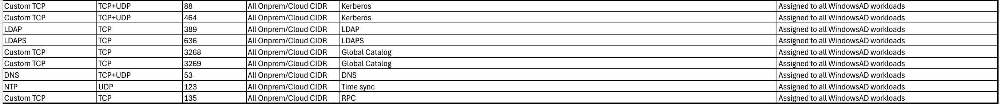
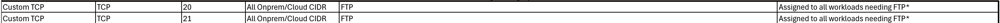
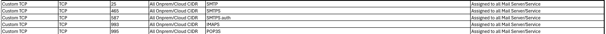
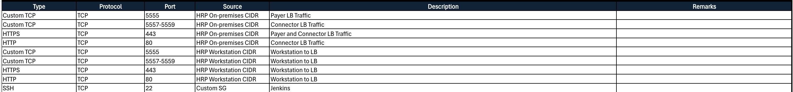
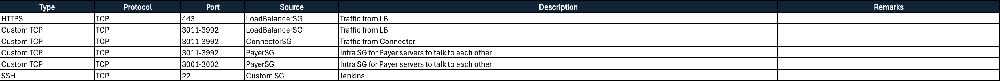
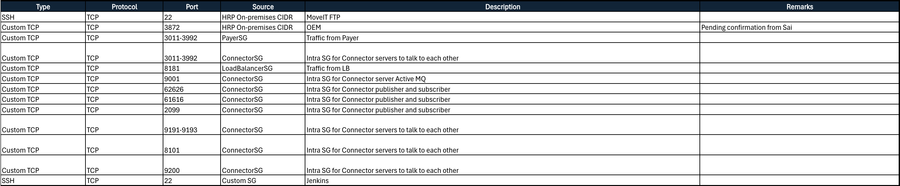
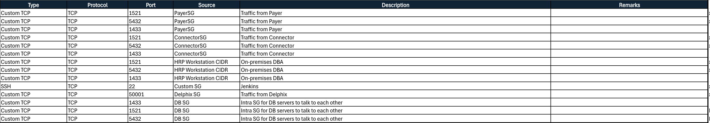
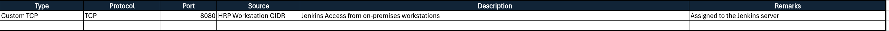
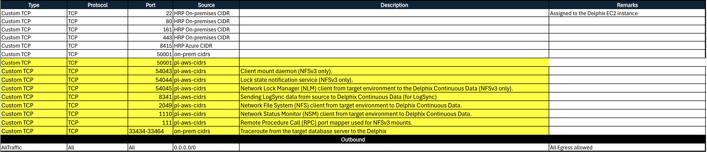

# Compliance Review - HRP Network Firewalls and Security Groups

**Confluence Page:** https://healthedge.atlassian.net/wiki/spaces/CP1/pages/5183012865/Compliance%20Review%20-%20HRP%20Network%20Firewalls%20and%20Security%20Groups

**Created by:** Shreya Singh on October 22, 2025  
**Last modified by:** Shreya Singh on December 08, 2025 at 08:47 PM

---

### HRP Network Firewall Rules

* The current HRP firewall rules set enables access from authorized jump hosts to the Dev and Shared environments and facilitates connectivity between AWS (Dev, Non-Prod, and Prod) and on-premises Data Centers to support operational dependencies. Dev, Shared, and Data Center networks are configured for full east-west communication, while Prod remains isolated, adhering to environment segregation principles.
* The rules also allow bidirectional communication between Dev, Shared, and Monitoring networks for observability, as well as controlled access to centralized Active Directory, on-premise storage, and database subnets for authentication, data replication, and backups. Several rules provide targeted access to specific IPs supporting build, orchestration, or integration services.
* Overall, the configuration establishes functional connectivity across environments for management, identity, monitoring, and data operations, though it relies on broad “any-any” permissions that should be periodically reviewed and restricted for least-privilege compliance by HE security and compliance teams.
* compliance review completed on Oct 20, 2025.

| **List of Firewall Rules reviewed** |
| --- |
| pass tcp $HRP\_JUMP\_SOURCES any -> [$HRP\_WORKLOAD\_NET\_DEV,$HRP\_WORKLOAD\_NET\_SHARED] $HRP\_JUMP\_PORTS (flow:established; msg:"Access from HRP Bastions"; sid:20001; ) |
| # pass tcp [$HRP\_WORKLOAD\_NET\_PROD,$HRP\_DATA\_CENTERS] any -> [$HRP\_WORKLOAD\_NET\_PROD,$HRP\_DATA\_CENTERS] $HRP\_APP\_TRAFFIC (flow:established; msg:"HRP application traffic prod"; sid:20002; ) |
| # pass tcp [$HRP\_WORKLOAD\_NET\_NONPROD,$HRP\_DATA\_CENTERS] any -> [$HRP\_WORKLOAD\_NET\_NONPROD,$HRP\_DATA\_CENTERS] $HRP\_APP\_TRAFFIC (flow:established; msg:"HRP application traffic nonprod"; sid:20003; ) |
| pass tcp [$HRP\_WORKLOAD\_NET\_DEV,$HRP\_DATA\_CENTERS] any -> [$HRP\_WORKLOAD\_NET\_DEV,$HRP\_DATA\_CENTERS] $HRP\_APP\_TRAFFIC (flow:established; msg:"HRP application traffic dev"; sid:20004; ) |
| pass tcp [$HRP\_WORKLOAD\_NET\_DEV,$HRP\_WORKLOAD\_NET\_SHARED,$HRP\_DATA\_CENTERS] any -> [$HRP\_WORKLOAD\_NET\_DEV,$HRP\_WORKLOAD\_NET\_SHARED,$HRP\_DATA\_CENTERS] $TANIUM (flow:established; msg:"Tanium\*"; sid:20005; ) |
| pass tcp [$HRP\_WORKLOAD\_NET\_DEV,$HRP\_WORKLOAD\_NET\_SHARED,$MONITORING\_NET] any -> [$HRP\_WORKLOAD\_NET\_DEV,$HRP\_WORKLOAD\_NET\_SHARED,$MONITORING\_NET] $HRP\_MONITORING (flow:established; msg:"SolarWinds, OEM monitoring"; sid:20006; ) |
| pass ssh [172.19.0.22,10.52.254.206] any -> [$HRP\_WORKLOAD\_NET\_DEV,$HRP\_WORKLOAD\_NET\_SHARED] 22 (msg:"MoveIT"; sid:20007; ) |
| pass ssh [$HRP\_WORKLOAD\_NET\_DEV,$HRP\_WORKLOAD\_NET\_SHARED] any -> [192.168.19.22,192.168.29.19] 22 (msg:"SFTP"; sid:20008; ) |
| pass tcp [$HRP\_WORKLOAD\_NET\_DEV,$HRP\_WORKLOAD\_NET\_SHARED] any -> 10.14.252.16 $HRP\_NEXUS (flow:established; msg:"Nexus artifact registry"; sid:20009; ) |
| pass tcp [$HRP\_WORKLOAD\_NET\_DEV,$HRP\_WORKLOAD\_NET\_SHARED] any -> [172.19.0.90,172.19.0.136,172.19.0.137,172.19.0.138,172.19.0.139] $HRP\_APP\_DYNAMICS (flow:established; msg:"App dynamics and system pulse"; sid:20010; ) |
| pass tcp [$HRP\_WORKLOAD\_NET\_DEV,$HRP\_WORKLOAD\_NET\_SHARED] any -> [10.51.254.23,10.52.254.23] $HRP\_MAIL (flow:established; msg:"Email server"; sid:20011; ) |
| pass ntp [$HRP\_WORKLOAD\_NET\_DEV,$HRP\_WORKLOAD\_NET\_SHARED] any -> [10.51.254.16,10.52.254.16] 123 (msg:"NTP"; sid:20012; ) |
| pass tcp [$HRP\_ONPREM\_DB\_SUBNETS\_DEV,$HRP\_AWS\_DB\_SUBNETS\_DEV] any -> [$HRP\_ONPREM\_DB\_SUBNETS\_DEV,$HRP\_AWS\_DB\_SUBNETS\_DEV] $DELPHIX\_TCP (flow:established; msg:"Delphix"; sid:20013; ) |
| pass tcp [$HRP\_WORKLOAD\_NET\_DEV,$HRP\_WORKLOAD\_NET\_SHARED,$HRP\_DATA\_CENTERS] any -> [$HRP\_AD\_SERVERS,$HRP\_WORKLOAD\_NET\_SHARED] $AD\_TCP (flow:established; msg:"AD TCP ports"; sid:20014; ) |
| pass udp [$HRP\_WORKLOAD\_NET\_DEV,$HRP\_WORKLOAD\_NET\_SHARED,$HRP\_DATA\_CENTERS] any -> [$HRP\_AD\_SERVERS,$HRP\_WORKLOAD\_NET\_SHARED] $AD\_UDP (msg:"AD UDP ports"; sid:20015; ) |
| pass tcp [$HRP\_WORKLOAD\_NET\_DEV,$HRP\_WORKLOAD\_NET\_SHARED] any -> $HRP\_ONPREM\_STORAGE\_NET $SMB\_TCP (flow:established; msg:"SMB"; sid:20016; ) |
| pass ip [$HRP\_WORKLOAD\_NET\_DEV,$HRP\_WORKLOAD\_NET\_SHARED] any -> $HRP\_ONPREM\_STORAGE\_NET $NFS\_TCP (msg:"NFS"; sid:20017; ) |

### **Review of Existing Security Groups for HRP**

* Security group architecture demonstrates strong security practices. The implementation follows a layered security model with distinct groups for different workload types (Linux, Windows, Windows AD, LoadBalancer, Payer, Connector, and Database), which aligns with AWS recommendations for minimizing the number of security groups while maintaining appropriate segmentation. The use of security group referencing between application tiers (LoadBalancerSG, PayerSG, ConnectorSG, and DatabaseSG) follows AWS best practices for controlling traffic between instances without requiring IP address management.
* **Application Groups (HRP)**: The LoadBalancerSG correctly restricts inbound traffic to specific ports (80, 443, 5555, 5557-5559) from defined source CIDRs. The DatabaseSG properly implements security group referencing for application tier access (PayerSG and ConnectorSG), which is an AWS best practice.
* **Delphix Group**: The Delphix security group uses prefix lists (pl-aws-cidrs) for NFS-related ports, which is a good practice for managing IP ranges at scale.
* Compliance review conducted on Oct 15th 2025 and still going on since migration team is still working on few of the security groups. Below is the link to all list of security groups being implemented for HRP

HRP Security Group:

* Windows AD SG - he-global-sg-winad-use1

* FTP SG - he-global-sg-ftp-use1

* Mail SG - he-global-sg-mail-use1

* LoadBalancerSG - he-global-sg-hrp-lb

* PayerSG - he-global-sg-hrp-payer

* ConnectorSG -  he-global-sg-hrp-cnc

* DatabaseSG -  he-global-sg-hrp-db

* SPECIFIC GROUP - he-hrp-sg-custom-perf-use1

* Delphix GROUP - he-global-sg-delphix (Yellow means to be added to LZA)

