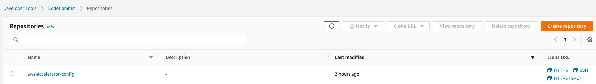
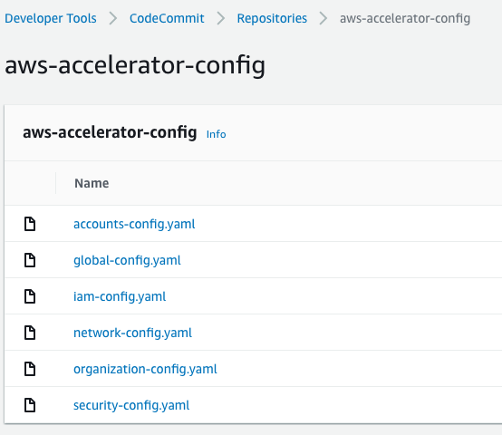
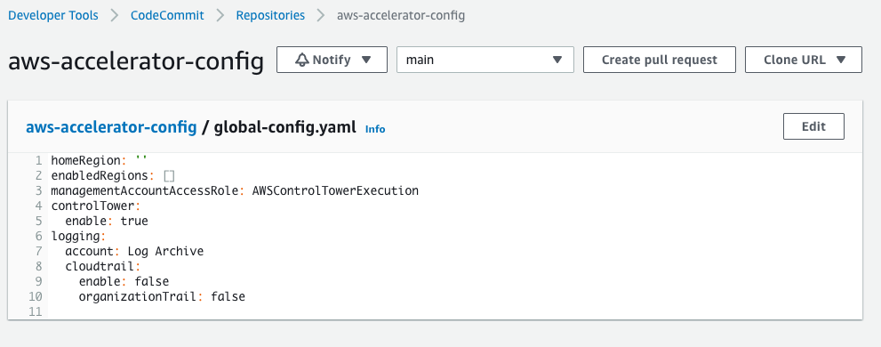

# 7-1-Accessing-Configuration-Files

**Confluence Page:** https://healthedge.atlassian.net/wiki/spaces/CP1/pages/4867033879/7-1-Accessing-Configuration-Files

**Created by:** Chris Falk on June 16, 2025  
**Last modified by:** Chris Falk on June 16, 2025 at 02:33 AM

---

---

title: 7.1 Accessing Configuration Files
----------------------------------------

**Purpose**
-----------

In this step, we will access the Landing Zone Accelerator configuration files that are stored in the AWS CodeCommit in the Organizations Management (Root) Account. Storing the configuration files in AWS CodeCommit allows us to utilize configuration management best practices and change tracking via Git. The CodeCommit repository containing the Landing Zone Accelerator configuration files is named `aws-accelerator-config`

Customers are able to clone the AWS CodeCommit configuration repository and interact with it directly using Git. Branching and pull request best practices should be followed when managing these configuration files. The AWS CodeCommit console allows you to also manually edit the configuration files, in this guide we’ll utilize the console to add changes and commits.

After changes are made to the configuration files within AWS CodeCommit the AWS CodePipeline will not automatically release those changes into Landing Zone Accelerator.

**Prerequisites**
-----------------

Before releasing the AWS CodePipeline changes in an AWS Environment, it’s important to ensure the follow prerequisites are met.

* The Region Design page

  1-1 - Decision - AWS Region Design
  should be referenced and baselined.
* AWS Control Tower Deployment
  should be completed and AWS Control Tower should state the Landing Zone deployment is complete without errors
* Landing Zone Accelerator on AWS Deployment
  should be completed and the Landing Zone Accelerator Solution Template in AWS CloudFormation is successfully deployed without errors.

**Access Configuration files using AWS CodeCommit**
---------------------------------------------------

1. Log into the Organizations Management (Root) AWS Account and navigate to the the **AWS CodeCommit console** in the region you deployed the Landing Zone Accelerator.
2. Access the **aws-accelerator-config** repository by selecting the name

1. The initial configuration files should be displayed

### Utilize AWS CodeCommit IDE for Configuration Changes

AWS CodeCommit provides a web-based IDE that can be utilized to make edits to the configuration .yaml files without the need for local git tooling to be installed.

1. When you access the AWS CodeCommit repository you can click on a configuration file name
2. First step is to baseline the global-config file, select the `global-config.yaml` file and then select **Edit**

1. This will open the file utilizing the AWS CodeCommit IDE, update the relevant configuration based on your requirements e.g. homeRegion and enabledRegions, to update the file fill in your name, email and commit message and choose commit changes. This will then save the file within the code commit environment but will not apply as the pipeline needs a “Release Change” as detailed in

   8-1 - Release Configuration changes into AWS CodePipeline

   **Sample Configuration**

**Replace Configuration Files**
-------------------------------

Once access to the configuration files has been enabled, replace the configuration files with the ones from AWS Rapid Migration, which will provide the starting point for configuring the landing zone. These will then be customized in the following runbooks to provide the initial baseline of the landing zone.

**Attachments:**

[image-20220323-193830.png](../../attachments/image-20220323-193830.png)

[image-20220323-193927.png](../../attachments/image-20220323-193927.png)

[image-20220323-194302.png](../../attachments/image-20220323-194302.png)

[image-20220323-194429.png](../../attachments/image-20220323-194429.png)

[image-20220519-202357.png](../../attachments/image-20220519-202357.png)

[image-20220519-202521.png](../../attachments/image-20220519-202521.png)

[image-20220519-211031.png](../../attachments/image-20220519-211031.png)