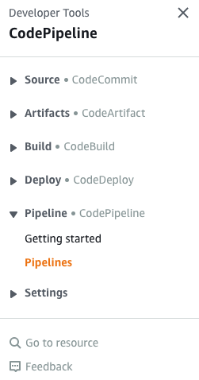
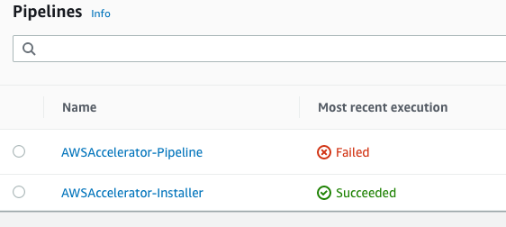

# 8-1-Release-Configuration-changes-into-AWS-CodePipeline

**Confluence Page:** https://healthedge.atlassian.net/wiki/spaces/CP1/pages/4867034487/8-1-Release-Configuration-changes-into-AWS-CodePipeline

**Created by:** Chris Falk on June 16, 2025  
**Last modified by:** Chris Falk on June 16, 2025 at 02:37 AM

---

---

title: 8.1 Release Configuration changes into AWS CodePipeline
--------------------------------------------------------------

**Purpose**
-----------

After changes are made to the configuration files within AWS CodeCommit the AWS CodePipeline will not automatically release those changes into Landing Zone Accelerator. This will allow multiple configuration changes to be made prior to execution of the pipeline.

**Prerequisites**
-----------------

Before releasing the AWS CodePipeline changes in an AWS Environment, it’s important to ensure the follow prerequisites are met.

* All changes to the *aws-accelerator-config* repository have been successfully committed

**Release changes for AWS CodePipeline**
----------------------------------------

1. Navigate to [AWS CodePipeline](https://console.aws.amazon.com/codesuite/codepipeline/pipelines) console
2. Expand the ***Pipeline*** menu and select ***Pipelines***

1. Select the ***AWSAccelerator-Pipeline*** from the list

1. Click ***Release change*** and let the pipeline run.

Note - manual user interaction will be required in the ***Review*** stage to Approve changes.

**Attachments:**

[image-20220324-145313.png](../../attachments/image-20220324-145313.png)

[image-20220324-145328.png](../../attachments/image-20220324-145328.png)

[image-20220324-145424.png](../../attachments/image-20220324-145424.png)