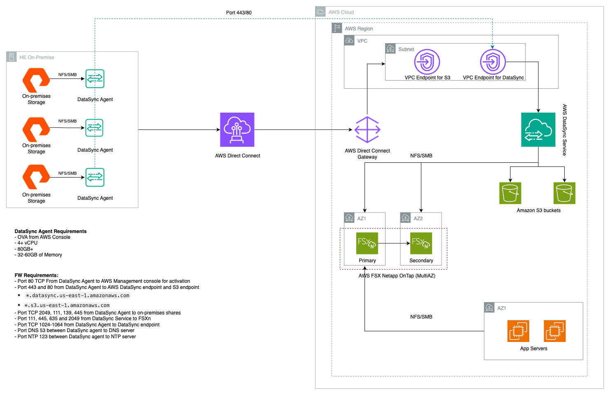
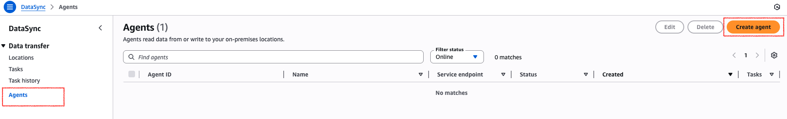
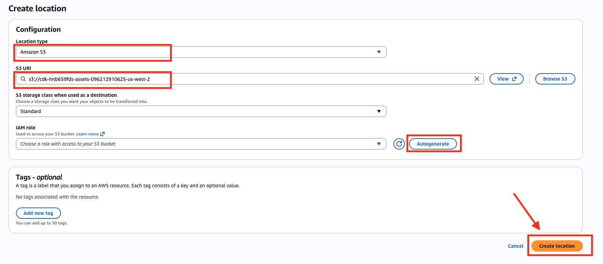
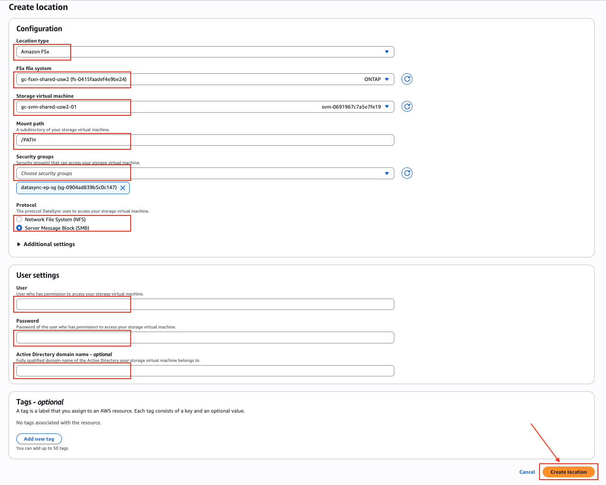
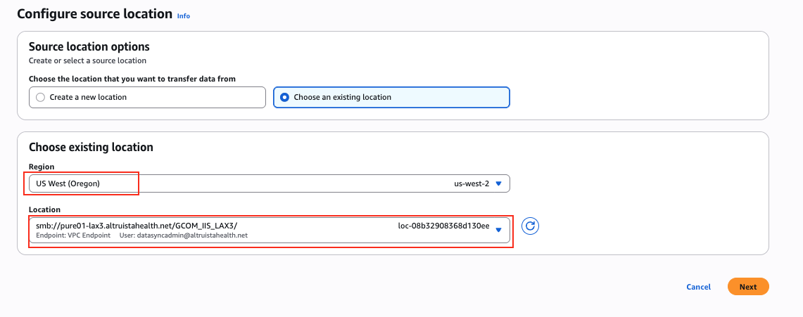
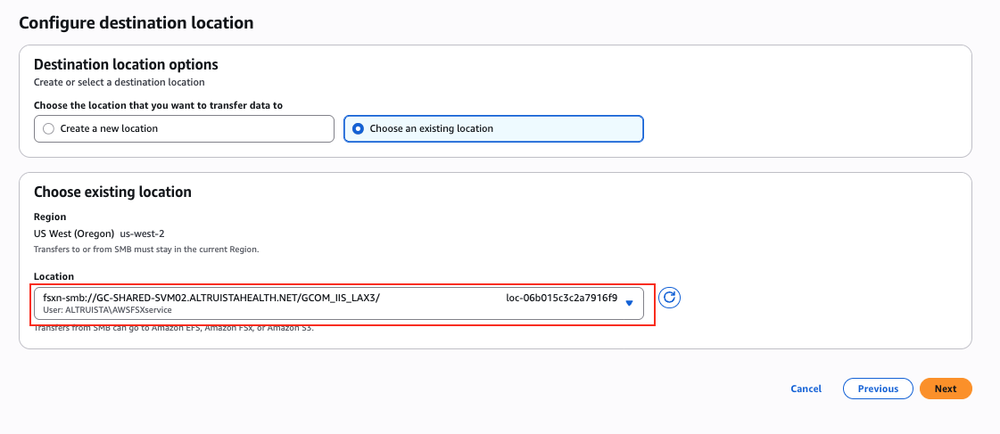
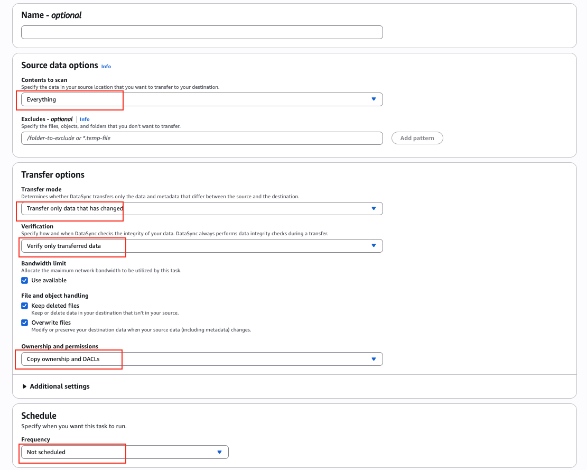

# Runbook - AWS DataSync Deployment and Runbook

**Confluence Page:** https://healthedge.atlassian.net/wiki/spaces/CP1/pages/5158993986/Runbook%20-%20AWS%20DataSync%20Deployment%20and%20Runbook

**Created by:** Himanshu Gupta on October 10, 2025  
**Last modified by:** Srinath K on December 09, 2025 at 06:44 AM

---

AWS DataSync is a secure, online data transfer service that simplifies, automates, and accelerates moving data between on-premises storage systems and AWS storage services. For HealthEdge's migration journey, DataSync provides a robust solution for transferring large volumes of healthcare data while maintaining data integrity and security compliance.

DataSync supports transfers from Network File System (NFS), Server Message Block (SMB), Hadoop Distributed File System (HDFS), self-managed object storage, and other cloud storage systems to Amazon S3, Amazon EFS, Amazon FSx for Windows File Server, Amazon FSx for Lustre, Amazon FSx for OpenZFS, and Amazon FSx for NetApp ONTAP.

### Key benefits of DataSync:

* Automate data movement - DataSync makes it easier to transfer data over the network between storage systems and services, automating both the management of data-transfer processes and the infrastructure required for high performance and secure data transfers
* Transfer data securely - DataSync provides end-to-end security, including encryption and data integrity validation using Transport Layer Security (TLS), to help ensure that your data arrives securely, intact, and ready to use
* Built-in scheduling mechanism - Periodically run data transfer tasks to detect and copy changes with hourly, daily, or weekly options
* Comprehensive monitoring and auditing - Integration with Amazon CloudWatch for monitoring transfer status and AWS CloudTrail for audit logging
* HIPAA eligible service - AWS DataSync is a HIPAA eligible service that can be used by covered entities and business associates to process, maintain, and store protected health information when used with a signed Business Associate Agreement (BAA)

### Firewall Ports Requirements:

For successful DataSync deployment, the following firewall ports must be configured:

|  |  |  |  |
| --- | --- | --- | --- |
| **Source** | **Target** | **Protocol** | **Port** |
| DataSync Agent | Local Storage | TCP | 139, 445, 2049 and 111 |
| Local Storage | DataSync Agent | TCP | 139, 445, 2049 and 111 |
| DataSync Agent | DataSync VPC Endpoint | TCP | 443, 1024-1064 |
| DataSync Agent | S3 VPC Endpoint | TCP | 443 |
| DataSync Agent | DNS Server | TCP | 53 |
| DataSync Agent | NTP Server | UDP | 123 |
| DataSync VPC Endpoint | FSxN | TCP | 111, 139, 635, 445 and 2049 |
| FSxN | DataSync VPC Endpoint | TCP | 111, 139, 635, 445 and 2049 |

#### Specific Endpoints:

* [datasync.us-east-1.amazonaws.com](http://datasync.us-east-1.amazonaws.com) (Replace us-east-1 with the region where you are deploying the endpoint)
* s3.us-east-1.amazonaws.com (Replace us-east-1 with the region where you are deploying the endpoint)

Networking requirement -<https://docs.aws.amazon.com/datasync/latest/userguide/datasync-network.html#using-vpc-endpoint>

### Architecture Diagram

#### On-Premises Infrastructure:

* Three DataSync Agents deployed on the on-premises vCenter. One agent per account.
* Each agent connects to NFS/SMB file shares containing healthcare data
* DataSync agents are configured with specific OVA requirements: 4x vCPU, 80GB storage, and 64GB memory

#### AWS Cloud Infrastructure:

* AWS Direct Connect provides dedicated network connectivity
* VPC with private subnets hosting the target storage infrastructure
* VPC Endpoints for S3 and DataSync services to keep traffic within AWS network
* Amazon S3 buckets and AWS FSx NetApp ONTAP as the destination for migrated data
* AWS FSx NetApp ONTAP configured in Primary/Secondary setup for high availability
* Application servers migrated to AWS using AWS FSx NetApp ONTAP volumes to access the migrated data

### AWS DataSync deployment steps:

1. Create a security group that inbound connection from on-premises CIDRs on port TCP 443 and TCP 1024-1064
2. Create VPC endpoint for DataSync in the AWS account where the data will be migrated
3. VPC endpoint for S3 is already created in the central networking account
4. Open the required [firewall rules](https://healthedge.atlassian.net/wiki/spaces/CP1/pages/5158993986/Runbook+-+AWS+DataSync+Deployment+and+Runbook#Firewall-Ports-Requirements%3A)
5. Download the DataSync Agent OVA from AWS console and deploy the OVA on-premises

   1. Login to AWS Console
   2. Search and Navigate to DataSync page
   3. Go to agent, click create agent, select the on-premises hypervisor as VMware and download the OVA

[VM Requirements](https://docs.aws.amazon.com/datasync/latest/userguide/agent-requirements.html#hardware)

6. Once the agent is deployed, SSH into the machine using Username and password as admin/admin. Once logged in, you will be prompted to change the password. Change the password and store it at a secure location
7. SSH into the agent with the New password and configure the static IP under network configuration. It is recommended to configure the agent with a static IP

[Agent configuration](https://docs.aws.amazon.com/datasync/latest/userguide/local-console-vm.html)

8. SSH into the agent and test the connectivity to the on-premises shares
9. SSH into the agent and test the connectivity to the DataSync VPC Endpoint
10. After checking the network connectivity, return to the homepage, generate and copy the activation key
11. Create the agent on the AWS console:

    1. Go to AWS console
    2. Search and Navigate to DataSync page
    3. Go to agent, click create agent, select endpoint type as VPCE, select the VPCE
    4. Select Manually enter your agents' activation key and paste the copied key in step 10
    5. Give your agent a name and create agent

12. Create the source location

    1. Go to AWS console
    2. Search and Navigate to DataSync page
    3. Go to location > create location > select the location type and provide the required details

[Creating SMB source location](https://docs.aws.amazon.com/datasync/latest/userguide/create-smb-location.html#create-smb-location-how-to)

13. Create the target location

    1. Go to AWS console
    2. Search and Navigate to DataSync page
    3. Go to location > create location > select the location type and provide the required details and create the task

[Creating S3 target location](https://docs.aws.amazon.com/datasync/latest/userguide/create-s3-location.html#create-s3-location-how-to)

[Creating FSX target location](https://docs.aws.amazon.com/datasync/latest/userguide/create-ontap-location.html#create-ontap-location-how-to)

14. Create DataSync task

    1. Go to AWS console
    2. Search and Navigate to DataSync page
    3. Go to task > Select source and target location > select the required options and create the task
    4. Select and execute the task either with defaults or override with options
    5. Once the task is executed go to task history to monitor transfer

[Creating a task](https://docs.aws.amazon.com/datasync/latest/userguide/create-task-how-to.html#create-task-steps)

* Create a Source location, point it to the pure storage that is been created using the previous step (create location)

* Create a destination location, point it to the FSx storage Path location.

* Create a task with below configurations

  + Contents to scan - Mention Everything to scan all data
  + Excludes - Incase if you would like to exclude something
  + Transfer mode - Transfer only the data changed/ all data
  + Verification - Verify the data that has been transferred
  + Ownership and Permission - Copy the Ownership and DACL’s
  + Schedule - If you want the task to run on a certain frequency you can mention the schedule

[Executing a task](https://docs.aws.amazon.com/datasync/latest/userguide/run-task.html#starting-task)

### Lessons Learned from Guiding Care DataSync Implementation

|  |  |  |  |
| --- | --- | --- | --- |
| **#** | **Issue** | **Resolution** | **Status** |
| 1 | Datasync agent unable to resolve to the on-premises DNS servers | Allowed port 53 from the agent to the DNS server | Completed |
| 2 | Datasync agent unable to resolve and reach the VPC endpoint. As the endpoints were created in a central account,so we had to use the public endpoint for agent creation and agent was unable to resolve the public DNS. | Created a hosted zone for DataSync add a DNS forwarder inbound and outbound. This is no longer required as the decision was made to deploy distributed DataSync endpoint in every individual account which will need data migration using DataSync. | Completed |
| 3 | DataSync agent unable to resolve cp.datasync and activation.datasync URL | These are public URLs and there is no private IP/endpoint available for cp and activation URL. Hence, it was decided to destroy the centralised endpoints and create account specific DataSync endpoints. The decision was made to deploy distributed DataSync endpoints in every individual account which will need data migration using DataSync | Completed |
| 4 | Unable to reach DataSync dataplane on the 1024-1064 ports | Enabled 1024-1064 in On-premises firewall and VPCE Security group | Completed |
| 5 | Data migration task failed due to permission issue for the on-premises SMB storage | @khalid Please update the resolution for this | Completed |

### References:

[AWS DataSync userguide](https://docs.aws.amazon.com/datasync/latest/userguide/what-is-datasync.html)

[AWS DataSync CLI reference guide](https://docs.aws.amazon.com/cli/latest/reference/datasync/)

Detailed runbook [DataSync FW and Implementations Steps.xlsx](https://healthedgetrial.sharepoint.com/:x:/s/AWSCloudMigration/EYKzoE6OxTVCoKaXBK2AZq4BsL_yBqgNM3r6lBABYcKRMw?e=tWsi3e)