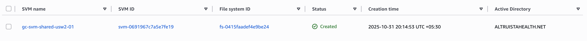
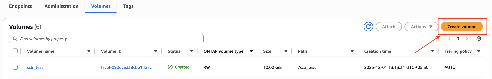

# Runbook - FSx ONTAP Creation

**Confluence Page:** https://healthedge.atlassian.net/wiki/spaces/CP1/pages/5282922987/Runbook%20-%20FSx%20ONTAP%20Creation

**Created by:** Srinath K on November 27, 2025  
**Last modified by:** Srinath K on December 08, 2025 at 02:15 PM

---

Amazon FSx for NetApp ONTAP is a fully managed file storage service on AWS that combines NetApp's proven ONTAP file system with AWS's cloud capabilities. It provides high-performance storage supporting multiple protocols (NFS, SMB, iSCSI), making it ideal for both Windows and Linux workloads. The service offers enterprise-grade features like snapshots, replication, and data compression, along with sub-millisecond latencies and automatic storage tiering between SSD and S3. FSx for ONTAP simplifies enterprise storage management with its fully managed nature, while maintaining compatibility with existing NetApp tools and workflows. It's particularly valuable for enterprise applications, database workloads, and organizations looking to migrate their on-premises ONTAP systems to the cloud.

Architecture Diagram
--------------------

.png)

Pre-Requisite
-------------

* Identify the Shares in advance from HE Team before each wave.
* HE Team will have to migrate Data from CIFS to pure Storage and share the path with AWS, The paths will be used by DataSync as source and will be migrated to FSx Volumes. This Activity needs to be performed before the Cutover in advance.
* Create a volume for them based on IAD3 (us-east-1) and LAX3 (us-west-2) location under FSx File share.

On-Premise Infrastructure
-------------------------

* There are multiple Shared storage available at on-premise - Pure Storage (Shared Storage). They will be migrated to FSx using [DataSync](https://healthedge.atlassian.net/wiki/x/QgCAMwE)

AWS Infrastructure
------------------

* The On-premise equivalent volumes are created on FSx Shares under a SVM File share.

* For us-east-1, Create the volumes manually from console. like below,

Create a volume,

* For us-west-2, Create volumes using the CDK - [GitHub Repo](https://github.com/HE-Core/platform.gc-iac/blob/main/config/gc-shared-fsxn-usw2.yaml)

  + Update the config file, add new volumes under the same fileshare and deploy it using the github actions pipelines - Implementation Guide
* Use FSx Tester Instance to configure volume using vserver - Instance ARN - arn:aws:ec2:us-east-1:096212910625:instance/i-0f4d905dd52b32b9f
* Login into the instance using Systems manager session manager and ssh into the FileShare sing below command,

  + ssh fsxadmin@<IP Address>
  + Use password for fsxadmin to login
* Create volumes using - [link](https://docs.netapp.com/us-en/ontap-cli/vserver-cifs-share-create.html#description)

  + Eg: vserver cifs share create -vserver {SVM ID} -share-name {volume name} -path {volume junction path}

Improvements
------------

* For upcoming waves we will have to use Python CDK config file to create volumes for us-east-1, As it is manually created now.