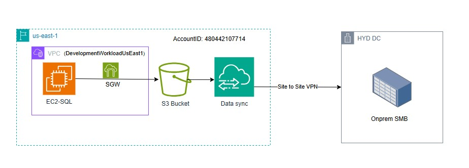
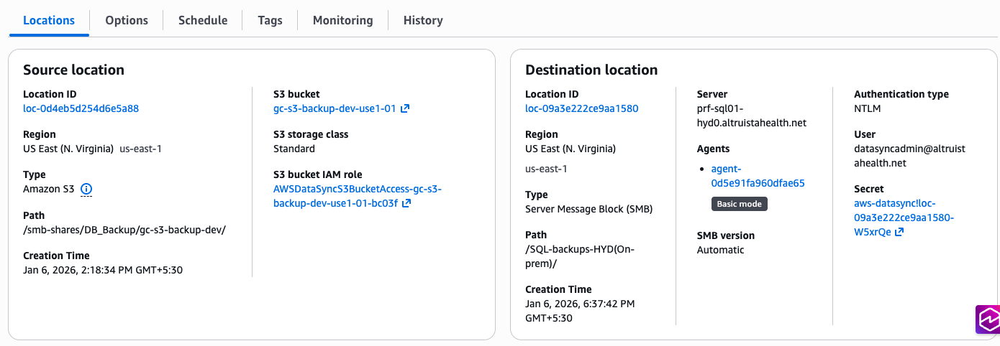
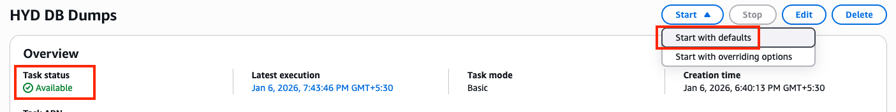
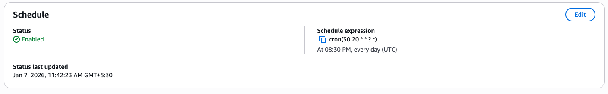

# Runbook - GC DataSync for DB Backup migration to on-premise Samba share

**Confluence Page:** https://healthedge.atlassian.net/wiki/spaces/CP1/pages/5415960595/Runbook%20-%20GC%20DataSync%20for%20DB%20Backup%20migration%20to%20on-premise%20Samba%20share

**Created by:** Srinath K on January 07, 2026  
**Last modified by:** Lakshmi Bhavya Kondamadugula on January 07, 2026 at 05:02 PM

---

Pre-requisites
--------------

1. Firewall Implementation - Link
2. Source S3 bucket - (gc-s3-backup-dev-use1-01)
3. Destination Sambda share - (prf-sql01-hyd0.altruistahealth.net)
4. Storage Gateway & Data sync
5. Site to site VPN from AWS to On-Premise

Architecture:
-------------

AWS Infrastructure:
-------------------

#### EC2-SQL

1. SQL agent backup job is scheduled to run daily at 10PM IST and write backups to s3 bucket:  
   gc-s3-backup-dev-use1-01/smb-shares/DB\_Backup/gc-s3-backup-dev/DB\_Backup/

Backup path: \\10.192.162.212\gc-sgw-fs-dev-use1c-01\gc-s3-backup-dev\DB\_Backup

2. SQL agent clean up job is schedule to delete the backup files from s3 bucket older than a day(before next backup run)

#### Storage gateway:

A SQL server backups are taken to S3 via the storage gateway file share: \\[10.192.162.212](http://10.192.162.212)\gc-sgw-fs-dev-use1c-01

#### Data Sync:

1. Create a source and destination location with the S3 details with below details - Steps

3. Test the data sync task by executing it. The task will transition its status from preparing → transferring → completed.

4. Once the task is completed verify the files on the destination to confirm if all files are passed.
5. Task ARN - arn:aws:datasync:us-east-1:480442107714:task/task-0e4e8787f5743e832
6. The Data Sync task is scheduled to run at 2AM IST every day.

**Note**: The task is created with full data replication later modified to run and migrate the only changes data.

On-Premise Infrastructure:
--------------------------

1. An Samba share (**\\prf-sql01-hyd0\SQL-backups-HYD(On-prem)**) is created at on-premise server for the database backup migration.
2. Also the necessary Firewall rules are implemented at on-premise end - Details
3. A clean up job is scheduled to delete the older backup files.