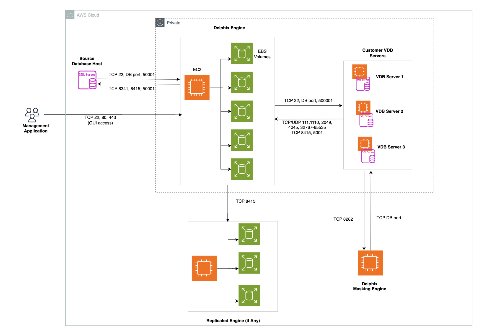

# Runbook - GC Delphix Migration

**Confluence Page:** https://healthedge.atlassian.net/wiki/spaces/CP1/pages/5339021368/Runbook%20-%20GC%20Delphix%20Migration

**Created by:** Lakshmi Bhavya Kondamadugula on December 12, 2025  
**Last modified by:** Lakshmi Bhavya Kondamadugula on December 12, 2025 at 07:39 AM

---

Overview:
---------

Delphix for SQL Server is a data virtualization platform that creates lightweight, virtual copies of production databases using minimal storage through shared data blocks. It enables organizations to provision fresh, masked copies of SQL Server databases to development and testing environments in minutes rather than hours or days. The platform automatically obfuscates sensitive data to ensure compliance with privacy regulations while providing self-service capabilities for developers to create and refresh databases on-demand. By eliminating the need for full database copies, Delphix reduces storage costs by up to 90% while accelerating application development and testing cycles with production-like data.

**Migration Approach:**

1. Delphix data replicated via delphix replication.

2. VDB’s are migrated via the MGN

3. Delphix masking engine: Customer define their own masking rules here in AWS.

**Target Platform:** Amazon EC2  
**Database Type:** Delphix.

Architecture:
-------------

* **Version requirements**

  + The replication target (AWS) must be on the **same or newer version** than the source (Azure).
  + Since the Azure engine is on **2025.1.0**, the target can be on **2025.1.0 or a higher version**.
* **Instance/Storage allocation**

  + AWS instance type chosen should provide required IOPS and throughput. (example: R6in.12xlarge 2 or R5b.12xlarge for 100k iops requirement)
  + Delphix provided AMI for the engine : <https://download.delphix.com/link/0e8f5f79-3bde-46c2-a0d4-70f17246f870>
  + Storage : EBS volumes of type gp3/io1 to achieve required performance with some headroom for surge.
* **Privilege requirements**

  + The user configured in the replication profile must have **administrative privileges** on both the source and target engines.

**Engine Deployment:**

**General inbound from the Delphix engine port allocation**

|  |  |  |
| --- | --- | --- |
| **Protocol** | **Port Number** | **Use** |
| TCP | 22 | SSH connections to the Delphix Engine |
| TCP | 80 | HTTP connections to the Delphix GUI |
| UDP | 161 | Messages from an SNMP Manager to the Delphix Engine |
| TCP | 443 | HTTPS connections to the Delphix Management Application |
| TCP | 8415 | Delphix Session Protocol connections from all DSP-based network services including Replication, SnapSync for Oracle, V2P, and the Delphix Connector. |
| TCP | 50001 | Connections from source and target environments for network performance tests via the Delphix CLI |

General outbound to the Delphix Engine port allocation
------------------------------------------------------

|  |  |  |
| --- | --- | --- |
| **Protocol** | **Port** | **Use** |
| TCP | 25 | Connection to a local SMTP server for sending email |
| TCP/UDP | 53 | Connections to local DNS servers |
| UDP | 123 | Connection to an NTP server |
| UDP | 162 | Sending SNMP TRAP messages to an SNMP Manager |
| TCP | 443 | HTTPS connections from the Delphix Engine to the Delphix Support upload server |
| TCP/UDP | 636 | Secure connections to an LDAP server |
| TCP | 8415 | Connections to a Delphix replication target |
| TCP | 50001 | Connections to source and target environments for network performance tests |

**​Engine and Target(VDB)**:

o        Round-trip latency should be <1 ms (ideally ~300 μs)

o        Keep the Delphix Engine on the **same subnet** as the target environment

* There should be no firewalls between the Delphix Engine and the target environment.

**Engine and Source DB host:**

o        ​Deploy in the **same VPC** and latency should be < 50 ms.

Migration Phases
----------------

### **Pre-Cutover Phase**

1. **Pre-Cutover Replication** - Run Replicate Now on source Delphix Engine to synchronize data
2. **Disable VDBs** - Take snapshots and disable all VDBs in replication profile to preserve customer data
3. **Final Replication** - Execute final replication to ensure clean cutover boundary

### **Infrastructure Shutdown Phase**

4. **Stop SQL Services** - Stop MSSQLSERVER and SQL Agent services on VDB server (2-5 minute wait)
5. **Shutdown Server** - Add "Do not start" tag and power off server safely for MGN cutover

### **AWS Cutover Phase**

6. **AWS MGN Cutover** - Launch Cutover Instance in AWS MGN and monitor until completion
7. **Validate EC2** - Verify security groups, ENIs, disks, and boot success in EC2 console

### **Network Configuration Phase**

8. **Update DNS** - Update A-records to AWS target IP/hostnames
9. **Open Firewall Ports** - Open TCP ports 9100 and 3260 between AWS Delphix Engine and VDB server

### **Service Restart & Validation Phase**

10. **Validate Delphix Connector** - Verify Delphix Connector installation and auto-start capability
11. **Restart SQL Services** - Restart SQL services on AWS VDB server and verify SSMS access

### **Failover & Reconfiguration Phase**

12. **Delphix Failover** - Execute failover to replicate dSources/VDBs to AWS
13. **Update Environment Host** - Update VDB host IP to AWS EC2 IP
14. **Enable Environment** - Enable environment discovery
15. **Refresh Environment** - Refresh environment and validate VDB discovery results

### **Post-Cutover Validation Phase**

16. **Validate VDB Discovery** - Confirm VDB discovery in AWS environment
17. **Enable VDBs** - Enable all VDBs from Datasets
18. **Post-Cutover Validation** - Validate connectivity via SSMS with query execution and job verificatio

References:
-----------

[Migration Runbook](https://healthedgetrial-my.sharepoint.com/:x:/g/personal/anas_hamza_healthedge_com/IQDi1VF_OvIFQbRMFhFvKMxEAemCL-mPpUlI75TcsLh2YFs?wdOrigin=TEAMS-MAGLEV.p2p_ns.rwc&wdExp=TEAMS-TREATMENT&wdhostclicktime=1764769265529&web=1)