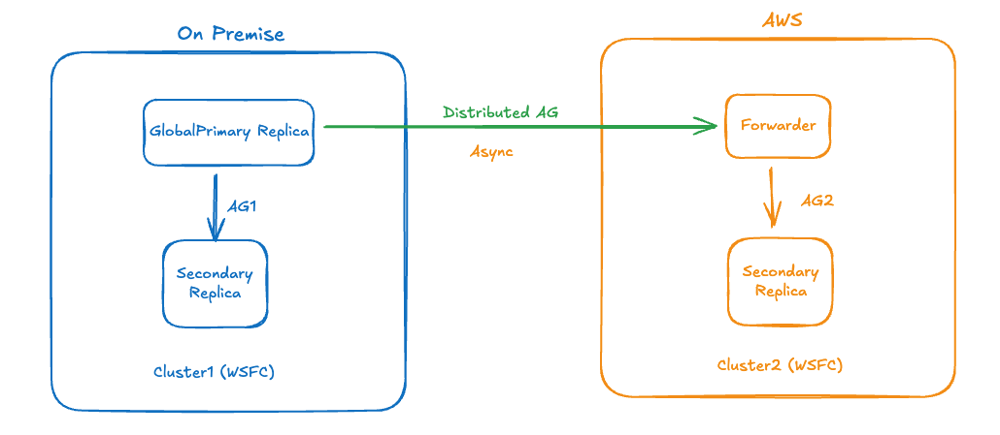

# Runbook - GC SQL Server AlwaysOn Availability Group (AOAG) Cluster : Re-platform

**Confluence Page:** https://healthedge.atlassian.net/wiki/spaces/CP1/pages/5300453404/Runbook%20-%20GC%20SQL%20Server%20AlwaysOn%20Availability%20Group%20%28AOAG%29%20Cluster%20%3A%20Re-platform

**Created by:** Lakshmi Bhavya Kondamadugula on December 03, 2025  
**Last modified by:** Lakshmi Bhavya Kondamadugula on December 09, 2025 at 11:33 AM

---

This runbook provides step-by-step procedures for migrating SQL Server Always On Availability Group (AOAG) clusters from on-premises infrastructure to AWS Cloud using SQL Server Distributed Availability Groups (DAG). This approach enables a seamless, near-zero downtime migration while maintaining high availability and data integrity throughout the migration process.

**Migration Process**
---------------------

**Migration Approach:** Re-platofrm using DAG  
**Target Platform:** Amazon EC2  
**Database Type:** SQL Server AOAG cluster

The migration leverages SQL Server Distributed Availability Groups, which creates a special type of availability group that spans two separate Always On Availability Group clusters.   
This architecture allows for:

* Continuous data synchronization between on-premises AOAG and EC2 AOAG.
* Minimal downtime during cutover (typically seconds to minutes).
* Bidirectional failover capability during migration window.
* Rollback capability if issues arise post-migration.
* No application code changes required.

***Architecture Overview:***
----------------------------



***Migration Phases***
----------------------

**Assessment & Planning:**

* Evaluate current environment, including servers, configurations, dependencies and data
* Dive deep into SQL Server configurations and details.
* Define Recovery Time Objective (RTO) and Recovery Point Objective (RPO) for the migration.
* Identify application dependencies of the database in the current scope.
* Review current data archival, backup strategy, and third-party tools usage.
* Evaluate migration options for the existing SQL server AOAG to AWS.
* Present migration options with pros and cons for stakeholder signoff.

**Pre-Requisite Tasks:**

* EC2 Compute provisioning for SQL Server AlwaysON clustering with secondary IP's for listener and specs similar to on-prem
* EBS volume provisioning to the EC2 instances as per the on-Prem servers
* AWS cluster witness setup
* In the AWS target account, confirm Instance Type, EBS volumes, EBS type, IP's, Region, Account details
* In the AWS target account, confirm the subnets that will be used for SQL Server EC2 instance
* In the AWS target account, confirm the Security Group that will be used for SQL Server EC2 instance
* use ssm document to update local administrator password
* In the AWS target account, S3 Storage gateway for the SQL server backups
* In the On-prem initiate the DB backups to Pure Storage Flashblade
* Datasync setup on AWS
* Transfer the DB backups from On-Prem(Pure Storage Flashblade) to S3 Storage gateway via DataSync

**Pre-Migration Tasks**

* Document current SQLServer version, patch level, and configuration
* Verify and document disk spaces and filesystem layout
* Document SQLServer directories: Data,log and backup
* Document existing backup schedules and verify latest backups, any third party backup tools used or not
* Verify if any HADR configuration exists
* Document the SQL server configuration

**Pre-Cutover**

* SQL Server AG and listerner configuration on AWS

1. Create secondary availabltiy group:


```
CREATE AVAILABILITY GROUP [<AG name]
FOR
REPLICA ON N'<primary server>' WITH (ENDPOINT_URL = N'TCP://<primary server fqdn>:5022',
    FAILOVER_MODE = MANUAL,
    AVAILABILITY_MODE = SYNCHRONOUS_COMMIT,
    SEEDING_MODE = MANUAL),
N'<Secondary server>' WITH (ENDPOINT_URL = N'TCP://<secondary server fqdn>:5022',
    FAILOVER_MODE = MANUAL,
    AVAILABILITY_MODE = SYNCHRONOUS_COMMIT,
    SEEDING_MODE = MANUAL);
GO
```


2. Join secondary replicas to secondary replica to secondary availablity group:


```
ALTER AVAILABILITY GROUP [<AG name>] JOIN
```


3. Create listener for secondary availablity group:


```
ALTER AVAILABILITY GROUP [<AG name>]
    ADD LISTENER '<listener name>' ( WITH IP ( ('<IP from subnet 1>'),('<ip from subnet 2>') ) , PORT = <listener port>);
GO
```


* Distributed AlwayOn AG configuration between on-premise and AWS


```
CREATE AVAILABILITY GROUP [<distributedAG name>]
   WITH (DISTRIBUTED)
   AVAILABILITY GROUP ON
      '<onprem AG name>' WITH
      (
         LISTENER_URL = 'tcp://<onprem listener fqdn>:5022',
         AVAILABILITY_MODE = ASYNCHRONOUS_COMMIT,
         FAILOVER_MODE = MANUAL,
         SEEDING_MODE = MANUAL
      ),
      '<AWS AG name>' WITH
      (
         LISTENER_URL = 'tcp://<aws ag listener fqdn>:5022',
         AVAILABILITY_MODE = ASYNCHRONOUS_COMMIT,
         FAILOVER_MODE = MANUAL,
         SEEDING_MODE = MANUAL
      );
GO
```


* Join distributed availability group on second cluster (AWS):


```
ALTER AVAILABILITY GROUP [<distributedAG name>]
   JOIN
  AVAILABILITY GROUP ON
        '<onprem AG name>' WITH
        (
           LISTENER_URL = 'tcp://<onprem listener fqdn>:5022',
           AVAILABILITY_MODE = ASYNCHRONOUS_COMMIT,
           FAILOVER_MODE = MANUAL,
           SEEDING_MODE = MANUAL
        ),
        '<AWS AG name>' WITH
        (
           LISTENER_URL = 'tcp://<aws ag listener fqdn>:5022',
           AVAILABILITY_MODE = ASYNCHRONOUS_COMMIT,
           FAILOVER_MODE = MANUAL,
           SEEDING_MODE = MANUAL
        );
GO
```


* DB backup/restore to AWS


```
Restore command WITH NORECOVERY
```


* Add DB to DAG on Forwarder (AWS)


```
ALTER DATABASE [<db name>]
    SET HADR AVAILABILITY GROUP = [<distributedAG name>];
```


**Cutover:**

* Verify AWS Server readiness
* Verify Data sync (on-premises to AWS) in the AG Dashboard
* Stop all transactions on Primary (On-premises)
* Set DAG to synchronous commit mode


```
-- sets the distributed availability group to synchronous commit on on-premise
 ALTER AVAILABILITY GROUP [<distributedAG name>]
 MODIFY AVAILABILITY GROUP ON
 '<onprem AG name>' WITH (AVAILABILITY_MODE = SYNCHRONOUS_COMMIT),
 '<aws AG name>' WITH (AVAILABILITY_MODE = SYNCHRONOUS_COMMIT);
```


* Verify Data sync state at on-premise

> "Wait and verify the last Hardened LSN with query


```
-- query to verify the commit state of the distributed availability group
 SELECT
  ag.name,
  ag.is_distributed,
  ar.replica_server_name [Local AG Names],
  ar.availability_mode_desc,
rv  ars.connected_state_desc,
gt  ars.role_desc,
jd  ars.operational_state_desc,
tt  ars.synchronization_health_desc
cn FROM sys.availability_groups ag
jc INNER JOIN sys.availability_replicas ar ON ag.group_id=ar.group_id
if LEFT JOIN sys.dm_hadr_availability_replica_states ars on ars.replica_id=ar.replica_id and ag.group_id = ars.group_id
e WHERE ag.is_distributed=1;
```


-- Run this query on the global primary (on-premises) and the forwarder (AWS)  
-- Check the results to see if synchronization\_state\_desc is SYNCHRONIZED, and the last\_hardened\_lsn is the same per database on both the global primary and forwarder  
-- If not, rerun the query on both side every 5 seconds until it is the case


```
SELECT ag.name AS [AG Name],
       ar.replica_server_name AS [replica],
       db_name(drs.database_id) AS database_name,
       drs.synchronization_state_desc,
       drs.last_hardened_lsn
FROM sys.availability_groups AS ag
     INNER JOIN
     sys.availability_replicas AS ar
     ON ag.group_id = ar.group_id
     INNER JOIN
     sys.dm_hadr_database_replica_states AS drs
     ON drs.replica_id = ar.replica_id
        AND ag.group_id = drs.group_id
WHERE ag.name IN ('ag1', 'ag2');
```


Wait until the status of the distributed availability group changes to SYNCHRONIZED and all replicas have the same last\_hardened\_lsn (per database). Run the following query on both the global primary, which is the primary replica of the primary availability group, and the forwarder to check the synchronization\_state\_desc and last\_hardened\_lsn:"

* **Failover DAG to AWS**

1. **Set DAG role to Secondary**


```
--On the global primary (on-premises), set the distributed availability group role to SECONDARY:
ALTER AVAILABILITY GROUP distributedAG SET (ROLE = SECONDARY);
```


Verify the LSN hardened values at on-prem and AWS ( use query in step ""Verify Data sync state at on-premise"")

2. **Initiate Failover Process**


```
--On Forwarder (AWS) :
ALTER AVAILABILITY GROUP distributedAG FORCE_FAILOVER_ALLOW_DATA_LOSS;
```


* Resume DB data movement in AG on onpremise
* Set DAG to asynchronous commit mode


```
-- sets the distributed availability group to asynchronous commit on AWS
 ALTER AVAILABILITY GROUP [<distributedAG name>]
 MODIFY AVAILABILITY GROUP ON
 '<onprem ag name>' WITH (AVAILABILITY_MODE = ASYNCHRONOUS_COMMIT),
 '<aws ag name>' WITH (AVAILABILITY_MODE = ASYNCHRONOUS_COMMIT);
```


* Validate the replicas health in AG
* Update any custom DB scripts or jobs using old listener name with new listener name address. (Only if required)
* Application connection changes


```
Set the MultiSubnetFailover=True. Server=tcp:AGListener,1433;Database=AdventureWorks;Integrated Security=SSPI;MultiSubnetFailover=True
```


* Validate orphan users (if any)
* Validate basic database and application connectivity checks
* Connection string updates , third party tools, Delphix, etc

**Rollback:**

* Stop all transactions on Primary (on AWS)
* Set DAG to synchronous commit mode on AWS:


```
-- sets the distributed availability group to synchronous commit on on-premise
 ALTER AVAILABILITY GROUP [<distributedAG name>]
 MODIFY AVAILABILITY GROUP ON
 '<onprem AG name>' WITH (AVAILABILITY_MODE = SYNCHRONOUS_COMMIT),
 '<aws AG name>' WITH (AVAILABILITY_MODE = SYNCHRONOUS_COMMIT);
```


* Verify AG synch status: Wait until the distributed availability group is synchronized and has the same last\_hardened\_lsn per database. Wait until the last\_hardened\_lsn per database matches between replicas.
* Failover DAG to on-premise:

1. Set DAG role to Secondary


```
-– On the global primary (AWS), set the distributed availability group role to SECONDARY:
ALTER AVAILABILITY GROUP distributedAG SET (ROLE = SECONDARY);
Verify the LSN hardened values at on-prem and AWS ( use query in step "Verify Data sync state at on-premise")
```


2. On Forwarder (on-premise), initiate failover process:

   
```
ALTER AVAILABILITY GROUP distributedAG FORCE_FAILOVER_ALLOW_DATA_LOSS;
```


* Update application connection strings (to on-premises)
* Verify connectivity and dependencies
* Shutdown AWS servers

**Post-Migration:**

* Verify AG dashboard Health
* Verify database status, and services (sample queries)
* Test application connectivity and functionality
* Verify backup jobs and schedules
* Verify the disk space for backups, logs, DB sessions and processes
* Delphix functional testing (if required)
* Local AG Failover- verify AG nodes are in synchronized state
* Local AG Failover- Verify the databases are in sync
* Local AG Failover- Initiate failover without data loss
* Remove DAG

References
----------

[DAG Deployment Process](https://healthedge.atlassian.net/wiki/spaces/CP1/pages/5300453404/Runbook+-+GC+SQL+Server+AlwaysOn+Availability+Group+AOAG+Cluster+Re-platform#References)

SQL Server AOAG Deployment Automation

[SQL Server Migration Runbooks](https://healthedgetrial.sharepoint.com/:x:/r/sites/AWSCloudMigration/_layouts/15/Doc.aspx?sourcedoc=%7B1838AD26-1A98-4DE8-BF36-37F3EE979689%7D&file=SQL%20Server%20Migration%20Run%20book%20Template.xlsx&action=default&mobileredirect=true)