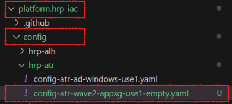
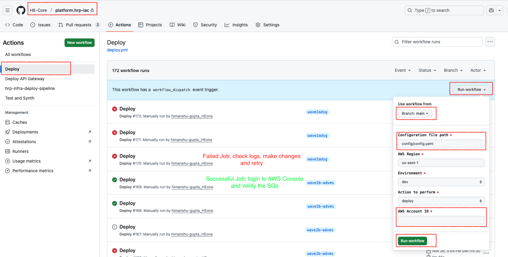
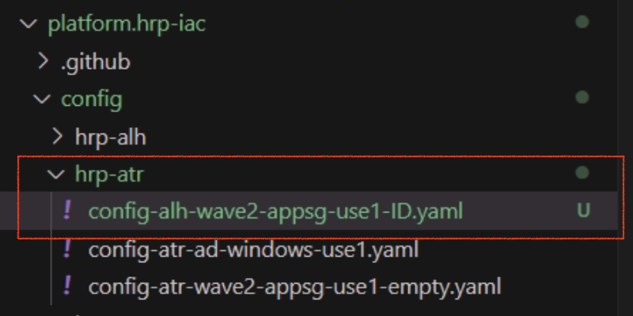
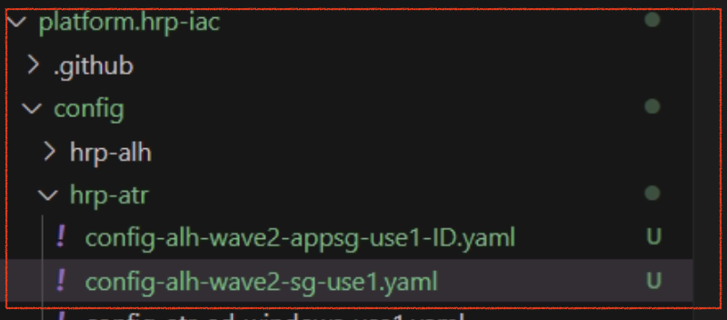
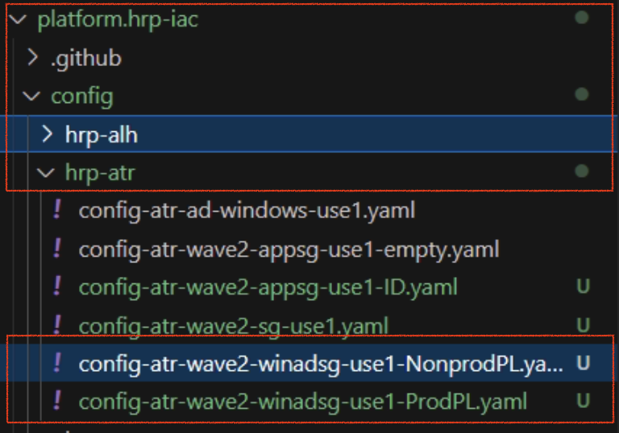

# Runbook - HRP New Customer Security Group Creation

**Confluence Page:** https://healthedge.atlassian.net/wiki/spaces/CP1/pages/5284331545/Runbook%20-%20HRP%20New%20Customer%20Security%20Group%20Creation

**Created by:** Himanshu Gupta on November 28, 2025  
**Last modified by:** Himanshu Gupta on December 09, 2025 at 12:31 PM

---

none

Introduction
------------

This runbook details the CDK code changes required to implement an HRP customer Security Groups (SGs). Below are the SGs needed for each customer:

1. **Operating System** - Linux/Windows SG, allowing OS specific traffic from on-premises Jump servers. Linux/Windows SG will be attached to every server for respective customer
2. **Application** - LB/Payor/Connector/Answers/Promote/CES/DB SG, allowing intra and inter application traffic between application components and on-premises jump servers. Every server will have at least one of these application specific group depending on the role of the server for respective customer
3. **Customer** - Allow standard ports from customer VPN CIDRs. This SG will be attached to every server for respective customer
4. **Active Directory** - Allowing AD traffic from customer AWS CIDRs. Will be attached to the AD servers provisioned in the production account.

**Important:** Throughout this runbook we will take an example of ATR customer to create the required AWS component.

Naming Convention
-----------------

To maintain consistency across all the environments, follow below naming convention for SGs and Prefix Lists (PL)

* **Security Group** - hrp-<cust>-sg-<purpose>-<env>-<region>

  + Examples:

    - OS - `hrp-atr-sg-linux-nonprod-use1`
    - Loadbalancer -`hrp-atr-sg-lb-nonprod-use1`
    - Payor - `hrp-atr-sg-payor-nonprod-use1`
    - Connector - `hrp-atr-sg-cnc-nonprod-use1`
    - DB - `hrp-atr-sg-db-nonprod-use1`
    - CES - `hrp-atr-sg-ces-nonprod-use1`
    - Promote - `hrp-atr-sg-promote-nonprod-use1`
    - AD - `hrp-atr-sg-winad-prod-use1`
* **Prefix List** - hrp-<cust>-pl-<purpose>-<env>-<region>

  + Examples:

    - AWS CIDRs - `hrp-atr-pl-awscidrs-nonprod-use1`
    - Customer VPN CIDRs - `hrp-atr-pl-vpncidrs-nonprod-use1`

Pre-Requisites
--------------

* AWS Target account created via LZA
* Customer VPC deployed in the AWS target account
* Customer Subnet deployed in the AWS target account - Refer Subnet creation Runbook ***<Add link to Aravindan’s Subnet Runbook>*** for deploying customer subnet.

High level steps
----------------

| **#** | **Phase** | **Task** | **Details** |
| --- | --- | --- | --- |
| 1 | Requirement Gathering | Get Security Groups Ports | Talk to application team and gather the ports required for each application component and each customer. Document the rules in the Security Group tab of the deep dive sheet |
| 2 | Requirement Gathering | Get customer VPN CIDRs | Talk to the network team and gather the customer VPN/External CIDRs for each customer. |
| 3 | Implementation | Create Prefix List for customer VPN CIDRs | Create a prefix list in both Primary and DR region and include all the provided Customer VPN CIDRs |
| 4 | Implementation | Create Prefix List for AWS CIDRs | Create a prefix list in both Primary and DR region and include all the AWS CIDRs for app and db subnets for both primary and DR region. |
| 5 | Implementation | Create Customer specific SGs | Create customer specific SGs in the target account for each customer. Allowing standard ports from VPN CIDRs for respective customers and SG |
| 6 | Implementation | Create Application specific SGs | Create application specific SGs in the target account for each customer. Allowing application components for intra/inter and jump server connectivity |
| 7 | Implementation | Create AD specific SGs | Create AD SG in the prod account for each customer. Allowing AD ports inbound from NonProd and Prod AWS Prefix list respectively |

### Security Group Mapping

| **#** | **SG Type** | **Quantity** | **Name** | **Remarks** |
| --- | --- | --- | --- | --- |
| 1 | Customer SG | 1 | hrp-<cust>-sg-global-<env>-<region> | Allow standard ports from VPN CIDRs for respective customers and SG. Will be attached to all the migrated servers for respective customers |
| 2 | Application SG | 11 (Linux, Windows, DB, LB, Payor, Connector, CES, Promote, Answers, Delphix, Jenkins) | hrp-<cust>-sg-<purpose>-<env>-<region> | Linux SG - Attached to all the migrated Linux servers.  Windows SG - Attached to all the migrated windows servers.  DB SG - Attached to al the migrated DB servers  Other SGs - Attached based on the server role |
| 3 | AD SG | 4  WinAD-NonProdPL  WinAD-ProdPL  WinAD  Win-global | hrp-<cust>-sg-winad-nppl-<env>-<region>  hrp-<cust>-sg-winad-ppl-<env>-<region>  hrp-<cust>-sg-winad-<env>-<region>  hrp-<cust>-sg-win-<env>-<region> | All these group will be attached to respective customer domain controllers only.  WinAD-NonProdPL - Allow AD inbound from all non-prod migrated servers on AD ports  WinAD-ProdPL - Allow AD inbound from all the prod migrated servers on AD ports and intra AD communication for replication etc..  WinAD - Allow AD inbound from all the other customer AD servers, Shared services and DNS from VCPE CIDR. |

Detailed steps
--------------

### Get Security Groups port document

Talk to the application team and understand the different components used by the application and which component needs connectivity to other component.

Create a Security group tab in the Wave deep dive sheet and record these details along with SG Name, Port, Protocol, Source and description.

**Example: Individual rule**


> **Note:** This is a complex table with merged cells. For best viewing experience, see the [original Confluence page].

<table ac:local-id="ddd4e26b-9c66-46df-99aa-1cd1b8867b6f" data-layout="center" data-table-width="1800"><tbody><tr><td colspan="6"><strong>Linux SG - hrp-&lt;cust&gt;-sg-linux-nonprod-use1</strong></td></tr><tr><td colspan="6"><strong>Inbound</strong></td></tr><tr><td><strong>Type</strong></td><td><strong>Protocol</strong></td><td><strong>Port</strong></td><td><strong>Source</strong></td><td><strong>Description</strong></td><td><strong>Remarks</strong></td></tr><tr><td>SSH</td><td>TCP</td><td>22</td><td>Customer AWS Prefix list</td><td>Linux SSH, SCP</td><td>Assigned to all Linux workloads</td></tr><tr><td>SSH</td><td>TCP</td><td>22</td><td>Jumpbox Prefix list</td><td>Jump server SSH</td><td>Assigned to all Linux workloads</td></tr><tr><td colspan="6"><strong>Outbound</strong></td></tr><tr><td>AllTraffic</td><td>All</td><td>All</td><td>0.0.0.0/0</td><td>All outbound</td><td>All Egress allowed</td></tr></tbody></table>


**Example: Whole list of rules for each component:**

[Wave 2a Deep Dive Sheet.xlsx](https://healthedgetrial.sharepoint.com/:x:/s/AWSCloudMigration/IQDgNuWWQe3VTI9RHuPoDrDEARPTcT-gMnp8ZkuNsfJOreg?e=nLidUi&nav=MTVfezk4MzRGNjM1LUI3RjYtNDNBQy1CQTQ1LTlFQzBFRjIzMUEzMn0) - Security Group Tab

### Get VPN CIDRs and document

Talk to the network team for the business unit and get the VPN/External/CustomerEnd CIDRs for each customer.

Create a CIDR tab in the wave deep dive sheet and record these details along with partner name, CIDRs and prefix list name (created in next step)

**Example: Individual CIDR**


> **Note:** This is a complex table with merged cells. For best viewing experience, see the [original Confluence page].

<table ac:local-id="31ed89e6-0234-48f8-90cb-820d6f79199d" data-layout="center" data-table-width="1800"><tbody><tr><td colspan="3"><strong>VPN/External</strong></td></tr><tr><td><strong>Customer Name</strong></td><td><strong>CIDR</strong></td><td><strong>Non-prod prefix list</strong></td></tr><tr><td>ALH</td><td>162.95.224.0/21, 162.95.232.0/21, 162.95.240.0/20</td><td>pl-0dc0d00497873697e - hrp-alh-pl-vpncidrs-nonprod-use1</td></tr></tbody></table>


**Example: Whole list of CIDRs for each customer**

[Wave 2a Deep Dive Sheet.xlsx](https://healthedgetrial.sharepoint.com/:x:/s/AWSCloudMigration/IQDgNuWWQe3VTI9RHuPoDrDEARPTcT-gMnp8ZkuNsfJOreg?e=aBWRq2&nav=MTVfe0I2RTI1N0JGLTQ4OUYtNDZERC1CQkYwLTk3QjNEREFEMTE1Q30) - CIDRs Tab

### Create Prefix List for customer VPN CIDRs

Once the CIDRs are provided by the network team, create Prefix list for the same. Use the script placed on the automation server to create the prefix lists in bulk.

* Script path - `C:\migrations\scripts\PrefixList`
* Input file - Update `prefix_lists.csv`

  + Update the input files with details - PL name, Customer VPN CIDRs, Description for each CIDR, Tag key and Tag values
  + Column details

| **Column** | **Required** | **Description** |
| --- | --- | --- |
| `prefixlistname` | Yes | Name of the prefix list |
| `CIDRS` | Yes | Comma-separated list of CIDR blocks |
| `Description` | No | Description for the CIDR entries |
| `Tag1_Key` to `Tag6_Key` | No | Tag keys (up to 6 tags) |
| `Tag1_Value` to `Tag6_Value` | No | Tag values (up to 6 tags) |

* 
```
prefixlistname,CIDRS,Description,Tag1_Key,Tag1_Value,Tag2_Key,Tag2_Value,Tag3_Key,Tag3_Value,Tag4_Key,Tag4_Value,Tag5_Key,Tag5_Value,Tag6_Key,Tag6_Value
hrp-atr-pl-awscidrs-nonprod-use1,"10.10.10.10/26,10.10.11.11/26",ATR VPN CIDRs,BusinessUnit,HRP,Owner,CLOPS@healthedge.com,Environment,NonProduction,DataClassification,Internal,ComplianceScope,None,Customer,ATR
```


### Create Prefix List for AWS CIDRs

Pull the AWS CIDRs for each customer from AWS console and create prefix list for the name.

* Command to pull the subnet details


```
aws ec2 describe-subnets \
  --query 'Subnets[*].[Tags[?Key==`Name`].Value|[0],AvailabilityZone,CidrBlock,SubnetId]' \
  --output table
```


* Use the script placed on the automation server to create the prefix lists in bulk.

  + Script path - `C:\migrations\scripts\PrefixList`
  + Input file - Update `prefix_lists.csv`
  + Update the input files with details - PL name, Customer VPN CIDRs, Description for each CIDR, Tag key and Tag values

    - Column details

| **Column** | **Required** | **Description** |
| --- | --- | --- |
| `prefixlistname` | Yes | Name of the prefix list |
| `CIDRS` | Yes | Comma-separated list of CIDR blocks |
| `Description` | No | Description for the CIDR entries |
| `Tag1_Key` to `Tag6_Key` | No | Tag keys (up to 6 tags) |
| `Tag1_Value` to `Tag6_Value` | No | Tag values (up to 6 tags) |

* Example:


```none
prefixlistname,CIDRS,Description,Tag1_Key,Tag1_Value,Tag2_Key,Tag2_Value,Tag3_Key,Tag3_Value,Tag4_Key,Tag4_Value,Tag5_Key,Tag5_Value,Tag6_Key,Tag6_Value
hrp-atr-pl-awscidrs-nonprod-use1,"10.225.2.64/26,10.225.2.128/26,10.225.2.192/26,10.225.2.32/28,10.225.2.16/28,10.225.2.48/28",ATR AWS USE1 CIDRs,BusinessUnit,HRP,Owner,CLOPS@healthedge.com,Environment,NonProduction,DataClassification,Internal,ComplianceScope,None,Customer,ATR
```


### Create Security Groups

Once the prefix lists are created, create SGs via the CDK.

1. Login to the VDI, Open Visual Studio Code and Clone the [platform.hrp.iac git repo](https://github.com/HE-Core/platform.hrp-iac/tree/main). This repo consist of the CDK code and config files used for the HRP deployments.


```
cd Documents\
git clone https://github.com/HE-Core/platform.hrp-iac/tree/main
cd platform.hrp-iac
```


2. Now you have cloned the latest code from git and you are in the code folder. Create a feature branch `feature/atrsgs`
3. Now you are in the new branch, create the application specific security groups

#### **Application specific security groups**

Currently the code doesn’t support cross references to the other SGs while creation, start with deploying the empty SGs

##### Creating Empty SGs

1. Go to the config folder in the code
2. Make a new folder based on the customer name or use existing and copy the `` `config-alh-wave2-appsg-use1-empty.yaml `` config file from `hrp-alh` folder to the new folder and rename the file for respective customer name



3. Open the file in the editor and make below changes

   1. Find and replace `alh` to `atr` and `ALH` to `ATR`. This will change the project name, SG names and Tags to the ATR specific
   2. Update the AWS account number, VPC ID and CIDR in global settings
4. Add your changes and push it to your branch


```
git add .
git commit -m “Adding ATR SG Config file”
git push origin feature/atrsgs
```


5. Go to [Git repo](https://github.com/HE-Core/platform.hrp-iac) and switch to your branch
6. Deploy the config file using Github actions

   1. Actions > Deploy > Run workflow
   2. change branch, update config file path to the recently created config file, update AWS Account ID to the account where you want to deploy these SGs
   3. Reverify the parameters and click runworkflow
   4. If there are no errors the workflow will complete and SGs will be deployed

      

##### Add Rules to Empty SGs

1. Go to the config folder in the code
2. Copy the `` `config-alh-wave2-appsg-use1-ID.yaml `` config file from `hrp-alh` folder to the customer folder created during the empty SG creation and rename the file for respective customer name.

   
3. Open the file in the editor and make below changes

   1. Find and replace `alh` to `atr` and `ALH` to `ATR`. This will change the project name, SG names and Tags to the ATR specific
   2. Update the AWS account number, VPC ID and CIDR in global settings
   3. Update the respective Linux, Windows, Payor, Connector, Answers, Promote, DB, etc.. SG IDs and Prefix list IDs in the config file for respective SG
4. Add your changes and push it to your branch


```
git add .
git commit -m “Adding ATR SG Config file”
git push origin feature/atrsgs
```


5. Go to [Git repo](https://github.com/HE-Core/platform.hrp-iac) and switch to your branch
6. Deploy the config file using Github actions

   1. Actions > Deploy > Run workflow
   2. change branch, update config file path to the recently created config file, update AWS Account ID to the account where you want to deploy these SGs
   3. Reverify the parameters and click runworkflow
   4. If there are no errors the workflow will complete and SGs will be deployed

      

#### **Customer specific security groups**

1. Go to the config folder in the code
2. Copy the `` `config-alh-wave2-sg-use1.yaml `` config file from `hrp-alh` folder to the customer folder created during the empty SG creation and rename the file for respective customer name.

   
3. Open the file in the editor and make below changes

   1. Find and replace `alh` to `atr` and `ALH` to `ATR`. This will change the project name, SG names and Tags to the ATR specific
   2. Update the AWS account number, VPC ID and CIDR in global settings
   3. Update the customer VPN prefix list ID ([created during the first step](https://healthedge.atlassian.net/wiki/spaces/CP1/pages/5284331545/Runbook+-+HRP+New+Customer+Security+Group+Creation#Create-Prefix-List-for-customer-VPN-CIDRs)), in the config file for SG
4. Add your changes and push it to your branch


```
git add .
git commit -m “Adding ATR SG Config file”
git push origin feature/atrsgs
```


5. Go to [Git repo](https://github.com/HE-Core/platform.hrp-iac) and switch to your branch
6. Deploy the config file using Github actions

   1. Actions > Deploy > Run workflow
   2. change branch, update config file path to the recently created config file, update AWS Account ID to the account where you want to deploy these SGs
   3. Reverify the parameters and click runworkflow
   4. If there are no errors the workflow will complete and SGs will be deployed

      

#### **AD Servers security groups**

1. Go to the config folder in the code
2. Copy the `config-alh-wave2-winadsg-use1-NonprodPL.yaml`, `config-alh-wave2-winadsg-use1-ProdPL.yaml`and `config-alh-wave2-winadsg-use1.yaml` config file from `hrp-alh` folder to the customer folder created during the empty SG creation and rename the file for respective customer name.

   
3. Open the file in the editor and make below changes

   1. Find and replace `alh` to `atr` and `ALH` to `ATR`. This will change the project name, SG names and Tags to the ATR specific
   2. Update the AWS account number, VPC ID and CIDR in global settings
   3. Update the customer AWS prefix list ID (NonProd PL in the NonProd file and Prod PL in the Prod file) in the `config-alh-wave2-winadsg-use1-NonprodPL.yaml` and `config-alh-wave2-winadsg-use1-ProdPL.yaml` config files
   4. Update the shared services PL and customer PL in the `config-alh-wave2-winadsg-use1.yaml` config file
4. Add your changes and push it to your branch


```
git add .
git commit -m “Adding ATR SG Config file”
git push origin feature/atrsgs
```


5. Go to [Git repo](https://github.com/HE-Core/platform.hrp-iac) and switch to your branch
6. Deploy the config file using Github actions

   1. Actions > Deploy > Run workflow
   2. change branch, update config file path to the recently created config file, update AWS Account ID to the account where you want to deploy these SGs
   3. Reverify the parameters and click runworkflow
   4. If there are no errors the workflow will complete and SGs will be deployed

      

Lessons Learnt/Known issues:
----------------------------

* You have less that 200 rules in the SG but still the SG deployment fails with “Exceed Service Limit” error. Check if you having a prefix list as a source. Each CIDR in the prefix list will be considered as an individual rule. Example: If you have 12 CIDRs in the Prefixlist and adding 20 rules in the SG, it will result in 12\*20=240 rules and you will not be able to deploy that SG
* You have added or removed some rules from the SG and CDK/CFN tries to delete and redeploy the SG. Check if you have changed the SG Name or Description. In case you change the SG Name and Description, it will redeploy the SG.
* You are creating a SG but CDK/CFN tried to edit/delete another existing SG, check if you are same project name in both the config files. CDK will use the project name to create the CFN stack name and if project name is same in both the files it will create conflicts.
* You are trying to deploy multiple SG with circular references and it is failing. This feature is currently not supported by the CDK construct. This development being worked upon via [Jira Story AWSM-1041](https://healthedge.atlassian.net/browse/AWSM-1041).