# Runbook - Implementing Server-Level Access Restrictions on Amazon FSx for NetApp ONTAP CIFS Shares

**Confluence Page:** https://healthedge.atlassian.net/wiki/spaces/CP1/pages/5388435484/Runbook%20-%20Implementing%20Server-Level%20Access%20Restrictions%20on%20Amazon%20FSx%20for%20NetApp%20ONTAP%20CIFS%20Shares

**Created by:** Aravindan A on December 23, 2025  
**Last modified by:** Aravindan A on December 23, 2025 at 08:41 PM

---

Annexure
--------

* Introduction
* Problem Statement
* Solution Overview
* High Level Steps
* Key Discovery
* Detailed Implementation Steps

  + Enable Export Policy Enforcement
  + Create Export Policy
  + Configure Access Rules
  + Apply Policy to Volume
  + Verify Configuration
  + Configure CIFS Share Permissions
  + Test Access Control
* Troubleshooting
* Cleanup/Rollback
* Lessons Learnt/Known Issues

---

1. Introduction
---------------

This runbook provides the complete solution for implementing server-level access restrictions on Amazon FSx for NetApp ONTAP CIFS shares. We will configure IP-based export policies to control which Windows servers can access specific CIFS shares, ensuring only authorized servers can connect to designated file shares.

**Technical Components:**

* **FSx ONTAP Export Policies** - Hostname based access control rules
* **CIFS Share Permissions** - User/group level access control
* **Export Policy Enforcement** - ONTAP feature to enforce export policies for CIFS protocol

2. Problem Statement
--------------------

This section identifies the need for server-level CIFS share restrictions in FSx ONTAP environments. Standard Windows file sharing allows any domain server to access shares if users have permissions, but we need to restrict access to specific servers only.

**Challenge**: FSx ONTAP CIFS shares allow access from any server in the domain by default. Standard CIFS share permissions and computer account restrictions have limitations for true server-level access control.

**Goal**: Implement **Hostname based** restrictions so only authorized servers can access designated CIFS shares, regardless of user permissions.

3. Solution Overview
--------------------

This section presents the technical architecture and key components of our server restriction solution. We will use FSx ONTAP export policies with Hostname or IP-based client matching to create reliable server-level access controls for CIFS shares.

### 3.1 Architecture

The solution uses FSx ONTAP export policies with **Hostname based** client matching to restrict CIFS share access to specific servers.


```
┌─────────────────┐    ┌─────────────────┐    ┌─────────────────┐
│   SCLRAPP01     │    │   SCLRAPP04     │    │   Other Servers │
│ (10.216.179.32) │    │(10.216.180.191) │    │   (Various IPs) │
└─────────┬───────┘    └─────────┬───────┘    └─────────┬───────┘
          │                      │                      │
          │ Allowed              │ Allowed              │ Blocked
          │                      │                      │
          └──────────────────────┼──────────────────────┘
                                 │
                    ┌────────────▼──────────────-┐
                    │     FSx ONTAP SVM          │
                    │  Export Policy Enabled     │
                    │                            │
                    │  ┌─────────────────────┐   │
                    │  │   sclr_test Share   │   │
                    │  │  Policy: Restricted │   │
                    │  └─────────────────────┘   │
                    └────────────────────────────┘
```


### 3.2 Key Components

1. **Export Policy Enforcement**: Enable CIFS export policy enforcement (disabled by default)
2. **Export Policy Rules**: Hostname or IP-based client matching rules.
3. **Volume Assignment**: Apply export policy to specific volumes
4. **Access Validation**: Test and verify restrictions

4. High Level Steps
-------------------

This section provides a summary of the main implementation phases from initial connection to final testing. These eight steps represent the complete workflow for implementing server-level CIFS share restrictions using export policies.

1. **Connect to FSx ONTAP** - SSH to management interface
2. **Enable Export Policy Enforcement** - Enable CIFS export policy enforcement
3. **Create Export Policy** - Create named export policy for restrictions
4. **Configure Access Rules** - Add Hostname or IP-based client matching rules
5. **Apply to Volume** - Assign export policy to target volume
6. **Configure CIFS Share Permissions** - Remove Everyone access and add specific users/groups
7. **Test Access Control** - Verify restrictions work as expected
8. **Final Verification** - Confirm all restrictions are working as expected

5. Key Discovery
----------------

This section reveals the critical finding that explains why server restriction attempts typically fail in FSx ONTAP environments.

**Critical Finding**: Export policy enforcement for CIFS is DISABLED by default in FSx ONTAP.

**Why This Matters**: Export policies can be configured correctly and CLI commands show proper access control, but actual CIFS connections ignore the rules because enforcement is disabled.

**Solution**: Enable export policy enforcement using `vserver cifs options modify -is-exportpolicy-enabled true` (detailed steps in Section 6.1).

6. Detailed Implementation Steps
--------------------------------

This section provides step-by-step instructions for implementing the complete solution. We will enable export policy enforcement, create policies with IP-based rules, configure CIFS share permissions, and test the access controls to ensure proper server-level restrictions.

### 6.1 Enable Export Policy Enforcement

**Purpose**: Enable export policy enforcement for CIFS protocol (disabled by default)

**Step 1: Connect to FSx ONTAP**


```bash
ssh fsxadmin@<FSX-MANAGEMENT-IP>
```


**Step 2: Enter Advanced Privilege Mode**


```bash
set -privilege advanced
```


**Alternative (shorthand)**:


```bash
set adv
```


**Output**:


```
Warning: These advanced commands are potentially dangerous; use them only when directed to do so by NetApp personnel.
Do you want to continue? {y|n}: y
```


**Note**: Type `y` and press Enter to continue. Advanced privilege mode is required to modify CIFS export policy enforcement settings.

**Step 3: Check Current Export Policy Enforcement Status**


```bash
vserver cifs options show -vserver <SVM-NAME> -fields is-exportpolicy-enabled
```


**Step 4: Enable Export Policy Enforcement**


```bash
vserver cifs options modify -vserver <SVM-NAME> -is-exportpolicy-enabled true
```


**Step 5: Return to Admin Privilege Mode**


```bash
set -privilege admin
```


**Alternative (shorthand)**:


```bash
set admin
```


**Note**: Always return to admin privilege mode after completing advanced operations for security best practices.

**Expected Output for Step 3**:


```
vserver               is-exportpolicy-enabled
--------------------- -----------------------
gc-svm-shared-usw2-01 false
```


**Expected Output After Step 4**:


```
vserver               is-exportpolicy-enabled
--------------------- -----------------------
gc-svm-shared-usw2-01 true
```


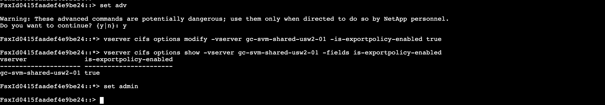

**Validation**:

* Verify `is-exportpolicy-enabled` shows `true`
* No error messages during modification

### 6.2 Create Export Policy

**Purpose**: Create a named export policy for server restrictions

**Commands**:


```bash
# Create export policy
export-policy create -vserver <SVM-NAME> -policyname <POLICY-NAME>

# Verify creation
export-policy show -vserver <SVM-NAME> 
(or)
# Verify creation only for a specific policy
export-policy show -vserver <SVM-NAME> -policyname <POLICY-NAME>
```


**Example**:


```bash
export-policy create -vserver gc-svm-shared-usw2-01 -policyname server-restriction
```


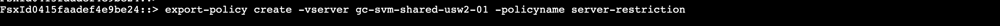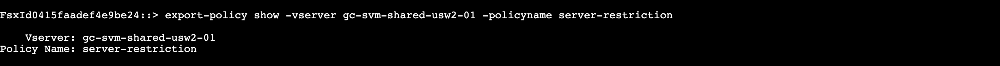

**Validation**:

* Export policy appears in policy list
* No error messages during creation

### 6.3 Configure Access Rules

**Purpose**: Add IP-based client matching rules to allow specific servers

**Commands**:


```bash
# Add rule for allowed server using hostname
export-policy rule create -vserver <SVM-NAME> -policyname <POLICY-NAME> -ruleindex 1 -protocol cifs -clientmatch <Hostname> -rorule any -rwrule any
(or)
# Add rule for allowed server using IP
export-policy rule create -vserver <SVM-NAME> -policyname <POLICY-NAME> -ruleindex 1 -protocol cifs -clientmatch <ALLOWED-IP>/32 -rorule any -rwrule any

# Add additional servers if needed using hostname
export-policy rule create -vserver <SVM-NAME> -policyname <POLICY-NAME> -ruleindex 2 -protocol cifs -clientmatch <Hostname> -rorule any -rwrule any
(or)
# Add rule for allowed

```


**Example**:


```bash
# Allow SCLRAPP01 server
export-policy rule create -vserver gc-svm-shared-usw2-01 -policyname server-restriction -ruleindex 1 -protocol cifs -clientmatch 10.216.179.32/32 -rorule any -rwrule any

#Check the rule associated with the policy
export-policy rule show -vserver gc-svm-shared-usw2-01 -policyname server-restriction
```


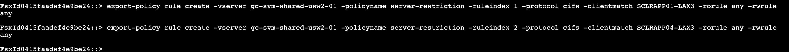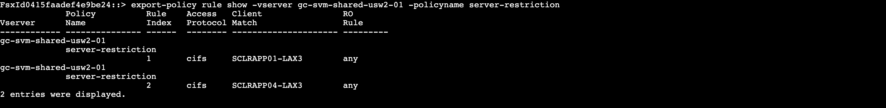

**Parameters Explained**:

* `ruleindex`: Rule priority (lower numbers evaluated first)
* `protocol cifs`: Apply to CIFS/SMB protocol only
* `clientmatch`: Hostname or IP address with /32 for single host
* `rorule any`: Allow read access with any authentication
* `rwrule any`: Allow write access with any authentication

**Validation**:

* Rules appear in export policy rule list
* Check correct Hostname or Correct IP addresses and protocols are configured

### 6.4 Apply Policy to Volume

**Purpose**: Assign the export policy to target volume(s)

**Commands**:


```bash
# Apply export policy to volume
volume modify -vserver <SVM-NAME> -volume <VOLUME-NAME> -policy <POLICY-NAME>

# Verify assignment
volume show -vserver <SVM-NAME> -volume <VOLUME-NAME> -fields policy
```


**Example**:


```bash
volume modify -vserver gc-svm-shared-usw2-01 -volume sclr_test -policy server-restriction
volume show -vserver gc-svm-shared-usw2-01 -volume sclr_test -fields policy
```


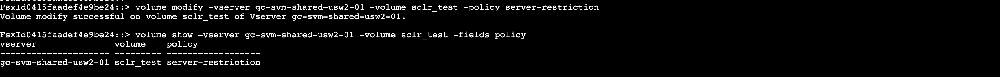

**Validation**:

* Volume shows assigned export policy
* "Volume modify successful" message appears

### 6.5 Verify Configuration

**Purpose**: Test export policy rules using ONTAP built-in access checking

**Commands**:


```bash
# Test allowed server access
vserver export-policy check-access -vserver <SVM-NAME> -volume <VOLUME-NAME> -client-ip <ALLOWED-IP> -protocol cifs -authentication-method sys -access-type read

# Test blocked server access
vserver export-policy check-access -vserver <SVM-NAME> -volume <VOLUME-NAME> -client-ip <BLOCKED-IP> -protocol cifs -authentication-method sys -access-type read
```


**Example**:


```bash
# Test SCLRAPP01 (should be allowed)
vserver export-policy check-access -vserver gc-svm-shared-usw2-01 -volume sclr_test -client-ip 10.216.179.32 -protocol cifs -authentication-method sys -access-type read

# Test SCLRAPP02 (should be denied)
vserver export-policy check-access -vserver gc-svm-shared-usw2-01 -volume sclr_test -client-ip 10.216.183.176 -protocol cifs -authentication-method sys -access-type read
```


**Expected Output**:


```
# Allowed server
Path                 Policy     Owner     Owner Type Index Access     Style
-------------------- ---------- --------- ---------- ---- ---------- ----------
/sclr_test           server-restriction
                                sclr_test volume        1 read       ntfs

# Blocked server
Path                 Policy     Owner     Owner Type Index Access     Style
-------------------- ---------- --------- ---------- ---- ---------- ----------
/sclr_test           server-restriction
                                sclr_test volume        0 denied     ntfs
```


### 6.6 Configure CIFS Share Permissions

**Purpose**: Remove default "Everyone" access and add specific user/group permissions to CIFS shares

**Step 1: Check Current CIFS Share Permissions**


```bash
# View specific share permissions
vserver cifs share access-control show -vserver <SVM-NAME> -share <SHARE-NAME>
```


**Example**:


```bash
vserver cifs share access-control show -vserver gc-svm-shared-usw2-01 -share sclr_test
```


**Step 2: Check All Share Permissions**


```bash
# View all share permissions
vserver cifs share access-control show -vserver <SVM-NAME>

# View all shares with ACL summary
vserver cifs share show -vserver <SVM-NAME>
```


**Example**:


```bash
vserver cifs share access-control show -vserver gc-svm-shared-usw2-01
vserver cifs share show -vserver gc-svm-shared-usw2-01
```


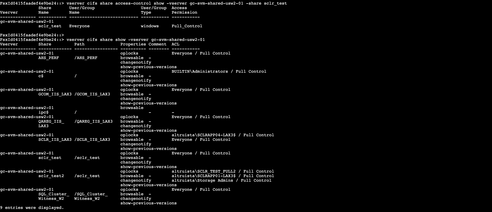

**Step 3: Remove Default "Everyone" Access**


```bash
vserver cifs share access-control delete -vserver <SVM-NAME> -share <SHARE-NAME> -user-or-group Everyone
```


**Example**:


```bash
vserver cifs share access-control delete -vserver gc-svm-shared-usw2-01 -share sclr_test -user-or-group Everyone
```


**Step 4: Add Specific User or Group Permissions**


```bash
# Add user permission
vserver cifs share access-control create -vserver <SVM-NAME> -share <SHARE-NAME> -user-or-group "<DOMAIN>\<USERNAME>" -permission Full_Control

# Add group permission
vserver cifs share access-control create -vserver <SVM-NAME> -share <SHARE-NAME> -user-or-group "<DOMAIN>\<GROUPNAME>" -permission Full_Control
```


**Example**:


```bash
# Add specific user
vserver cifs share access-control create -vserver gc-svm-shared-usw2-01 -share sclr_test -user-or-group "altruista\awsmgnsvc" -permission Full_Control

# Add domain group for administrative access
vserver cifs share access-control create -vserver gc-svm-shared-usw2-01 -share sclr_test -user-or-group "altruista\Domain Admins" -permission Full_Contro
```


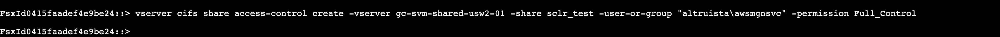

**Note**: Computer account permissions are not needed as server-level access control is handled by export policies.

**Step 5: Verify Updated Permissions**


```bash
# Check specific share permissions
vserver cifs share access-control show -vserver <SVM-NAME> -share <SHARE-NAME>
```


**Example**:


```bash
vserver cifs share access-control show -vserver gc-svm-shared-usw2-01 -share sclr_test
```


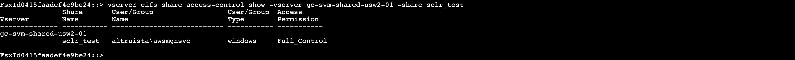

**Available Permission Levels**:

* `Full_Control` - Complete access (read, write, modify, delete)
* `Change` - Read, write, and modify access
* `Read` - Read-only access

**Validation**:

* "Everyone" group should be removed from share permissions
* Only specified users/groups should have access
* Permissions should match security requirements

### 6.7 Test Access Control

**Purpose**: Verify actual CIFS access from Windows servers

**From Allowed Server (SCLRAPP01)**:


```cmd
# Windows Command Prompt or File Manager
\\<FSX-SVM-DNS-NAME>\<SHARE-NAME>

# Example
\\gc-svm-shared-usw2-01.altruistahealth.net\sclr_test
```


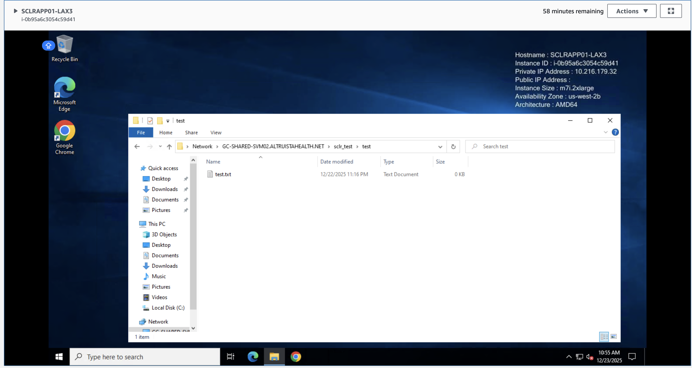

**From Blocked Server (SCLRAPP04)**:


```cmd
# Windows Command Prompt or File Manager
\\<FSX-SVM-DNS-NAME>\<SHARE-NAME>

# Example
\\gc-svm-shared-usw2-01.altruistahealth.net\sclr_test
```


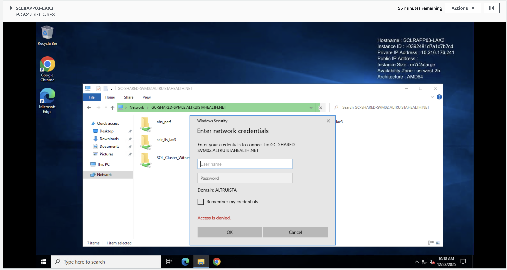

**Expected Results**:

* **Allowed Server**: Access granted, can browse and access files
* **Blocked Server**: Access denied, connection fails

**Troubleshooting Access Issues**:


```cmd
# Check server IP address
ipconfig

# Test with specific credentials
net use Z: \\<FSX-SVM-DNS-NAME>\<SHARE-NAME> /user:<DOMAIN>\<USERNAME>
```


7. Troubleshooting
------------------

This section addresses common issues that may occur during implementation and provides solutions for resolving them. We cover scenarios where export policies don't work, allowed servers get denied access, and cache-related problems that can interfere with proper functionality.

### 7.1 Export Policy Not Working

**Symptoms**:

* Export policy rules configured correctly
* CLI check-access shows proper allow/deny
* But servers can still access from blocked Hostname/IPs

**Root Cause**: Export policy enforcement disabled

**Solution**:


```bash
set -privilege advanced
vserver cifs options show -vserver <SVM-NAME> -fields is-exportpolicy-enabled
# If shows 'false', enable it:
vserver cifs options modify -vserver <SVM-NAME> -is-exportpolicy-enabled true
set -privilege admin
```


### 7.2 Allowed Server Getting Access Denied

**Symptoms**:

* Server should be allowed but gets access denied
* Export policy check-access shows "read" for the IP

**Possible Causes**:

1. **Wrong IP Address**: Server has different IP than configured
2. **Multiple Network Interfaces**: Server using different interface
3. **CIFS Share Permissions**: Share-level permissions blocking access
4. **Cached Connections**: Old connection cache interfering

**Solutions**:


```bash
# Check actual server IP
ipconfig /all  # Run on Windows server

# Check CIFS share permissions
vserver cifs share access-control show -vserver <SVM-NAME> -share <SHARE-NAME>

# Test with correct Hostname or correct Hostname in export policy

export-policy rule modify -vserver <SVM-NAME> -policyname <POLICY-NAME> -ruleindex 1 -clientmatch <CORRECT-IP>/32
```


### 7.3 All Servers Still Have Access

**Symptoms**:

* Export policy configured with specific IPs
* All servers can still access the share

**Possible Causes**:

1. **Export Policy Not Applied**: Volume still using default policy
2. **Broad Rule**: Export policy has 0.0.0.0/0 rule allowing everyone
3. **Rule Order**: Allow-all rule evaluated before specific restrictions

**Solutions**:


```bash
# Check volume policy assignment
volume show -vserver <SVM-NAME> -volume <VOLUME-NAME> -fields policy

# Check export policy rules
export-policy rule show -vserver <SVM-NAME> -policyname <POLICY-NAME>

# Remove broad allow rules
export-policy rule delete -vserver <SVM-NAME> -policyname <POLICY-NAME> -ruleindex <RULE-INDEX>
```


**Example**:


```bash
# Check volume policy assignment
volume show -vserver gc-svm-shared-usw2-01 -volume sclr_test -fields policy

# Check export policy rules
export-policy rule show -vserver gc-svm-shared-usw2-01 -policyname server-restriction

# Remove broad allow rules (if rule index 3 allows everyone)
export-policy rule delete -vserver gc-svm-shared-usw2-01 -policyname server-restriction -ruleindex 3
```


### 7.4 Cache Issues

**Symptoms**:

* Configuration changes not taking effect immediately
* Inconsistent access behavior

**Solutions**:


```bash
# Check available nodes
node show

# Flush export policy cache
vserver export-policy access-cache flush -vserver <SVM-NAME> -node <NODE-NAME> -policy <POLICY-NAME>
```


8. Cleanup/Rollback
-------------------

This section provides procedures for removing server restrictions and reverting the system to its original state. We will show how to safely remove export policies, disable enforcement, and restore unrestricted access when needed for maintenance or troubleshooting.

### 8.1 Remove Server Restrictions

**Purpose**: Revert volume to unrestricted access

**Commands**:


```bash
# Revert volume to default policy
volume modify -vserver <SVM-NAME> -volume <VOLUME-NAME> -policy default

# Delete custom export policy
export-policy delete -vserver <SVM-NAME> -policyname <POLICY-NAME>

# Verify cleanup
volume show -vserver <SVM-NAME> -volume <VOLUME-NAME> -fields policy
export-policy show -vserver <SVM-NAME>
```


### 8.2 Disable Export Policy Enforcement (Optional)

**Purpose**: Disable export policy enforcement for CIFS (return to default state)

**Commands**:


```bash
set -privilege advanced
vserver cifs options modify -vserver <SVM-NAME> -is-exportpolicy-enabled false
set -privilege admin
```


**Note**: Only disable if no other volumes require export policy enforcement

### 8.3 Verification

**Commands**:


```bash
# Verify volume uses default policy
volume show -vserver <SVM-NAME> -fields volume,policy

# Verify export policy enforcement status
set -privilege advanced
vserver cifs options show -vserver <SVM-NAME> -fields is-exportpolicy-enabled
set -privilege admin

# Test access from previously blocked server
# Should now work from all servers
```


9. Lessons Learnt/Known Issues
------------------------------

This section summarizes the key insights gained during implementation and identifies important limitations to consider. The information helps future implementations avoid common pitfalls and understand the technical constraints of the solution.

| Category | Item | Description |
| --- | --- | --- |
| **Key Learnings** | Export Policy Enforcement Disabled by Default | FSx ONTAP disables export policy enforcement for CIFS by default. Must be explicitly enabled using `vserver cifs options modify -is-exportpolicy-enabled true` |
| **Key Learnings** | Hostname or IP-Based Restrictions Work Reliably | Once enforcement is enabled, Hostname or IP-based export policies work correctly and provide true server-level access control |
| **Key Learnings** | Rule Order Matters | Export policy rules evaluated in index order. First matching rule determines access |
| **Known Limitations** | Advanced Privilege Required | Export policy enforcement setting requires advanced privilege mode. Use `set -privilege advanced` before making changes |
| **Known Limitations** | IP Address Dependencies | Solution relies on static IP addresses for servers. DHCP environments require careful IP management (DHCP assigns IP addresses dynamically - servers can get different IPs when they restart) |