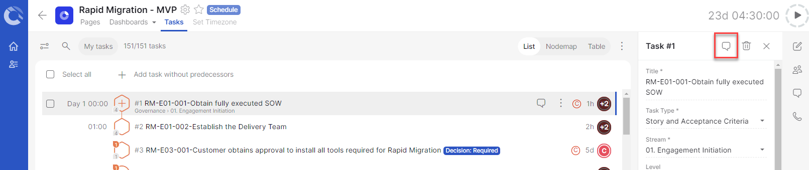
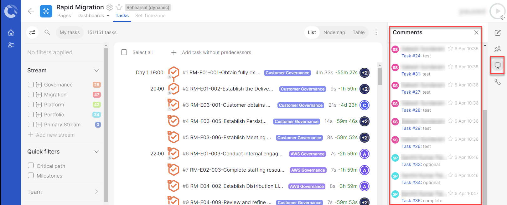

# Cutover-FAQs

**Confluence Page:** https://healthedge.atlassian.net/wiki/spaces/CP1/pages/4866051789/Cutover-FAQs

**Created by:** Chris Falk on June 16, 2025  
**Last modified by:** Chris Falk on June 16, 2025 at 02:15 AM

---

The purpose of this document is to capture Cutover FAQs during a Rapid Migration engagement.

**How do we use this in terms of sprint planning/ backlog management? Should we keep the activity backlog in JIRA/customer tool - run Sprints and other ceremonies but use this tool for tracking?**
----------------------------------------------------------------------------------------------------------------------------------------------------------------------------------------------------

* Cutover will be the “source of truth” for all activity backlogs in Rapid Migration. Both the Foundation work of Rapid Migration (e.g. Portfolio, Platform, etc) and the Migration work (e.g. app and wave migrations) will be tracked in Cutover. Cutover will be where we manage backlog and sprint planning.
* We will use Cutover to run our day-to-day cadence. This won’t be pure agile like many of us are used to. For example, we’ll do a daily stand up where we’ll be using the Dashboard to kick off startable tasks.

**Can I extract/export status reporting from the dashboards? or create templates for status reporting?**
--------------------------------------------------------------------------------------------------------

* The built-in dashboard is updated in real-time as team members update their runbook activities. The Rapid Migration Dashboard is intended to be able to be used as the status report. You can download this view as a PDF. Recommend timing this PDF snapshot given it will continue to change as the team makes progress.

**Can we trigger communications to customers/teams based on reaching a milestone? or generate a reminder of an upcoming activity?**
-----------------------------------------------------------------------------------------------------------------------------------

* Cutover has built-in notification capabilities.

**Can the runbook be modified after it is created?**
----------------------------------------------------

* Yes and No. When a runbook is in “Play” mode the completed tasks cannot be modified. Upcoming tasks (not yet started) can still be modified by anyone with "Runbook Admin" role.
* In order to capture decisions and ad-hoc activities, the "Runbook Admin" role has the ability to add tasks/decisions. We have a runbook that explains how to do these things.

**How do we assign tasks to customers (if there are dependencies)? Can this be shared with customer teams?**
------------------------------------------------------------------------------------------------------------

* Out of the box, the Rapid Migration Runbook is pre-assigned to Customer and AWS “Central Teams”. One of the first steps (done by the Engagement Manager) is to add the individuals/humans from Customer, Partner, and AWS into those “Central Teams”.

**Do we have to manually update each tasks in the run-book?**
-------------------------------------------------------------

* Each assigned Team is responsible to update their runbook tasks.

**Are there filters to see only in-progress / past due items?**
---------------------------------------------------------------

* Yes, the best place to see these areas is on Dashboards.

**Can Cutover update runbook task status in real-time based on migration progress ( like any web-hooks to retrieve systemic records?**
--------------------------------------------------------------------------------------------------------------------------------------

* Based on the AWS AppSec Review, these features are not currently being used in the Rapid Migration use-case.

**Can we import all the cutover tasks into cutover project? Do we have such template based approach to maintain for future needs or can we save all these tasks in runbook as one template/workbook?**
------------------------------------------------------------------------------------------------------------------------------------------------------------------------------------------------------

* Yes, we have an excel template that is the source of runbooks.
* By default for Rapid Migration instances of Cutover, they will be preloaded with the Rapid Migration runbook. In future we will package other runbook templates in AWS instances for other offerings.

**Where can I get a username and password to logon?**
-----------------------------------------------------

* AWS team members will be granted access via SSO/Midway. Customers will be granted access through their SSO.

**How do I record that a task is delayed and provide status updates?**
----------------------------------------------------------------------

* Each task has a comments facility, comments can be added to each of the tasks and recorded.

**How can I see all the comments made across the entire project?**
------------------------------------------------------------------

* While logged into the runbook, select the comment icon (on the right-hand side)

**What is the difference in Task Levels (level 1, 2, or 3)?**
-------------------------------------------------------------

* Currently, the task levels are not being used to track anything in the Rapid Migration project.

**Can we pause a started story or pause the entire runbook?**
-------------------------------------------------------------

* Individual tasks/stories cannot be paused.
* The entire runbook can be paused but **this is not advised.**
* Only pause the runbook when truly needed. *Pausing the runbook prevents the entire team* from working/editing tasks. Example scenarios of when you may pause a runbook:
  + Over a holiday break when neither the customer nor AWS will be working.
  + You may pause an Application Migration Runbook if the Application moves to a later wave.

**Attachments:**

[ProjectComments.png](../../attachments/ProjectComments.png)

[TaskComments.png](../../attachments/TaskComments.png)