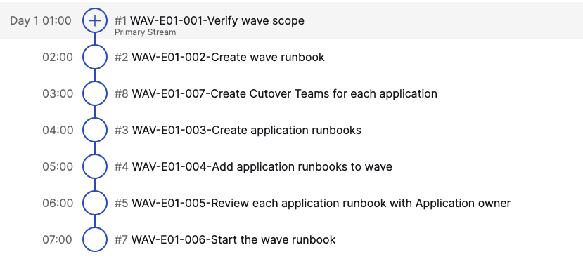
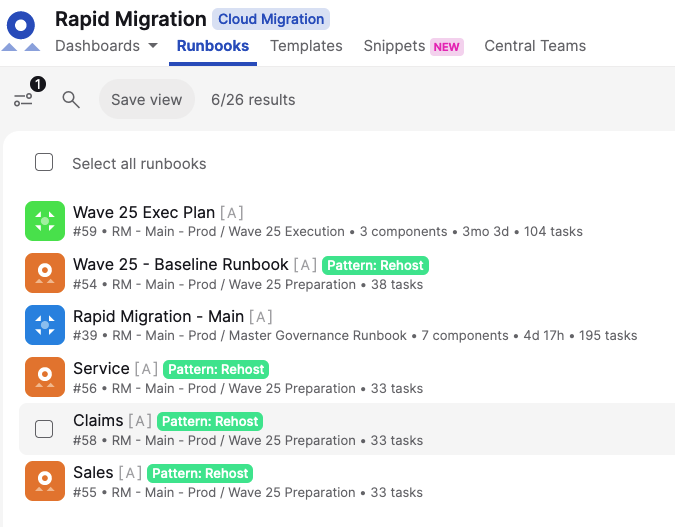

# Runbook-How-to-add-a-migration-wave-to-Cutover

**Confluence Page:** https://healthedge.atlassian.net/wiki/spaces/CP1/pages/4867032747/Runbook-How-to-add-a-migration-wave-to-Cutover

**Created by:** Chris Falk on June 16, 2025  
**Last modified by:** Chris Falk on June 16, 2025 at 02:15 AM

---

---

title: Runbook - How to add a migration wave to Cutover
-------------------------------------------------------

Section 1 - Add a new Migration wave to the foundational runbook.
=================================================================

Related task IDs: RM-E08-001  
Role Responsible: Engagement Manager

Within the Rapid Migration - Foundational Runbook, and after the Portfolio workstream publishes the initial Wave Plan (Task ID: PF-E03-015), the 
**[Engagement Manager]** will carry out Task 
RM-E08-001, which involves adding a “Snippet” task for each wave in to the main foundational runbook. These wave tasks are the highest level for tracking waves and the activities required to establish and start a new wave.

NOTE: all Migration Waves will show that they are running in parallel in the Rapid Migration foundational runbook; thus all Waves are startable at the same time, after" "Pilot Migration Execution - Complete" this enables waves to run in parallel and also a degree of flexibility to the wave plan.

1. Go to List View, and navigate to task prefixed with MG-E11-001
2. Add a task after the MG-E11-001 for “Wave 
   ***X*** 
   Migration - 
   ***Wave Description***”
3. Click “I’ll pick” and set the successor to be “All Migrations Complete”
4. Edit the task you just created
5. Change the task type to 
   **Snippet**
6. Select the Snippet for “Wave Governance”
7. Click Save

NOTE: You won’t see tasks added until the Wave Task is started. But here are the list of tasks that will be added once the 
**Snippet** task is started

Example list of tasks for wave setup and management
---------------------------------------------------

Section 2 - Create the application teams in Cutover
===================================================

Related task IDs: WAV-E01-007  
Role Responsible: Engagement Manager

Central Teams in Cutover provide a group of individuals that can be assigned tasks and grant specific roles with the Runbooks. For each application team we suggest that a Cutover team is created which will enable assignment of tasks to that team. Within the Cutover instance we have created some very generic teams to get you started, these can be used as is but in most cases application or specific teams should be created to mirror the structure of the application business, support and development team in the customer organization.

By default the Cutover instance/runbook has the following teams defined for Applications:

* Customer Application Support
* Customer Application Owners
* Customer Database Support
* Customer Application Teams - used for the foundational runbook tasks before specific application owners are identified.

For each application we suggest the following should be completed.

1. The purpose of this task is to create Cutover Teams to manage the individuals associated with each Application. These teams will be assigned tasks in the Cutover runbooks and they will also receive communications related to their application runbooks.
2. You will create the following teams for each application: (note: the “Customer Application Teams” is used for initial Governance and Portfolio tasks.)

Section 3 - Creation of the Wave runbooks
=========================================

Related task IDs: WAV-E01-002  
Role Responsible: Engagement Manager

Situation: Rapid Migration Foundational Runbook - We’ve started the Wave x task in the Runbook. Back in the Rapid Migration Workspace we will create Wave and application specific runbooks.

1. Navigate to the Runbooks section of the Cutover workspace.
2. In the filter panel on the Left-hand side, under folders, click the 
   **Add new folder** 
   link and enter the name of the wave you wish to add.
3. Click 
   **Create Runbook**
4. Select 
   **Migration**, from the runbook types available.
5. Select the 
   **Rehost Migration - Wave Runbook** template.
6. Name the “Wave x - Wave Description”
7. Choose a Folder and select the Wave Number. (All App Runbooks will be contained within the Wave Folder)
8. Enter the forecasted start and end dates of the WAVE (not including design work).

Section 3 - Creation of Application runbooks
============================================

Related task IDs: WAV-E01-003  
Role Responsible: Engagement Manager

1. Navigate to the 
   **Runbooks** 
   section of the Cutover workspace.  
   
2. Click 
   **Create Runbook**
3. Select 
   **Migration**, from the runbook types available.
4. Select the 
   **Rehost Migration - Application Runbook** 
   template.
5. Enter Title; this should be the name of the application provided in the wave plan.
6. Select the FOLDER for the associated wave.
7. Enter the “Scheduled Start” date - 
   **calculate as 2 weeks prior to the Wave Start Date.**
8. Do not use “Autostart” on Application Runbooks.
9. Manual starts force the team to review/validate the scope of the Wave.
10. Now edit the Application Runbook Created:
11. Select All Tasks within the Runbook. Click “Edit Selected” button at top of Runbook.
12. In right-hand panel, within 
    **Rapid Migration** 
    fields, update the “Applications” with the name of the application being migrated.
13. Within the Application Runbook just created, you will need to “Replace” the Teams with the Application Specific Teams you created in the previous step. The easiest way to do this is to go into the Users and Teams.
14. Select “Customer Application Owners” Team
15. At the top of the menu, Click “...“ and select “Replace Team”
16. Select “Application - Specific Owners” Team
17. Repeat steps I to n, for “Customer Application Support” and “Customer Database Support”
18. Repeat this set of tasks to create 1 Runbook for each Application in the wave.