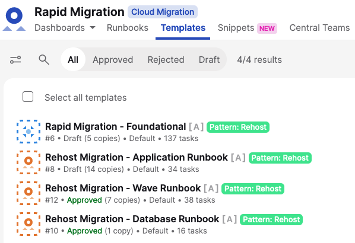

# Runbook-How-to-validate-Cutover-Runbook-templates

**Confluence Page:** https://healthedge.atlassian.net/wiki/spaces/CP1/pages/4867096903/Runbook-How-to-validate-Cutover-Runbook-templates

**Created by:** Chris Falk on June 16, 2025  
**Last modified by:** Chris Falk on June 16, 2025 at 02:15 AM

---

---

title: Runbook - How to validate Cutover Runbook templates
----------------------------------------------------------

Section 1 - Validating Cutover Runbook templates
================================================

Related Task IDs: MG-E09-002  
Role responsible: Migration Lead

Validate the Migration Runbook Templates @ start of engagement (these reside under the “Templates” section of the Cutover workspace) (reference Rapid Migration MVP Runbook, task # MG-E09-002 to validate wave, application, and database runbook templates in the workspace.)

Below is an image of the default templates that should be loaded into your Cutover workspace (some may have slight different names).

Validate the “Rehost Migration - Wave Runbook”.
-----------------------------------------------

1. This contains all the tasks required to mange the wave and do bulk migration activities for the wave. This is done in coordination with the customer.
2. Ensure that all the tasks are correct. Make sure to validate the assigned teams.
3. Remove any tasks that aren’t required (across any of the waves) for the customer environment.
4. Add any tasks that have be done at the Wave Level (across all the waves)
5. Validate timings and Nodemap flow (including dependencies).
6. Review Phases with the customer to ensure the built-in reporting maps to how the team wants to see progress.

Validate the “Rehost Migration - Application Runbook”
-----------------------------------------------------

1. This contains all the tasks required to mange the individual application specific migration activities. This is done in coordination with the customer.
2. Ensure that all the tasks are correct. Make sure to validate the assigned teams.
3. Remove any tasks that aren’t required (across any of the waves or applications) for the customer environment.
4. Add any tasks that have be done at the Application Level (for the majority of applications); if it is a small number of applications that require specific tasks then these tasks can be added later.
5. Validate timings and Nodemap flow (including dependencies). Some streams in this runbook will not have Predecessors; this is expected at this stage and will be resolved in later tasks.
6. Review Phases with the customer to ensure the built-in reporting maps to how the team wants to see progress.

Validate the “Rehost Migration - Database Runbook”
--------------------------------------------------

1. This contains all the tasks required to mange the individual application specific and do bulk migration activities. This is done in coordination with the customer.
2. Ensure that all the tasks are correct. Make sure to validate the assigned teams.
3. Remove any tasks that aren’t required (across any of the waves) for the customer environment.
4. Add any tasks that have be done at the Wave Level (across all the waves)
5. Validate timings and Nodemap flow (including dependencies).
6. Review Phases with the customer to ensure the built-in reporting maps to how the team wants to see progress.