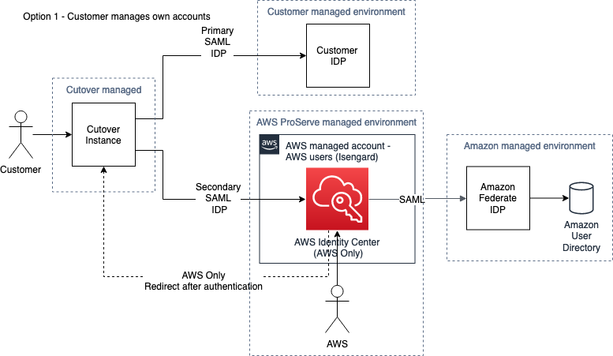
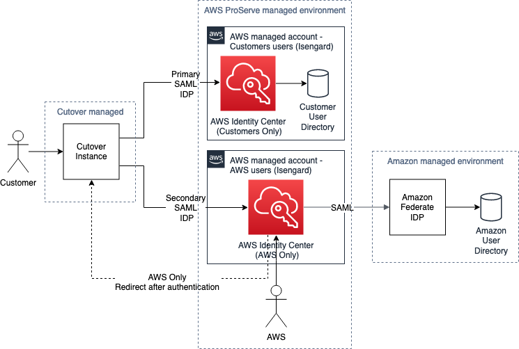

# Runbook-Setup-and-Manage-the-Cutover-instance

**Confluence Page:** https://healthedge.atlassian.net/wiki/spaces/CP1/pages/4867096932/Runbook-Setup-and-Manage-the-Cutover-instance

**Created by:** Chris Falk on June 16, 2025  
**Last modified by:** Chris Falk on June 16, 2025 at 02:15 AM

---

---

title: Runbook - Setup and Manage the Cutover instance
------------------------------------------------------

Cutover instance management
===========================

Cutover instances are centrally provisioned for use on AWS projects and when handed over to the AWS Engagement Manager at the start of a new project they should have been pre-configured to allow AWS employees the ability to authenticate using the Amazon internal SSO Identity Provider. The only user with access to this instance initially is the AWS Engagement Manager and through break-glass a small number of AWS Cutover support team members. The **AWS Engagement manager is fully responsible for the instance** once it is handed over to them, their responsibilities include:

* Managing the setup and configuration of the Customer SSO provider with Cutover.

1-this-is-my-header
===================

* [Registering new users](#registering-users) for both AWS and Non-AWS.
* [Off-board / Deregister users](#deregistering-users)
* Managing user roles within Cutover.
* Managing the Runbook templates.
* Raising any tickets for support.

Section 1 - Managing the setup and configuration of the Customer SSO provider with Cutover.
-------------------------------------------------------------------------------------------

AWS Provisioned Cutover instances support two configurations to provide authentication of non-AWS users to the instance.  The first and preferred configuration associates the non-AWS users with an existing IDP within the customer environment, this allows for the customer's existing users to authenticate with their internal credentials. The second option is an alternative solution for times when customers do not have a appropriate IDP, or do not wish to associate their existing IDP to the Cutover instance.

**Option 1 - Associate existing customer IDP with Cutover for non-AWS users.**

**Option 2 - Associate with AWS Managed IDP for non-AWS users (this will be rare)**

### Option 1 - Using the customer IDP for authentication of non-AWS users.

SSO setup for Cutover is a multi-step, multi-party process; involving Cutover and Customer to exchange SSO metadata to setup the relationship between the IDP and Cutover.

#### Prerequisites

* Dedicated Cutover instance has been provisioned by Cutover.
* The following information is available:
* **Cutover instance URL**
* Obtain the Cutover instance 
  **SAML XML metadata file**. This should be requested from the Cutover Administration team by your AWS Engagement manager.
* Customer IDP contact identified and agreement to integrate.

#### Step-by-step instructions

1. Send Cutover SAML XML metadata file to the customer IDP contact along with the URL of the instance, requesting that that configure the Cutover as an application in their SAML IDP. They should create an access group for the Cutover application and add users that need access to the group membership using their internal standards and processes to perform this activity.
2. Once the customer IDP contact has added the Cutover instance to their IDP they will return a metadata file for adding to Cutover.
3. Send customers metadata file to Cutover Administration team to requesting that it is setup as the primary IDP for the dedicated Cutover instance.
4. Once confirmation that the new SSO configuration has been completed. The AWS engagement manager or a delegate can be requested to register the required users in the instance; thus granting them access to the instance.

### Option 2 - Setting up the AWS Managed IDP for authentication of non-AWS users.

This process needs to be managed by the AWS Engagement manager who will liaise between the internal AWS Cutover teams and Cutover to setup this IDP association with the new instance.

#### Prerequisites

* Dedicated Cutover instance has been provisioned by Cutover.
* The following information is available:
* **Cutover instance URL**

#### Step-by-step instructions

1. AWS Engagement manager requests that the AWS managed IDP is associated with the new Cutover instance. They should provide the team with the reason for not using option1 when making this request.
2. The AWS Cutover provisioning team will then configure the instance and setup the required groups.
3. New users then need to be registered by the AWS Cutover provisioning team using the bulk request form below.

Registering users
-----------------

This process needs to be 
**managed by the AWS Engagement manager** 
and will grant users access to Cutover instance(s).

1. Provide the AWS engagement manager the following details for the user:
   * Email address
   * First, and last name
2. Optional - If using a customer IDP then the customer administrator should add the user to the access group for the Cutover application.

Deregistering users
-------------------

This process needs to be 
**managed by the AWS Engagement manager** 
and will remove users access to Cutover instance(s).

1. Provide the AWS engagement manager the following details for the user:
   * Email address
   * First, and last name
2. Optional - If using a customer IDP then the customer administrator should remove the user from the access group for the Cutover application.

Troubleshooting
---------------

### Error presented on Cutover Login screen

The error above can be caused by one of the following:

* The user has not accepted the invite email from the Cutover instance - verify with the user that they have received the invite and clicked the accept button.
* The user trying to connect has not been registered in Cutover or the email address/username does not match with what Cutover is configured with - verify with the AWS Engagement manager that the user is registered in the Cutover instance.
* The SSO IDP is not setup correctly (this will effect all users only) - the AWS Engagement manager needs to verify the setup with AWS Cutover support team.