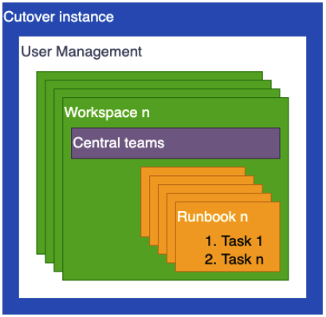
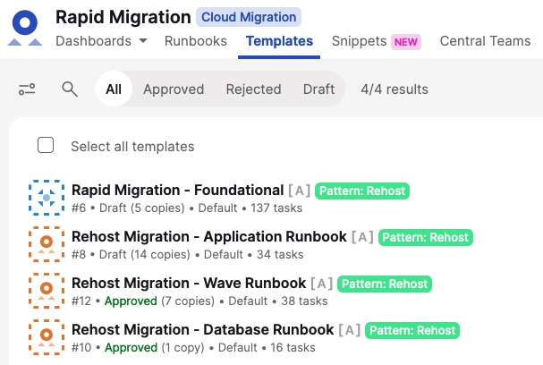
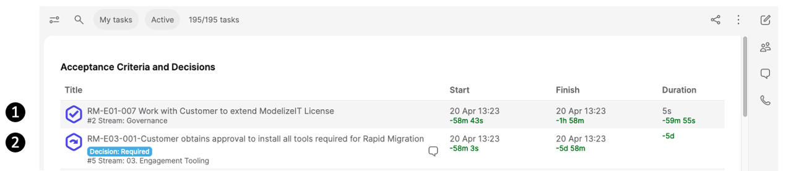

# AWS Cutover

**Confluence Page:** https://healthedge.atlassian.net/wiki/spaces/CP1/pages/4867064115/AWS%20Cutover

**Created by:** Chris Falk on June 16, 2025  
**Last modified by:** Chris Falk on June 16, 2025 at 02:17 AM

---

Module coverage
---------------

This module provides an overview and detailed guidance on using the Cutover product to manage runbooks and governance of a large scale project; for instance a large migration project to AWS.

The module provides guidance in the following areas:

* Setup and Management of the Cutover instance
  + Backup/restore
  + Archival
  + Project closure
* Access Management within Cutover
* Progress reporting and governance using Cutover
* Runbook management

What is Cutover?
----------------

Cutover delivers a low risk, optimized migration via the work orchestration and observability platform, connecting teams, processes and technology with dynamic, automated runbooks.

The Cutover workspace consists of pre-populated runbook templates out of the box covering the most common tasks you need to complete a number of different outcomes within the Migration and Modernization space. With guardrails built into each runbook as a safety net, you can start migrating applications with the guidance built through the combined knowledge of thousands of similar projects. The platform is fully customizable, providing you the ability to scale at pace for any type and number of migrations. You can create and edit any template runbooks to create new processes to meet your requirements.

With Cutover, you can:

* Get started easily with our pre-populated task library that creates a guided path to cloud migrations. Our runbooks are pre-loaded with every task, creating a step by step process to successfully achieve an end to end migration.
* View critical data in real time to make intelligent decisions. With hundreds of tasks to complete, dashboards provide a live overview of progress made. Teams see details for every task, make quick decisions and collaborate seamlessly.
* Observe, track and control the project processes to build a comprehensive audit trail. Details of every task are listed with owners, guardrails are set for security and automations are added to reduce manual work.
* Visualize the next steps for all your applications through the various phases. You can identify parallel tasks and dependencies to manage the critical path that drives a risk-free migration.

### **Cutover within the Migration tooling landscape**

Cutover provides migration projects all the elements required to govern and track progress from the setup of the program, down to the individual tasks required migrate individual applications.

The diagram below shows a example of the tooling landscape deployed on a typical migration project. From here you can see that Cutover is the command and control center for the migration, directing all activities and downstream tooling.

### **Cutover instance structure**

Each Cutover instance has the following high-level structure:

* User Management is controlled globally for the instance, but with the ability to delegate user administration to the owners of a Workspace.
* Within each instance there will be one or more Workspaces, these allow a single instance of Cutover to maintain multiple projects and control the visibility of the projects through the assignment global User Management roles.
* Workspaces contain a Central teams capability; this allows users assigned the Central Team Management role to maintain the list of teams and also the membership of the teams.
* Finally within a Workspace there are 1 or more runbooks which will be used to track various processes, every runbook contains 1 or more tasks.

AWS provided Cutover content
----------------------------

### **Runbook Types**

Runbook Types make managing and working with runbooks in Cutover simpler, providing customized dashboards, and content along with its own icon and color in the runbook lists (see
Figure 1), they also enable templates to be link directly to a Runbook type to help with creation of new runbooks (see
Figure 2). Runbook Type creation can only be performed by someone with the Workspace Manager role, which in AWS Instances is restricted to the Engagement Manager.

By default each Cutover instance used within an AWS migration project will be have the following runbook types available.

> **Note:** This is a complex table with merged cells. For best viewing experience, see the [original Confluence page].

<table><tbody><tr><th>Runbook Type</th><th colspan="1">Icon</th><th>Description</th><th>Customization</th></tr><tr><td>Rapid Migration</td><td colspan="1">

</td><td>Used for the main foundational runbook only.</td><td>Pre-configure Dashboards<ul><li>Acceptance and Decisions</li><li>Exec Summary</li><li>In progress tasks</li><li>Rapid Migration</li><li>Startable tasks</li></ul></td></tr><tr><td>Migration</td><td colspan="1">

</td><td>Used for all migration wave and application runbooks.</td><td>Pre-configure Dashboards<ul><li>Acceptance and Decisions</li><li>Exec Summary</li><li>In progress tasks</li><li>Rapid Migration</li><li>Startable tasks</li></ul></td></tr><tr><td>Normal Runbook</td><td colspan="1">

</td><td>Built-in default runbook</td><td>None</td></tr></tbody></table>

### **Runbook templates**

By default, the following AWS runbook templates should be available in the Cutover instance.

#### **Rapid Migration - Foundational**

This runbook covers all the tasks and workstreams needed to setup a large scale rehost migration to AWS. It includes the following workstreams:

* Governance
* Platform
* Portfolio
* Migration

The outcome of this runbook is to:

1. Setup the governance required to run the program (People, Processes, and Tools)
2. Deploy and configure the AWS Landing Zone, or assess an existing one.
3. Start the portfolio assessment of the applications and put in place the continuous assessment processes.
4. Setup the migration facilities and migration of the Wave 0 applications to validate the processes and facilities.
5. Track the high-level status of the migration to completion.

If your instance of Cutover has been provided to support a Migration to AWS then a runbook based on Rapid Migration - Foundational runbook template should already have been created for you and is visible in the Runbooks list; if this is not present please contact your AWS Migrations team for assistance.

#### Rehost Migration - Wave runbook

This runbook covers all the tasks required to govern all the applications in a Wave that are not application specific. This runbook template will be instantiated for each wave in the project. This runbook template is used in conjunction with the Application and Database runbooks, the Wave runbook being a parent to the application runbooks within it's scope.

It covers the following phases:

* Design
* Migration Planning
* Pre-Migration
* Migration Cutover
* Handover and close
* Rollback

The outcome of this runbook is to:

1. Migrate the scope of a wave.
2. Manage and initiate bulk application/server migration activities through automation.
3. Provide structure to the specific application runbook tasks, ensuring there is alignment of key dates across applications.

#### Rehost Migration - Application runbook

This runbook covers all the tasks required to govern and migrate a single application in the Wave. This runbook template will be instantiated for each application in the project. This runbook template is used in conjunction with the Wave, every application runbook will be associated with a Wave runbook once started. This runbook provides the application owners and support teams the ability to customize the migration process for their needs, such as, start-up/shutdown tasks.

It covers the following phases:

* Design
* Migration Planning
* Pre-Migration
* Migration Cutover
* Handover and close
* Rollback

The outcome of this runbook is to:

1. Migrate a specific application to AWS.

#### Rehost Migration - Database runbook

This runbook covers all the tasks required to govern and migrate a single database in an Application. This runbook template will be instantiated for each database in the project. This runbook template is used in conjunction with the Application, every database runbook will be associated with a Application runbook once started. This runbook provides the database and application owners and support teams the ability to customize the migration process for their needs.

It covers the following phases:

* Design
* Migration Planning
* Pre-Migration
* Migration Cutover
* Handover and close
* Rollback

The outcome of this runbook is to:

1. Migrate a specific database to AWS in conjunction with the application.

### **Dashboards**

Cutover provides dashboards that provide automated reporting and summaries of the status of the current runbook but also multiple runbook combined. Within the AWS Cutover instance you will find that along with the built-in Cutover Dashboards a number of pre-defined dashboards have been provided and will be used for the management and delivery of the migration project with AWS; the details of these Dashboards are provided below.

#### Acceptance Criteria and Decisions Dashboard

Acceptance Criteria and Decisions dashboard  ( shown below ) provides real time visibility of task progression and completion against user story acceptance criteria (each task represents a user story), it also provides a view on key decisions that have been made when completing the tasks. As with all dashboards in Cutover this will be automatically updated when tasks are completed and updated by the team responsible for completion.

It provides details for following areas:

* Acceptance description
  -
  additional details for the acceptance criteria outcome  
  (pass; fail; not tested)
* Decision record: capturing required decision details against a task
* Bring visibility to decisions and acceptance description using filters

The screenshot below shows 2 tasks that have the task type of Story and Acceptance Criteria:

1. This task is has acceptance criteria only and this is highlighted by the icon showing a tick.
2. This tasks is has both acceptance criteria and also has required decisions that need to be made and recorded, this is highlighted by the jumping arrow icon.

External Links
--------------

<https://www.cutover.com/>