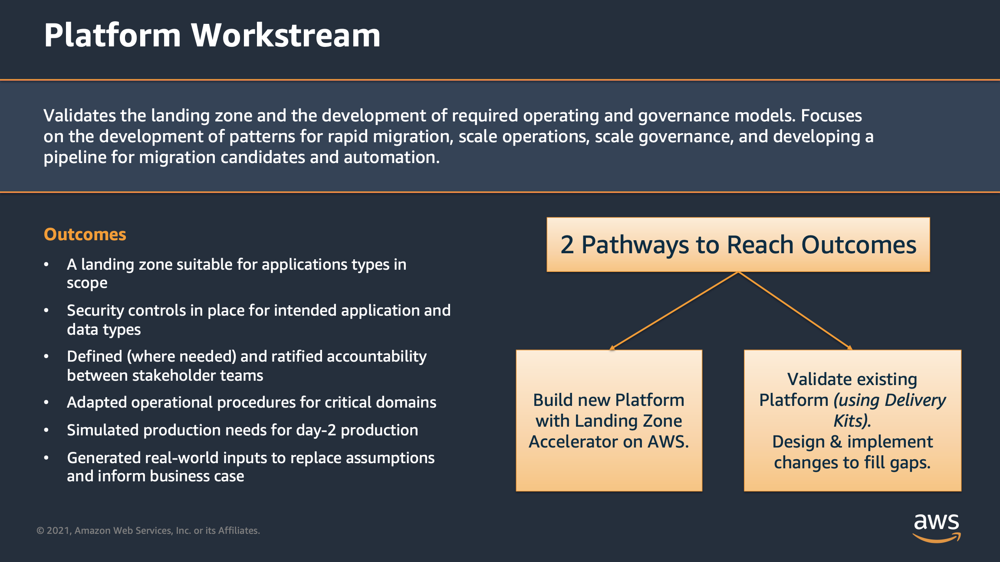

# Landing Zone

**Confluence Page:** https://healthedge.atlassian.net/wiki/spaces/CP1/pages/4867064363/Landing%20Zone

**Created by:** Chris Falk on June 16, 2025  
**Last modified by:** Chris Falk on June 27, 2025 at 06:52 PM

---

**Background**
--------------

To proceed in the Migration and Modernization process, customer's need an established platform to support business operations in their cloud environment. The Platform Workstream is designed to provide customers a landing zone that is both scalable and secured that helps customer achieve desired business outcomes. Through the Platform workstream, customers have multiple paths now to reach an established platform through existing CI/CD solutions or through the Landing Zone Accelerator on AWS solution.

**Overview**
------------

The Landing Zone Accelerator on AWS solution helps you quickly deploy a secure, resilient, scalable, and fully automated cloud foundation that accelerates your readiness for your cloud compliance program. The [Landing Zone Accelerator solution](https://aws.amazon.com/solutions/implementations/landing-zone-accelerator-on-aws/) is architected to align with AWS best practices and multiple, global compliance frameworks. When used in coordination with other AWS services, it provides a comprehensive no-code solution across 35+ AWS services. With this solution, customers with highly-regulated workloads and complex compliance requirements can better manage and govern their multi-account environment. The Landing Zone Accelerator solution helps you establish platform readiness with security, compliance, and operational capabilities.

**Using this Delivery Kit**
---------------------------

This step-by-step delivery kit contains all of the instructions and information needed to successfully implement the Landing Zone Accelerator. It also serves as the single place to collaborate and document progress.

1. The delivery kit is set up with sections for the work to be completed, in the order in which the work needs to be completed.

   1. The sprints are populated with the items to be completed in each sprint.
2. This kit provides all the decisions you need to make to deploy Landing Zone Accelerator on AWS. Each page that requires a decision will have a green callout box with the decisions to be made.

   1. Each decision page also has a place for you to document your specific decisions for future reference.
   2. The decision log in the Project Management section has links to all the decision pages for ease of searching.
   3. There is a CSV file containing all decisions, that can be uploaded to your project management tool.
3. This kit provides all of the tasks that need to be completed for a successful deployment of Landing Zone Accelerator on AWS.

   1. There is a CSV file containing all tasks, that can be uploaded to your project management tool.

**Example Decision Callout:**

**Decision**

There will be decisions to make in these boxes

The completed kit is intended to be a self-service online library including any and all relevant operational artifacts. At the completion of the project, the kit will encapsulate all technical and business artifacts developed and can be used as reference and training guidance for existing and new team members.

**Attachments:**

[Picture1.png](../attachments/Picture1.png)

[Picture2.png](../attachments/Picture2.png)

[Screen%20Shot%202022-06-01%20at%202.42.32%20PM.png](../attachments/Screen%20Shot%202022-06-01%20at%202.42.32%20PM.png)

[Screen%20Shot%202022-06-01%20at%202.43.14%20PM.png](../attachments/Screen%20Shot%202022-06-01%20at%202.43.14%20PM.png)

[image2022-7-7\_9-28-33.png](../attachments/image2022-7-7_9-28-33.png)