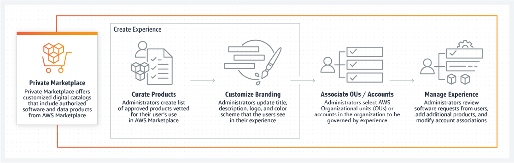
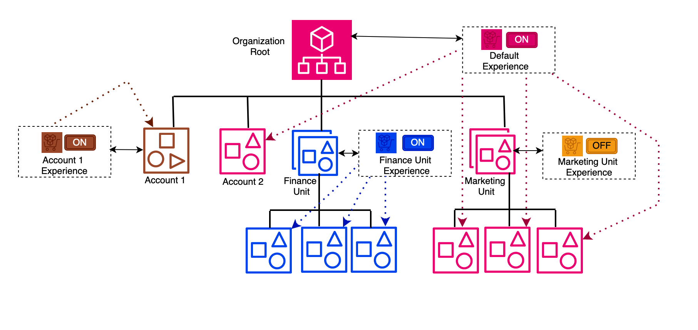
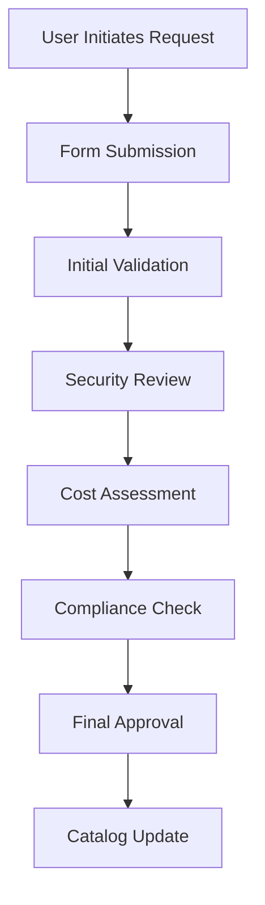

# 3-2-Design-Marketplace-Procurement-Process

**Confluence Page:** https://healthedge.atlassian.net/wiki/spaces/CP1/pages/4993188282/3-2-Design-Marketplace-Procurement-Process

**Created by:** Lei Shi on August 07, 2025  
**Last modified by:** Lei Shi on August 07, 2025 at 10:51 PM

---

Phase 1 and Phase 2 with AWS Private Marketplace Experience enablement for Sandbox OU as pilot program
======================================================================================================

1. Overview
-----------

### 1.1 Purpose

This document outlines the design for implementing a controlled AWS Private Marketplace Experience for Sandbox OU accounts, including governance controls and product request workflows.

### 1.2 Scope

* Private Marketplace Experience configuration
* Initial approved product catalog
* Governance controls
* New product request process

2. Architecture Design
----------------------

### 2.1 Component Overview


```
AWS Organizations
└── Management Account
    ├── Private Marketplace Delegated Administrator Account
        ├── Private Marketplace Experience for Sandbox OU
          ├── Approved Product Catalog
          └── Audience Scope
            └── Sandbox OU

```


### 2.2 Core Services Used

* AWS Marketplace
* AWS Organizations
* AWS EC2



3. Private Marketplace Experience Configuration
-----------------------------------------------

### 3.1 Experience Settings

json

### 3.2 Initial Approved Product Catalog

yaml

4. New Product Request Workflow
-------------------------------



