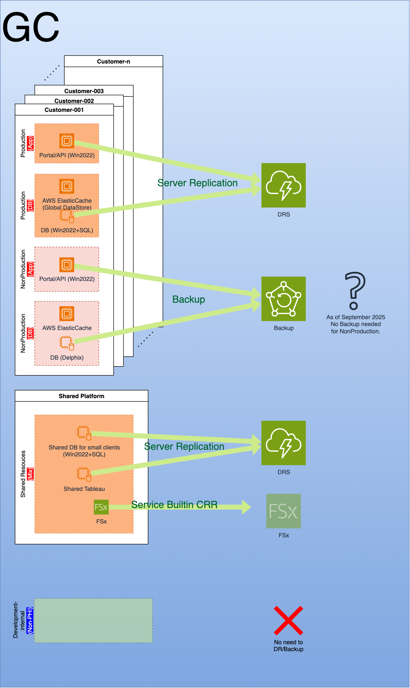

# 5-1-Backup-Management-Decision

**Confluence Page:** https://healthedge.atlassian.net/wiki/spaces/CP1/pages/5127471255/5-1-Backup-Management-Decision

**Created by:** Lei Shi on September 26, 2025  
**Last modified by:** Chris Falk on November 13, 2025 at 07:21 PM

---

According to the workshop discovery and decisions. HealthEdge overall needs Disaster Recovery(DR) protection to customer production workloads in HRP and GC, and as of September 2025, there is not need to provide DR protection to either Customer’s NonProdcution workloads or HealthEdge Development workloads.

Clarifications on the terms of DR/Backup/HA for HealthEdge operates in AWS cloud:
---------------------------------------------------------------------------------

* DR: Entire Service Stack Operates in one AWS region all the time until the region failure, then perform Disaster Recovery in another AWS region, with minimum RTO/RPO;
* Backup: Regular server and data backup within region or cross region, mainly for data retention purpose, and perform individual server/storage recovery to a certain recovery point. Not suitable for service stack DR operation as RPO will be over an hour gap.
* HA: Within an AWS Region, place web/app/db tiers in a service stack to all across multiple Availability Zones(AZ), which can survive from single AZ failures, to avoid unnecessary cross-region DR failover operation.

BU Decisions
------------

From onprem, HRP and GC was exercising Backup solution/tools to fulfill DR. While after migrate into AWS, there will be AWS native solutions to customize the DR needs.

In below sections/diagrams, illustrate different environment/component need toward DR requirement. As HRP and GC workloads currently are VM-based, AWS DRS will be the service to fulfill DR along with some storage cross-region data backups.

HRP
---

### ***HRP - Current Business Continuity Practice***

#### For SaaS-Prod

* RTO: 15 minutes (note: 15 min is for a individual client, or 4 hours for all clients)
* RPO: second-level
* Cross DC Backup Frequency: Realtime Continuous
* Backup Retention: 14 days
* DR Drill frequency: At least once a year contractually for end customers (note: may be multiple times upon some client request.)

#### For SaaS-NonProd

* RTO: Best effort
* RPO: Best effort
* Cross DC Backup Frequency: Realtime Continuous. (note: not guaranteed, may be deleted to free out space for SaaS-Prod use.)
* Backup Retention: 14 days
* DR Drill frequency: None

#### For Development

* RTO: None
* RPO: None
* Cross DC Backup Frequency: None
* Backup Retention: None
* DR Drill frequency: None

### ***HRP - DR & Backup Strategy Decisions in AWS***

#### For SaaS-Prod

* RTO: DR - 15 minutes (note: 15 min for new servers up&running in a another region, full application stack operation cutover may be various)
* RPO: DR - second-level
* Backup Policy: Backup - Triggered daily, and all restore points stored for 14 days in both workload account and central account within same region

  + HRP: Oracle Standalone Database Backup and Disaster Recovery Strategy independent of AWS Backup of instances
* DR Drill frequency: At least once a year contractually for end customers (note: may be multiple times upon some client request.)

#### For SaaS-NonProd

* RTO: NA
* RPO: NA
* Cross AWS Region Backup Frequency: NA
* Backup Retention: NA
* DR Drill frequency: None

#### For Development

* RTO: NA
* RPO: NA
* Cross AWS Region Backup Frequency: NA
* Backup Retention: NA
* DR Drill frequency: None

Guiding Care
------------

### ***GC - Current Business Continuity Practice***

#### For Customer-Prod-DB

* RTO: weeks or even months
* RPO: 1 day
* Cross DC Backup Frequency:

  + In local DC, weekly full db backup, daily differential db backup, hourly transactional log backup;
  + Cross DC, aux copy the backups into different DC, but not triggered by database.
* Backup Retention: 60 days for production sql db (consider to reduce the retention)
* DR Drill frequency: No actual DR capability yet.

#### For Customer-Prod-App

* RTO: weeks or even months
* RPO: NA
* Cross DC Backup Frequency: no backup, app server will pickup documents from SMB shares.
* Backup Retention: None
* DR Drill frequency: No actual DR capability yet.

#### For Development

* RTO: None
* RPO: None
* Cross DC Backup Frequency: None
* Backup Retention: None
* DR Drill frequency: None

### ***GC - DR & Backup Strategy Decisions in AWS***

#### For Customer-Prod-Whole Stack

* RTO: DR - 4 hours
* RPO: DR - 30 minutes
* Backup Policy: Backup - Triggered daily, and all restore points stored for 14 days in both workload account and central account within same region

  + After discussion with the Migration Technical Oversight Committee, it was decided to implement the same AWS Backup policies for GC as HRP (November 12, 2025 - Jim Fallon, Mark Mucha, Ted O’Hayer, Chris Falk)
  + GC: Sqlserver Database Backup Strategy Backup for databases in addition to AWS Backup of instances
* DR Drill frequency: ?

#### For Customer-NonProd-Whole Stack

* RTO: DR - none
* RPO: DR - no-one
* Backup Policy: NotRequired for now (as of 2025-09-30)
* DR Drill frequency: none

#### For Internal-Development

* RTO: DR - none
* RPO: DR - none
* Backup Policy: NotRequired for now (as of 2025-09-30)
* DR Drill frequency: none

### ***Wellframe - Backup Strategy Decisions in AWS***

#### For Prod

* 6 EC2 instances in production account to receive AWS Backup service, 2 Looker (BI tool), 2 SFTP, 2 VPN (Strongswan).
* Backup Policy: Backup - Triggered daily, and all restore points stored for 14 days in both workload account and central account within same region

#### For NonProd

* Cross AWS Region Backup Frequency: NA
* Backup Retention: NA

#### For Development

* Cross AWS Region Backup Frequency: NA
* Backup Retention: NA

### Source - Backup Strategy Decisions in AWS

#### For Prod

* EC2 in production account to receive AWS Backup service.
* Backup Policy: Backup - Triggered daily, and all restore points stored for 14 days in both workload account and central account within same region

#### For NonProd

* EC2 in Non-production account to receive AWS Backup service.
* Backup Policy: Backup - Triggered daily, and all restore points stored for 14 days in both workload account and central account within same region

#### For Development

* EC2 in Develop account to receive AWS Backup service.
* Backup Policy: Backup - Triggered daily, and all restore points stored for 14 days in both workload account and central account within same region