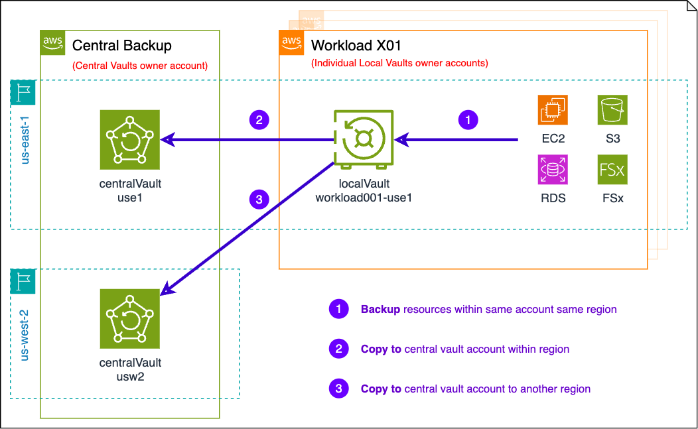

# 5-2-Backup-Management-Design

**Confluence Page:** https://healthedge.atlassian.net/wiki/spaces/CP1/pages/5127766111/5-2-Backup-Management-Design

**Created by:** Lei Shi on September 26, 2025  
**Last modified by:** Lei Shi on September 26, 2025 at 02:50 PM

---

| **AWS Recommended Cloud Approach** |
| --- |
| Most organizations initially maintain their existing backup and recovery processes and software to avoid friction in cloud adoption. However, as your adoption extends and matures, organizations select a blend of backup and recovery options from the list outlined below:  Options:   * Maintain current backup and recovery process and software for Amazon EC2 instances * A hybrid backup and restore process using the same agent-based software for EC2 and Amazon RDS snapshots * Implement the use of EBS snapshots combined with a snapshot retention policy   **S3**  As discussed in the Availability section, S3 is designed for 11-9's of durability. This durability translates to a high degree of confidence that all data written to S3 is secured. Strictly speaking, it is not necessary to configure cross-region bucket replication or perform any subsequent backups of data stored in S3. However, this level of durability does not prevent against accidental or malicious deletion or tampering. In these cases, or for any other data that is deemed extremely critical, enabling versioning, MFA Delete and cross-region bucket replication are recommended.    Lifecycle policies can also be enabled for S3 data, which will transition the data to lower-cost models with the same durability, but decreased availability. These include S3 Infrequent Access (99.0% availability SLA and accessible via the same S3 API) or Glacier (slower archival storage with restore times in minutes or hours, at significantly reduced cost).  **EBS**  EBS snapshots are incremental backups, which means that only the blocks on the device that have changed after your most recent snapshot are saved. These incremental backups minimize the time required to create the snapshot and save on storage costs by not duplicating data. When you delete a snapshot, only the data unique to that snapshot is removed. Each snapshot contains all of the information needed to restore your data  When you delete a snapshot, only the data referenced exclusively by that snapshot is removed. Even though snapshots are saved incrementally, the snapshot deletion process is designed so that you need to retain only the most recent snapshot to restore the volume. Deleting previous snapshots of a volume does not affect your ability to restore volumes from later snapshots of that volume.  Deleting a snapshot might not reduce your data storage costs. Other snapshots might reference that snapshot's data, and referenced data is always preserved.  **Databases**  Database backups should be performed periodically. Database replicas and multi-AZ RDS deployments are not sufficient to ensure recoverability from data loss or corruption. The backup schedule should coincide with the RPO/RTO per application. RDS also features ["point-in-time" database recovery](http://docs.aws.amazon.com/AmazonRDS/latest/UserGuide/USER_PIT.html) by replaying the transaction log since the most recent backup. This database recovery is possible with databases running on EC2. However, it can be challenging to manage. |

HealthEdge Backup Management Design Overview
--------------------------------------------

HealthEdge Organization was designed with AWS Control Tower governance over landing zone. AWS Control Tower streamlines backup management with built-in capabilities and direct AWS Backup integration. It automatically provisions a central backup vault in each AWS Region within a dedicated central backup account.

As organization scales, AWS Control Tower automatically creates local backup vaults in each workload account in AWS Backup-enabled organizational units (OUs) across all governed AWS Regions. Customize backup strategy by configuring backup policies to copy backups from local to central vaults, either within the same Region or cross-Region.

This Backup Management Design has completed backup infrastructure for the organization. Later thru AWS AMS service, using AWS Backup policies to implement a comprehensive backup strategy on top of these baselined backup vaults as infrastructure, with HealthEdge scoping for the backup service toward workloads, this design will be maintaining consistent governance across your AWS environment.

### Two dedicated central backup accounts

Two specialized accounts that form the backbone of HealthEdge backup infrastructure:

* **Backup administrator account (**043809027519**)**: This account manages backup policies and configurations for your entire organization.
* **Central backup account (**000122363665**)**: This account stores centralized backup vaults and cross-account backup copies.

### All vaults created via Control Tower leveraging a multi-Region AWS KMS Key for backup encryption

Backup encryption is a crucial security requirement in HealthEdge. Create a multi-Region AWS Key Management Service (AWS KMS) key in the management account to enable encryption of backup data at rest and secure cross-account backup capabilities. The key should be created in the AWS Control Tower Home Region and replicated to all governed AWS Regions. This multi-Region AWS KMS key is used to encrypt backups in the central backup account vaults, and all local vaults in the workload accounts in all Regions.

### AWS Backup Enablement in AWS Control Tower

AWS Backup should be enabled on scoped OUs.

The order of enablement is critical, so when enabling the AWS Backup baseline across your organization, follow a hierarchical approach. Start with the top-level OUs before proceeding to child OUs. In the example shown in the following diagram, we would first enable the AWS Backup baseline on the Workloads top-level OU, then proceed to child OUs such as Workloads X, Workloads Y, etc.

After backup enablement to a OU, all AWS accounts in the OU will be provisioned local vault in each region, those local vaults cross account in the same OU will receiving exact same Vault Name, which is by design to ease the Backup Policy (JSON code) design later to implement backup strategy cross the board.

### Tag scoped resources for backup

To be decided with backup service needs scope, and AMS team will implement Backup policy to fulfill the backup policy implementation.