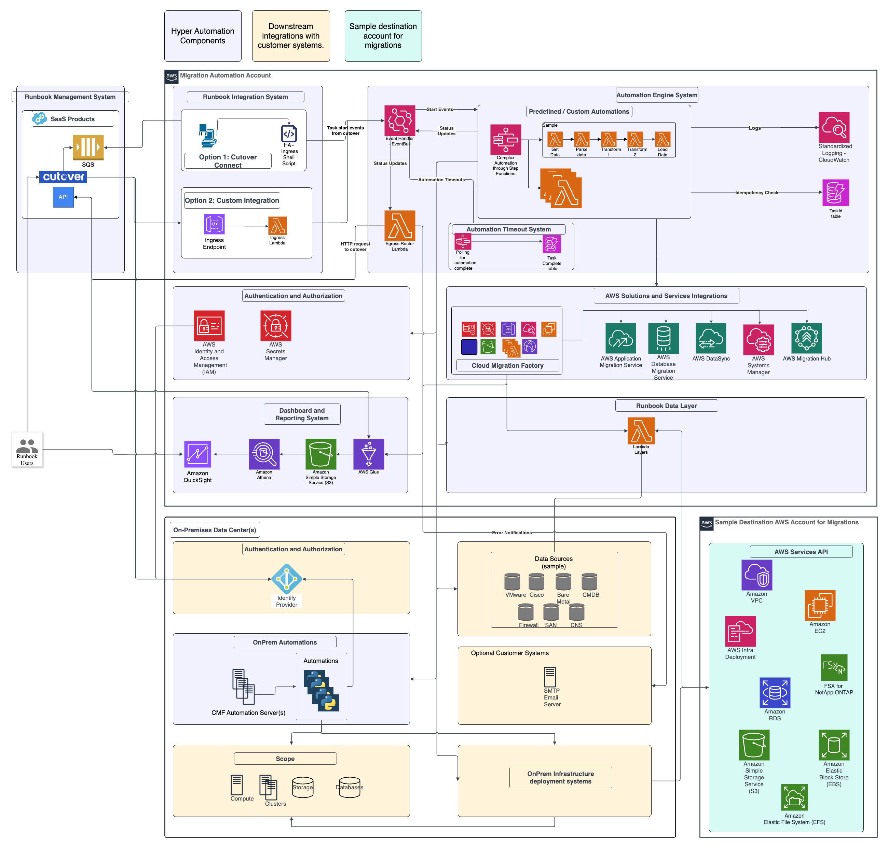

# Overview-HyperAutomation

**Confluence Page:** https://healthedge.atlassian.net/wiki/spaces/CP1/pages/4866051980/Overview-HyperAutomation

**Created by:** Chris Falk on June 16, 2025  
**Last modified by:** Chris Falk on June 16, 2025 at 02:21 AM

---

Architecture Overview
=====================

### TIP: Quick Guide

**Visit the**

to learn all steps to deploy the solution

Diagram
-------

This diagram is a reference implementation for the components deployed with this solution. A

version of this diagram is available in the attachments folder and can be used to adapt the diagram to represent your actual customer implementation.

Runbook Management System
-------------------------

This is the runbook orchestration system, for which we are currently leveraging [Cutover.com](https://www.Cutover.com).

Runbook Integration System
--------------------------

This is the component that handles requests coming in from Cutover.com and parsing them into a Hyper Automation EventBridge Event. There are 3 possible integration options with Cutover. We recommend API Gateway with an ingress Lambda function, using a Bearer Token Auth, that is also the default option that is shipped with the solution.

1. API Gateway with an ingress Lambda function. This option is the default integration mode and has no assocaited cost besides the AWS services used.
   1. This option requires an API Gateway endpoint that is able to receive requests from Cutover.com
   2. This integration option currently supports Bearer Token.
2. Cutover Connect. This option has a Cutover.com fee of 25K (check with your Cutover.com representative)
   1. This a “pull” integration rather than a push, Cutover publishes events to a single tenant SQS Queue, from which the CutoverConnect docker image pulls from then parses the event and places it on the EventBridge Bus.

Automation Engine System
------------------------

This is the core component of the Hyper Automation solution, it has a single EventBridge Bus and an Egress Lambda function. All automations have a EventBridge Rule configured for events its able to process. Egress Lambda handles updating Cutover.com tasks after an automation is complete.

Eventbridge sometimes duplicates events. To ensure this doesn’t cause automations to get invoked more than once, we build some event deduplication logic into a code helper. Simply wrap all of your automations in the provided `@automation` wrapper, and duplicated Lambda/Step Function invocations are cancelled.

In the event of an automations that hangs or exits unexpectedly, the task in Cutover will simply show as pending ad infinitum. To give tasks a max duration, populate the `maxDuration` field (measured in seconds) in Cutover.com runbook task details. Tasks will be marked as failed in Cutover.com once that amount of time has passed.

Upon any errors or timeouts, an email is sent if an email address was specified in the `notificationRecipient` of that Cutover.com task.

Runbook Data Layer
------------------

This component sits between automations and data sources, allowing for the separation of “what” data from “where” the data is stored by creating the concept of Data Client vs Data Provider. This allows consultants to change the “where” of the data without impacting the automations. It is deployed as a Lambda layer, which all automations will use to get data it needs to complete.