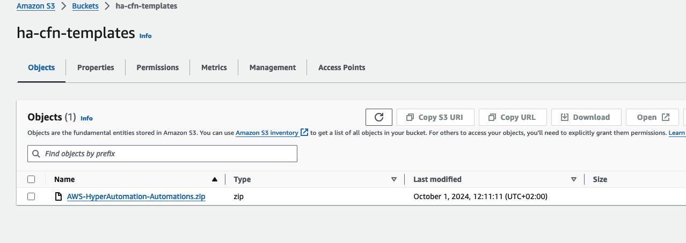
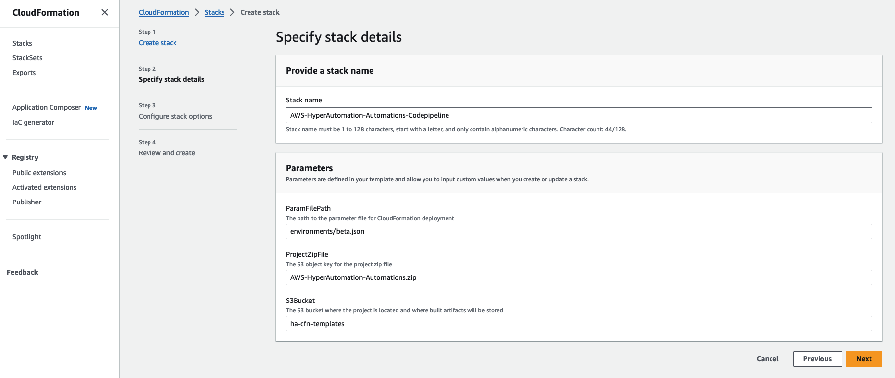
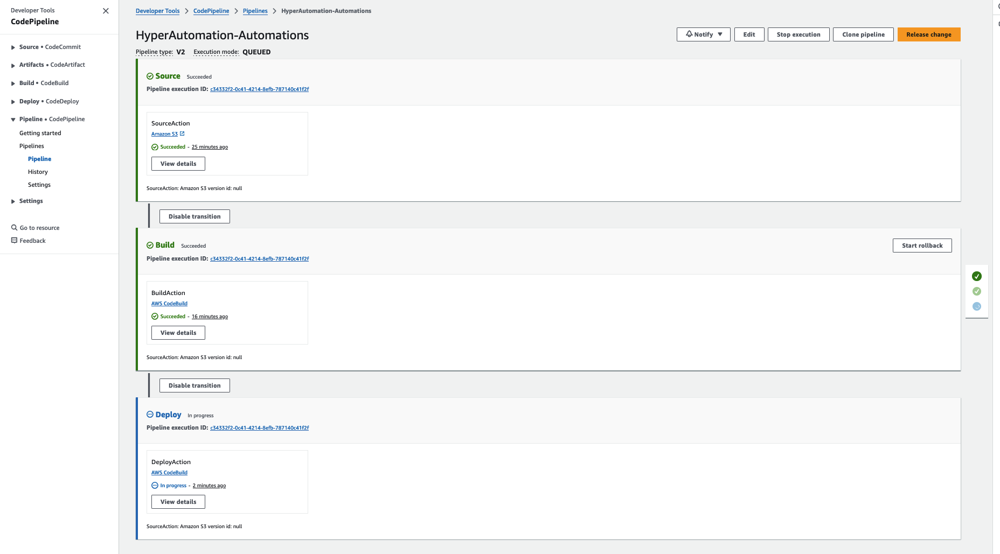
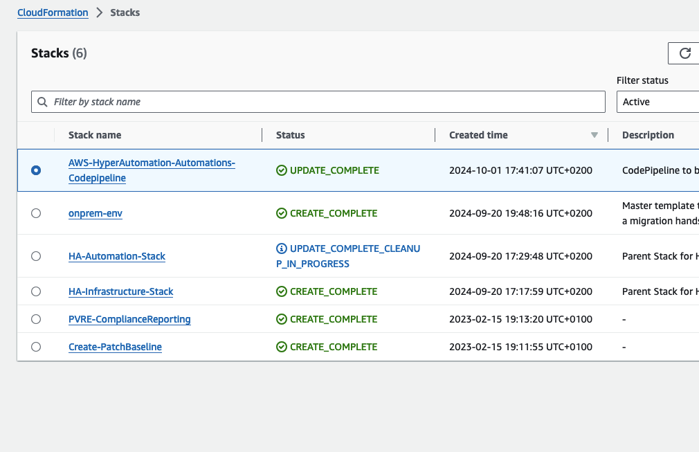

# Deployment

**Confluence Page:** https://healthedge.atlassian.net/wiki/spaces/CP1/pages/4867064188/Deployment

**Created by:** Chris Falk on June 16, 2025  
**Last modified by:** Chris Falk on June 16, 2025 at 02:18 AM

---

Deployment Instructions
-----------------------

### Summary

The solution comprises two main software packages:

* [The infrastructure package](https://code.amazon.com/packages/AWS-HyperAutomation-InfrastructureCDK) (link available to AWS Employees only) deploys all the relevant AWS Services required for the core solution to operate (see

  ).
* [The automation library package](https://code.amazon.com/packages/AWS-HyperAutomation-Automations/) (link available to AWS Employees only) contains a library of pre-built automations to be leveraged with the solution (this library can be further expanded with your own automations, see

  ). Note that, by default, this package will also deploy Cloud Migration Factory (CMF) unless otherwise specified by the user. The use of CMF is mandatory for Migration Rehost type of runbooks. A set of 'sample' CMF custom automations is included to assist with the creation of additional CMF automations that can be triggered by the Hyper Automation solution.

**Important note**: Deploying CMF via the Hyper Automation Stack won't deploy the CMF Target Account template. This template is required on each target AWS account (i.e.,each AWS account to where servers will be migrated). The CMF target account template must be deployed manually to each target account. Download the template from [this link](https://solutions-reference.s3.amazonaws.com/cloud-migration-factory-on-aws/latest/aws-cloud-migration-factory-solution-target-account.template) and proceed to deploy it on each target account.

### Pre-Requisites

**1.** You have access to a valid Cutover.com instance and workspace. See

for initial setup.

**2.** Decide on the Cutover.com integration method. See

. You will need to specify the integration method chosen when deploying the CloudFormation templates. Note that by default the API Gateway integration method is deployed.

**3.** Request that the customer provides a least privileged IAM role to AWS to deploy the solution. A baseline for the IAM policies required is available

.

### Recommended activities

* Perform security reviews with your team and customer
* Identify key customer stakeholders (including third-parties) to discuss solution deployment and AWS services required
* Tailor architecture diagram to customer specific configuration (e.g., AWS account, VPC, deployment method, cutover.com integration options, deployment pipelines, etc.) and produce an implementation design.
* Review implementation proposal with Customer and assist Customer to deploy the solution

### Deploying the Solution

**Note**: It is recommended that you build a pipeline adhering to your customer dev tools choice.

This section details how to deploy the Hyper Automation Solution directly from your computer by building, uploading, and triggering the installation of the relevant packages.

If deploying locally presents challenges—such as limitations in building the stack directly from your computer—consider using an **AWS CodePipeline** deployment. This approach leverages a CodePipeline setup to handle the build and deployment process within AWS.

For detailed steps on setting up and deploying using CodePipeline, see the **[Option 2: CloudFormation CodePipeline Deployment](#option-2-cloudformation-codepipeline-deployment)** section at the end of this document.

**Pre-requisites**

**1.** **AWS Credentials:** You'll need your AWS Access Key ID, Secret Access Key, and Session Token (optional). Set these environment variables before proceeding:

`bash
export AWS_ACCESS_KEY_ID="<ACCESS-KEY>"
export AWS_SECRET_ACCESS_KEY="<SECRET-KEY>"
export AWS_SESSION_TOKEN="<TOKEN>"`

**2.** **AWS CLI:** Ensure you have the AWS Command Line Interface (AWS CLI) installed and configured on your machine. Refer to the AWS documentation for installation instructions: <https://docs.aws.amazon.com/cli/latest/userguide/getting-started-install.html>

**3.** **Lambda Artifact Bucket and AWS Region:** Identify the name of the S3 bucket where Cloud Formation artifacts will be stored. Also, define the region for your deployment. Next, set these environment variables:

`bash
export AWS_REGION="<YOUR-REGION>"
export LAMBDA_ARTIFACT_BUCKET="<BUCKET-NAME>"`
**Note**: if you don't specify your desired region, the deployment will be formed in us-west-2 by default.

**4.** **You have NPM (typically installed with Node) and Python 3.12.x** or above installed in your computer. You can check the version of Python by running `python3 --version`. If you don't have NPM, proceed to install it, [see instructions for npm](https://docs.npmjs.com/downloading-and-installing-node-js-and-npm). For python, [install it from here](https://www.python.org/downloads/).

**Deployment Steps**

**1.** Clone both, the [infrastructure](https://code.amazon.com/packages/AWS-HyperAutomation-InfrastructureCDK) and [automations](https://code.amazon.com/packages/AWS-HyperAutomation-Automations) repositories.

**2.** Open a terminal window and navigate to the root directory of the stack you want to deploy `infrastructure` or `automation`. Both stacks are required so you will need to repeat the process for each package.

**3. Customize CloudFormation Parameters:**

The deployment process relies on CloudFormation parameters to define configuration settings for your deployment. You'll need to edit a file named `<environment_name>.json` within a folder named `environments` inside the root directory. This file provides a way to manage environment-specific configurations.

**Here's an example structure for the CloudFormation parameters file of the Infrastructure package (e.g., `.beta.json`):**

`[
{
"ParameterKey": "Environment",
"ParameterValue": "beta"
},
{
"ParameterKey": "ServiceName",
"ParameterValue": "ha-infra"
#Note that there's a 15 char limit to the service name value if you decide to change it
},
{
"ParameterKey": "CutoverUrl",
"ParameterValue": "<YourCutoverInstanceAPIURL>"
#Use the Cutover.com public API endpoint for your cutover.com instance, it should start with 'api', e.g.: https://api.aws-training.cutover.com.
#This is tyupically the same URL as your cutover.com user interface + api at the beginning.
},
{
"ParameterKey": "CutoverWorkspaceName",
"ParameterValue": "YourCutoverInstanceWorkspaceName"
}
]`
**Important**: ensure that the Cutover workspace names matches the exact name of your workspace.

The deployment script will automatically load these parameters and use them during deployment.

**Note**: The parameters file for the `Automations package` will look different. In the Automation package environment file, The most important parameter is the one that defines if you will also deploy Cloud Migration Factory with it. This value is set to `true` by default. Other parameters are optional and used to specify configurations for CMF private deployment if required.

**4. Deploy the Stack:** Use the `npm run` command with the appropriate arguments to deploy the stack:

`bash
npm run deploy:root --env=<environment_name>`
Replace `<environment_name>` with the desired deployment environment (e.g., `beta`).

* `npm run`: Executes an npm script defined in the project's `package.json` file.
* `deploy:root`: The specific script name that triggers the deployment process.
* `--env=<environment_name>`: An argument specifying the deployment environment.

**5. Repeat the deployment steps 1 to 4** for the other package (e.g., if you deployed HA Infrastructure Stack, repeat the process for HA Automations Stack)

**6. for Infrastructure package only** When using the **API Gateway Ingress API integration option**, once the Infrastructure package has been deployed, go to AWS Secrets Manager, locate the Secret named "/hyper\_automation/cutover\_ingress\_bearer\_token" and specify a secret value (the secret must be specified by the user, work with your customer to generate a secret that meets their security standards). This action should be performed by the customer. This value will also be required when configuring the API Gateway integration in Cutover.com (step 9 below).
**Important** when specifying the secret value, use the following format:
"`Bearer <Token>`"
The word `Bearer` followed by a space and the customer defined `<Token>`

**7. (Optional, for Automations package only) Configure SSM Parameters (for pre-existent CMF deployments only)**
**Important Note**: In order to leverage the Migration Rehost automations it is required to deploy Cloud Migration Factory (CMF). Hyper Automation includes an option to deploy CMF with the HA `Automations` stack. If you have an existent CMF deployment and are not deploying CMF as part of the HA automations stack, then it is necessary to manually update the SSM parameters as follows and **after deploying the HA Automations Stack**. Also, ensure that your pre-existent CMF deployment is at the latest version (minimum CMF v3.3.5). If you are deploying CMF with the HA Automations Stack then ignore this step.

* Go to AWS CloudFormation, select the main CMF stack, go to Outputs and obtain the values for: LoginAPI, ToolsAPI, and UserAPI.
* Go to AWS Secrets Manager and obtain the Secret Name for `MFServiceAccount-<region>-<id>`

To configure SSM parameters manually, go to AWS Systems Manager, Parameter Store, and set the obtained values above for:

```
/hyper\_automation/cmf/login\_api\_url

use the LoginAPI value
======================

/hyper\_automation/cmf/secrets\_name

use the LoginAPI value
======================

/hyper\_automation/cmf/tools\_api\_url

use the MFServiceAccount-- value
================================

/hyper\_automation/cmf/user\_api\_url

use the UserAPI value
=====================

```

**8. Obtain a Cutover.com API Token for CallBank Integration.** This token will be used by the HA solution to communicate with the Cutover.com public API. A Cutover.com user with Developer role is required. Work with your Customer and Cutover.com to ensure your Customer has at least one user with Developer Role. This user should login to Cutover.com, click on the user details, scroll to the bottom, and Create a New Token. The value should be placed in AWS Secrets Manager for the '/hyper\_automation/cutover\_api\_key'.

**9.**

**10.** Deployment complete.

### Accessing Automation Logs

To debug automations in development or production accounts, you'll probably need to access the logs for those automations. If you are dealing with a sensitive environment and want to access logs without breaking any critical components, simply federate into your aws account and assume the HyperAutomation-LogsReadonlyRole.

### Controlling updates to the solution

If using the pipelines solution provided and the AWS CodeCommit repository directly, please follow AWS recommendations [here](https://docs.aws.amazon.com/codecommit/latest/userguide/auth-and-access-control.html).
If using a custom deployment solution or a repository replication into CodeCommit, the current control mechanisms in place can be leveraged to control access to the source repository.

### Deploying QuickSight Dashboards

#### Pre-requisites

* Hyper Automation Solution is deployed
* Cloud Migration Factory 3.3.5 or above is deployed.
* Quicksight setup has been completed, as per [CMF Quicksight setup guide](https://docs.aws.amazon.com/solutions/latest/cloud-migration-factory-on-aws/step9.html), completing only the following steps:
* **Set the QuickSight permission and connections**
* **Set up permissions for Amazon Athena**
* API key has been generated in Cutover.com.
* Access to the AWS account where HA has been deployed.

#### Deployment Steps

##### 1. Create Cutover secret in CMF Credentials Manager

**1.** Open the CMF console
**2.** Goto **Administration** > **Credentials Manager**
**3.** Select **Add**
**4.** Select **Secret Type** of **Secret key/value**
**5.** Enter a **Secret Name**, this can be any value
**6.** Enter the URL for your Cutover.com instance into the **Key** field
**7.** Enter the API Key for your Cutover.com instance into the **Value** field.

##### 2. Upload Cutover scripts for extract to S3

**1.** Download the following scripts.

[Cutover.com Runbook Extract Script](https://code.amazon.com/packages/Aws-cloudendure-migration-factory-solution/blobs/heads/feature/quicksight_cutover/--/source/integrations/migration-tracker/GlueScript/Migration_Tracker_Cutover_Runbook_Extract_Script.py)

[Cutover.com Runbook Tasks Extract Script](https://code.amazon.com/packages/Aws-cloudendure-migration-factory-solution/blobs/heads/feature/quicksight_cutover/--/source/integrations/migration-tracker/GlueScript/Migration_Tracker_Cutover_Runbook_Tasks_Extract_Script.py)

**2.** Upload these scripts to the S3 bucket named {*application*}**-**{*environment*}**-**{*AWS account Id*}**-migration-tracker** in the folder called **GlueScript**. This bucket resides in the HA Deployment AWS Account.

##### 3. Deploy CMF Cutover migration tracker update CFT/stack.

This adds the Glue Jobs and tables to extract and transform data from Cutover.com

**1.** Download the [CMF Cutover CloudFormation template](https://code.amazon.com/packages/Aws-cloudendure-migration-factory-solution/blobs/heads/feature/quicksight_cutover/--/deployment/CFN-templates/aws-cloud-migration-factory-solution-tracker-cutover.template)

**2.** Deploy the template into the same account that HA is deployed, providing the parameters outlined below.

| Parameter | Description |
|----------------------|-----------------------------------------------------------------------|
| **Application** | {cmf main stack Application} |
| **Environment** | {cmf main stack Environment} |
| **CutoverSecretArn** | arn:aws:secretsmanager:{region}:{AWS Account Id}:secret:{Secret name} |

##### 4. Run Saved query to create Cutover view in Athena

**1.** Open the Athena console in the HA AWS Account
**2.** Goto **Query Editor** in the Athena console
**3.** Ensure that the **Data source** selected is **AWSDatacatalog**, and **Database** is {*application*}**-**{*environment*}**-tracker**
**4.** Select **Saved queries**
**5.** Select the saved query with the name {*application*}**\_**{*environment*}**\_tracker\_runbook\_view\_query**, replacing *application* and *environment* with your instance values.
**6.** Select **Run** on the query editor screen. The query should result in a successful message.

##### 5. Deploy CMF QuickSight dashboards CFT/Stack

**1.** Download the [CMF QuickSight dashboards CloudFormation template](https://code.amazon.com/packages/Aws-cloudendure-migration-factory-solution/blobs/heads/feature/quicksight_cutover/--/deployment/CFN-templates/aws-cloud-migration-factory-solution-tracker-qs-dasboard.template)

**2.** Deploy the template into the same account that HA is deployed, providing the parameters outlined below.

| Parameter | Description |
|-----------------|------------------------------------------------------------------------------------------------------------------------------------------|
| **Application** | {cmf main stack Application} |
| **Environment** | {cmf main stack Environment} |
| **LogoURL** | https://d0.awsstatic.com/logos/powered-by-aws.png |
| ProgramSiteURL | Enter the URL to provide more details on the program |
| QuickSightAdmin | Enter the administrator of the QuickSight instance, this can be found by opening QuickSight and clicking on the profile in the top right |
| SupportEmail | Email address for viewers to contact for updates and assistance with the program and dashboard |

### Appendix

#### Option 2: CloudFormation CodePipeline Deployment

If local deployment is challenging (for example, if you’re unable to build the stack from your local computer), you can use AWS CodePipeline to build and deploy the CloudFormation stacks.

**Instructions:**

1. Follow Steps 1 to 3 in the **[Deployment Steps](#deployment-steps-ha)** section to prepare the stack folders. Skip the pre-requisites and Step 4.
2. **Download Pipeline Templates:**

   * Get the following CodePipeline templates:
3. **Zip the Stack Folders:**

   * Compress the `infrastructure` and `automation` stack folders. Ensure each zip file has the stack content at the root level.
4. **Upload the Zipped Files to S3:**

   * Upload both zips to a versioned S3 bucket.



1. **Deploy the CodePipeline Templates:**
   * Use the CodePipeline CloudFormation templates, filling in these parameters:
     + **S3Bucket**: Name of the S3 bucket with the zipped files.
     + **ProjectZipFile**: S3 object key for each zip file.
     + **ParamFilePath**: Path to the environment file, e.g., `environments/beta.json`.







Once the CodePipeline deployment completes, continue with any remaining steps in your setup.