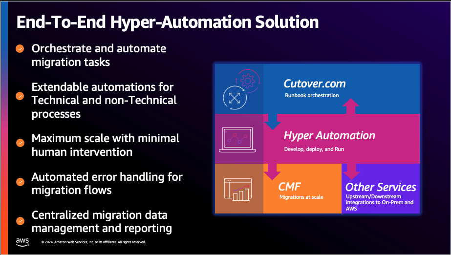

# AWS Hyper Automation

**Confluence Page:** https://healthedge.atlassian.net/wiki/spaces/CP1/pages/4866051837/AWS%20Hyper%20Automation

**Created by:** Chris Falk on June 16, 2025  
**Last modified by:** Chris Falk on June 16, 2025 at 02:21 AM

---

Introduction to Hyper Automation
--------------------------------

### TIP: Quick Guide

**Visit the**

to learn all steps to deploy the solution

### Summary

**Hyper Automation** is a packaged software solution developed by AWS Professional Services. It provides capabilities for end-to-end runbook/process automation and orchestration where flexibility and customization are the key. Every engagement is different and every process has to be adapted, the goal of the solution is to help accelerate engagement timelines, reduce risk and cost, and provide additional compliance by enabling users to customize processes and automations. The solution is intended to be deployed in Customer AWS accounts under AWS Professional Services engagements. Currently, the solution is not publicly accessible to AWS Customers and/or Partners without AWS Professional Services involvement.

The solution is comprised of two main software packages:

* **The infrastructure package** deploys all the relevant AWS Services required for the core solution to operate (see architecture).
* **The automation library package** contains a library of pre-built automations to be leveraged with the solution (this library can be further expanded with your own automations, see user guide). For example, the library contains automations to extract, transform, and load data, automations to perform migration activities by calling downstream systems such as Cloud Migration Factory and MGN, etc.

The pre-built automations and runbook templates are currently focused on Migration scenarios, automating migrations processes for Rehost and Replatform use cases. However, it can be leveraged to automate any process for any relevant use case, including Modernization, by defining new runbooks and expanding its library of automations.

### Main Features

* CloudFormation templates to deploy the solution infrastructure and automation library, including optional pipelines.
* Out of the box integration with Cutover.com, the hyper automation solution enables the automation of the runbooks and leverages the orchestration capabilities of Cutover.com
* Out of the box. integration with Cloud Migration Factory (CMF). The solution contains a set of pre-built automations that interact with CMF APIs to further automate and orchestrate the CMF capabilities, minimizing the ned for CMF UI operations.
* Automation Engine. Support for starting and monitoring automations, including error handling (e.g., failures, time-outs, retries), e-mail notifications, and Cutover.com runbook updates.
* Extendable Automation Library. Templates are provided to create new automations. An optional pre-built pipeline including code vulnerability scanning.
* Centralized logging of automation staus.
* Dashboard and Reporting. The solution includes an optional component that centralized information from Cutover.com, CMF, and others.
* Error handling. Support for failed automations and notifications.
* Data management. Pre-built data clients in the form of Lambda layers that are used by existing and new automations.