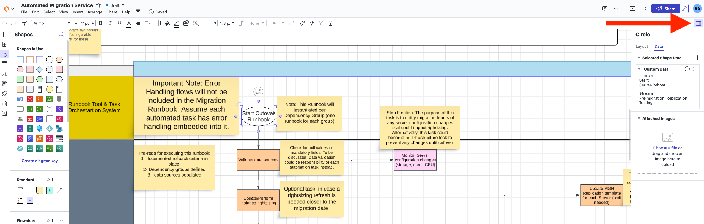
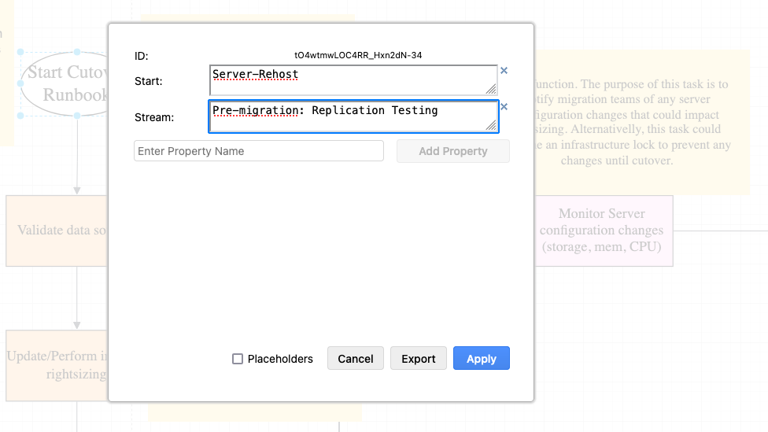

# How-To-Create-Runbook-templates

**Confluence Page:** https://healthedge.atlassian.net/wiki/spaces/CP1/pages/4867064260/How-To-Create-Runbook-templates

**Created by:** Chris Falk on June 16, 2025  
**Last modified by:** Chris Falk on June 16, 2025 at 02:19 AM

---

How to Create Templates
-----------------------

### How to convert existing flowchart templates into Cutover.com runbook templates

**Pre-Requisites for conversion**

**1.** The Hyper Automation solution has been deployed (see

and the).
**2.** Ensure you have configured thebetween Cutover.com and Hyper Automation
**3.** Ensure you have configured the Cutover.com API and populated the `CutoverSecret` value in Secrets Manager before attempting the conversion (see [Configuring Cutover.com Integration](../User-Guide/Configuring-Cutover-com-Integration.md#call-back-integration))
**4.** Ensure Cutover.com has been

In order to convert existing flowchart templates to Cutover.com templates, follow the steps below.

**1.** Ensure your LucidChart flowchart or DrawIO diagram has a `Version` data property set on the `Start Runbook` object.
**2.** If your flowchart/diagram already has a `Version` property, increment the value. The publishing automation will not overwrite a runbook template in Cutover.com which has the same version number.
**3.** Export the flowchart to CSV (if using LucidChart) or save your diagram in drawio format (if using DrawIO). Make sure your template follows the formatting rules specified in the next section.
**4.** Upload the exported CSV file or DrawIO file to the Hyper Automation solution S3 bucket for runbook templates (named as `${ServiceName}-${AWS::AccountId}-${Environment}-templates`). This action will trigger an automation that will peform the automated conversion and import to Cutover.com.

Once converted, the runbooks will appear in the templates section of your Cutover.com instance. The conversion automation supports updating these templates. If new versions of the template are uploaded the automation will verify differences and update the templates accordingly.

### How to Create or modify runbook templates

Whilst you can define your own runbook templates directly in Cutover.com or in a CSV file, or even use templates already provided by Cutover.com, we recommend creating runbook templates in a flow chart tool. Doing so will facilitate runbook and process reviews. This delivery kits contains

.

The Hyper Automation Solution supports automated flowchart conversion to Cutover.com templates from tools like LucidChart and DrawIO. The templates provided with this Delivery Kit are in DrawIO format. These templates are great start for common activities such as Discovery, Planning, Wave Design, and Rehost Migrations, with more templates being added in the future. You can update these templates and also create brand new runbooks from scratch by following the guidelines below.

| Shape | Name | Use When... |
| --- | --- | --- |
| Hexagon | Milestone | Looking to define a milestone in the workflow |
| Diamond | Decision | Needing to specify a branch to choose different possible paths based on input |
| Circle | Branch Header or Start | Indicating the start of a flow and when indicating the start of a branch |
| Block or Process | Child Runbook | Indicating a child runbook to be inserted at a point in the main runbook flow. In LucidChart, use a 'block', in Draw.io, use a 'process' figure. |
| Pink Rectangle | Custom Automation | Indicating a task that is a candidate to be automated (new development) |
| Green Rectangle | Automation Exists | Indicating that the automation exists already as part of the automation library of Hyper Automation |
| Blue Rectangle | Manual Task | Indicating that the task at hand is manual |

Data Attributes
---------------

In order to convert flow diagrams to a runbook definition, users have to make use of data attributes on LucidChart or on DrawIO depending which tool they are using. Data attributes are used to provide additional metadata to each shape in the runbook. For example, the metadata is used to specify the beginning of a flow and to specify the task automation ID for those tasks that are automated which is then transferred automatically to the runbook management system (e.g., cutover.com). This step is key to constructing automated runbooks.

Data attributes are key-value pairs that users can add to each shape in a workflow diagram.

Adding data attributes in LucidChart
------------------------------------

In Lucid, users need to click the icon marked by the red arrow in the diagram below, then select the “Data” tab.
From there you can add, edit or delete data attributes on shapes.

Adding data attributes in DrawIO
--------------------------------

In DrawIO, you need to right click the shape, then click on “Edit Data...” button.
From there you can add, edit or delete data attributes on shapes.
To add a key-value pair, first you need to add the key to the “property” field then click on “Add property”. Then you would be able to set a value to that key.

| Attribute Key | Attribute Value | Mandatory | Recommended Shape | Use When... |
| --- | --- | --- | --- | --- |
| Start | Runbook Template ID* Example ID: Server-Rehost | Yes | Circle | Used as a marker of where the runbook starts. The key name 'Start' is mandatory to denote the start of the flow. The expected value is the runbook template ID defined by the user and is also mandatory. This value is later embedded in the runbook template's JSON definition alongside its version. |
| Version | Runbook Template Version | No | Circle | If used, the value is combined with the runbook template ID. |
| AutomationID | Automation ID for an automated task in the Hyper Automation library* Example: MIG-CMF-001 | Yes | Rectangle | Indicates that this particular task is automated and which automation should be fired. During runbook execution, the automation ID is used to signal to the automation engine that a particular task has been invoked. |
| TaskType | Used to mark special task types. Options are:   * Milestone * Branch * BranchHeader * RunbookTemplate | No | Hexagon (Milestone), Circle (Branch, Branch-Header), Process/Block (Runbook Template) | Task types are used to distinguish between different sections in the runbook. |
| TemplateID | Runbook Template ID for a child runbook. Examples:   * Server-Rehost-Pre-Migration | Yes (only when using Child Runbooks) | Process/Block (Child Runbook) | Indicates the template ID of a child runbook. Template IDs have to match an existing runbook template ID |
| TemplateVersion | Runbook Template Version for a child runbook. Examples:   * Server-Rehost-Pre-Migration | Yes (only when using child runbooks) | Process/Block (child runbook) | Indicates the template version of a child runbook. The version must match an existing runbook template version. |

Best practices for creating runbooks in flow chart tools
--------------------------------------------------------

* Always update data attributes: It is very common to copy-paste blocks around when extending the runbook flow diagram. Always make sure you update the data attributes of the shape you copy-paste.
* Give your runbook templates clear names: When naming a parent runbook or a phase runbook, make sure to provide a clear name. Names should only contain alphanumeric characters, dashes and underscores. Template names should not contain version numbers, as versions are managed separately from runbook names.