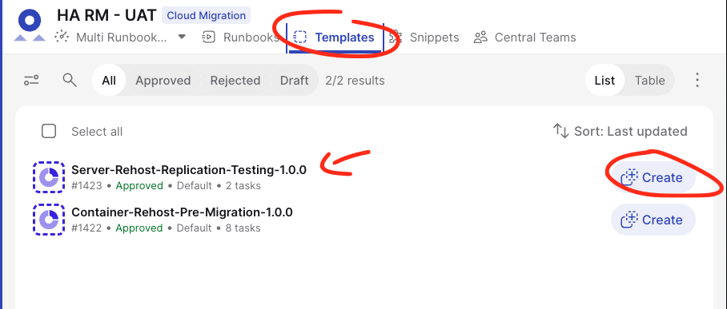
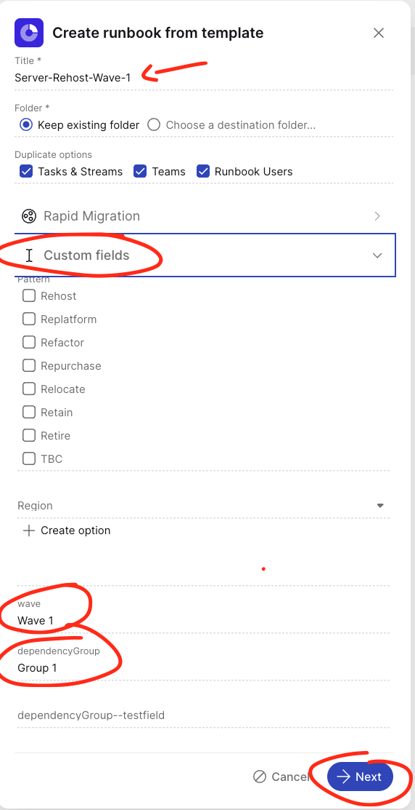
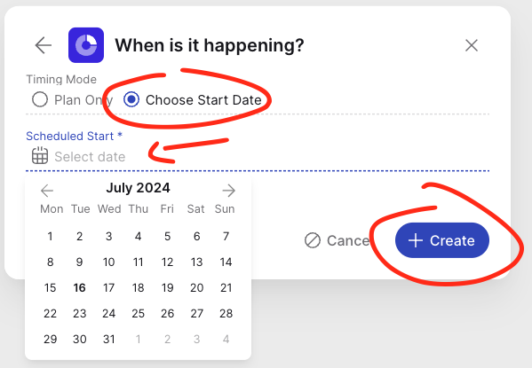

# Instantiating-Runbooks

**Confluence Page:** https://healthedge.atlassian.net/wiki/spaces/CP1/pages/4866999518/Instantiating-Runbooks

**Created by:** Chris Falk on June 16, 2025  
**Last modified by:** Chris Falk on June 16, 2025 at 02:19 AM

---

Instantiating Runbooks in Cutover.com
-------------------------------------

To understand how to create templates refer to

and also tofor a list of runbooks that are available with this kit.

**Note**: by default, the expected behaviour is that runbooks will perform actions against dependency groups within a wave. Therefore, if you have 10 dependency groups in one wave the expectation is that you will create 10 runbooks. You can change this to create more granular (e.g., per application) or more hihg-level (e.g., per wave) runbooks (see Tips in step 3 below).

Follow these steps to instantiate runbooks in Cutover.com:

Pre-requisites for Executing Runbooks
-------------------------------------

**1.** In order to successfuly execute runbooks against the scope you must define a custom attribute in Cloud Migration Factory. This is a one time activity. Follow [these guidelines](https://docs.aws.amazon.com/solutions/latest/cloud-migration-factory-on-aws/schema-management.html) to create a new CMF attribute in the **Application** schema, as follows:

Display name: Dependency Group
Programmatic name: dependency\_group\_name
Type: String

**2.** The automations that come with the solution will leverage the CMF metadata store to obtain data about the scope (e.g., the list of servers in a given wave) (See

). Make sure that your Runbook includes a task at the beginning (ideally the first task) triggering the "Import data to CMF" automation (Automation ID: MIG-CMF-EXCEL-IMPORT). See [Using, Creating, and Deploying Automations](./Using-And-Deploying-Automations.md#using-existing-automations). This automation will populate CMF from thepre-populated by the user. This intake form must be placed in the "...cmf-excel-import-artifacts" S3 bucket. Alternativelly, the user can populate CMF manually via the CMF Web UI where this intake form can also be imported.

Steps for instantiating a Runbook
---------------------------------

**1.** Go to your Cutover.com workspace and select the Templates tab. Select the Runbook template you want to instantiate and click Create.

**2.** Provide a value for Custom Fields during runbook instantiation. In particular, **wave** and **dependencyGroup** fields are required to be populated. These fields' data will be passed to the hyper autoamtion solution as a payload and are key to specify the scope of the runbook and the automations.

**3.** Select the timing mode. Typically you would define a scheduled wave start date as shown below

**Tip 1**: If you want to create a runbook to apply to 1 application only (i.e., you are defining per-application runbooks) assign a unique Dependency Group name to your application in the

in the Applications sheet. Note that if you assign the same dependency group name to other applications the runbook will perform its actions against all applications in that dependency group.

**Tip 2**: If you want to create a runbook to perform actions against the entire wave scope at the same time (i.e., all apps and servers in that wave), assign a Dependency Group name to all applications in that wave in the

in the Applications sheet.