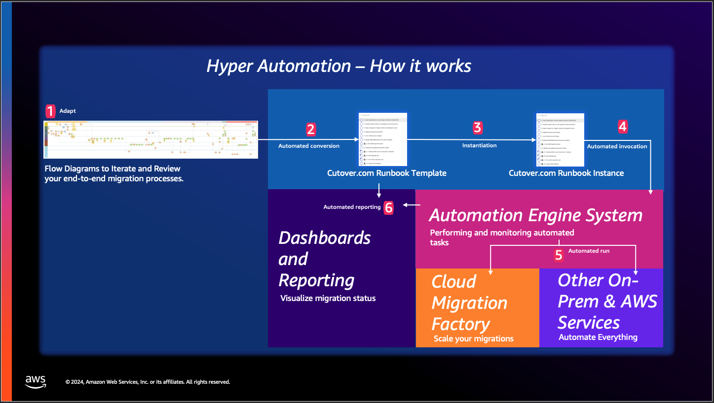

# Introduction

**Confluence Page:** https://healthedge.atlassian.net/wiki/spaces/CP1/pages/4867096997/Introduction

**Created by:** Chris Falk on June 16, 2025  
**Last modified by:** Chris Falk on June 16, 2025 at 02:18 AM

---

Introduction
------------

### TIP: Quick Guide

**Visit the**

to learn all steps to deploy the solution

The solution closes the gap between runbooks (currently we leverage a third-party product [Cutover.com](https://Cutover.com) to store these runbooks) and AWS Migration Services and Solutions.

**(1)** Hyper Automation supports automatically converting a process/runbook/pattern defined in a flowchart tool, such as LucidChart and DrawIO, into an executable runbook in Cutover.com.

**(2)** This is done by uploading the flowchart file (following formatting recommendations as per delivery kit) into an S3 bucket deployed by the solution. This action will trigger an automation to covert the flow into a Cutover.com runbook template.

**(3)** These templates are available to be instantiated for a portion of the scope (e.g., one or more migration waves).

**(4)** Next, for a given runbook in Cutover.com, the tasks that are automated will invoke an automation from the hyper automation - automation engine system.

**(5)** The solution includes a set of pre-built automations for automatically triggering CMF tasks and other typical migration activities, and it supports the addition of any number of custom automations built by the user. These automations leverage common functionality provided by the automation engine, such as data layers and error handling. Cutover.com fires automated tasks in a runbook passing a payload with scope information (e.g., a migration wave name) and an automation task ID (i.e., an actual automation in the library) to the Hyper Automation Solution endpoint. Next, the solution invokes the relevant automation whilst it logs and monitors its execution, and then closes/updates the task in Cutover.com with a success or failed result. In the event of an error, the solution supports integration with an external (i.e., customer managed) SMTP service for proactive notifications, otherwise the task is closed automatically and the next task in sequence is fired. For example, if a runbook defined in Cutover.com has 10 tasks and all these tasks are linked to an automation in the automation library, then the execution of this runbook will be completely automated from end to end. If a manual task is part of the runbook, then it will be assigned and actioned by an individual to then continue the automated execution upon manual task closure.

Currently, the solution supports Lambda Layers for Data requirements from the automations in the automation library. By default, the solution comes with two layers or data clients, an Excel template for a migration wave plan, and the Cloud Migration Factory metadataDB. This means that both the out-of-the-box automations and any custom automation created by the users can leverage these sources. Users can create additional layers and data clients, as needed.

Users can deploy new automations that have been built as part of a given engagement through the Automation Library pipeline. Once deployed, any custom automation can be leveraged by the created runbooks. These custom automations can be either automations hosted in the hyper automation system itself or custom Cloud Migration Factory automations that can be deployed through this pipeline for a centralized experience.

**(6)** In addition, the solution comes with an optional Dashboard component that can be deployed by flagging the initial deployment in Cloud Formation. This Dashboard leverages the Cutover.com API to obtain data about runbook execution and provide summary dashboards and reports.