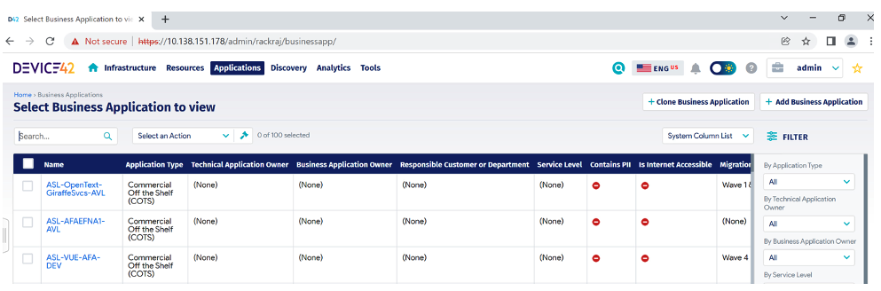
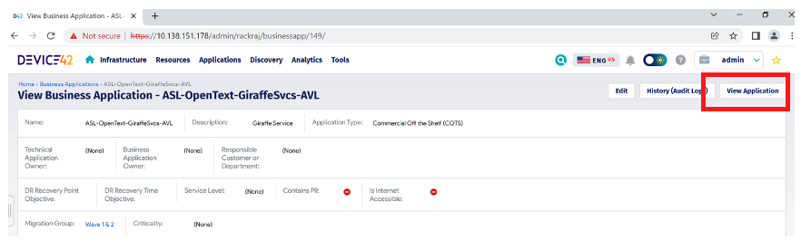
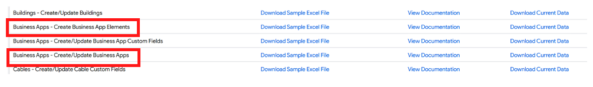
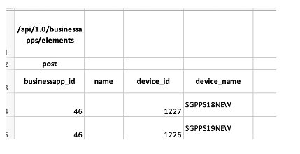
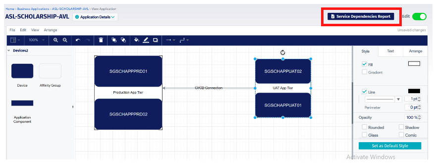

# Building-Applications-and-Dependency-Mapping

**Confluence Page:** https://healthedge.atlassian.net/wiki/spaces/CP1/pages/4867098845/Building-Applications-and-Dependency-Mapping

**Created by:** Chris Falk on June 16, 2025  
**Last modified by:** Chris Falk on June 16, 2025 at 02:52 AM

---

Building Business Applications is the ultimate goal of a cloud migration discovery project as migration wave planning and execution is by Business Application. We migrate Business Applications to the AWS cloud and not individual servers so this activity must be planned from the start of your project.

**Important:** You should not assume a discovery tool such as Device42 is a silver bullet that can automatically map your infrastructure into discrete Business Applications.

Device42 is able to fingerprint common application components and all service level dependencies which was covered in the enabling ADM section of the [Running Discovery Jobs (including best practices)](#). However, Enterprise Business Application stacks are normally a mixture of custom and COTs applications that aren’t always using common fingerprinted application components. Another challenge is the application stacks typically comprise of 3-tiers (App, Web, DB), with tier components such as databases shared by multiple Business Applications. This can create a lot of noise when viewing the service dependency data in Device42. The view becomes even noisier with the infrastructure service traffic such as monitoring tools, asset management tools and system management tools.

To help reduce the noise Device42 has a feature called Affinity Groups. Affinity Groups are a result of a process that evaluates all the connections for a given device and constructs a more consumable view of its inter-dependencies. Through a process of Pinning, Starring, and Hiding Services, noise is limited to just meaningful connections to better understand the impact or dependency of a particular device.  Please see the Device42 [documentation](https://docs.device42.com/apps/affinity-groups/) to further understand this process.

Essentially Device42 is pinning the application components it’s able to fingerprint and then treating the devices running those components as the core dependencies of your infrastructure. The tool then calculates affinities around the core dependencies (devices) based on client communication to a particular service listening on a TCP or UDP port and server process. The result is a visualized grouping of communication patterns but the problem arises when tier components such as databases are shared by multiple Business Applications as mentioned above. Currently the affinity group features has limited use when building Business Applications due to the application component/server sharing that is common is most enterprises.

The following approach is a combination of people and tools which has worked on multiple discovery projects:

1. At the start of your discovery project, prepare a questionnaire for applications teams to provide non-discoverable data about their Business Applications. The type of questions you will ask is Application Business Criticality, Application Roadmap, RTO/RPO Requirements, Regulatory Requirements and also include questions for application, web and database servers.
2. After the application questionnaires have been completed you will have the application names/IDs for all in scope Business Applications. Using the imports/exports (xls) from the Tools menu, you will create the Business Applications in Device42. Download the current data to get the API formatted template and then populate the excel with your Business Application information. If you need additional fields then you can extend the data model for Business Applications by using the custom fields that was covered earlier in this document. Once your Business Application and Custom Fields import files are ready then upload them to Device42.
3. You can go to Business Applications from the Applications menu where you should see the Business Applications you just uploaded.



1. The next step is to map the newly created Business Applications to discovered devices using the data that was collected via the questionnaire process. You can do this in the UI by clicking on a Business Application and then clicking on View Application on the top right of the page. This will take you to an editor that allows you search and add devices or affinity groups. However, as mentioned previously the affinity group feature has limited use currently and adding devices one by one takes too long.



1. The quickest method is to use the imports/exports (xls) from the Tools menu and scroll down until you see 1. “Business Apps – Create Business App Elements” and 2. “Business Apps – Create/Update Business Apps”. Download the current data for both type of import and start by opening import #2. The current data will consist of Business Applications created in step 2 but you will now have the ID number for each Business Application.



```
Next open import #1 so you can create the Application to Device mapping using the Business Application ID, Device ID and Device Name as shown below.
```



```
**Tip:** You can get the Device ID by going to Tools – &gt; Saved DOQL Queries -&gt; “D42\_All\_Infrastructure” query -&gt; Clone DOQL Query -&gt; Add a line of DOQL in the cloned query which you can then save. Clink the Query URL on the cloned DOQL to generate the report which will now include the Device ID for each Device Name.
```

1. Using the imports/exports (xls) from the Tools menu upload your Business Application to Device Mapping using the import file “Business Apps – Create Business App Elements” that you just created.
2. Now you can go back to view one of your Applications in the UI as per step 4 and you should see the mapped devices when you open the editor. You can use the editor to group devices together such as Production or UAT Servers and add/annotate connectivity similar to Visio or Drawio.



1. Up until this point you have created Business Applications and Business Applications to Discovered Device mappings using manually collected data from Application Teams. The next step is to share the discovered dependency data with the Application Teams so they can check their application landscapes for completeness and accuracy. You can generate the Service Dependencies Report from the View Application page but this will only generate data for the Device Listeners mapped to that application. The recommended approach is to run the following DOQL query which will generate a report for all discovered service dependencies with contextual Business Application information. This will allow Application Owners to filter on their Business Application from either the listener or client side to see if there’s any important dependencies missing from their Business Application landscapes.

3 and coalesce(sic.topology\_status\_id,1) <> 3]]>

**Attachments:**

[image-20230508-172205.png](../../../attachments/image-20230508-172205.png)

[image-20230508-172218.png](../../../attachments/image-20230508-172218.png)

[image-20230508-172227.png](../../../attachments/image-20230508-172227.png)

[image-20230508-172236.png](../../../attachments/image-20230508-172236.png)

[image-20230508-172243.png](../../../attachments/image-20230508-172243.png)

[image-20230508-172254.png](../../../attachments/image-20230508-172254.png)