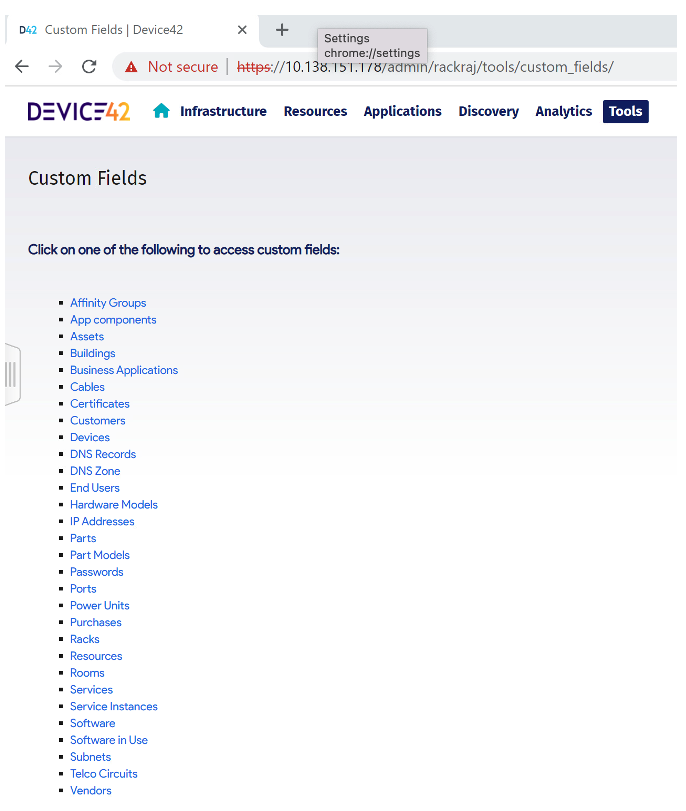
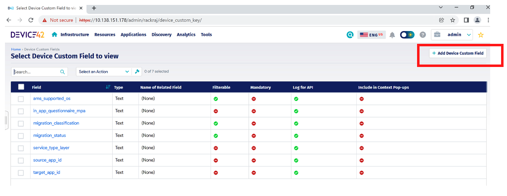
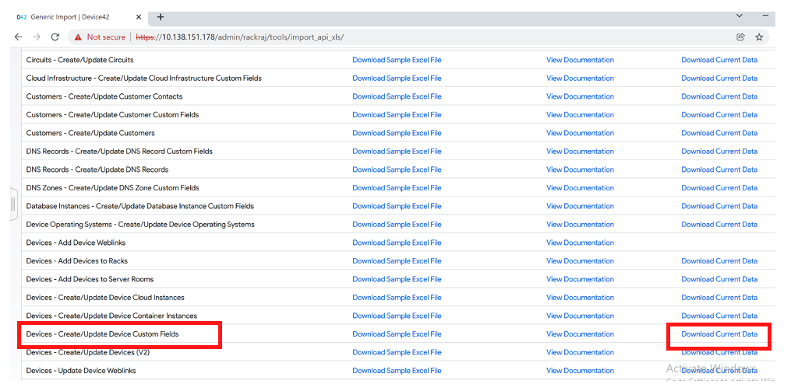
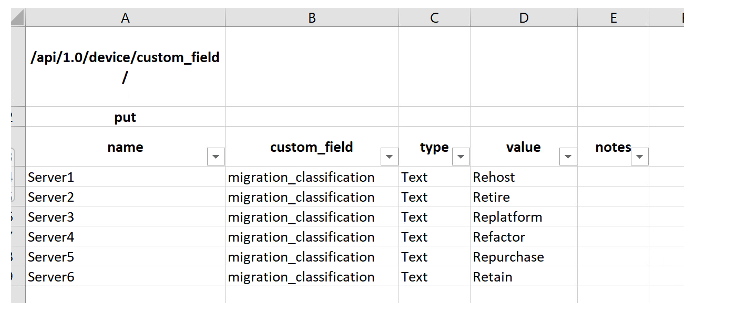
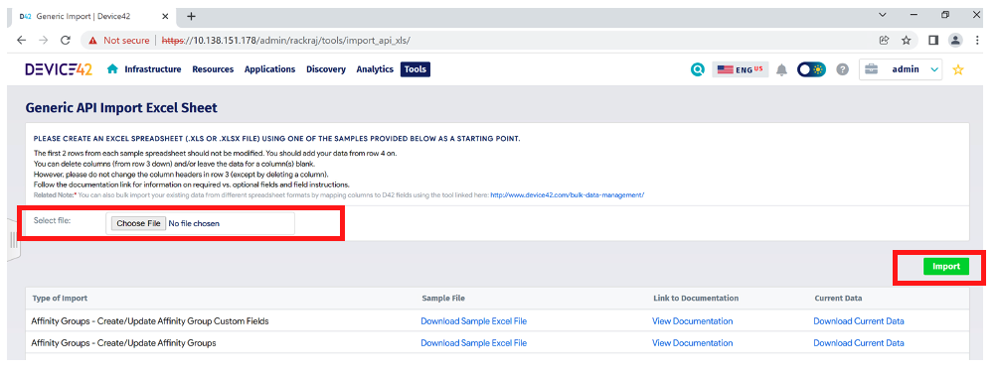

# Enriching-the-collected-data

**Confluence Page:** https://healthedge.atlassian.net/wiki/spaces/CP1/pages/4867066081/Enriching-the-collected-data

**Created by:** Chris Falk on June 16, 2025  
**Last modified by:** Chris Falk on June 16, 2025 at 02:52 AM

---

This is a useful feature as it allows you to extend the data model with your own attributes for most of the record types in Device42. You would normally use this feature once you’ve discovered all your devices and you need to capture additional information that is relevant to your migration project. For example, you might want to record the migration strategy at a device level, at the business application level or both.  You can see which record types allow custom fields by going to Custom Fields from the Tools menu.

When you select Devices you will be presented with the following screen showing the current custom fields along with settings that you chose when you created the custom field. To add a new custom field click “Add Device Custom field” button in the top right of the page.

Once the custom field has been created, you are ready to upload the values for the new field. Select imports/exports (xls) from the Tools menu and scroll down until you see “Devices – Create/Update Device Custom Fields”. Click Download Current Data to get the API ready format for your upload.

Assuming you created a new custom field called *migration\_classification* then the downloaded file will list all discovered devices mapped to the new field with no values. Update the file with the relevant values for each discovered device being careful not to alter the API formatting (rows 1-3) and save the file.

Go back to imports/exports (xls) from the Tools menu and select Choose File at the top of the page to import your saved file. Click the import button and the file will be processed by the Device42 API and the results will be displayed on screen once the import completes.

If the import was successful, you will see the values for your device custom field in the Device record “Other” Tab under Custom fields. You will now be able to include this field when searching for devices and building reports.

**Attachments:**

[image-20230508-171843.png](../../../attachments/image-20230508-171843.png)

[image-20230508-171900.png](../../../attachments/image-20230508-171900.png)

[image-20230508-171925.png](../../../attachments/image-20230508-171925.png)

[image-20230508-171938.png](../../../attachments/image-20230508-171938.png)

[image-20230508-171952.png](../../../attachments/image-20230508-171952.png)

[image-20230508-172007.png](../../../attachments/image-20230508-172007.png)