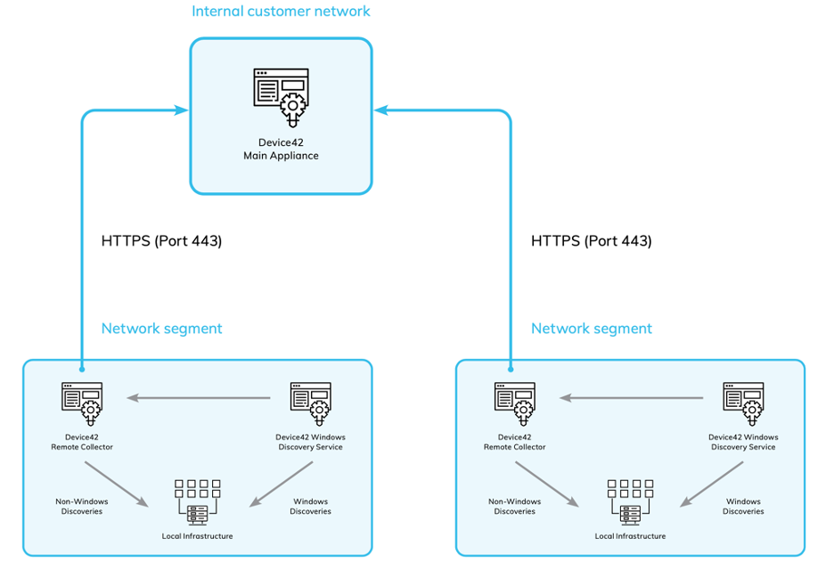
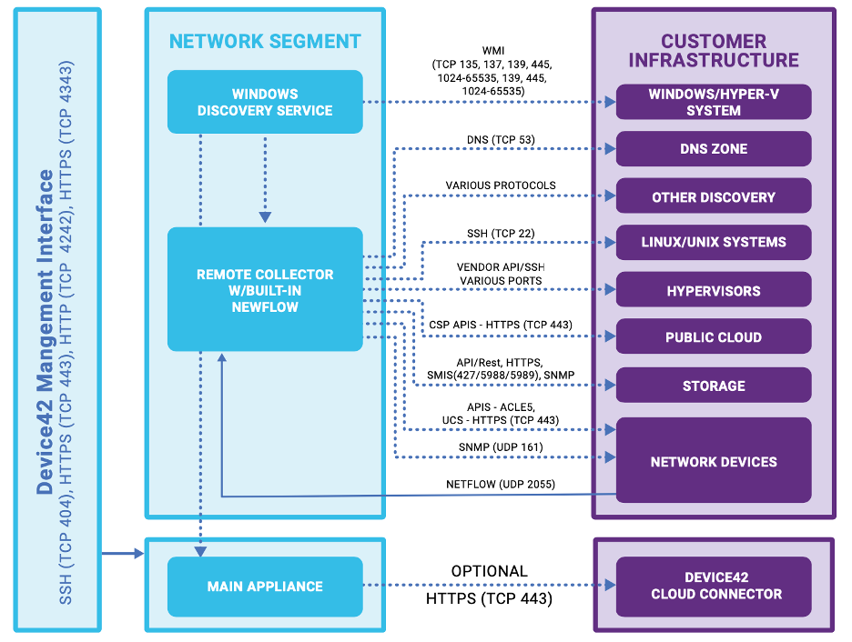

# How-to-get-starte

**Confluence Page:** https://healthedge.atlassian.net/wiki/spaces/CP1/pages/4867098790/How-to-get-starte

**Created by:** Chris Falk on June 16, 2025  
**Last modified by:** Chris Falk on June 16, 2025 at 02:52 AM

---

Before you can start using Device42 to discover your environment you have to address the pre-requisites in the following order. Steps 1-3 can be parallelized to save time.

**1 - Decide on your deployment architecture** – The 3 core components of the Device42 solution are the Main Appliance (MA), the Remote Collector (RC) and the Windows Discovery Service (WDS). The MA can run discovery jobs but it’s good practice to offload all the discovery jobs to the RC(s) so the MA resources can be reserved for job orchestration, reporting and administrative tasks. This means the MA will only need access to the RC(s) and optionally the Device42 Cloud Connector. This means the MA can reside in a different network segment to the RC and you would only need to open port 443 between the MA and RC(s). The WDS is only required for discovering Windows target devices and the WDS is always paired with an RC for Windows job orchestration. The RC and WDS pairs should reside in the same segment.

For cloud migration projects, you will want to run Application Dependency Mapping (ADM) and Resource Utilization (RU) jobs in addition to the main OS discovery jobs, so it’s recommended to deploy 1 RC/WDS pair per 500 target devices. In their documentation, Device42 recommends 1 RC per 1000 target devices but this configuration can overload the data processing between the RC and MA when collecting high frequency ADM/RU data. It will depend on how frequently you run the ADM/RU jobs which is configurable within the OS discovery jobs, but the general rule of thumb is higher frequency the better. You can deploy an unlimited number of RCs across your environment so there’s no trade off by reducing the *RC:Target Device* ratio.

*Example Deployment with Multiple Network Segments. The MA would typically reside in the core/management network alongside your monitoring and system management tools.*

**2 - IP Subnets of Interest –** The next step is to decide which IP subnets should be in scope for the discovery project. First consider the project scope, e.g. a migration driven by a DC Centre exit will require the broadest scan as you will need to identify all types of devices in the DC. Whereas migrating applications off a private cloud will require a narrower scan to discover only the relevant app, web and database servers. When you are clear on the scope use your IPAM or Knowledge Management tool to help your identify the subnets where you expect to find the in-scope devices. Make sure the RC/WDS placement in your deployment architecture can reach the subnets either by opening the relevant firewall ports or preferably placing the WDS/RC in the same network segment as the target devices.  **Tip:** Try to avoid scanning large CIDR ranges (e.g. /16) as this can impact the job processing performance of the Main Appliance.

***3 -*** **Secure CISO approval –** Once you’ve decided on your Deployment Architecture and identified the IP Subnets of Interest, you will know which ports need opening on your firewalls and target devices. You should create an architecture diagram for your proposed Device42 deployment and overlay it with the required ports from the Device42 reference architecture. This will make it easy for CISO and other teams to understand the design and provide their approval. To support your approval request share the Device42 – Security Overview Document so the approvers can familiarize themselves with important security posture topics such as hardening and credential management. Finally you will also need approval for discovery accounts that will be used for the duration of the project. Reason being is it’s good practice to setup a dedicated account rather than using an existing production account. This approach is audit friendly and it also protects you in case an account lockout with a production credential causes an avoidable outage.

Requirements for Window Account Credentials are available in the Devic42 documentation [here](https://docs.device42.com/auto-discovery/windows-and-hyper-v-auto-discovery/#section-11) and Linux Account Credentials [here](https://docs.device42.com/auto-discovery/linux-unix-server-auto-discovery/#section-13).

### *Device42 Reference Architecture*

**4 - Discovery Account Provisioning –** This will depend on your IT Infrastructure but normally for Windows you can use AD for domain attached servers and LDAP for Linux servers. If you don’t have a central authentication server for Linux or Windows servers, you would either have to 1. use an existing account (not good practice but if you do this it should not be root) 2. create manually on each server or 3. use configuration management tools such as Chef, SaltStack, Puppet or Ansible.

**5 - Server Provisioning –** You might want to start this process after step 2 depending on how fast your request and provisioning process is. If necessary, you can cancel or put the request on hold if CISO approval is taking longer than expected. The recommended size for each is server is shown in the table below:

> **Note:** This is a complex table with merged cells. For best viewing experience, see the [original Confluence page].

<table>
<tbody>
<tr>
<td>
<strong>Device42 Server</strong>

</td>
<td>
<strong>Small Deployment</strong>

<strong>(1-3k target devices)</strong>

</td>
<td>
<strong>Large Deployment</strong>

<strong>(&gt;3k target devices)</strong>

</td>
</tr>
<tr>
<td>
Main Appliance
</td>
<td>
8 cores / 16gb RAM / 500gb Disk
</td>
<td>
16 cores / 64gb RAM / 500gb Disk
</td>
</tr>
<tr>
<td>
Remote Collector
</td>
<td colspan="2">
4 cores / 16gb RAM / 500gb Disk
</td>
</tr>
<tr>
<td>
WDS
</td>
<td colspan="2">
Lightweight MSI installer can be run on existing Windows Server or provision
                    small VM to run this service
</td>
</tr>
</tbody>
</table>

*Notes:* *Ensure that a minimum 1GBPS network connection is present, that there is a dedicated resource pool for the Device42 VM, and that there are no resource contention issues. Placing the D42 Appliance’s (Virtual Machine) VHD on SSD is ideal, but is not required.*

**6 - Firewall Port Opening –** This is another process that can take time to complete in most organizations so try and start this at the same time you are seeking CISO approval for Device42 (step 3). Your deployment architecture will be key here as you want to limit the opening of ports to the absolute minimum, which is why you should place your RC/WDS pair in the same segment as the target devices. You should also check with the system admins for the target devices to see if they have local firewalls running, as these would also require ports to be opened.

**7 - Installation & Network Configuration** – You can start installing Device42 once the server provisioning process is complete:

a.     Download the OVF images for the Main Appliance [here](https://www.device42.com/d42-links/), Remote Collector and WDS [here](https://www.device42.com/autodiscovery/)

b.     Install the MA on your vCenter by following these [instructions](https://docs.device42.com/getstarted/installation/installation-vcenter-server/)

c.     Install the RC on your vCenter and connect to the MA by following these

d.     Install the WDS on a Windows Server by following these [instructions](https://docs.device42.com/getstarted/installation/windows-discovery-service-installation/)

**8 - Testing –** When you have completed all these pre-requisite steps you will need to run tests to verify your Device42 deployment, which includes checking if the correct ports are open on network/local firewalls, target devices are reachable from the RC/WDS pair and the discovery credentials are able to fully discover the target devices. The best way to do this is by running Device42 discovery jobs against a small subset of target devices
that are representative of your target environment. For example, you might have a group of  Windows Servers centrally managed that were built with a golden image and another group of Windows Servers that are locally managed not using the golden image. In this case, you would create a Windows Discovery job per group and only target 1-5 devices in each job. This approach allows you to test and troubleshoot without being overwhelmed with data, which can be the case if you start by targeting all devices. It’s important to test with different builds as you might be able to fully discover one type of build but not the other due to differences in enabled services, local firewall settings and permissions. Also by keeping the target devices to a minimum you can use the 30-day free trial license for testing purposes and only use your paid license when you know everything is working.

**Important:** Please be aware that full or partial discovery failures is almost guaranteed due to the complexity of IT environments so be prepared to spend at least 1-2 weeks on troubleshooting and remediating activities.

You should include this testing in your project plan and secure resource commitment from your Sys Admins/Network SMEs. Doing this rigorous testing at the beginning of your discovery project will save you a lot of pain later on when your entire environment is being discovered. Please see the [Troubleshooting Discovery Issues](#) section for more information on this topic.

**Attachments:**

[image-20230508-170741.png](../../../attachments/image-20230508-170741.png)

[image-20230508-170803.png](../../../attachments/image-20230508-170803.png)