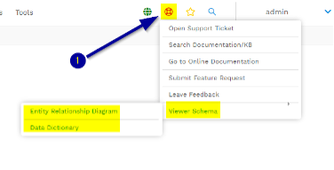

# Device42

**Confluence Page:** https://healthedge.atlassian.net/wiki/spaces/CP1/pages/4867001422/Device42

**Created by:** Chris Falk on June 16, 2025  
**Last modified by:** Chris Falk on June 16, 2025 at 02:52 AM

---

Introduction
------------

Device42 was founded in 2012 to provide a full-stack agentless discovery and dependency mapping platform for Hybrid Cloud. It has multiple use cases from IT Operations, Change & Configuration Management, Audit & Compliance, to Cloud Migrations which is the focus of this blog. The company is both an AWS Advanced Technology Partner and an AWS Migration Competency Partner. The product has also been accepted into the AWS ISV Acceleration Program where it’s available on [AWS Marketplace](https://aws.amazon.com/marketplace/seller-profile?id=743f843d-704e-4cbf-9400-70181a27cc3b).

The product has extensive integrations both with AWS Migration Tools (AWS Migration Hub, AWS Migration Evaluator, AWS Migration Portfolio Assessment, AWS Application Migration Service) and 3rd Party Tools (Carbonite, Service Now, Rivermeadow, Jira and many more). The integrations are essentially limitless as you get full access to the data when you deploy Device42.

There’s a well-documented API guide available [here](https://api.device42.com/)  and you can view the database schema in a couple of ways via the product’s user interface. From the Help Menu select Viewer Schema and select Entity Relationship Diagram to navigate the Device42 database schema and visualize relationships, which is helpful when constructing queries using Device 42’s Object Query Language (DOQL). The data dictionary is another way to explore and view the details of the Device42 database and is quite handy when writing DOQL queries. The viewer schema is formatted as a text-based list, each table formatted to show the columns in that table, each field’s data type, and a field description, which provides a quick sentence describing the type of data one should expect to find in that field.

Aside from the advantages of getting full access to the data, there are a number of other reasons why Device42 is a good discovery tool to use for cloud migrations to AWS such as:

* **Agentless auto-discovery** – no software to install on target devices which means the server owners and security are more likely to approve the discovery project.
* **Broad Support** – Device42 is one of the few discovery tools on the market that can discover all devices in the Hybrid Data Centre including Windows, Linux, Unix (& Legacy), Network, Virtualization, Cloud, Bare Metal (Chassis etc.), Data Centre (PDU, UPS etc.) and Storage Devices. This makes it the ideal discovery tool for a cloud migration project that is driven by a Data Centre exit strategy.
* **CISO Friendly** – Device42 virtual appliances are designed to reside securely in a customer’s data center, requiring no external internet access and the discovered data stays at rest behind the customer’s firewall. The discovery jobs use industry standard protocols (SNMP, IPMI, SSH, WMI and others) that do not require Admin level permissions. The principle of least privilege is applied when discovering assets with Read-only and lower-level credential accounts being the preferred means of discovery. Device42 only escalates to privileged commands when the target operating system demands it. The deployment architecture uses remote collectors that reside in segmented networks so discovery can securely take place without opening ports across network boundaries. The main appliance is a self-contained, self-maintaining, hardened virtual appliance that is compliant with industry best practices. Discovery account credentials are encrypted with 256-bit encryption upon entering in the appliance.
* **Easy to deploy** - Device42 main appliance and the remote collector are delivered as virtual appliances making installation easy, secure and with a low impact to customer environments. You just need to download and install Device42 to your hypervisor of choice and then login to the console to set the network settings and add a passphrase for security. Then you are ready to start configuring the discovery jobs.

**Attachments:**

[Screen%20Shot%202020-09-22%20at%204.30.40%20PM.png](../../../attachments/Screen%20Shot%202020-09-22%20at%204.30.40%20PM.png)

[image-20230508-170704.png](../../../attachments/image-20230508-170704.png)