# Running-Discovery-Jobs

**Confluence Page:** https://healthedge.atlassian.net/wiki/spaces/CP1/pages/4867034874/Running-Discovery-Jobs

**Created by:** Chris Falk on June 16, 2025  
**Last modified by:** Chris Falk on June 16, 2025 at 02:52 AM

---

Device42 provides a broad range of discovery jobs, so you will need to select the jobs that are both relevant to your technology stack as well as the scope of your discovery project. For example, if your migration project is part of a larger DC exit strategy then you will want to discover all devices, including network, shared storage, physical/virtual servers, hypervisors, chassis, appliances etc. Alternatively, if you are planning to migrate a specific application portfolio that is built on Windows/.Net Framework then you would only need to run the Windows Discovery Job with SQL Server Discovery enabled.

There are two ways to create discovery jobs and you will typically want to use both over the course of your discovery project. You can manually create jobs or Device42 can automatically create jobs for you based on the TCP Port Scan functionality. It’s recommended to start your discovery project by running TCP Port Scan jobs on IP Subnets of interest. You simply specify the IP Subnet you want to scan, give the job a meaningful name such as “*192.168.1.0/24-App\_Svrs*”, and then run the job. Device42 will ping each IP in the CIDR Range and then attempt a protocol handshake each time it receives a response. The job will determine the OS of the device based on the result of the handshake, and then automatically create Windows and/or \*nix (Linux, Unix) discovery jobs for the active IPs. The newly created jobs will be automatically configured with the Device42 recommended settings so this is an easy method to kickstart your discovery project. You will need a make the following configuration changes to the jobs before they are ready to run:

**Discovery Account Credentials** Select the search icon on the Password field underneath Discovery Target(s) Credential(s) and select “+ Add Secret” in the popup window. Enter the discovery account credentials into Secrets (also accessible from the Resources menu) and use the burnt method so external parties don’t see your passwords. Once the secret is added you can select it from the list to add it to the discovery job.

**Tip:** You can add multiple credentials to discovery jobs if you need Device42 to try logging in with different credentials. This can be useful when you don’t know which credential is provisioned on a particular target device.

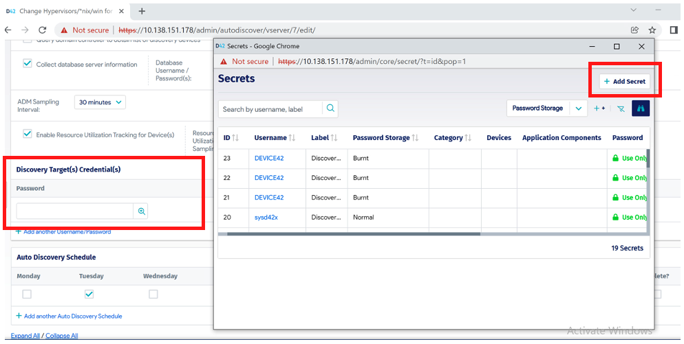

**Database Discovery Credentials** If the discovery job is targeting Windows or \*.nix servers that are also running SQL Server or Oracle then you can enable database discovery by selecting the box “Collect database server information”. Similar to step 1, you will need to add the database credential into Secrets and then select it from the list to add it to the discovery job. For example, if you need to discover a SQL Server running on a Windows server then add the database credential to the Windows job that is targeting the Windows server.

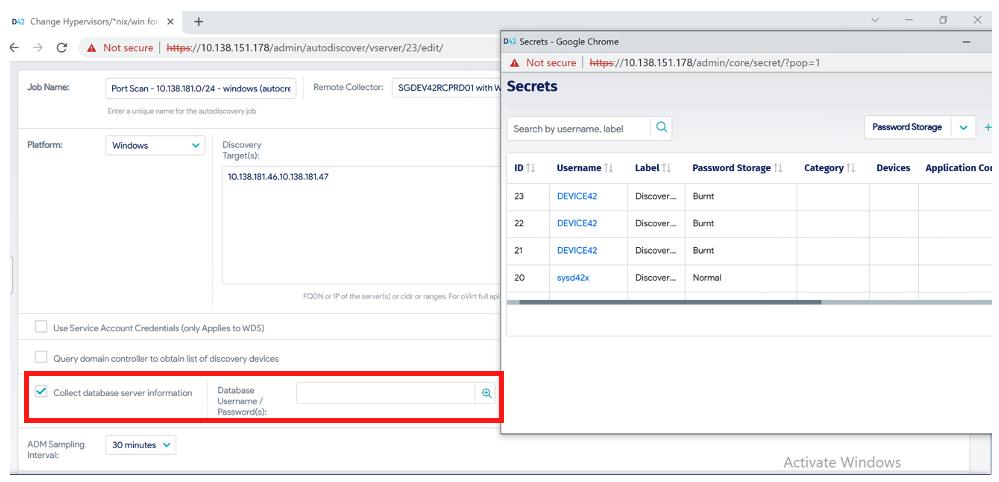

**Application Dependency Mapping (ADM)** Configure ADM by selecting an “ADM Sampling Interval” - 2 or 4 hours is usually sufficient to gain an application communication profile. If you would like to discover config files, select the “Store Application Components Config Files” checkbox. When auto-discovery is run, Application Components will be created based on related services on a server. For instance, a server with Oracle Database running will have a component created that associates all Oracle Database services together on that machine.

**Important:** Device42 does not create application components for all discovered services but it does discover all running services.

The list of application components that Device42 currently fingerprints is [here](https://docs.device42.com/enterprise-application-dependency-mapping/adm-supported-applications/) and an example of ADM with a supported application component could be this:

*Apache Application Component **runs on** Prod-Server1 **depends on** MySQL Application Component **runs on** Prod-Server2-Database-Server1*.

To illustrate the difference between fingerprinted services (application components) and non-fingerprinted services see the 2 rows of excel data after the screenshots below.

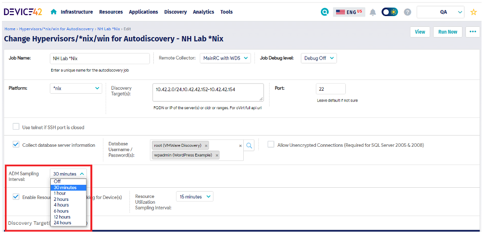
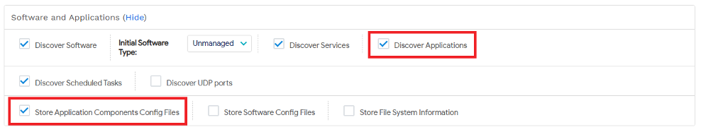
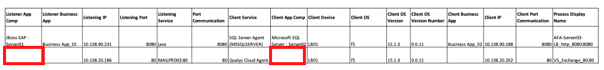

**Resource Utilization (RU)** This module collects resource utilization metrics from discovered Windows and Linux devices such as CPU, Memory, Disks and Networks. Enable the RU module by selecting the checkbox “Enable Resource Utilization Tracking for Device(s)” in the discovery job. You will also need to select your preferred sampling interval which is the number of seconds between data points. If you want to get AVG/MIN/MAX data at 5-minute intervals for the last 24 hours, set interval=300 and you will receive 288 data points.

**Tip:** Be careful with this interval setting as the number of data points will be multiplied by the number of devices you are discovering. If you are discovering 1000 devices from a single Remote Collector then you will receive 288,000 data points for every 24-hour cycle which can cause performance issues. You would need to either split the discovery jobs over multiple RCs to spread the load or increase the interval to say 15 or 30 minutes.

The RU data is stored in a Time Series Database and is critical for a cloud migration project as it allows you to select an optimized cloud instance type based on actual usage. This data is normally used during the business case stage when you are seeking budgetary approval for your project as well as during the migration planning/execution stage to ensure you provision the “rightsized” instance type.

Time series RU data is also useful if you plan to use burstable instances when you migrate to AWS. Many general-purpose workloads are on average not busy, and do not require a high level of sustained CPU performance. These low-to-moderate CPU utilization workloads lead to wastage of CPU cycles and, as a result, you pay for more than you use. To overcome this, you can leverage the low-cost burstable general-purpose instances, which are the [T instances](https://docs.aws.amazon.com/AWSEC2/latest/UserGuide/burstable-performance-instances.html). More information on the RU module is available [here](https://docs.device42.com/auto-discovery/resource-utilization-overview/).

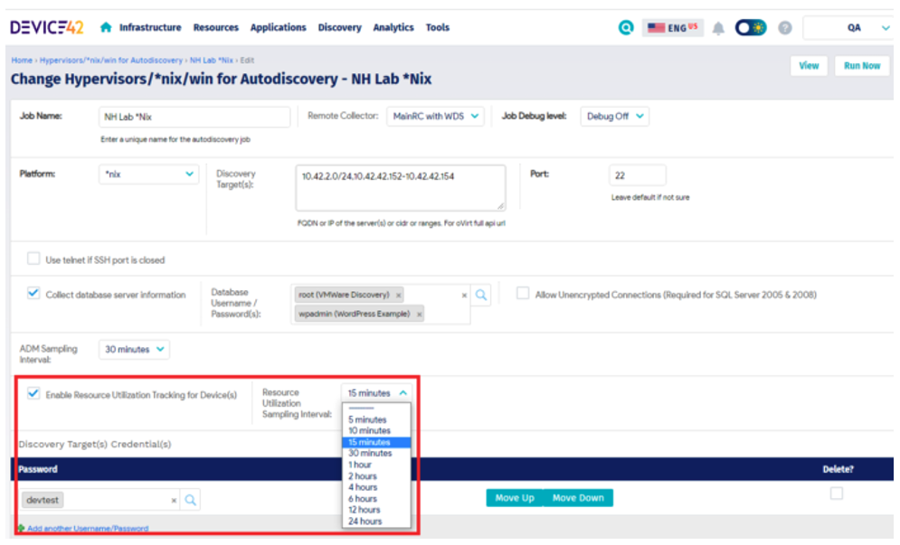

**Auto Discovery Schedule** The
discovery jobs can be scheduled to run at certain times and it’s recommended to sequence the jobs based on the scope of your migration project. For example, if you are discovering everything (DC Exit scenario) then you could run your Network jobs on a Monday, your Storage jobs on a Tuesday, your Hypervisor jobs on a Wednesday, your Windows jobs on a Thursday and your \*.nix jobs on a Friday. Running these jobs once a week is usually sufficient as the CI data typically does not change that frequently and the RU/ADM polling will continue to run based on the intervals you set in the discovery jobs. Even though these jobs don’t create noticeable overhead on the target devices, you can schedule them to run out of hours just to be safe. It’s also good practice to inform your monitoring teams when these jobs will be running so they don’t trigger unnecessary alarms.

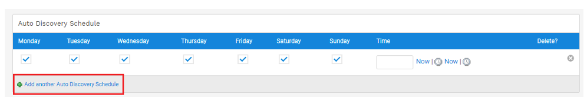

**Tags** When you collected your IP Subnets of Interest it’s likely that you also collected metadata about those subnets. For example, you might have subnets dedicated to Dev/Test environments or subnets dedicated to application/web servers and this metadata can be added to the discovered devices via the tags setting in the discovery job. To add a comma separated list of tags to a discovery job, which are subsequently added to all devices discovered by that job, expand the Miscellaneous section in the discovery job and enter as many tags as you need.

**Tip:** Tags can be useful in the early stages of your discovery project as they help you group servers into categories for further analysis and they can also assist in troubleshooting discovery issues.

For example, you might have a Hypervisor discovery job that sets the tag “vcenter” on all discovered devices and a Windows discovery job that sets the tag “App\_Svr” on all discovered devices. It’s possible that the Hypervisor job is discovering devices that are either missing from the Windows job or failing for some reason. You can quickly report on all Windows Servers in Device42 which only contain the tag “vcenter” and you know these devices need further investigation.

**Important:** In order to fully discover a device with its services, installed software, RU metrics etc., it must be discovered via the Windows or \*nix discovery jobs.

The Hypervisor job (similar to cloud jobs) is API based so it only discovers basic information about the device. It’s not able to perform a remote login and use WMI/SSH to perform a detailed discovery. We will discuss this further in the [Troubleshooting Discovery Issues](#) section.

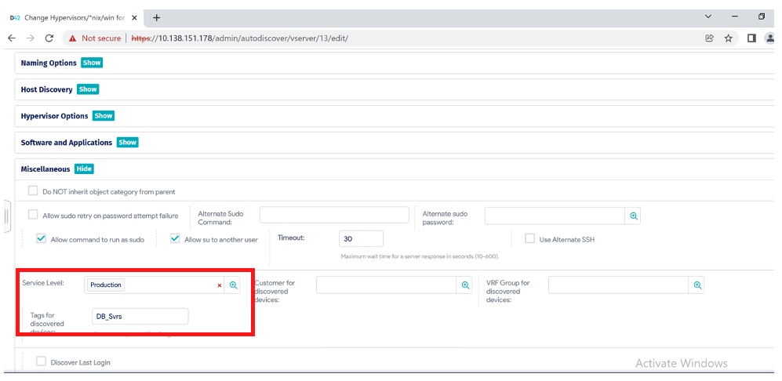

**Tip:** If you know which environment the target devices are operating in then configure the Service Level rather than using a tag for environment. You can create your own Service Level values or use the default ones. Any target device discovered by that job will inherit the service level you configured which is useful when planning for a cloud migration.

**Hosts File** This is an optional discovery that can be enabled for \*nix discovery jobs as Device42 is able to grep and copy the hosts file from Linux/Unix devices. This can be useful in a migration project as you might need to switch from host file configurations to DNS configurations in order for the application to work in the cloud.

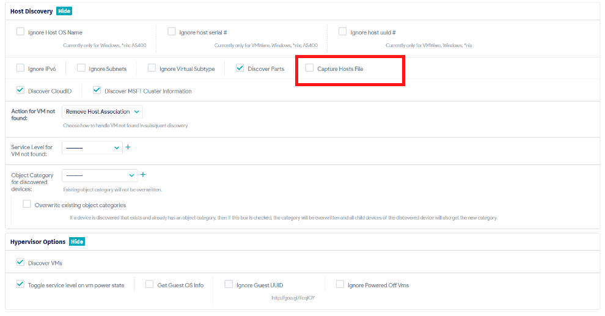

The other way to create a discovery job is manually and this can done throughout the discovery project on an ad hoc basis. For instance, there could be new scope that wasn’t part of the original TCP Port Scan, or there might be a subset of target devices in your automatically configured jobs that are not being discovered (fully or partially) and therefore it’s easier to separate them into a dedicated job for troubleshooting purposes.

To create a discovery job, select the type of job you need from the Discovery Menu with the most common one being Hypervisors / \*nix / Windows.

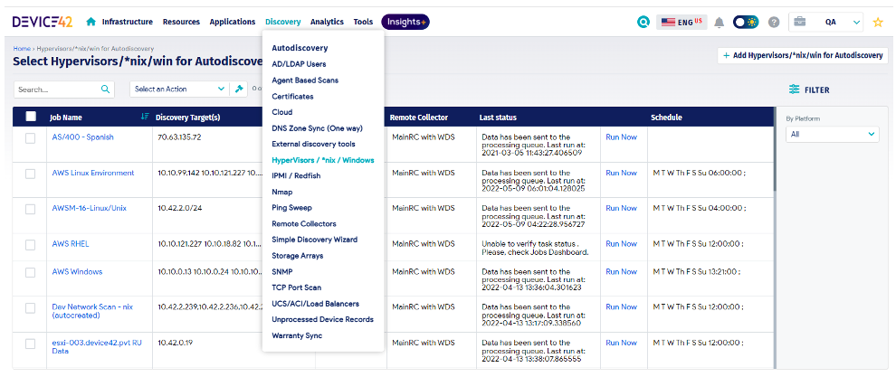

Give the job a name using a similar naming convention to the automatically created jobs, select the Remote Collector you want to run the job from, the platform you will be discovering and the target device IP’s or CIDR range. Like the automatically created jobs, Device42 recommended settings will be configured by default but you’ll need to make the 7 configuration changes listed above before the jobs are ready to run. Review the [Device42 documentation](https://docs.device42.com/auto-discovery/) for more detailed information on each type of discovery job/platform.

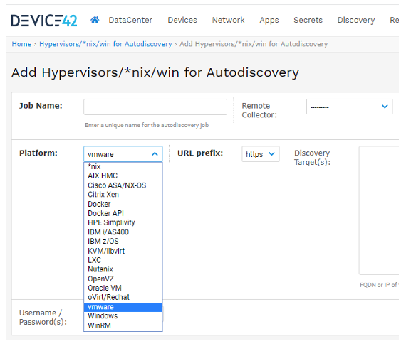

**Attachments:**

[image-20230508-161928.png](../../../attachments/image-20230508-161928.png)

[image-20230508-162028.png](../../../attachments/image-20230508-162028.png)

[image-20230508-162057.png](../../../attachments/image-20230508-162057.png)

[image-20230508-162102.png](../../../attachments/image-20230508-162102.png)

[image-20230508-171027.png](../../../attachments/image-20230508-171027.png)

[image-20230508-171054.png](../../../attachments/image-20230508-171054.png)

[image-20230508-171117.png](../../../attachments/image-20230508-171117.png)

[image-20230508-171132.png](../../../attachments/image-20230508-171132.png)

[image-20230508-171145.png](../../../attachments/image-20230508-171145.png)

[image-20230508-171151.png](../../../attachments/image-20230508-171151.png)

[image-20230508-171212.png](../../../attachments/image-20230508-171212.png)

[image-20230508-171235.png](../../../attachments/image-20230508-171235.png)

[image-20230508-171254.png](../../../attachments/image-20230508-171254.png)

[image-20230508-171311.png](../../../attachments/image-20230508-171311.png)

[image-20230508-171332.png](../../../attachments/image-20230508-171332.png)

[image-20230508-171344.png](../../../attachments/image-20230508-171344.png)