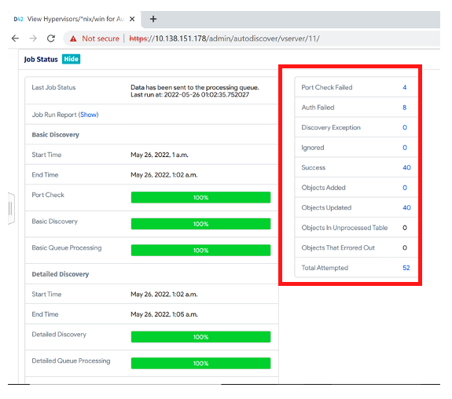
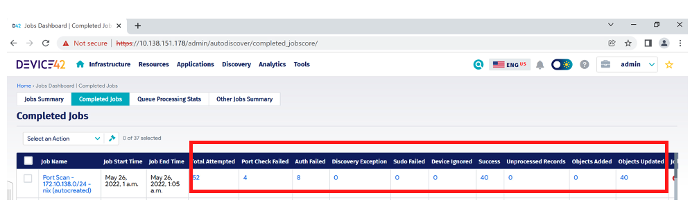
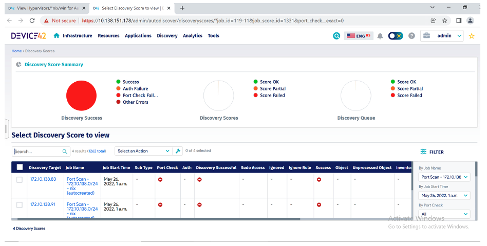
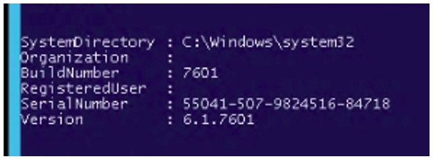
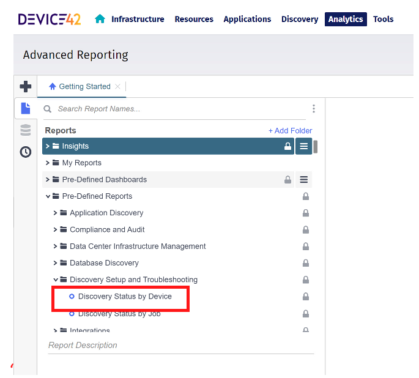
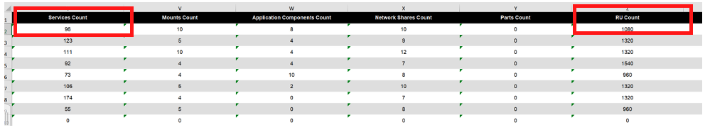

# Troubleshooting-Discovery

**Confluence Page:** https://healthedge.atlassian.net/wiki/spaces/CP1/pages/4867034923/Troubleshooting-Discovery

**Created by:** Chris Falk on June 16, 2025  
**Last modified by:** Chris Falk on June 16, 2025 at 02:52 AM

---

This is an important activity that should be prioritized at the start of your discovery project. You should expect to encounter discovery issues, either full or partial failures, which is why testing is recommended in the pre-requisite steps.

After running your discovery job you can see the results in two places:

1. In the Job Status section of the discovery job itself or
2. In the Jobs Dashboard “Jobs Summary” tab for recently completed jobs or in the “Completed Jobs” tab for a historical view of all your completed jobs.

To see the detailed discovery score for each failure type click on the hyperlink in the Port Check Failed or Auth Failed fields. You will be taken to a page that looks like this:

**Discoveries begin with port checks to confirm connectivity immediately followed by authentication. See below for specific information on each.**

**Port Check Failure** – this is classified as a full discovery failure as it means the device could not be discovered at all. The “Discovery Target” field identifies the IP address that failed the port check and as this example is a \*.nix job you know the port is 22. You can also click on the IP address hyperlink (Discovery Target field) to see the discovery score for this specific IP where it will also show you the port number. Port check failure is usually caused by a firewall between the RC (WDS for Windows) and the target device. It could be a network firewall or a local firewall on the target device, and to remediate this issue you will need to open port 22 for Linux/Unix and port 135 for Windows. Alternatively, the target device could simply be offline.

If the target device is Windows you can test if port 135 on the remote machine is reachable from the WDS server by executing the following command from the PowerShell of WDS server:

**Auth Failure** – this failure means the discovery job was able to connect to the target device over the port (port 22 in the above example) but the remote login to the target device failed. So similar to port check failure it’s also classified as a full discovery failure as the device could not be discovered at all. This failure is normally caused by the credential configured in the discovery job not matching a non-expired credential configured on the target device. To remediate this issue, you will need to configure the correct discovery account credential on the target device.

If the target device is Windows then an Auth Failure can also occur if the WDS server is unable to connect to or query WMI on the target device. You can test if you are able to query WMI on the target device by executing the following command from PowerShell on the WDS server:

where  **"domain\user"** will be replaced with the auto discovery job user name (the password will be prompted) and **IP** will be the IP address or the DNS of the target device.

If you get an output like the screenshot below then the query worked and therefore the discovery job should also work.

You can refer to the following links to see how to enable remote access to WMI:

<https://docs.microsoft.com/en-us/windows/desktop/wmisdk/connecting-to-wmi-on-a-remote-computer>

<https://www.poweradmin.com/help/faqs/how-to-enable-wmi-for-remote-access/>

If you get an access denied or another type of error, then go back and check the permissions and firewall ports required for Windows discovery which are available in the Device42 documentation [here](https://docs.device42.com/auto-discovery/windows-and-hyper-v-auto-discovery/#section-11) and summarized below:

1. Ensure the user has remote access to "CIMV2", "DEFAULT" and "WMI" namespaces on the target device
2. Enable the following Firewall Rules on the target device:

   1. Windows Management Instrumentation (DCOM-In)
   2. Windows Management Instrumentation (WMI-In)
3. 135 port must be open on the target and an ephemeral port range of ports 1024 to 65535 must be open. WMI first uses port 135 to negotiate, then DCOM selects a random port between 1024 and 65535
4. If you have a domain\user\_name on the Windows server you also need to use the same user for the auto discovery job, and the user account must be a member of the *Performance Monitor Users Group* and *Distributed COM Users Group* on the target device
5. You can also temporarily disable Antivirus on the target device to see if it’s blocking WMI requests

If you are unable to diagnose and remediate these full discovery failures the next course of action is to raise a support ticket with Device42 using this [email address](mailto:support@device42.com). They will most likely ask you to run the discovery job in debug mode and then [create a log bundle](http://docs.device42.com/device42-appliance-manager/generate-log-bundle/) from the [appliance manager](https://docs.device42.com/device42-appliance-manager/device42-appliance-manager-login/). They will also need the RC log which you can get by navigating to: Discovery > Remote Collectors and clicking on the “Logs” link for the corresponding remote collector under the “Actions” column. Once you have the log bundle and RC log, upload both files to this [link](https://upload.device42.com/) referencing your support case.

**Partial Failures** – Once the discovery job is able to connect and remote login to the target device it will execute multiple commands to collect the detailed information from the target device. For example, Device Properties (IP, OS, CPU, RAM, Disk etc.), Running Services, Installed Software, Application Components (fingerprinted from Running Services), Service Connectivity (with other devices) and Resource Utilization Metrics (Windows and Linux Servers).

Identifying partial discovery failures is not intuitive using the Device42 discovery scores module. The best way to approach this challenge is to understand what you are looking for and then run an Advanced Report to check you have the data you need. Remember only the OS jobs (Windows/\*.nix) are able to collect all the detailed information mentioned above and it’s this information that is important for a cloud migration project. You might be running hypervisor jobs as part of your discovery project and these jobs are able to collect some basic information such as Hostname, IP and OS but they can’t collect the detailed information. Therefore, it’s best to report on the detailed information that only the OS jobs can collect which is Running Services, Installed Software and Resource Utilization.

**Tip:** Don’t use Application Components for this exercise as not all Running Services can be fingerprinted but all Running Services can be discovered.

From the Analytics menu select Advanced Reporting, then navigate to “Discovery Setup and Troubleshooting” which is under “Pre-Defined Reports”. Run the “Discovery Status by Device” Report by highlighting the report and clicking the ‘hamburger’ menu. In the menu popup, click “Export as Excel”. The generated report will include all discovered devices along with the discovery job they were discovered by and the discovery statistics such as ‘Services Count’, ‘Software Count’ and ‘RU Count’. Using this report, you can check to see if any devices discovered by a \*.nix or Windows job have 0 counts for either Services, Software or Resource Utilization. If the count is 0 for one of these metrics it’s considered a partial failure which will occur if any command related to that data category failed to run due to a sudo or permission access issue, but also potentially if the command does not exist on the system.

**Attachments:**

[image-20230508-162738.png](../../../attachments/image-20230508-162738.png)

[image-20230508-171410.png](../../../attachments/image-20230508-171410.png)

[image-20230508-171428.png](../../../attachments/image-20230508-171428.png)

[image-20230508-171441.png](../../../attachments/image-20230508-171441.png)

[image-20230508-171552.png](../../../attachments/image-20230508-171552.png)

[image-20230508-171757.png](../../../attachments/image-20230508-171757.png)

[image-20230508-171806.png](../../../attachments/image-20230508-171806.png)