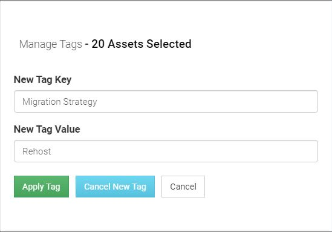
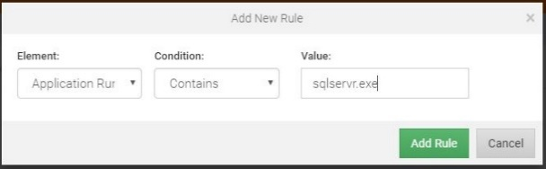
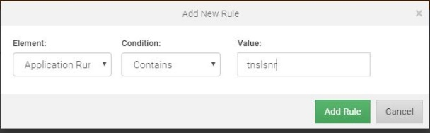

# Cloudscape-Tagging-Methodology

**Confluence Page:** https://healthedge.atlassian.net/wiki/spaces/CP1/pages/4867035088/Cloudscape-Tagging-Methodology

**Created by:** Chris Falk on June 16, 2025  
**Last modified by:** Chris Falk on June 16, 2025 at 02:53 AM

---

---

title: Cloudscape Tagging Methodology
-------------------------------------

Overview
--------

In the RISC Networks ITOA Platform, tags are metadata elements that are associated with assets (e.g. Windows Server) or Application Stacks. This metadata further describes the asset or application stack and can be based on collected data or external attributes. External attributes are those attributes that are known to and provided by the customer and not based on specific data points collected by the platform. The following table provides examples of each for both asset and application stack tags.

| **Tag** | **Example** | **Tag Type** | **Based On** | **Comment** |
| --- | --- | --- | --- | --- |
| Department or Business Unit | IT, HR, Sales | Stack, Asset | External Data Attribute | Identifies which department or business unit owns the application or asset |
| Environment | Test, Dev, Prod | Stack, Asset | External Data Attribute | Identifies the application environment for the application or asset |
| RScore | Rehost, Replatform | Asset | Collected Data Attribute | Used to establish "level of effort" for a given app stack. Assets are tagged based specific criteria such as Operating System and rolled up at an application stack level |
| Tier | Web, Middleware, Database | Asset | Collected Data Attribute | Identifies the tier based on the existence of known web, middleware, and database processes |

In the RISC Networks ITOA Platform, tags can be categorized as follows:

**System or default tags**

Tags that are applied and maintained in the platform by default. For more information refer to the Tags section of the glossary.

<https://portal.riscnetworks.com/app/documentation/?path=/using-the-platform/glossary/>

**DNS Tags**

Tags that are applied and maintained in the platform by default when there are licensed and accessible Windows Servers running Microsoft DNS. For more information refer to the Tags section of the glossary.

<https://portal.riscnetworks.com/app/documentation/?path=/using-the-platform/glossary/>

**Rule Based Tags**

Tags that are applied by the user based on a specific set of criteria such as Operating System or running process. In this case, the user will use the Search Applications and Processes, Advanced Rulesets, or the Assets pages in the portal to filter to a subset of assets in order to apply the appropriate tag. For example, you can tag database servers with the specific database type (MSSQL, Oracle, MySQL) running on them.

**CMDB Based Tags**

Tags that are based on external data attributes that are known to and provided by the customer. These tags are typically provided in CSV format and ultimately bulk imported into the platform using the Tag Import feature. For example, you can apply an Environment (test, dev, prod) tag to an asset or application stack.

In summary, a well thought out and implemented tagging methodology incorporates both business and technical attributes within the platform in order to gain valuable insights and make better decisions. Tags provide additional context to the assessment data and can be used directly in certain reporting modules. For example:

* Use the Orb to see which departments share data or what portion of your environment an application owner is responsible for
* Use the Interactive Scorecard to create a prioritized backlog of applications for migration

Rule Based Tags
---------------

The following are examples of rule based tags that can be implemented where applicable. These tags should be used wherever possible in Cloud Readiness or Cloud Migration use cases.

> **Note:** This is a complex table with merged cells. For best viewing experience, see the [original Confluence page].

<table>

<tbody>
<tr>
<th colspan="1">Tag Key</th>
<th colspan="1">Tag Value</th>
<th colspan="1">Criteria</th>
<th colspan="1">Tag Type</th>
<th colspan="1">Comment</th>
</tr>
<tr>
<td>
Migration Strategy
</td>
<td>
Rehost
</td>
<td>
Use Assets page and filter for Windows (2012, 2016, 2019), Linux (EL6,
                    EL7)
</td>
<td>
Asset
</td>
<td>
Used to establish "level of effort" for a given app stack. Devices are
                    tagged based on listed criteria and rolled up at an app stack level to
                    show distribution of the different rscore tags. A device could have multiple
                    tags depending on the approach. For example 1 tag for rehost because of
                    OS compatibility and 1 tag for replatform because its running MySQL.
</td>
</tr>
<tr>
<td>
Migration Strategy
</td>
<td>
Replatform
</td>
<td>
Use Assets page and filter for Windows (2000, 2003, 2008), Linux (EL5)
</td>
<td>
Asset
</td>
<td>
Used to establish "level of effort" for a given app stack. Devices are
                    tagged based on listed criteria and rolled up at an app stack level to
                    show distribution of the different rscore tags. A device could have multiple
                    tags depending on the approach. For example 1 tag for rehost because of
                    OS compatibility and 1 tag for replatform because its running MySQL.
</td>
</tr>
<tr>
<td>
Migration Strategy
</td>
<td>
Replatform
</td>
<td>
Use Advanced Rulesets / Application Runpath and search for processes associated
                    with MySQL, MSSQL, PostgreSQL, Oracle, Memcached, Redis, MongoDB etc…
</td>
<td>
Asset
</td>
<td>
Can be used to identify opportunities for moving to PaaS solutions like
                    RDS, NoSQL (e.g. DynamoDB), Cache (Redis, Memcached) etc… This would need
                    customer / partner input.
</td>
</tr>
<tr>
<td>
Database Type
</td>
<td>
MSSQL
</td>
<td>
Use Advanced Rulesets / Application Runpath and search for sqlservr.exe
</td>
<td>
Asset
</td>
<td>
Used in scorecard to identify and rank assets / application stacks with
                    DB systems
</td>
</tr>
<tr>
<td>
Database Type
</td>
<td>
Oracle
</td>
<td>
Use Advanced Rulesets / Application Runpath and search for tnslsnr AND
                    sqlplus
</td>
<td>
Asset
</td>
<td>
Used in scorecard to identify and rank assets / application stacks with
                    DB systems
</td>
</tr>
<tr>
<td>
Database Type
</td>
<td>
MySQL
</td>
<td>
Use Advanced Rulesets / Application Runpath and search for mysqld
</td>
<td>
Asset
</td>
<td>
Used in scorecard to identify and rank assets / application stacks with
                    DB systems
</td>
</tr>
<tr>
<td>
Database Type
</td>
<td>
PostgreSQL
</td>
<td>
Use Advanced Rulesets / Application Runpath and search for postgres
</td>
<td>
Asset
</td>
<td>
Used in scorecard to identify and rank assets / application stacks with
                    DB systems
</td>
</tr>
<tr>
<td>
Cloud Criteria
</td>
<td>
Cluster
</td>
<td>
Use Advanced Rulesets / Application Context and search for Microsoft Cluster
                    Services
</td>
<td>
Asset
</td>
<td>
Used in scorecard to identify and rank assets / application stacks with
                    running HA solutions
</td>
</tr>
<tr>
<td>
Cloud Criteria
</td>
<td>
NFS Mount
</td>
<td>
Use Advanced Rulesets / Filesystem and search for NFS
</td>
<td>
Asset
</td>
<td>
Used in scorecard to identify and rank assets / application stacks with
                    NFS mounts
</td>
</tr>
</tbody>
</table>

CMDB Based Tags
---------------

The following are examples of CMDB based tags that can be used where available and / or applicable. These tags are typically provided in CSV format and bulk imported into the platform using the Tag Import feature.

> **Note:** This is a complex table with merged cells. For best viewing experience, see the [original Confluence page].

<table>

<tbody>
<tr>
<th colspan="1">Tag Key</th>
<th colspan="1">Example Tag Value</th>
<th colspan="1">Tag Type</th>
<th colspan="1">Comment</th>
</tr>
<tr>
<td>
Application Classification / Application Categorization
</td>
<td>
Enterprise Resource Management, Operations Management, Data Management,
                    Security
</td>
<td>
Stack
</td>
<td>
Identifies the type of application
</td>
</tr>
<tr>
<td>
Department / Business Unit
</td>
<td>
IT, HR, Sales
</td>
<td>
Stack, Asset
</td>
<td>
Identifies which department or business unit owns the application or asset
</td>
</tr>
<tr>
<td>
Supported By
</td>
<td>
Business, Outsourced
</td>
<td>
Stack, Asset
</td>
<td>
Support Organization, Department, or Individual
</td>
</tr>
<tr>
<td>
Environment
</td>
<td>
Test, Dev, Prod
</td>
<td>
Stack, Asset
</td>
<td>
Identifies the application environment for the application or asset
</td>
</tr>
<tr>
<td>
Data Type
</td>
<td>
HIPPA, PII, PCI-DSS
</td>
<td>
Stack
</td>
<td>
Identifies if application data is subject to compliance requirements
</td>
</tr>
<tr>
<td>
Application Criticality
</td>
<td>
Mission Critical, Mission Essential, Tactical
</td>
<td>
Stack
</td>
<td>
Identifies the criticality of the application to the business
</td>
</tr>
<tr>
<td>
Application Name
</td>
<td>
SharePoint, CRM, Cognos
</td>
<td>
Asset
</td>
<td>
Import of CMDB info (application to server mapping) for reference
</td>
</tr>
<tr>
<td>
Datacenter / Location
</td>
<td>
US-Virginia
</td>
<td>
Asset
</td>
<td>
Datacenter or Location designation
</td>
</tr>
<tr>
<td>
In-Scope
</td>
<td>
Yes, No
</td>
<td>
Asset
</td>
<td>
Used to flag devices in the Inaccessible Device list that are not in scope
                    and / or flag devices that will be licensed
</td>
</tr>
<tr>
<td>
Support SLA
</td>
<td>
Gold, Silver, Bronze
</td>
<td>
Stack
</td>
<td>
Identifies support SLA for the application
</td>
</tr>
<tr>
<td>
RTO/RPO
</td>
<td>
4h / 24h
</td>
<td>
Stack
</td>
<td>
Recovery Time Objective, Recovery Point Objective - Used in Disaster Recovery
                    and Business Continuity planning
</td>
</tr>
<tr>
<td>
Application Lifecycle / Status
</td>
<td>
Deploy, Maintain, Retire, End of Support
</td>
<td>
Stack
</td>
<td>
Identifies the lifecycle stage or overall status for the application stack
</td>
</tr>
<tr>
<td>
Migration Wave
</td>
<td>
Wave 1
</td>
<td>
Stack
</td>
<td>
If customer has already authored a wave strategy incorporate into portal
</td>
</tr>
<tr>
<td>
Business Disposition
</td>
<td>
Retain, Replace, Refactor,Retire
</td>
<td>
Stack, Asset
</td>
<td>
Business decision for the disposition of application stack or asset
</td>
</tr>
<tr>
<td>
Application Module
</td>
<td>
Access Management, Portal, Integration, EDI, Front-End
</td>
<td>
Asset
</td>
<td>
Modular server role for associated application
</td>
</tr>
</tbody>
</table>

Examples
--------

### Migration Strategy

The follow illustrates how to create Rehost and Replatform tags based on Operating System version. A general rule of thumb is that if the Operating System version is still under mainstream support it would be considered a Rehost. Whereas if the Operating System version has gone End of Support (EOS) it would be considered a Replatfom. There is some nuance here and ultimately this will be based on the customer's preference and priorities.

1. Navigate to the **Consume Intelligence** >> **Assets** page
2. Filter the OS Version column for "2016" to filter down to Microsoft Windows Server 2016 based systems
3. Maximize the number of records per page (e.g. 100)
4. Click to check the box in the header row to select all filtered systems
5. Click on Manage Tags
6. Type "Migration Strategy" in for the Tag Key and Create New Tag
7. Type Rehost for the Tag Value
8. Apply Tag

1. If there were more than 100 results then advance to the next page and apply the same tag
2. Repeat this process for other OS Versions to assign Rehost or Replatform tag values as necessary

### Database Type

The follow illustrates how to create a Database Type tag that can be used to understand database distribution in the customer environment and opportunities to leverage Platform as a Service (PaaS) solution offerings.

#### Microsoft SQL Server

1. Navigate to **Add Intelligence** >> **Advanced Rulesets**
2. Click Add New Rule
3. Set rule for Application Runpath, Contains, sqlservr.exe

1. Add rule
2. Click on (select) newly created rule to list result in table below
3. Shift select all rows
4. Right click >> Manage Tags
5. Enter "Database Type" for Tag Name and "MSSQL" for Tag Value
6. Apply Tag

#### Oracle

1. Navigate to **Add Intelligence** >> **Advanced Rulesets**
2. Click Add New Rule
3. Set rule for Application Runpath, Contains, tnslsnr

1. Add rule
2. Click on (select) newly created rule to list result in table below
3. Shift select all rows
4. Right click >> Manage Tags
5. Enter "Database Type" for Tag Name and "Oracle" for Tag Value
6. Apply Tag

---

**Attachments:**

[worddav18130ffba5a5b7a3d8f1b19668ae246a.png](../../../attachments/worddav18130ffba5a5b7a3d8f1b19668ae246a.png)

[worddav730a254d1270776df037a8a9beab81ce.png](../../../attachments/worddav730a254d1270776df037a8a9beab81ce.png)

[worddavd1e96de8791df7162744a1c3357aadbb.png](../../../attachments/worddavd1e96de8791df7162744a1c3357aadbb.png)

[worddave81a22f196bac9689d1af3733a020901.png](../../../attachments/worddave81a22f196bac9689d1af3733a020901.png)