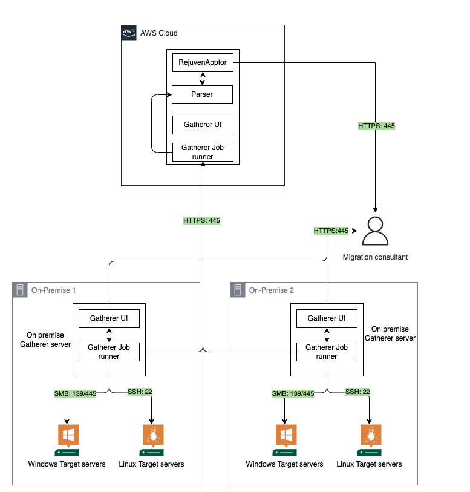
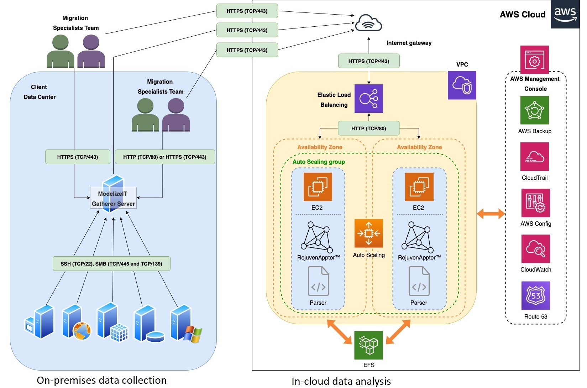

# Architecture

**Confluence Page:** https://healthedge.atlassian.net/wiki/spaces/CP1/pages/4867001113/Architecture

**Created by:** Chris Falk on June 16, 2025  
**Last modified by:** Chris Falk on June 16, 2025 at 02:47 AM

---

ModelizeIT is an Agentless discovery tool that runs scripts on the on target clients and collect information on inventory, utilization, and dependency for a fixed period of time (default: 7 days). The output files are thereafter loaded into the RejuvenApptor Webserver, where aggregated data for all servers discovered can be analyzed. ModelizeIT supports various models of script execution, upload and analysis of data. The details of the various configurations and other documentation can be found [here](https://www.modelizeit.com/documentation/toc.html). This document describes automated execution of scripts and upload of data to SaaS based RejuvenApptor app.

The main components of Modelize IT are:

1. Gatherer Server: Engine to run the automation for execution of scripts, collection of output and upload of output results to Parser.
2. Parser: This is an application modeler, intermediate processing engine that processes raw OUT files from each server and converts them into per-server application reports in CSV format.
3. RejuvenApptor: Web application allowing analysis of all collected data. Allows further manipulation of data dependency to create a migration wave plan.

Many On-Premises Gatherer servers can be installed. This enables each Gatherer server to collect data across the organization separated by different locations and networking zones. Users may not have access to the on-premise Gatherer Server over the internet and will have to access the Gatherer Server through VPN or take help from customer in accessing it.

\*Not all servers within a customer landscape may be accessible through the On-Premise Gatherer server. In such case the data collection scripts should be run on the Target servers manually and the output files recovered and stored on a particular location in Gatherer server for them to be uploaded to the RejuvenApptor (Analysis) Server (or directly uploaded to the analysis server).

**Modelize IT deployment architecture**

**Attachments:**

[Modeliez%20IT%20architecture.drawio.png](../../../attachments/Modeliez%20IT%20architecture.drawio.png)

[image-20200919-095331.png](../../../attachments/image-20200919-095331.png)

[image-20200922-190350.png](../../../attachments/image-20200922-190350.png)

[image-20230508-175918.png](../../../attachments/image-20230508-175918.png)

[image-20230508-175939.png](../../../attachments/image-20230508-175939.png)

[modelizeit\_efs\_with\_ports\_new\_icons\_AWSbox-ab.jpg](../../../attachments/modelizeit_efs_with_ports_new_icons_AWSbox-ab.jpg)