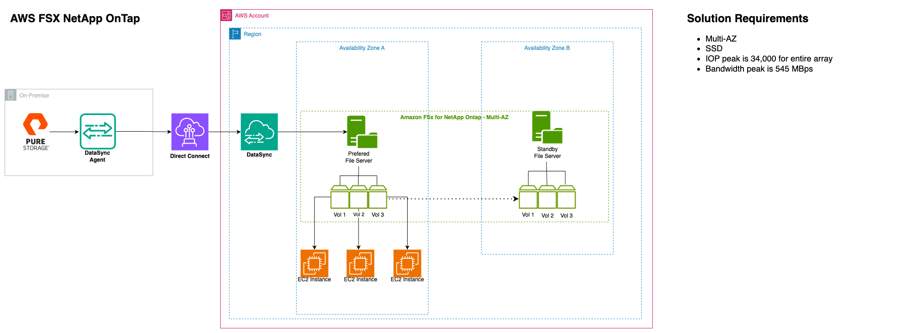

# GC Shared Storage Target Architecture

**Confluence Page:** https://healthedge.atlassian.net/wiki/spaces/CP1/pages/5118164997/GC%20Shared%20Storage%20Target%20Architecture

**Created by:** Khalid Ahmed on September 23, 2025  
**Last modified by:** Khalid Ahmed on September 23, 2025 at 03:24 PM

---

**Background**
--------------

As part of HealthEdge's cloud consolidation and modernization journey, the company seeks to migrate from their current siloed infrastructure spread across on-premises, GCP, and Azure to a unified AWS Cloud platform. This consolidation effort encompasses their entire product portfolio, including Guiding Care (GC).

**Motivation**
--------------

GC requires a NAS share solution to migrate their current on-premises Pure Flash Blade array that stores critical configuration files and artifacts essential for Guiding Care operations across multiple customer. These Pure Flash Blade shares are critical infrastructure components - any downtime would directly impact Guiding Care's availability and functionality for all customers. The solution demands High Availability SSD storage to ensure continuous operations and must be accessible across multiple AWS regions where customer environments are deployed. Lastly, the platform needs to support Windows servers via SMB protocol.

**Discovery**
-------------

Shared storage discovery was completed through ModelizeIT output analysis and PureFlash Blade Array data review, which was determined as the target to move to AWS with a NAS solution. From the PureFlash data, we gathered information per share (58 total) including: Filesystem type, Average IOPS from past 7 days, Size in GiB, and Region location. The analysis revealed: Peak IOPS requirement: 34,000 IOPS, Peak throughput: 545 MBps, Average IOPS: 13,000, Average throughput: 157 MBps, and Total storage: 47 TB. We evaluated solutions that could meet these performance requirements while providing high availability and cost efficiency.

[Shared Storage GC](https://healthedgetrial.sharepoint.com/:x:/r/sites/AWSCloudMigration/_layouts/15/Doc.aspx?sourcedoc=%7B3E63DDC8-1870-437A-B3B8-C5D90EE0EC30%7D&file=Shared-Storage-GC.xlsx&action=default&mobileredirect=true)

**Target Solution**
-------------------

*Target Architecture*

The proposed solution leverages AWS FSx for NetApp OnTap to provide enterprise-grade file storage in AWS with data migration from on-premises Pure Storage. This architecture ensures high availability through a Multi-AZ deployment with automatic failover capabilities between the preferred and standby file servers. The key components include on-premises infrastructure with Pure Storage as the source storage system, DataSync Agent installed on-premises for data migration, and Direct Connect connection to AWS for secure, reliable data transfer. The AWS Cloud implementation features multi-region AWS account deployment, two availability zones (Zone A and Zone B) for high availability.

Architectural Components
========================

Below table describes the architectural component that makes up the to-be architecture diagram of Health Rules Payor (HRP).

|  |  |  |  |
| --- | --- | --- | --- |
| Ref# | Logical Component Name | Description | Details |
| 1 | Direct Connect | AWS Direct Connect establishes a private, consistent, high-bandwidth network connection between your on-premises network and AWS | 10 Gbps link from on-premises |
| 2 | AWS Region | Region for this application | us-east-1, us-west-2 |
| 3 | VPC | A virtual private cloud (VPC) is a secure, isolated private cloud hosted within a public cloud | Segregated based on environment (Need Confirmation from Network team) |
| 4 | AWS FSx NetApp Ontap | Amazon FSx for NetApp ONTAP (FSx for ONTAP) is a fully managed AWS service that provides file systems powered by NetApp's ONTAP storage operating system | Will deploy 2 FSx NetApp Ontap file systems one for each region. |
| 6 | AWS DataSync | AWS DataSync is an online data transfer service simplifies data migration and securely transfer data to, from, and between AWS storage services. | For the Deployment Share solution all data will be sent to S3 using Data Sync from on-premise. |
|  | Data Sync Agent | A DataSync Agent is a virtual machine (VM) appliance deployed in your environment (on-premises, other cloud, or Amazon EC2) that facilitates secure data transfers between your local storage systems (like NFS, SMB, HDFS, or other cloud object storage) and AWS storage services | Will be downloaded on the server where the Pure Flash Blade share is present. |
| 10 | Amazon EC2 | All EC2 instances will be rehosted using CMF and AWS MGN outside of Delphix and clustered database servers. | Once servers are migrated if they require the shares migrated from Pure Flash Blade we will need to establish connection and mount |

Next Steps:

·       Define Storage Virtual Machines (SVMs) for proper segregation

·       Map existing 58 shares to appropriate volumes within SVMs

·       Configure share-level permissions to meet security requirements

·       Use AWS DataSync with an on-premises agent to migrate data from Pure Storage to FSx NetApp ONTAP