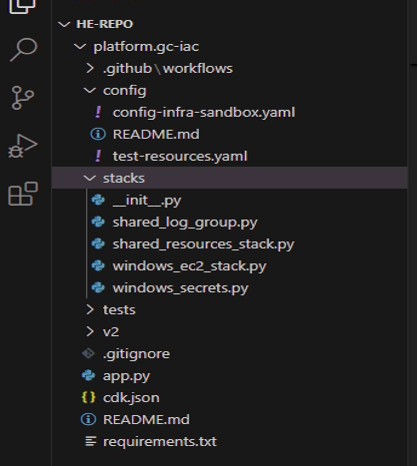
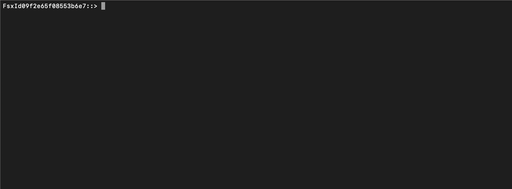
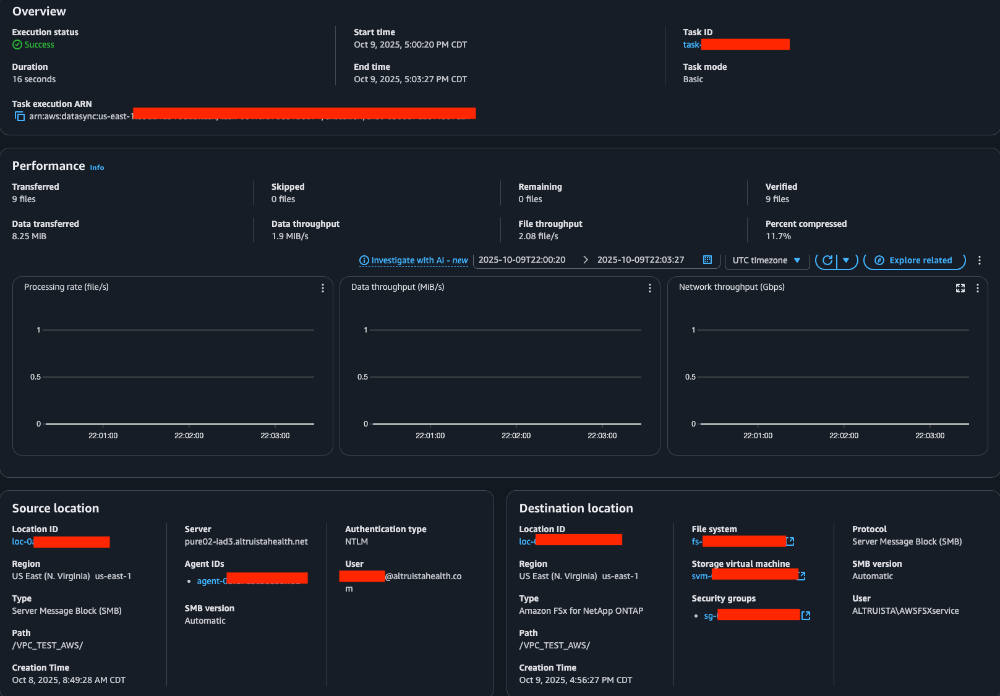
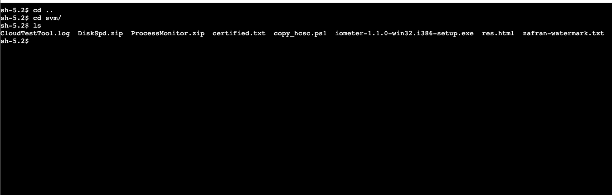

# Guiding Care: FSx NetApp ONTAP Implementation Guide

**Confluence Page:** https://healthedge.atlassian.net/wiki/spaces/CP1/pages/5159977104/Guiding%20Care%3A%20FSx%20NetApp%20ONTAP%20Implementation%20Guide

**Created by:** Khalid Ahmed on October 10, 2025  
**Last modified by:** Khalid Ahmed on October 10, 2025 at 07:49 PM

---

Executive Overview
==================

Purpose & Scope
---------------

This document serves as the implementation guide for deploying Amazon FSx for NetApp ONTAP as the GuidingCare (GC) Shared Storage solution. It provides detailed, reproducible instructions that enable infrastructure teams to consistently deploy FSx NetApp ONTAP across multiple AWS accounts and environments. This guide documents the complete implementation lifecycle—from initial environment preparation through deployment and data migration.

Guiding Care Shared Storage Target Architecture
-----------------------------------------------

.png)

*Target Architecture*

The Guiding Care shared storage target architecture deploys FSx for NetApp ONTAP in the GC Shared Services AWS account across two availability zones with preferred and standby file servers for automatic failover. This centralized file system supports the lift-and-shift migration strategy, receiving data from on-premises Pure Storage through AWS DataSync agents over Direct Connect. This share will operate as a shared resource accessed by workloads across multiple AWS accounts via Transit Gateway connections, enabling EC2 instances in different accounts to mount the SMB shares. The architecture maintains existing file access patterns for rehosted applications allowing the mounting of the share at locations determined by the GuidingCare team.

Phase 1: Prerequisites & CDK Environment Setup
==============================================

Phase Overview
--------------

This phase establishes the foundational environment for deploying FSx NetApp ONTAP using the GuidingCare Infrastructure as Code (IaC) platform. The primary objective is to configure the HE-Core/platform.gc-iac repository with the FSx NetApp ONTAP stack (fsx\_netapp\_ontap\_stack.py) and prepare a customized config.yaml file that defines the complete storage infrastructure. By the end of this phase, you will have a fully configured development environment with a feature branch containing your FSx-specific configuration, ready for CDK synthesis and deployment. This phase typically requires 2-3 days to complete, including time for access provisioning, environment validation, and configuration file customization.

Prerequisites
-------------

Before beginning this phase, ensure you have the following access, tools, and knowledge:

### Required Access

* **Repository Access**: Read/Write permissions to HE-Core/platform.gc-iac GitLab/GitHub repository
* **HE Sonet Access**: Okta access to HealthEdge Sonet

  + VSCode access confirmed in Sonet VDI

### Required Knowledge

* **AWS CDK Proficiency:** Understanding of CDK constructs, stacks, and synthesis process
* **Repository Architecture**: Familiarity with the HE-Core/platform.gc-iac structure:

  + Stack definitions location: /stacks/
  + Configuration files: /configs/config.yaml
  + CDK app entry point: app.py
* **YAML Configuration**: Ability to write and validate YAML syntax
* **Git Workflow**: Understanding of feature branch workflow and merge requests

For detailed information about the repository structure and CDK implementation patterns, review the [README.md](https://github.com/HE-Core/platform.gc-iac/blob/main/README.md) file in the HE-Core/platform.gc-iac repository. This documentation contains critical information about the stack architecture, deployment patterns, and configuration schema.

Repo Configuration
------------------

### Setup Local Development Environment

#### 1. Create Project Directory Structure (Optional):

|  |  |
| --- | --- |
|  | # Create a dedicated folder for your GC Platform Repo or confirm and utilize an existing location |
|  | mkdir -p C:/{*folder-location*} |
|  | cd C:/{*folder-location*} |

#### 2. Clone the Repository:

|  |  |
| --- | --- |
|  | # Clone via HTTPS (or other preferred method) |
|  | git clone <https://github.com/HealthEdge/HE-Core/platform.gc-iac.git> |

#### 3. GitHub SSO Authentication:

* A browser window will open automatically
* Sign in with your HealthEdge Okta credentials
* Approve the GitHub SSO request
* Return to terminal to confirm successful clone

#### 4. Open in IDE:

* Open the folder where the repo has been downloaded into VSCode or other approved IDE

#### 5. Verify Repository Structure: Once VSCode opens, confirm the following directory structure is present:



#### 6. Create Feature Branch

|  |  |
| --- | --- |
|  | # Ensure you're on the main branch and it's up to date |
|  | git checkout main |
|  | git pull origin main |
|  |  |
|  | # Create your feature branch for FSx implementation |
|  | git checkout -b *{feature-branch-name}* |
|  | # Example Branch Name: feature/fsx-netapp-deployment |

Phase 2: FSx CDK Configuration & CDK Deployment
===============================================

Phase Overview
--------------

This section will go through the overall parameters allowed when deploying the FSx using Python CDK. The config.yaml file defines all resources required for the given tenants deployment. This will be the location where the FSx NetApp ONTAP deployment will reside. The configuration is structured in layers: Globals, Templates, and Resource Groups (Security and Storage). Each layer references and builds upon the previous section to create a complete storage infrastructure.

Config File Overview
--------------------

### Global Configuration

The globals section defines environment-wide settings that are referenced throughout the configuration. These parameters establish the foundational network and tagging strategy for all resources.

#### Global Parameters

|  |  |  |  |
| --- | --- | --- | --- |
| **Parameter** | **Required** | **Description** | **Example** |
| region | Yes | AWS region for deployment | “us-east-1” |
| vpc\_id | Yes | Target VPC ID | “vpc-11111111111111” |
| vpc\_cidr | Yes | VPC CIDR block | “172.30.0.0/16” |
| common\_tags | Yes | Tags applied to all resources | See tags table below |

#### Common GlobalTags Structure

|  |  |  |
| --- | --- | --- |
| **TagKey** | **Description** | **Example** |
| BusinessUnit | Type of Business Unit | “GuidingCare” |
| Environment | Deployment environment | “Production” |
| Owner | Contact email for resource owner | “gc\_infrastructure@healthedge.com” |
| DataClassification | Data sensitivity level | “PHI” |
| ComplianceScope | Compliance Requirement | “AllThree” |
| Customer | Customer designation | “Shared” |
| DRS | Disaster recovery status | “False” |
| Backup | Backup requirement | “NotRequired” |

For a detailed overview and understanding on the defined required tasks for a given environment please review the following Tag Management confluence page.

### Security Resource Group

The security resource group contains all security-related resources that must be created before the storage infrastructure. These resources provide encryption, access control, and credential management for the FSx deployment.

#### Security Groups

|  |  |  |  |
| --- | --- | --- | --- |
| **Parameter** | **Required** | **Description** | **Example** |
| id | Yes | Unique Identifier for config reference | “fsx-netapp-sg” |
| name | Yes | AWS Security Group Name | “fsx-netapp-ontap-sg” |
| description | Yes | Security Group description | “Security group for FSx NetApp ONTAP” |
| ingress\_rules | Yes | List of inbound traffic rules | See ingress rules table |
| egress\_rules | Yes | List of outbound traffic rules | See egress rules table |
| tags | Yes | Resource tags | Reference common\_tags baseline |

##### Security Groups Ingress Rules Structure

|  |  |  |  |
| --- | --- | --- | --- |
| **Parameter** | **Required** | **Description** | **Example** |
| from\_port | Yes | Starting port number | “445” |
| to\_port | Yes | Ending port number | “445” |
| protocol | Yes | Network protocol | “tcp”, “udp”, “icmp” |
| cidr\_blocks | Yes \* | List of allowed CIDR blcks | [“172.30.0.0/16] |
| source\_security\_group\_id | Yes \* | Source security group ID | “sg-xxxxxxxxx” |
| description | Yes | Rule description | “SMB/CIFS access from VPC” |

**Note:**

* Either **cidr\_blocks** **or source\_security\_group\_id** must be specified
* Egress baseline allows all outbound traffic

##### Required Ports for FSx NetApp ONTAP

For a detailed overview on available ports for FSx NetApp ONTAP in AWS please review the following [AWS Documentation](https://docs.aws.amazon.com/fsx/latest/ONTAPGuide/limit-access-security-groups.html).

### Storage Resource Group

The storage resource group contains the FSx filesystem, Storage Virtual Machines (SVMs), and volumes. These resources depend on the security group being created first.

#### FSx Filesystems

The FSx filesystem is the primary storage resource that provides the NetApp ONTAP functionality in AWS. It manages the physical storage, networking, and high availability configuration.

|  |  |  |  |
| --- | --- | --- | --- |
| **Parameter** | **Required** | **Description** | **Example** |
| id | Yes | Unique identifier for config reference | “primary-fsx” |
| name | Yes | Filesystem name | “gc-fsxn-shared-use-1” |
| preferred\_subnet\_id | Yes | Primary Subnet for deployment | “subnet-11111111111111” |
| standby\_subnet\_id | Conditional | Standby Subnet for Multi AZ deployment | “subnet-11111111111111” |
| route\_tables\_id | Conditional | Route tables for Multi-AZ | [“rtb-11111111111111”] |
| endpoint\_ip\_address\_range | No | Custom IP range for endpoints | 172.30.2.255/24 |
| <<: fsx\_template | Yes | References fsx template | Reference FSx Template Parameters |

#### FSx Template Parameters

|  |  |  |  |  |
| --- | --- | --- | --- | --- |
| Parameter | Required | Description | Valid Values | Default |
| storage\_capacity | Yes | Storage size in Gib | 1024, 2048 etc |  |
| storage\_type | Yes | Storage media type | “SSD”. “HDD” |  |
| deployment\_type | Yes | Deployment architecture | Single\_AZ\_1, Single\_AZ\_2,  Multi\_AZ\_1,  Multi\_AZ\_2 |  |
| ha\_pairs | Conditional \* | Number of HA Pairs (Mutli-AZ) | 1-12 | 1 |
| Throughput\_capacity\_  per\_pair | Conditional \* | Throughput in MB/s per HA Pair (Mulit-AZ) | 384, 768, 1536 etc |  |
| automatic\_backup\_  retention\_days | No | Backup retention period in days | 0-90 | 7 |
| daily\_backup\_start\_time | No | Daily backup start time (UTC) | `"HH:MM"` format |  |
| weekly\_maintenance  \_start\_time | No | Weekly maintenance window | `"D:HH:MM"` format |  |
| disk\_iops\_mode | No | IOPs Configuration Mode | `"AUTOMATIC"`, `"USER_PROVISIONED"` | “`AUTOMATIC`” |

#### Storage Virtual Machines (SVMs)

SVMs provide logical separation within the FSx filesystem and handle Active Directory integration for SMB/CIFS authentication. Each SVM can host multiple volumes with different access permissions.

|  |  |  |  |
| --- | --- | --- | --- |
| **Parameter** | **Required** | **Description** | **Example** |
| id | Yes | Unique identifier for config reference | “smb\_svm” |
| name | Yes | Storage Virtual Machine Name | “gc-svm-shared-01” |
| filesystem\_id | Yes | Reference to parent filesystem ID | “primary-fsx” |
| root\_volume\_security\_style | Yes | Security style of SVM root volume | “NTFS” |
| tags | Yes | Resource specific tags | Reference common\_tags |

#### Volumes

Volumes are the actual storage containers that are mounted as shares. Each volume is associated with an SVM and becomes accessible as a distinct SMB/CIFS share or NFS export. The junction path determines the mount point within the SVM namespace.

|  |  |  |  |
| --- | --- | --- | --- |
| **Parameter** | **Required** | **Description** | **Example** |
| id | Yes | Unique identifier for config reference | “VPC-Test-Share” |
| name | Yes | Volume name | “VPC-Test-Share” |
| svm\_id | Yes | Reference to parent SVM | “svm-smb” |
| junction\_path | Yes | Mount path within SVM | “/VPC-Test-Share” |
| size\_in\_gb | Yes | Volume size in GB | 100 |
| security\_style | Yes | Volume security style | “NTFS” |
| storage\_efficiency\_enabled | Yes | Enable deduplication and compression | “True” |
| tiering\_policy.name | No | Data tiering policy | “Auto” |
| tiering\_policy\_cooling\_period | No | Days before data tiers to capacity pooling | 31 |

### Example Config.Yaml


```yaml
# Global Configuration
globals:
  region: "us-east-1"
  vpc_id: "vpc-00000000000000000"
  vpc_cidr: "172.31.0.0/16"
  
  # Common tags applied to all resources
  common_tags: &common_tags
    BusinessUnit: "GuidingCare"
    Environment: "Production"
    Owner: "gc_infrastructure@healthedge.com"
    DataClassification: "Internal"
    ComplianceScope: "None"
    Customer: "Shared"
    DRS: "False"
    Backup: "NotRequired"

# FSx filesystem template
fsx_template: &fsx_template
  storage_capacity: 1024  # Minimum: 1024 GiB, increments of 1024 GiB
  storage_type: "SSD"     # Options: "SSD" or "HDD"
  deployment_type: "MULTI_AZ_2"  # Options: "SINGLE_AZ_1", "SINGLE_AZ_2", "MULTI_AZ_1", "MULTI_AZ_2"
  ha_pairs: 1  # For MULTI_AZ_2 only, range: 1-12
  throughput_capacity_per_pair: 384  # For MULTI_AZ_2 only, valid: 384, 768, 1536, 3072, 6144 (MB/s)
  tags:
    <<: *common_tags
    ResourceType: "FSxFileSystem"

# SVM template with Active Directory integration for SMB/CIFS
svm_ad_template: &svm_ad_template
  root_volume_security_style: "NTFS"  # Required for SMB/CIFS shares
  tags:
    <<: *common_tags
    ResourceType: "SVM"

# Volume template
volume_template: &volume_template
  size_in_gb: 10  # Size in gigabytes, minimum: 20 MB (0.02 GB)
  storage_efficiency_enabled: true  # Required: true or false (enables deduplication and compression)
  security_style: "MIXED"             # Options: "UNIX", "NTFS", "MIXED", AWS default: MIXED
  tiering_policy:                     # AWS default: AUTO with 31 days
    name: "AUTO"                      # Options: "SNAPSHOT_ONLY", "AUTO", "ALL", "NONE"
  tags:
    <<: *common_tags
    ResourceType: "Volume"

# Resource Groups
resource_groups:
  security:
    dependencies: []
    resources:
      security_groups:
        # Main FSx NetApp ONTAP security group (created by this stack)
        - id: fsx-netapp-sg
          name: "fsx-netapp-ontap-security-group"
          description: "Security group for FSx NetApp ONTAP"
          ingress_rules:
            # SMB/CIFS access for any client in the VPC
            - from_port: 445
              to_port: 445
              protocol: tcp
              cidr_blocks: ["${ACCEPTED_CIDR}"]
              description: "SMB/CIFS access from VPC"
            # Management access ports
            - from_port: 22
              to_port: 22
              protocol: tcp
              cidr_blocks: ["{ACCEPTED_CIDR}"]
              description: "SSH access to ONTAP CLI"
            - from_port: -1
              to_port: -1
              protocol: icmp
              cidr_blocks: ["${ACCEPTED_CIDR}"]
              description: "ICMP for ping and network diagnostics"
          egress_rules:
            - from_port: 0
              to_port: 65535
              protocol: -1
              cidr_blocks: ["0.0.0.0/0"]
              description: "All outbound traffic"
          tags: *common_tags

      kms_keys:
        - id: fsx-kms-key
          description: "KMS key for FSx NetApp ONTAP encryption"
          enable_key_rotation: true
          tags: *common_tags

      secrets:
        - id: fsx-admin-password
          name: "fsx-netapp-ontap-admin-credentials"
          description: "FSx NetApp ONTAP Administrator credentials"
          username: "fsxadmin"
          generate_password: true
          password_length: 16
          exclude_characters: " \"'\\/@"
          tags: *common_tags
        - id: svm-admin-password
          name: "fsx-netapp-ontap-svm-admin-credentials"
          description: "FSx NetApp ONTAP SVM Administrator credentials"
          username: "svmadmin"
          generate_password: true
          password_length: 16
          exclude_characters: " \"'\\/@"
          tags: *common_tags

  storage:
    dependencies: ["security"]
    resources:
      fsx_filesystems:
        - id: primary-fsx
          name: "gc-fsxn-shared-use1"
          preferred_subnet_id: "subnet-00000000000000000" #Private Subnet 1
          standby_subnet_id: "subnet-00000000000000000" #Private Subnet 2
          # MULTI_AZ_2 specific configuration
          route_table_ids:
            - "rtb-00000000000000000"
          <<: *fsx_template

      svms:
        # SVM with Active Directory integration for SMB/CIFS shares
        - id: smb-svm
          name: "gc-test-svm-use1"
          filesystem_id: "primary-fsx"
          <<: *svm_ad_template

      volumes:
        # SMB/CIFS volumes on AD-integrated SVM
        - id: Test-Volume
          name: "TEST_VOLUME"
          svm_id: "smb-svm"
          junction_path: "/TEST-VOLUME"
          size_in_gb: 100  # 100GB
          security_style: "NTFS"  # Required for SMB/CIFS
          <<: *volume_template


```


### CDK Deployment

Once the config.yaml file is complete with all FSx NetApp ONTAP configurations, commit your changes to GitHub and have a PR created that is reviewed by necessary team to trigger the automated deployment pipeline. The GitHub Actions workflow will then deploy your FSx infrastructure to the target AWS account through the CDK stack.

|  |  |
| --- | --- |
|  | # Stage all your changes |
|  | git add . |
|  | git commit -m “Commit Message” |
|  | git push origin {feature-branch} |

#### Create Pull Request & Request Review

1. Navigate to: https://github.com/HealthEdge/HE-Core/platform.gc-iac

2. Click "Pull requests" → "New pull request"

3. Select your branch as source, main as target

4. Add pull request description

5. Request review by relevant team

#### Deployment

Once the PR is opened and approved to be merged to main, the GitHub Actions pipeline automatically validates the configuration syntax, synthesizes the CDK stack into CloudFormation templates, deploys the FSx infrastructure to the target AWS account, and verifies successful resource creation.

Phase 3: FSx NetApp Post CDK Deployment Configurations
======================================================

Phase Overview
--------------

This phase covers the essential post-deployment configurations required after the CDK stack has successfully created the FSx NetApp ONTAP infrastructure. The primary objective is to join the Storage Virtual Machine (SVM) to the Active Directory domain, which enables SMB/CIFS authentication and allows Windows clients to access the file shares. This process requires validating network connectivity between the FSx filesystem and Active Directory domain controllers, then completing the domain join operation through the AWS Console.

### Network Connectivity to Active Directory

#### Network Requirements

Before attempting to join the SVM to the domain, you must ensure network connectivity between the FSx NetApp ONTAP filesystem and your Active Directory infrastructure. The connectivity requirements differ based on where your Active Directory is hosted.

For On-Premises Active Directory:

* Verify VPN or Direct Connect connectivity is established
* Confirm AWS Network Firewall allows outbound traffic to on-premises AD
* Ensure on-premises firewall permits inbound traffic from AWS VPC CIDR

For AWS-Hosted Active Directory:

* Verify security groups allow traffic between FSx and AD instances
* Confirm AWS Network Firewall rules (if applicable) permit AD traffic
* Ensure route tables have proper routes to AD subnets

#### Required Ports for Active Directory Integration

.png)

### Storage Virtual Machine (SVM) Domain Join

#### Prerequisites

Once network connectivity is established to Active Directory, proceed with joining the SVM to the domain. You will need the following information ready before starting the domain join process.

#### Active Directory Configuration Requirements

|  |  |  |  |
| --- | --- | --- | --- |
| **Parameter** | **Required** | **Description** | **Example** |
| NetBIOS Name | Yes | Computer name for SVM in AD (15 char) | GCFSXSVM01 |
| Active Directory Domain | Yes | Fully qualified domain name | [Altruistahealth.net](http://Altruistahealth.net) |
| DNS IP Addresses | Yes | IP Addresses of DNS Servers (Comma Separated) | 10.0.1.10, 10.0.1.11 |
| Username | Yes | AD Account with domain join permissions | svc-svm-admin |
| Password | Yes | Password for service account | \*\*\*\*\*\*\*\*\*\* |
| Organizational Unit | No | OU where computer object will be created | OU=FSx,OU=Servers,DC=gc,DC=local |
| Delegated Admin Group | No | AD Group with FSx Admin rights | Domain Admins |

Navigate to the FSx Console by opening the AWS Console and selecting Amazon FSx, then locate and select your filesystem and click on the "Storage virtual machines" tab alongside Actions. There you will see the option “Join/Update Active Directory”.


Phase 4: Create SMB/CIFS Shares
===============================

Phase Overview
--------------

This phase covers the process of creating SMB/CIFS shares on the FSx NetApp ONTAP filesystem using NetApp ONTAP CLI commands. NetApp ONTAP is an enterprise storage operating system that provides advanced data management capabilities, and in FSx it can be accessed through the fsxadmin account via SSH. By connecting to the filesystem's management endpoint from an EC2 instance, administrators can use native ONTAP commands to create and configure shares, set permissions, and manage storage resources directly through the command-line interface.

### FSx Admin Instance Setup

#### EC2 Instance Requirements

To manage the FSx NetApp ONTAP filesystem, you need an EC2 instance or on-prem server with proper network access and SSH capabilities to the filesystem. This instance serves as your management jumpbox for executing ONTAP commands.

#### Instance Configuration:

* Launch an EC2 instance in the same VPC as your FSx filesystem
* Attach a security group that allows SSH (port 22) outbound to the FSx management endpoint
* Ensure the instance can reach the FSx management IP address

#### Network Requirements:

* The FSx security group must allow inbound SSH (port 22) from your EC2 instance
* If using floating endpoint IPs or custom IP ranges, ensure route tables have proper routes between the EC2 subnet and FSx subnets
* Verify bidirectional connectivity between the management instance and FSx endpoints

#### Connectivity Validation

Before attempting to connect, verify network connectivity:

| 1. | # Test connectivity to FSx management endpoint |
| --- | --- |
| 2. | ping <fsx-management-endpoint-ip> # If ICMP Traffic is allowed |

### Connect to FSx NetApp ONTAP

#### SSH Connection

Once network connectivity is confirmed, establish an SSH session to the FSx filesystem:

|  |  |
| --- | --- |
|  | # SSH to FSx management endpoint |
|  | ssh fsxadmin@<fsx-management-endpoint-id> |
|  | #When prompted, enter the fsxadmin password |
|  | # Initial password can be retrieved from AWS Secrets manager if auto generated |

Upon entering the password you should be in the FSx NetApp Ontap CLI. This will be the location where you will be updating any shares related setups associated to your FSx NetApp Ontap FS. For documentation on ONTAP CLI commands please reference the [NetApp Command Reference](https://docs.netapp.com/us-en/ontap-cli/index.html) as well as the AWS FSx for ONTAP documentation on [Managing FSx for ONTAP resources using NetApp applications](https://docs.aws.amazon.com/fsx/latest/ONTAPGuide/managing-resources-ontap-apps.html).



### Create SMB/CIFS Shares

#### ONTAP Command Structure

Once logged into the FSx filesystem as fsxadmin, use NetApp ONTAP commands to create and manage shares.

| **#Basic share creation syntax** |
| --- |
| vserver cifs share create -vserver {SVM-Server-Name} -share-name {Share-Name} -path /{Junction-Path} |

Confirm the share has been created.

| **#Basic share show syntax** |
| --- |
| vserver cifs share show |

Phase 5: DataSync Implementation
================================

Phase Overview
--------------

Now that the FSx NetApp ONTAP has been deployed, joined to the domain, and configured with CIFS shares, this phase focuses on implementing AWS DataSync to facilitate data migration from on-premises file shares to the newly created FSx shares. The DataSync implementation involves deploying a DataSync agent in the on-premises environment, creating source and destination locations that define the connection points for data transfer, and configuring transfer tasks that orchestrate the actual data movement.

Implementation Guide
--------------------

For detailed step-by-step instructions on deploying the DataSync agent, configuring source and destination locations, and creating transfer tasks, please refer to the comprehensive **DataSync Implementation Guide**. This guide provides complete walkthrough procedures including agent deployment, network configuration, location setup, and transfer task orchestration.

Security Group Configuration for DataSync
-----------------------------------------

### FSx Security Group Updates

After the initial FSx deployment, you must update the FSx NetApp ONTAP security group to allow DataSync traffic on port 443 from the DataSync Agents security group. This enables the DataSync agent to establish a secure connection from on-premises to the FSx filesystem.

Phase 6: Test Share Implementation
==================================

DataSync Task Results from Test Share Execution
-----------------------------------------------

The following image shows the latest DataSync Task execution from the current on-premises Pure Flash Blade test share to the newly created FSx NetApp Ontap test share. This was a total of 9 files that took a total of 16 seconds to complete.



Once the DataSync execution has successfully completed, you can verify the data transfer by mounting the FSx share from a domain-joined client. Upon accessing the share using the SMB path (e.g., `\\svm-endpoint\share-name`), you will see all files and folders that were migrated from the on-premises source, with their permissions and metadata intact as transferred by the DataSync task.

