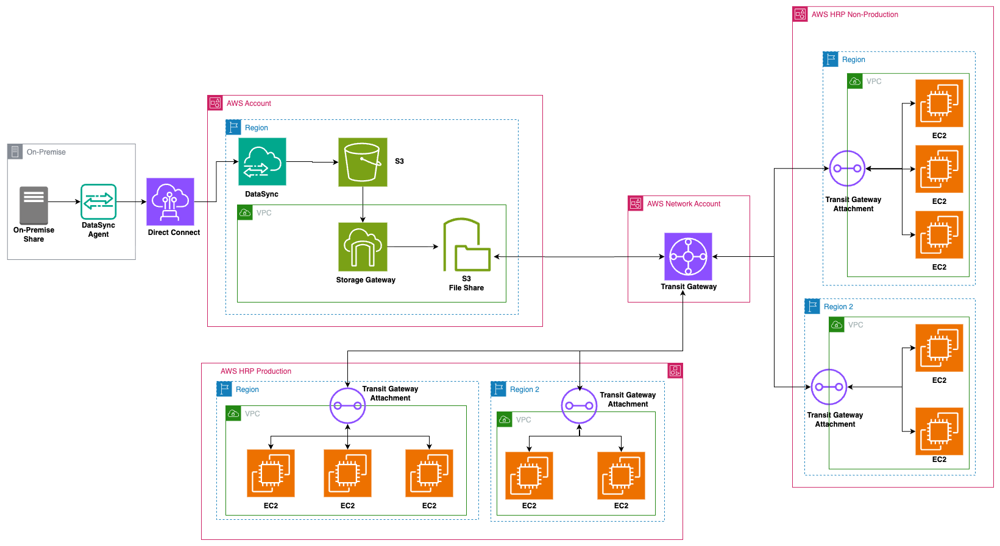

# HRP Shared Storage Target Architecture

**Confluence Page:** https://healthedge.atlassian.net/wiki/spaces/CP1/pages/5116395628/HRP%20Shared%20Storage%20Target%20Architecture

**Created by:** Khalid Ahmed on September 22, 2025  
**Last modified by:** Khalid Ahmed on September 23, 2025 at 02:59 PM

---

Background
----------

As part of HealthEdge's cloud consolidation and modernization journey, the company seeks to migrate from their current siloed infrastructure spread across on-premises, GCP, and Azure to a unified AWS Cloud platform. This consolidation effort encompasses their entire product portfolio, including Health Rules Payor (HRP). which is a comprehensive claims and benefits administration.

Motivation
----------

As part of HealthEdge's cloud consolidation and modernization journey, the company seeks to migrate Health Rules Payor (HRP) from their current siloed infrastructure spread across on-premises, GCP, and Azure to a unified AWS Cloud platform. The HRP team requested a NAS share be available for their deployment process. This share follows an established workflow where software is downloaded once, stored in a ticket-numbered directory on the deployment share, and then reused across environment promotions from non-production to production, ensuring the same files are deployed consistently across all environments. This share needs to be accessible across multiple AWS accounts and regions where customer environments are located, supporting both Windows servers (via SMB) and Linux servers (via NFS) for deployment operations.

Discovery
---------

Shared storage discover was completed through ModelizeIT output analysis and HRP team discussions, the following table summarizes the current NFS/CIFS storage mounts present in HRP and their AWS migration approach:

|  |  |  |
| --- | --- | --- |
| **Storage Mount Path** | **Current Setup** | **Expected Migration Solution** |
| iway | Server-to-server NFS mounts | No change - Migrate servers and re-mount |
| printComm | CIFS shares for PDF storage | Decommissioning before AWS migration |
| cmAppFax | NFS4 for fax application | Decommissioning before AWS migration |
| hec\_sc\_letters | Customer-owned CIFS over VPN | Network connectivity only (VPN or Direct Connect) |
| /mnt/HE-PROD | Customer-owned CIFS mounted on awh-wl and awh-con servers | Network connectivity only (VPN or Direct Connect) |
| /mnt/HE-PREPROD | Customer-owned CIFS mounted on awh-wl and awh-con servers | Network connectivity only (VPN or Direct Connect) |
| **/util/fax** | NFS4 on CareManager utility servers | Decommissioning before AWS migration |

The migration approach for the following storage systems require minimal effort. Three systems (printComm, cmAppFax, and /util/fax) will be decommissioned and not moved to AWS during the migration due to product discontinuation. The iway NFS mounts migrate with their host servers, maintaining existing configurations. Lastly, customer-owned external shares (hec\_sc\_letters, HE-PROD, and HE-PREPROD) remain under customer management and only require VPN or Direct Connect connectivity in AWS—no data migration or storage provisioning needed.

For the AWS migration the HRP team has stated a need for a NAS shared storage solutions for their deployment operations in AWS. This deployment share stores third-party software and deployment files that are referenced across environment promotions. The workflow involves downloading vendor software, storing it in ticket-numbered directories, and referencing these files during subsequent non-prod to prod deployments to ensure consistency. The shares must be accessible for Windows and Linux servers across all environments.

*Target Architecture*

The proposed solution for the deployment share in AWS will utilize AWS Storage Gateway S3 File Gateway, deployed in the HRP Shared Services account to provide centralized storage access across all HRP-related accounts. Storage Gateway supports both NFS (versions 3 and 4.1) and SMB (versions 2 and 3) protocols, enabling seamless integration with both Linux and Windows environments while maintaining native file system semantics including permissions, timestamps, and file ownership metadata. The architecture will create two distinct shares within the same S3 bucket using prefix-based separation—one configured for Windows servers using SMB protocol and another for Linux systems using NFS—allowing each operating system to access storage through its native protocol while maintaining data in a unified S3 backend.

Connectivity between accounts will be established through a Transit Gateway hosted in the AWS Network Account, which serves as a central hub connecting the HRP Shared Services account with each target account (production, non-production, and internal). The initial data migration from on-premises to AWS will be executed using AWS DataSync, with the DataSync agent installed on the on-premises server and configured to transfer data directly to the target S3 bucket via Direct Connect, ensuring efficient and reliable data transfer.

Architectural Components
------------------------

Below table describes the architectural component that makes up the to-be architecture diagram of Health Rules Payor (HRP).

|  |  |  |  |
| --- | --- | --- | --- |
| Ref# | Logical Component Name | Description | Details |
| 1 | Direct Connect | AWS Direct Connect establishes a private, consistent, high-bandwidth network connection between your on-premises network and AWS | 10 Gbps link from on-premises |
| 2 | AWS Region | Region for this application | us-east-1, us-west-2 |
| 3 | VPC | A virtual private cloud (VPC) is a secure, isolated private cloud hosted within a public cloud | Segregated based on environment (Need Confirmation from Network team) |
| 4 | AWS Storage Gateway | Storage Gateway is a hybrid cloud storage service that provides on-premises access to virtually unlimited cloud storage by connecting your existing infrastructure | Will utilize one Storage Gateway located in the HRP Shared account. |
| 5 | Storage Gateway S3 FileShare | Provides access to data stored in S3 or FSx as file objects, ideal for file shares and data that needs to be accessed using standard file protocols. | Will be utilizing two shares one for SMB and NFS and associating them to seperate S3 Prefix paths within the same S3 bucket. |
| 6 | AWS DataSync | AWS DataSync is an online data transfer service simplifies data migration and securely transfer data to, from, and between AWS storage services. | For the Deployment Share solution all data will be sent to S3 using Data Sync from on-premise. |
| 7 | Amazon S3 | Amazon S3 is an object storage service offered by Amazon. It provides highly scalable, durable, and secure solution for storing and retrieving any amount of data. | EKS will be utilized for WebUI and Melissadata Micro Services. |
| 8 | AWS Transit Gateway | AWS Transit Gateway is managed network routing and connectivity service that acts as a central hub, simplifying network architecture by connecting multiple Amazon Virtual Private Clouds (VPCs) and on-premises networks | Will be deployed and utilized for cross account access of HRP Deployment Share located in the HRP Shared Account. |
| 9 | AWS Transit Gateway Attachment | AWS Transit Gateway attachment is a resource that connects an Amazon Virtual Private Cloud (VPC), AWS Site-to-Site VPN, or AWS Direct Connect gateway to the Transit Gateway service, acting as a central cloud router | Will be attached to each respective VPC of every account and every region where the Storage Gateway share needs to be mounted on. |
| 10 | Amazon EC2 | All EC2 instances will be rehosted using CMF and AWS MGN outside of Delphix and clustered database servers. | Once servers are migrated if they require the deployment share we will need to allow connection to be established and mounting of the share |