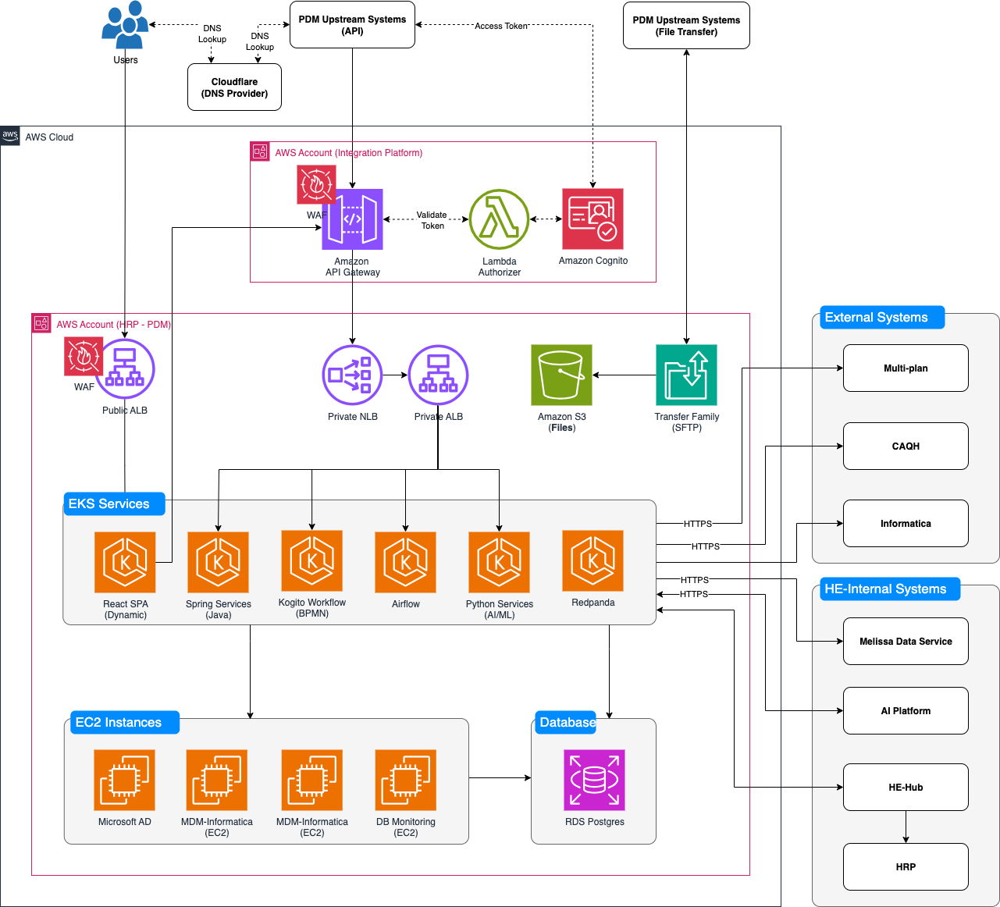
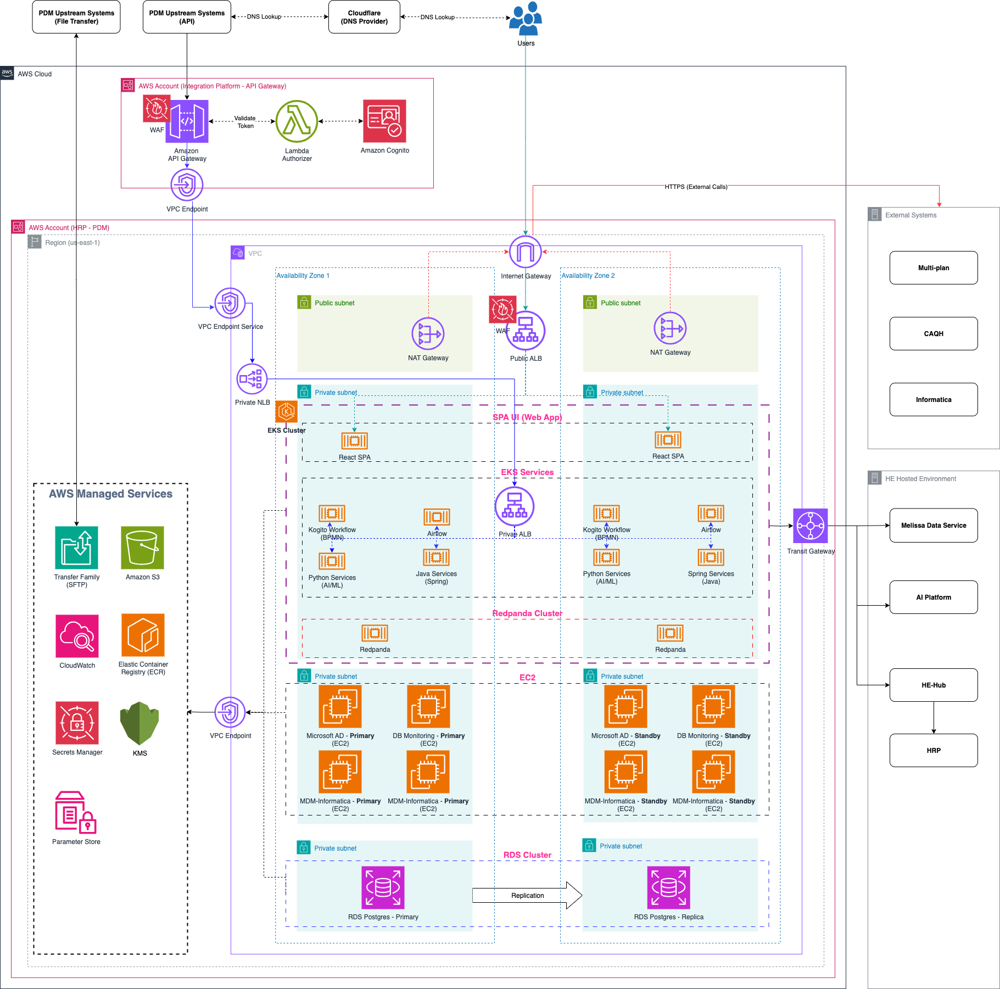

# PDM Target Architecture

**Confluence Page:** https://healthedge.atlassian.net/wiki/spaces/CP1/pages/5330010180/PDM%20Target%20Architecture

**Created by:** Sreenivas Algoti on December 10, 2025  
**Last modified by:** Sreenivas Algoti on January 12, 2026 at 12:53 AM

---

1. PDM Solution Architecture - Target State (Proposed)
======================================================

2. PDM Physical Architecture - Target State (Proposed)
======================================================

3. Architectural Components
===========================

| **Component/Service Name** | **Description** | **Comments** |
| --- | --- | --- |
| EKS | Managed Kubernetes service that runs containerized applications with automatic scaling and high availability |  |
| EC2 | Virtual servers (instances) in the cloud providing scalable compute capacity for various workloads |  |
| Redpanda on EKS | Kafka-compatible event streaming platform deployed on EKS for high-performance real-time data pipelines. |  |
| Lambda Authorizer | Custom authorization logic for API Gateway that validates tokens/credentials before allowing API access | OAuth2 custom authorizer for API Gateway |
| Amazon API Gateway | Managed service to create, publish, secure and manage REST/WebSocket/HTTP APIs at any scale |  |
| Amazon Cognito | Managed user identity service providing authentication, authorization, and user management for web and mobile applications. | OAuth2 provider for API Gateway (used for machine-to-machine authentication in HealthEdge) |
| Amazon S3 | Scalable object storage service for storing and retrieving any amount of data from anywhere. |  |
| Amazon RDS Postgres | Managed PostgreSQL database service with automated backups, patching, scaling, and high availability. |  |
| AWS SFTP Transfer Family | Managed file transfer service enabling secure SFTP, FTPS, and FTP access to Amazon S3 or EFS. |  |
| Amazon Elastic Container Registry (ECR) | Fully managed Docker container registry for storing, managing, and deploying container images. |  |
| AWS WAF | Web Application Firewall that protects applications from common web exploits, bots, and malicious traffic. |  |
| AWS Secrets Manager | Service for securely storing, rotating, and managing access to secrets like database credentials and API keys. |  |
| AWS Key Management Service (AWS KMS) | Managed service for creating and controlling cryptographic keys used to encrypt your data. |  |
| Parameter Store (AWS AWS Systems Manager Parameter Store) | Secure hierarchical storage for configuration data, plain text, or encrypted secrets. |  |
| Amazon CloudWatch | Monitoring and observability service for collecting metrics, logs, and events from AWS resources and applications. |  |
| Public ALB | Internet-facing Application Load Balancer distributing incoming HTTP/HTTPS traffic to multiple targets. |  |
| Private ALB | Internal Application Load Balancer that routes HTTP/HTTPS traffic between services within a VPC without internet exposure. |  |
| Private NLB | Internal Network Load Balancer handling high-throughput, low-latency TCP/UDP traffic within a VPC. |  |
| Internet Gateway | VPC component enabling bidirectional communication between VPC resources and the internet. |  |
| NAT Gateway | Managed service allowing private subnet resources to access the internet while preventing inbound connections. |  |
| Transit Gateway | Central hub connecting multiple VPCs, on-premises networks, and VPNs through a single gateway. |  |
| VPC Endpoint | Private connection enabling VPC resources to access AWS services without traversing the public internet. |  |
| VPC Endpoint Service | Feature allowing you to expose your own applications as private endpoints for other VPCs (or accounts) to consume privately. |  |
| Public Subnet | Subnet with a route table entry directing traffic to an Internet Gateway for public internet access. |  |
| Private Subnet | Subnet without direct internet access, typically routing outbound traffic through a NAT Gateway. |  |