# GitHub Access

**Confluence Page:** https://healthedge.atlassian.net/wiki/spaces/CAS/pages/4937056299/GitHub%20Access

**Created by:** Veena Vemula on July 16, 2025  
**Last modified by:** Veena Vemula on July 16, 2025 at 05:32 PM

---

Login to [cas-auto-pr03.healthedge.biz](http://cas-auto-pr03.healthedge.biz) using your <a-account>.

Once logged in, proceed to your home `.ssh` directory by entering the following command:


```bash
cd .ssh
```


Next, generate your SSH key, id\_rsa.pub, if one does not exist, by executing the command below:


```bash
ssh-keygen
```


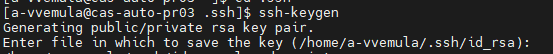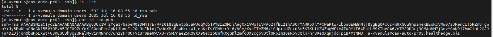

### To access GitHub, please log in using the following link:

<https://github.com/HE-Core>

Go to settings under your username

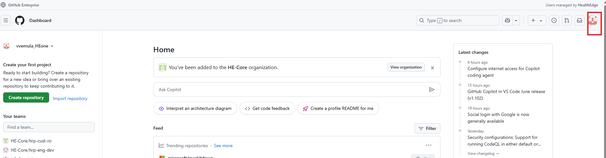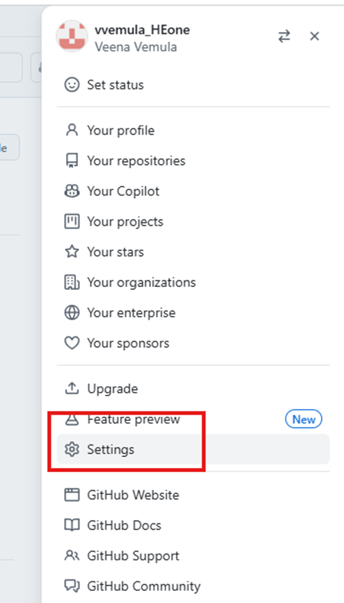

Navigate to the SSH and GPG Keys section and click on "New SSH Key."

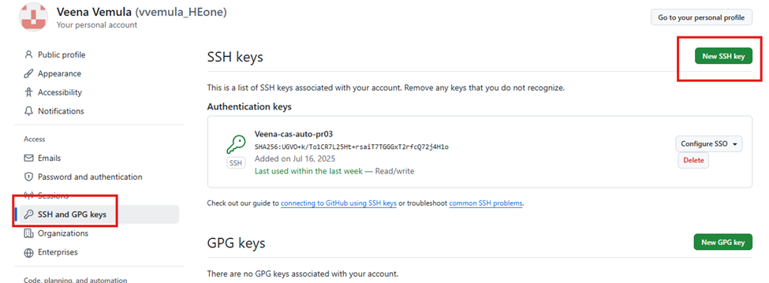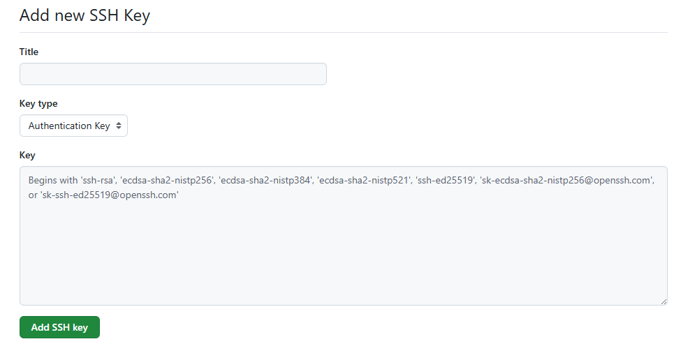

Title – Choose a name of your choice

Key – Copy and paste the `id_ras.pub` key from the `cas-auto-pr03` server, which was generated in Step 1, and then click on Add SSH Key.

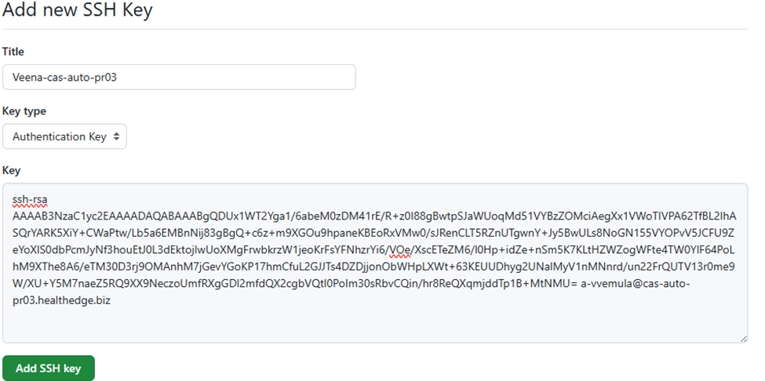

Once the SSH key has been added, the next step is to authorize the repository.

Click the dropdown button and select "Authorize."

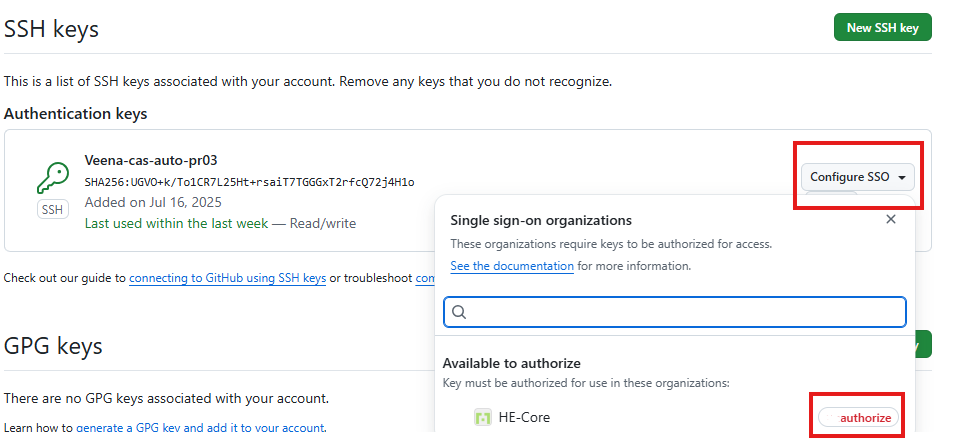

#### Clone the Repo

Repo Name: [hrp.core.environments.customer](https://github.com/HE-Core/hrp.core.environments.customer)

Enter the repository name in the search bar at the top and press enter.

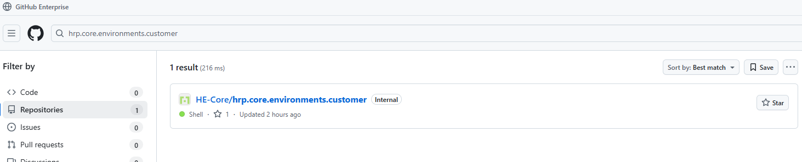

To clone the repository, navigate to the "Code" section, select "SSH," and then click "Copy."

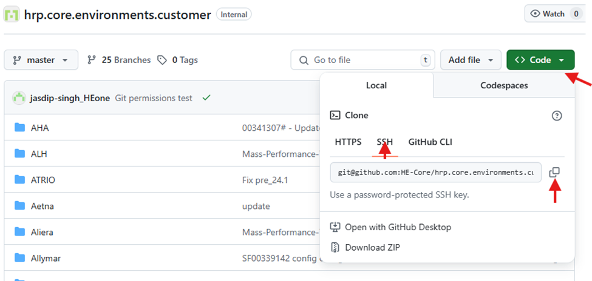

Please log in to [cas-auto-pr03.healthedge.biz](http://cas-auto-pr03.healthedge.biz) using your <a-account>. Once logged in, execute the following command in your home directory.


```bash
git clone git@github.com:HE-Core/hrp.core.environments.customer.git
```


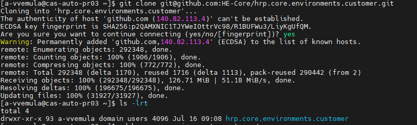