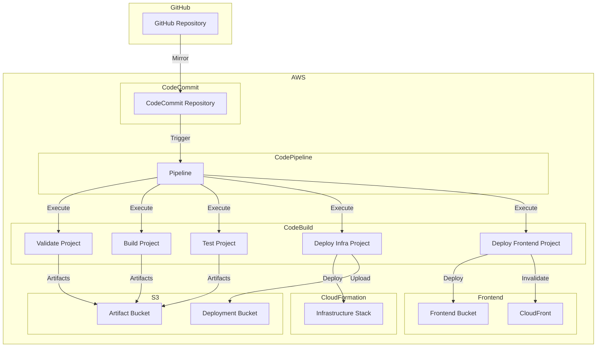

# AWS DRS Orchestration - CI/CD Setup Guide

This guide provides detailed instructions for setting up and configuring the CI/CD pipeline for the AWS DRS Orchestration platform using AWS CodeCommit, CodeBuild, and CodePipeline.

## Table of Contents

- [Overview](#overview)
- [Prerequisites](#prerequisites)  
- [CI/CD Architecture](#cicd-architecture)
- [Setup Process](#setup-process)
- [Pipeline Configuration](#pipeline-configuration)
- [BuildSpec Customization](#buildspec-customization)
- [GitHub Integration](#github-integration)
- [Pipeline Monitoring](#pipeline-monitoring)
- [Troubleshooting](#troubleshooting)
- [Best Practices](#best-practices)
- [Advanced Configuration](#advanced-configuration)

## Overview

The AWS DRS Orchestration CI/CD pipeline provides:

- **Automated Validation**: CloudFormation template validation, code quality checks
- **Automated Building**: Lambda packaging, frontend builds
- **Automated Testing**: Unit tests, integration tests, security scans
- **Automated Deployment**: Infrastructure and application deployment
- **GitHub Integration**: Automatic mirroring from GitHub to CodeCommit

### Pipeline Stages

1. **Source**: CodeCommit repository with GitHub mirroring
2. **Validate**: CloudFormation validation, Python/TypeScript linting
3. **Build**: Lambda packages, React frontend build
4. **Test**: Unit tests, integration tests, coverage reports
5. **Deploy Infrastructure**: CloudFormation deployment
6. **Deploy Frontend**: S3 sync, CloudFront invalidation

## Prerequisites

### AWS Services Required

- AWS CodeCommit
- AWS CodeBuild
- AWS CodePipeline
- AWS S3 (for artifacts)
- AWS IAM (for service roles)
- AWS Secrets Manager (for GitHub integration)

### Permissions Required

The deployment user/role needs permissions for:

```json
{
  "Version": "2012-10-17",
  "Statement": [
    {
      "Effect": "Allow",
      "Action": [
        "codecommit:*",
        "codebuild:*",
        "codepipeline:*",
        "s3:*",
        "iam:CreateRole",
        "iam:AttachRolePolicy",
        "iam:PassRole",
        "secretsmanager:CreateSecret",
        "secretsmanager:GetSecretValue"
      ],
      "Resource": "*"
    }
  ]
}
```

### GitHub Requirements (Optional)

- GitHub repository: https://github.com/johnjcousens/aws-elasticdrs-orchestrator
- GitHub Personal Access Token with `repo` permissions
- Webhook configuration for automatic mirroring

## CI/CD Architecture



## Setup Process

### Step 1: Enable CI/CD During Fresh Deployment

```bash
# Deploy with CI/CD enabled (default)
./scripts/fresh-deployment-setup.sh \
  --admin-email admin@yourcompany.com \
  --enable-cicd

# Or explicitly enable CI/CD
./scripts/fresh-deployment-setup.sh \
  --admin-email admin@yourcompany.com \
  --enable-cicd
```

### Step 2: Configure GitHub Integration (Optional)

If you want automatic mirroring from GitHub:

```bash
# Store GitHub Personal Access Token in Secrets Manager
aws secretsmanager create-secret \
  --name "aws-elasticdrs-orchestrator/dev/github-token" \
  --description "GitHub Personal Access Token for repository mirroring" \
  --secret-string "ghp_your_github_token_here" \
  --region us-east-1

# Update the secret if it already exists
aws secretsmanager update-secret \
  --secret-id "aws-elasticdrs-orchestrator/dev/github-token" \
  --secret-string "ghp_your_github_token_here" \
  --region us-east-1
```

### Step 3: Get Repository Information

```bash
# Get CodeCommit repository URL
REPO_URL=$(aws cloudformation describe-stacks \
  --stack-name aws-elasticdrs-orchestrator-dev \
  --region us-east-1 \
  --query 'Stacks[0].Outputs[?OutputKey==`RepositoryCloneUrlHttp`].OutputValue' \
  --output text)

echo "CodeCommit Repository: $REPO_URL"

# Get pipeline URL
PIPELINE_URL=$(aws cloudformation describe-stacks \
  --stack-name aws-elasticdrs-orchestrator-dev \
  --region us-east-1 \
  --query 'Stacks[0].Outputs[?OutputKey==`PipelineUrl`].OutputValue' \
  --output text)

echo "Pipeline Console: $PIPELINE_URL"
```

### Step 4: Clone and Configure Repository

```bash
# Clone the CodeCommit repository
git clone $REPO_URL aws-drs-orchestrator-cicd
cd aws-drs-orchestrator-cicd

# Configure Git credentials (if using HTTPS)
git config credential.helper '!aws codecommit credential-helper $@'
git config credential.UseHttpPath true

# Add the original repository as upstream (optional)
git remote add upstream https://github.com/johnjcousens/aws-elasticdrs-orchestrator.git
```

## Pipeline Configuration

### Pipeline Parameters

The pipeline is configured with these environment variables:

| Variable | Value | Description |
|----------|-------|-------------|
| PROJECT_NAME | aws-elasticdrs-orchestrator | Project name for resource naming |
| ENVIRONMENT | dev | Environment name |
| DEPLOYMENT_BUCKET | aws-elasticdrs-orchestrator | S3 bucket for deployment artifacts |
| AWS_REGION | us-east-1 | AWS region for deployment |

### Service Roles

The pipeline creates these IAM roles:

1. **CodePipeline Service Role**: `aws-elasticdrs-orchestrator-dev-pipeline-service-role`
2. **CodeBuild Service Roles**: One for each build project
3. **CloudFormation Deployment Role**: `aws-elasticdrs-orchestrator-dev-cfn-deployment-role`

### Artifact Management

- **Source Artifacts**: Stored in CodeCommit
- **Build Artifacts**: Stored in S3 artifact bucket
- **Deployment Artifacts**: Stored in S3 deployment bucket

## BuildSpec Customization

### Validate BuildSpec (`buildspecs/validate-buildspec.yml`)

Customization options:

```yaml
# Add custom validation tools
install:
  runtime-versions:
    python: 3.12
    nodejs: 22
  commands:
    - pip install custom-validator==1.0.0
    - npm install -g custom-linter

# Add custom validation commands
build:
  commands:
    - custom-validator cfn/
    - custom-linter frontend/src/
```

### Build BuildSpec (`buildspecs/build-buildspec.yml`)

Customization options:

```yaml
# Customize Lambda packaging
build:
  commands:
    # Add custom dependencies
    - pip install custom-library==2.0.0 -t lambda/api-handler/
    
    # Custom build steps
    - python scripts/custom-build-step.py
    
    # Custom frontend build
    - cd frontend && npm run build:custom
```

### Test BuildSpec (`buildspecs/test-buildspec.yml`)

Customization options:

```yaml
# Add custom test frameworks
install:
  commands:
    - pip install custom-test-framework==1.0.0

# Custom test execution
build:
  commands:
    # Run custom tests
    - python -m custom_test_framework tests/
    
    # Generate custom reports
    - custom-reporter --output reports/custom-report.xml
```

### Deploy Infrastructure BuildSpec (`buildspecs/deploy-infra-buildspec.yml`)

Customization options:

```yaml
# Custom deployment parameters
build:
  commands:
    # Deploy with custom parameters
    - aws cloudformation deploy \
        --template-file cfn/master-template.yaml \
        --stack-name $PROJECT_NAME-$ENVIRONMENT \
        --parameter-overrides \
          ProjectName=$PROJECT_NAME \
          Environment=$ENVIRONMENT \
          CustomParameter=CustomValue \
        --capabilities CAPABILITY_NAMED_IAM
```

### Deploy Frontend BuildSpec (`buildspecs/deploy-frontend-buildspec.yml`)

Customization options:

```yaml
# Custom frontend deployment
build:
  commands:
    # Custom configuration generation
    - python scripts/generate-custom-config.py
    
    # Custom S3 sync options
    - aws s3 sync frontend/dist/ s3://$FRONTEND_BUCKET/ \
        --delete \
        --cache-control "public, max-age=86400" \
        --exclude "*.html" \
        --exclude "config.js"
```

## GitHub Integration

### Automatic Mirroring Setup

The CI/CD stack automatically sets up GitHub mirroring if a GitHub token is provided:

```bash
# 1. Create GitHub Personal Access Token
# Go to GitHub Settings > Developer settings > Personal access tokens
# Create token with 'repo' permissions

# 2. Store token in AWS Secrets Manager
aws secretsmanager create-secret \
  --name "aws-elasticdrs-orchestrator/dev/github-token" \
  --secret-string "ghp_your_token_here" \
  --region us-east-1

# 3. The CodeCommit stack will automatically configure mirroring
```

### Manual GitHub Integration

If automatic mirroring is not working:

```bash
# 1. Clone both repositories
git clone https://github.com/johnjcousens/aws-elasticdrs-orchestrator.git github-repo
git clone $CODECOMMIT_URL codecommit-repo

# 2. Set up manual sync
cd github-repo
git remote add codecommit $CODECOMMIT_URL

# 3. Push changes to both repositories
git push origin main
git push codecommit main
```

### Webhook Configuration

For real-time mirroring, configure GitHub webhooks:

```bash
# Get webhook URL from CodeCommit stack outputs
WEBHOOK_URL=$(aws cloudformation describe-stacks \
  --stack-name aws-elasticdrs-orchestrator-dev \
  --region us-east-1 \
  --query 'Stacks[0].Outputs[?OutputKey==`GitHubWebhookUrl`].OutputValue' \
  --output text)

echo "Configure GitHub webhook: $WEBHOOK_URL"
```

## Pipeline Monitoring

### Pipeline Status

```bash
# Check pipeline status
aws codepipeline get-pipeline-state \
  --name aws-elasticdrs-orchestrator-dev-pipeline \
  --region us-east-1

# Get pipeline execution history
aws codepipeline list-pipeline-executions \
  --pipeline-name aws-elasticdrs-orchestrator-dev-pipeline \
  --region us-east-1 \
  --max-items 10
```

### Build Project Status

```bash
# List all build projects
aws codebuild list-projects \
  --region us-east-1 \
  --query 'projects[?contains(@, `aws-elasticdrs-orchestrator-dev`)]'

# Get build history for a specific project
aws codebuild list-builds-for-project \
  --project-name aws-elasticdrs-orchestrator-dev-validate \
  --region us-east-1 \
  --max-items 10
```

### CloudWatch Logs

```bash
# View pipeline logs
aws logs tail /aws/codepipeline/aws-elasticdrs-orchestrator-dev-pipeline \
  --since 1h --region us-east-1

# View build logs
aws logs tail /aws/codebuild/aws-elasticdrs-orchestrator-dev-validate \
  --since 1h --region us-east-1
```

### Notifications

Set up SNS notifications for pipeline events:

```bash
# Create SNS topic
aws sns create-topic \
  --name aws-elasticdrs-orchestrator-dev-pipeline-notifications \
  --region us-east-1

# Subscribe to notifications
aws sns subscribe \
  --topic-arn arn:aws:sns:us-east-1:123456789012:aws-elasticdrs-orchestrator-dev-pipeline-notifications \
  --protocol email \
  --notification-endpoint admin@yourcompany.com \
  --region us-east-1
```

## Troubleshooting

### Common Issues

#### 1. Pipeline Fails at Source Stage

**Problem**: CodeCommit repository is empty or inaccessible.

**Solution**:
```bash
# Check repository status
aws codecommit get-repository \
  --repository-name aws-elasticdrs-orchestrator-dev-repo \
  --region us-east-1

# Push initial code
git clone $CODECOMMIT_URL
cd aws-elasticdrs-orchestrator-dev-repo
# Add your code
git add .
git commit -m "Initial commit"
git push origin main
```

#### 2. Validate Stage Fails

**Problem**: CloudFormation templates have syntax errors.

**Solution**:
```bash
# Validate templates locally
aws cloudformation validate-template \
  --template-body file://cfn/master-template.yaml \
  --region us-east-1

# Check build logs
aws codebuild batch-get-builds \
  --ids $(aws codebuild list-builds-for-project \
    --project-name aws-elasticdrs-orchestrator-dev-validate \
    --region us-east-1 \
    --query 'ids[0]' --output text) \
  --region us-east-1 \
  --query 'builds[0].logs.cloudWatchLogs.groupName'
```

#### 3. Build Stage Fails

**Problem**: Lambda packaging or frontend build issues.

**Solution**:
```bash
# Check build project configuration
aws codebuild batch-get-projects \
  --names aws-elasticdrs-orchestrator-dev-build \
  --region us-east-1

# Test build locally
cd lambda/api-handler
pip install -r requirements.txt -t .
zip -r api-handler.zip .
```

#### 4. Deploy Infrastructure Fails

**Problem**: CloudFormation deployment errors.

**Solution**:
```bash
# Check CloudFormation events
aws cloudformation describe-stack-events \
  --stack-name aws-elasticdrs-orchestrator-dev \
  --region us-east-1 \
  --query 'StackEvents[?ResourceStatus==`CREATE_FAILED`]'

# Check deployment role permissions
aws iam get-role \
  --role-name aws-elasticdrs-orchestrator-dev-cfn-deployment-role
```

#### 5. Deploy Frontend Fails

**Problem**: S3 sync or CloudFront invalidation issues.

**Solution**:
```bash
# Check S3 bucket permissions
aws s3api get-bucket-policy \
  --bucket $(aws cloudformation describe-stacks \
    --stack-name aws-elasticdrs-orchestrator-dev \
    --region us-east-1 \
    --query 'Stacks[0].Outputs[?OutputKey==`FrontendBucketName`].OutputValue' \
    --output text)

# Check CloudFront distribution
aws cloudfront list-distributions \
  --query 'DistributionList.Items[?contains(Comment,`aws-elasticdrs-orchestrator`)].Status'
```

### Debug Commands

```bash
# Get detailed pipeline execution
EXECUTION_ID=$(aws codepipeline list-pipeline-executions \
  --pipeline-name aws-elasticdrs-orchestrator-dev-pipeline \
  --region us-east-1 \
  --query 'pipelineExecutionSummaries[0].pipelineExecutionId' \
  --output text)

aws codepipeline get-pipeline-execution \
  --pipeline-name aws-elasticdrs-orchestrator-dev-pipeline \
  --pipeline-execution-id $EXECUTION_ID \
  --region us-east-1

# Get build details
BUILD_ID=$(aws codebuild list-builds-for-project \
  --project-name aws-elasticdrs-orchestrator-dev-validate \
  --region us-east-1 \
  --query 'ids[0]' --output text)

aws codebuild batch-get-builds \
  --ids $BUILD_ID \
  --region us-east-1
```

## Best Practices

### Security

1. **Least Privilege**: Use minimal IAM permissions for service roles
2. **Secrets Management**: Store sensitive data in AWS Secrets Manager
3. **Encryption**: Enable encryption for all S3 buckets and artifacts
4. **Access Logging**: Enable CloudTrail for all CI/CD activities

### Performance

1. **Caching**: Use CodeBuild caching for dependencies
2. **Parallel Execution**: Run independent stages in parallel
3. **Artifact Optimization**: Minimize artifact sizes
4. **Resource Sizing**: Use appropriate compute resources for build projects

### Reliability

1. **Error Handling**: Implement proper error handling in BuildSpecs
2. **Rollback**: Configure automatic rollback for failed deployments
3. **Monitoring**: Set up comprehensive monitoring and alerting
4. **Testing**: Include comprehensive testing in the pipeline

### Cost Optimization

1. **Build Scheduling**: Schedule builds during off-peak hours
2. **Resource Management**: Use appropriate instance types for builds
3. **Artifact Lifecycle**: Configure S3 lifecycle policies for artifacts
4. **Monitoring**: Monitor and optimize build times and resource usage

### Maintenance

1. **Regular Updates**: Keep BuildSpec files and dependencies updated
2. **Security Patches**: Regularly update base images and tools
3. **Performance Review**: Regularly review and optimize pipeline performance
4. **Documentation**: Keep pipeline documentation up to date

## Advanced Configuration

### Custom Build Images

```yaml
# Use custom Docker image for builds
version: 0.2
phases:
  pre_build:
    commands:
      - echo Logging in to Amazon ECR...
      - aws ecr get-login-password --region $AWS_DEFAULT_REGION | docker login --username AWS --password-stdin $AWS_ACCOUNT_ID.dkr.ecr.$AWS_DEFAULT_REGION.amazonaws.com
  build:
    commands:
      - echo Build started on `date`
      - docker build -t $IMAGE_REPO_NAME:$IMAGE_TAG .
      - docker tag $IMAGE_REPO_NAME:$IMAGE_TAG $AWS_ACCOUNT_ID.dkr.ecr.$AWS_DEFAULT_REGION.amazonaws.com/$IMAGE_REPO_NAME:$IMAGE_TAG
  post_build:
    commands:
      - echo Build completed on `date`
      - echo Pushing the Docker image...
      - docker push $AWS_ACCOUNT_ID.dkr.ecr.$AWS_DEFAULT_REGION.amazonaws.com/$IMAGE_REPO_NAME:$IMAGE_TAG
```

### Multi-Environment Deployment

```yaml
# Deploy to multiple environments
version: 0.2
phases:
  build:
    commands:
      # Deploy to dev
      - aws cloudformation deploy --stack-name $PROJECT_NAME-dev --parameter-overrides Environment=dev
      
      # Deploy to test (after dev succeeds)
      - aws cloudformation deploy --stack-name $PROJECT_NAME-test --parameter-overrides Environment=test
      
      # Deploy to prod (with approval)
      - aws codepipeline put-approval-result --pipeline-name $PIPELINE_NAME --stage-name ApprovalStage --action-name ManualApproval --result summary="Ready for production",status=Approved
```

### Integration with External Tools

```yaml
# Integrate with external tools
version: 0.2
phases:
  pre_build:
    commands:
      # Slack notification
      - curl -X POST -H 'Content-type: application/json' --data '{"text":"Build started"}' $SLACK_WEBHOOK_URL
      
      # JIRA integration
      - python scripts/update-jira-ticket.py --status "In Progress"
  
  post_build:
    commands:
      # Update monitoring dashboard
      - python scripts/update-dashboard.py --build-status $CODEBUILD_BUILD_SUCCEEDING
      
      # Send metrics to external system
      - curl -X POST $METRICS_ENDPOINT -d '{"build_time": "'$BUILD_TIME'", "status": "success"}'
```

This comprehensive CI/CD setup guide provides everything needed to configure, customize, and maintain the AWS DRS Orchestration CI/CD pipeline.