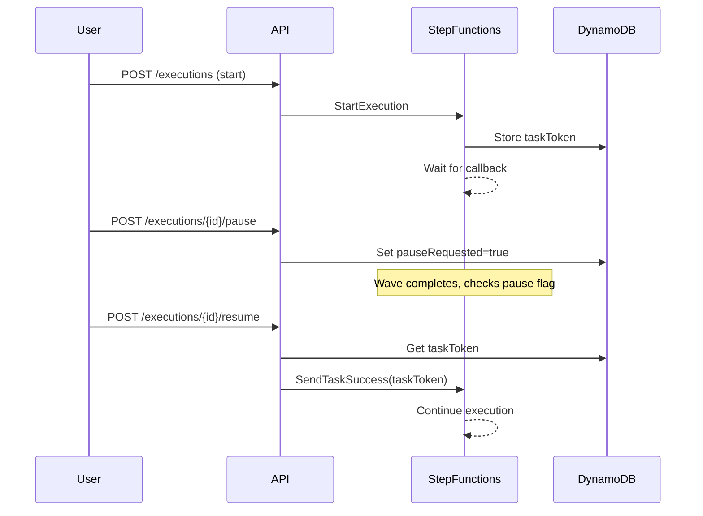
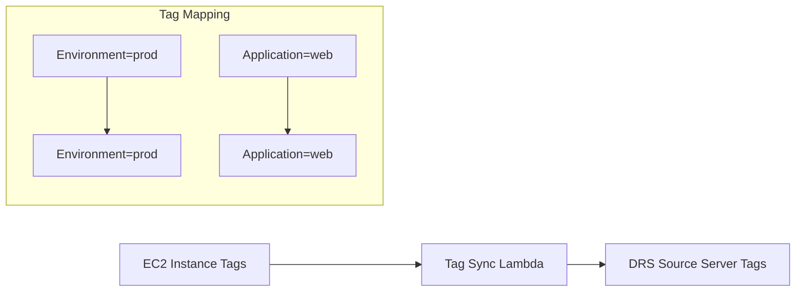
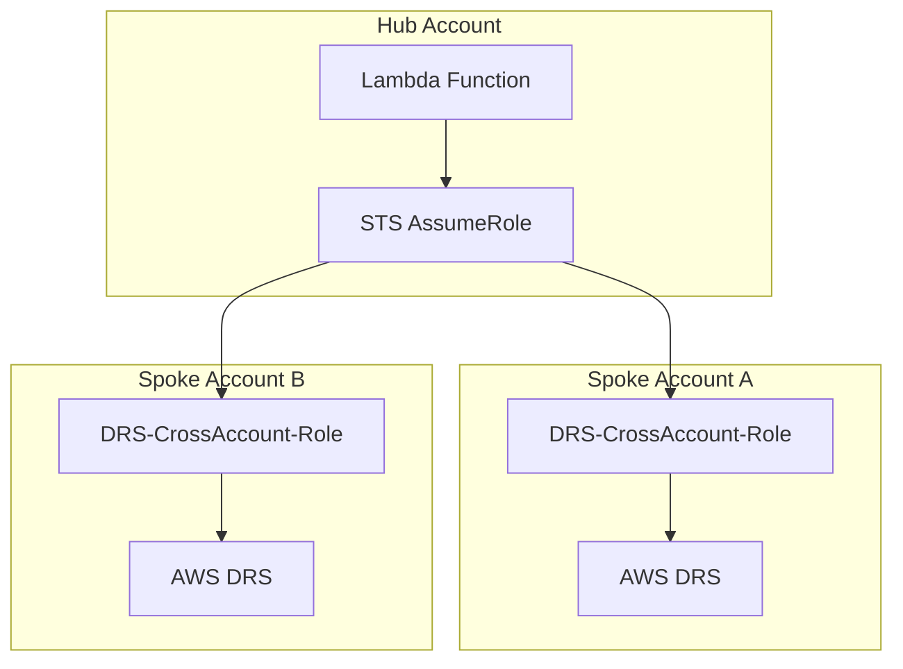

# Reference Implementation Code

[← Back to Index](./README.md)

---

The DRS Orchestration solution provides battle-tested, production-ready code that developers can reference when building enterprise DR orchestration solutions. All code is available in the public GitHub repository.

**Repository**: [github.com/johnjcousens/aws-elasticdrs-orchestrator](https://github.com/johnjcousens/aws-elasticdrs-orchestrator)

---

## Table of Contents

- [Step Functions with Pause/Resume](#step-functions-with-pauseresume-waitfortasktoken)
- [Wave-Based Tag Orchestration](#wave-based-tag-orchestration)
- [Tag Sync (EC2 to DRS)](#tag-sync-ec2-to-drs)
- [Launch Settings Configuration](#launch-settings-configuration)
- [DynamoDB Database Schema](#dynamodb-database-schema)
- [Cross-Account Role Assumption](#cross-account-role-assumption)
- [RBAC (Role-Based Access Control)](#rbac-role-based-access-control)
- [Complete API Handler](#complete-api-handler)
- [Infrastructure as Code](#infrastructure-as-code)

---

## Step Functions with Pause/Resume (waitForTaskToken)

The pause/resume pattern uses Step Functions `waitForTaskToken` callback to enable human validation points between waves.

| Component | Description | GitHub Link |
|-----------|-------------|-------------|
| **State Machine Definition** | CloudFormation template with `WaitForResume` state using `waitForTaskToken` | [cfn/step-functions-stack.yaml](https://github.com/johnjcousens/aws-elasticdrs-orchestrator/blob/main/cfn/step-functions-stack.yaml) |
| **Pause Execution API** | Lambda handler that schedules pause after current wave completes | [lambda/api-handler/index.py#L5522](https://github.com/johnjcousens/aws-elasticdrs-orchestrator/blob/main/lambda/api-handler/index.py#L5522) |
| **Resume Execution API** | Lambda handler that calls `SendTaskSuccess` to resume execution | [lambda/api-handler/index.py#L5667](https://github.com/johnjcousens/aws-elasticdrs-orchestrator/blob/main/lambda/api-handler/index.py#L5667) |
| **Task Token Storage** | Orchestration Lambda that stores task token in DynamoDB for later resume | [lambda/orchestration-stepfunctions/index.py](https://github.com/johnjcousens/aws-elasticdrs-orchestrator/blob/main/lambda/orchestration-stepfunctions/index.py) |

### How It Works



---

## Wave-Based Tag Orchestration

Dynamic server discovery using AWS tags enables flexible protection group definitions without hardcoding server IDs.

| Component | Description | GitHub Link |
|-----------|-------------|-------------|
| **Tag-Based Server Query** | Function to query DRS source servers by tag key-value pairs | [lambda/api-handler/index.py#L1815](https://github.com/johnjcousens/aws-elasticdrs-orchestrator/blob/main/lambda/api-handler/index.py#L1815) |
| **Protection Group Resolution** | Resolves `ServerSelectionTags` to actual server IDs at execution time | [lambda/orchestration-stepfunctions/index.py#L335](https://github.com/johnjcousens/aws-elasticdrs-orchestrator/blob/main/lambda/orchestration-stepfunctions/index.py#L335) |
| **Tag Preview API** | API endpoint to preview which servers match tag criteria before creating groups | [lambda/api-handler/index.py#L1764](https://github.com/johnjcousens/aws-elasticdrs-orchestrator/blob/main/lambda/api-handler/index.py#L1764) |
| **Wave Execution Logic** | Orchestration Lambda that processes waves with tag-based server resolution | [lambda/orchestration-stepfunctions/index.py](https://github.com/johnjcousens/aws-elasticdrs-orchestrator/blob/main/lambda/orchestration-stepfunctions/index.py) |

### Tag-Based Discovery Example

```python
# Query servers by tags
def get_servers_by_tags(region: str, tags: dict) -> list:
    """
    Find DRS source servers matching tag criteria.
    
    Example tags:
    {
        "Environment": "production",
        "DR-Tier": "application",
        "DR-Wave": "2"
    }
    """
    drs_client = boto3.client('drs', region_name=region)
    
    # Get all source servers
    servers = drs_client.describe_source_servers()['items']
    
    # Filter by tags
    matching_servers = []
    for server in servers:
        server_tags = {t['key']: t['value'] for t in server.get('tags', [])}
        if all(server_tags.get(k) == v for k, v in tags.items()):
            matching_servers.append(server['sourceServerID'])
    
    return matching_servers
```

---

## Tag Sync (EC2 to DRS)

Synchronize EC2 instance tags to DRS source servers to maintain consistent tagging across services.

| Component | Description | GitHub Link |
|-----------|-------------|-------------|
| **Tag Sync Handler** | API handler that syncs EC2 tags to DRS source servers across regions | [lambda/api-handler/index.py#L9362](https://github.com/johnjcousens/aws-elasticdrs-orchestrator/blob/main/lambda/api-handler/index.py#L9362) |
| **Tag Sync Settings** | Get/update tag sync configuration (auto-sync, tag prefixes) | [lambda/api-handler/index.py#L10747](https://github.com/johnjcousens/aws-elasticdrs-orchestrator/blob/main/lambda/api-handler/index.py#L10747) |

### Tag Sync Flow



---

## Launch Settings Configuration

Per-server and per-protection-group launch configuration for DRS recovery instances.

| Component | Description | GitHub Link |
|-----------|-------------|-------------|
| **Launch Config in Protection Groups** | Protection group schema with embedded `LaunchConfig` for instance settings | [lambda/api-handler/index.py#L2111](https://github.com/johnjcousens/aws-elasticdrs-orchestrator/blob/main/lambda/api-handler/index.py#L2111) |
| **DRS Launch Configuration API** | Get and update DRS launch configuration templates | [lambda/api-handler/index.py](https://github.com/johnjcousens/aws-elasticdrs-orchestrator/blob/main/lambda/api-handler/index.py) (search for `launch_configuration`) |

---

## DynamoDB Database Schema

Production-ready DynamoDB table definitions with GSIs, TTL, encryption, and point-in-time recovery.

| Component | Description | GitHub Link |
|-----------|-------------|-------------|
| **All Table Definitions** | CloudFormation template with 4 DynamoDB tables | [cfn/database-stack.yaml](https://github.com/johnjcousens/aws-elasticdrs-orchestrator/blob/main/cfn/database-stack.yaml) |
| **Protection Groups Table** | Schema for server groupings with tag-based or explicit selection | [cfn/database-stack.yaml#L16](https://github.com/johnjcousens/aws-elasticdrs-orchestrator/blob/main/cfn/database-stack.yaml#L16) |
| **Recovery Plans Table** | Schema for wave-based recovery configurations | [cfn/database-stack.yaml#L42](https://github.com/johnjcousens/aws-elasticdrs-orchestrator/blob/main/cfn/database-stack.yaml#L42) |
| **Execution History Table** | Schema with GSIs for status and plan queries | [cfn/database-stack.yaml#L63](https://github.com/johnjcousens/aws-elasticdrs-orchestrator/blob/main/cfn/database-stack.yaml#L63) |
| **Target Accounts Table** | Schema for cross-account hub-and-spoke configuration | [cfn/database-stack.yaml#L107](https://github.com/johnjcousens/aws-elasticdrs-orchestrator/blob/main/cfn/database-stack.yaml#L107) |

### Table Structure

```
DynamoDB Tables (4 total):
├── protection-groups     # Server groupings
│   ├── PK: GroupId
│   └── GSI: RegionIndex
├── recovery-plans        # Wave configurations
│   ├── PK: PlanId
│   └── GSI: StatusIndex
├── execution-history     # Execution state
│   ├── PK: ExecutionId
│   ├── GSI: StatusIndex
│   └── GSI: PlanIdIndex
└── target-accounts       # Cross-account config
    └── PK: AccountId
```

---

## Cross-Account Role Assumption

Hub-and-spoke architecture for managing DRS across multiple AWS accounts.

| Component | Description | GitHub Link |
|-----------|-------------|-------------|
| **Cross-Account Role Template** | CloudFormation template for target account IAM role | [cfn/cross-account-role-stack.yaml](https://github.com/johnjcousens/aws-elasticdrs-orchestrator/blob/main/cfn/cross-account-role-stack.yaml) |
| **Role Assumption Logic** | Lambda code for assuming cross-account roles and creating DRS clients | [lambda/api-handler/index.py#L140](https://github.com/johnjcousens/aws-elasticdrs-orchestrator/blob/main/lambda/api-handler/index.py#L140) |
| **Account Context Resolution** | Determine target account from protection groups in recovery plan | [lambda/api-handler/index.py#L140](https://github.com/johnjcousens/aws-elasticdrs-orchestrator/blob/main/lambda/api-handler/index.py#L140) |

### Cross-Account Pattern



---

## RBAC (Role-Based Access Control)

Cognito group-based authorization with 5 DRS-specific roles.

| Component | Description | GitHub Link |
|-----------|-------------|-------------|
| **RBAC Middleware** | Complete RBAC implementation with roles, permissions, and endpoint mappings | [lambda/shared/rbac_middleware.py](https://github.com/johnjcousens/aws-elasticdrs-orchestrator/blob/main/lambda/shared/rbac_middleware.py) |
| **Security Utilities** | Input validation, sanitization, and security headers | [lambda/shared/security_utils.py](https://github.com/johnjcousens/aws-elasticdrs-orchestrator/blob/main/lambda/shared/security_utils.py) |
| **Cognito Auth Stack** | CloudFormation template for Cognito User Pool with groups | [cfn/api-auth-stack.yaml](https://github.com/johnjcousens/aws-elasticdrs-orchestrator/blob/main/cfn/api-auth-stack.yaml) |

### RBAC Roles

| Role | Description | Key Permissions |
|------|-------------|-----------------|
| **DRSOrchestrationAdmin** | Full administrative access | All operations |
| **DRSRecoveryManager** | Recovery operations lead | Execute, terminate, configure |
| **DRSPlanManager** | DR planning focus | Create/modify plans and groups |
| **DRSOperator** | On-call operations | Execute/pause/resume only |
| **DRSReadOnly** | Audit and monitoring | View-only access |

---

## Complete API Handler

Full REST API implementation with 47+ endpoints across 12 categories.

| Component | Description | GitHub Link |
|-----------|-------------|-------------|
| **API Handler Lambda** | Complete API implementation (~11,000 lines) | [lambda/api-handler/index.py](https://github.com/johnjcousens/aws-elasticdrs-orchestrator/blob/main/lambda/api-handler/index.py) |
| **API Gateway Stack** | CloudFormation templates for REST API with Cognito authorizer | [cfn/api-gateway-core-stack.yaml](https://github.com/johnjcousens/aws-elasticdrs-orchestrator/blob/main/cfn/api-gateway-core-stack.yaml) |

### API Categories

| Category | Endpoints | Description |
|----------|-----------|-------------|
| Health | 1 | Health check |
| User | 2 | User info, permissions |
| Protection Groups | 6 | CRUD + tag preview |
| Recovery Plans | 6 | CRUD + validation |
| Executions | 12 | Start, pause, resume, cancel, status |
| DRS Operations | 8 | Source servers, jobs, launch config |
| EC2 Operations | 4 | Instances, subnets, security groups |
| Config | 4 | Tag sync, settings |
| Target Accounts | 5 | Cross-account management |

---

## Infrastructure as Code

Complete CloudFormation templates for the entire solution.

| Component | Description | GitHub Link |
|-----------|-------------|-------------|
| **Master Template** | Root orchestrator for all nested stacks | [cfn/master-template.yaml](https://github.com/johnjcousens/aws-elasticdrs-orchestrator/blob/main/cfn/master-template.yaml) |
| **Lambda Stack** | All Lambda function definitions with IAM roles | [cfn/lambda-stack.yaml](https://github.com/johnjcousens/aws-elasticdrs-orchestrator/blob/main/cfn/lambda-stack.yaml) |
| **EventBridge Stack** | Scheduled polling and event rules | [cfn/eventbridge-stack.yaml](https://github.com/johnjcousens/aws-elasticdrs-orchestrator/blob/main/cfn/eventbridge-stack.yaml) |
| **GitHub OIDC Stack** | CI/CD integration with GitHub Actions | [cfn/github-oidc-stack.yaml](https://github.com/johnjcousens/aws-elasticdrs-orchestrator/blob/main/cfn/github-oidc-stack.yaml) |

### Stack Architecture

```
CloudFormation Stacks (15+ templates):
├── master-template.yaml          # Root orchestrator
├── database-stack.yaml           # DynamoDB tables
├── lambda-stack.yaml             # Lambda functions
├── step-functions-stack.yaml     # State machine
├── api-gateway-core-stack.yaml   # REST API core
├── api-gateway-*-stack.yaml      # API methods (6 stacks)
├── api-auth-stack.yaml           # Cognito
├── eventbridge-stack.yaml        # Scheduled events
├── frontend-stack.yaml           # S3 + CloudFront
├── cross-account-role-stack.yaml # Target account role
└── github-oidc-stack.yaml        # CI/CD
```

---

[← Back to Index](./README.md) | [Next: DR Orchestration Patterns →](./02-dr-orchestration-patterns.md)
